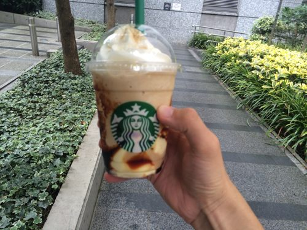
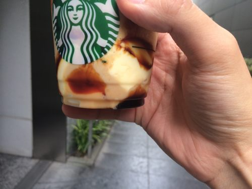
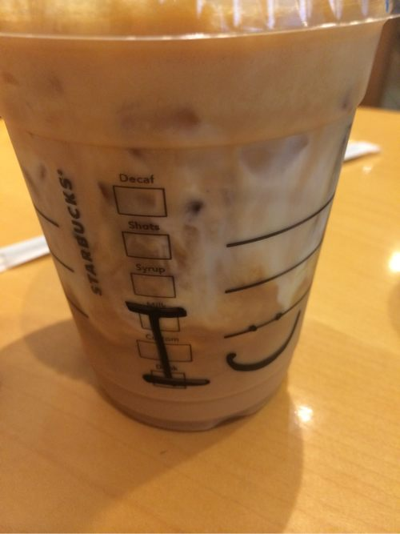
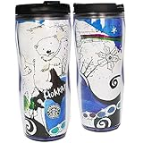

---
categories:
- グルメ
date: Wed, 03 Sep 2014 15:24:57 +0000
slug: post-6173
tags:
- スタバ
title: スタバ2014秋の新作「キャラメル&プディングフラペチーノ」と「シェイクン キャラメル カスタード & エスプレッソ」
---

ハロー。しんぺー(<a href="https://twitter.com/s_s_p_y" target="_blank">@s_s_p_y</a> )です。

オフィより詳しくて、wikiよりも有用なsukekiyo情報サイト「Gadget Zombie Parasite」へようこそ。

<!--more-->

スターバックスの秋の新作のレビューです。

ちなみにホリデーシーズンのドリンクレビューはこちら
<a style="color:#0070C5;" href="https://www.warawareotoko.com/2014/11/01/post-6497/" target="_blank">スタバ新作「スノーメープルトフィーラテ」「クランベリーブリスホワイトモカ」「ジンジャーブレットラテ」カロリーと値段と感想 | Gadget Zombie Parasite</a>  

<h2>キャラメル&プディングフラペチーノ</h2>

こんな感じ。中身はコーヒーフラペチーノにカスタードプディングとキャラメルソースが入っておる。

見よ。カスタードプディングがまんま入ってる。これがとにかくストローで吸い込みずらい。

それと補足だけど、プディングとプリンの違いですが、プディングは小麦粉やラードなどを使って蒸し固めた料理のこと。で、そのうちでカスタードプディングのことを日本ではプリンと呼ぶのだそうです。

知らなんだ。

<h3>値段とカロリー</h3>

(Short  ￥500)  Tall ￥540　　Grande　￥580　　Venti  ￥620 

(Short  334kcal)  Tall 441kcal　　Grande　619kcal　　Venti  650kcal
これはミルクベースの場合です。
他にも低脂肪タイプや無脂肪乳、豆乳に変更可能ですので色々試してみるのもいいかと思います。カロリーはどれもそこまで変わりません。（<a href="http://www.starbucks.co.jp/assets/images/web2/images/allergy/pdf/allergen-beverage.pdf">カロリー表</a>） 

<h3>味の感想</h3>
聞いてくれ！プリンの風味がそんなにしないんだ！
これならコーヒーフラペチーノに自分でプッチンプリン入れた方がマシだぜ！

<h2>シェイクン キャラメル カスタード & エスプレッソ</h2>
こっちの方がよっぽどカスタード臭がしてプリンぽかった！
甘いけれども飲みやすかった。なぜなら氷と一緒にシェイクしてあって空気を含んでいるので口通りがまろやか。さらにエスプレッソが入っているため、後味がさっぱりしているのです。

<h3>値段とカロリー</h3>

なんとサイズはTallのみ。540円です。
カロリーは307kcalです。こちらもベースのカスタマイズが変更可能。

<h3>味の感想</h3>

こっちの方が好きかも。フラペチーノのは甘すぎる上にプリンがそのまま入ってて、ストローじゃ吸い込みずらい。

こっちはほのかにプリンぽい風味がしてちょっと甘ったるけど、まぁまだマシ。

全体感でいうと、<a href="https://www.warawareotoko.com/2014/07/18/post-5920/">前回のストロベリーフラペチーノに比べると</a>そこまで美味しくないぜよ。
毎年この時期は甘ったるい飲み物出るけど、冬はもっと甘ったるいんだよなー。

とりあえず、取り立てて飲むほどのものではないと思いました。

<h2>しんぺーはこう思った。</h2>

両方ともこれでワンコインは高すぎるぜマジで。

多分<a href="https://www.warawareotoko.com/2014/07/21/post-5942/">前回もしたけど</a>、今回もDIYできそうな気がする。。。試してみようかな。
乞うご期待。

といったところで、本日は以上です。おやすみなさい。

<a href="http://www.amazon.co.jp/exec/obidos/ASIN/B00M960CUG/warawareotoko-22/ref=nosim/" rel="nofollow" target="_blank">STARBUCKS スターバックス タンブラー 北海道 限定JAPAN hokkaido 12oz/350ml【タンブラーのみの販売です】</a>
posted with <a href="http://kaereba.com" rel="nofollow" target="_blank">カエレバ</a>

 STARBUCKS COFFEE     

