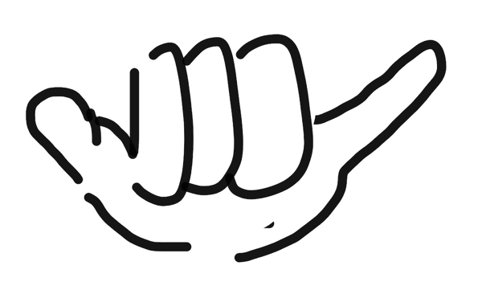
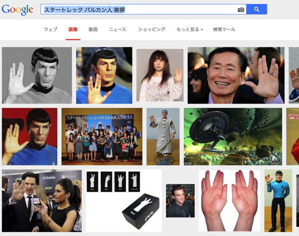
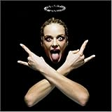
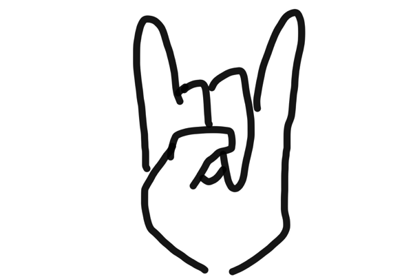
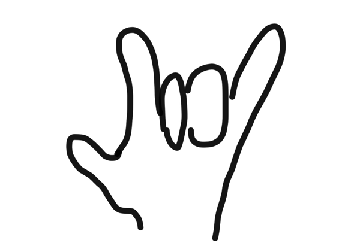

---
categories:
- ブログ
date: Sun, 07 Sep 2014 05:16:29 +0000
slug: post-6187
title: リア充が写真撮る時アロハみてーなポーズやるけどさ多分意味解らずやってるよね？
---

ハローしんぺー(<a href="https://twitter.com/s_s_p_y" target="_blank">@s_s_p_y</a> )です。
オフィより詳しくて、wikiよりも有用なsukekiyo情報サイト「Gadget Zombie Parasite」へようこそ。<!--more--><!--more-->意味わかる？このポーズのことな。

よくいるんすよ。facebookのリア充の同僚とか学生時代の写真とかで集団で写ってるときによくこれ見かける。

でもさ、これってハワイの挨拶のアロハだよね？
こいつらどう考えてもピースの代わりにやってると思うの。

で、ここからは持論なんですが、あれって多分元々はアロハじゃないと思うすよ。多分海外（アメリカ）からきてて、恐らく「電話して」って意味だと予想。

もう少し説明を加えると写真を見た人に向けて“ビッチ”が「あたしのこと気に入ったら“電話して”」と伝えてるんだと思うんのよ。

さらにこれはネットが発達してきてから、写真をあかの他人に見られるっていう時代になってからのことだと思う。それ以前はこのポーズはハワイでの写真撮影くらいにしか存在しなかったんじゃないかしら。

で、この際だから他にも気になってた写真撮影時のハンドサイン諸々についてまとめてみる。

<h2>SUGIZOのあれ</h2>

<blockquote class="twitter-tweet" lang="ja">
TOSHIさんZepp Diver City、素晴らしかった！ 若者衆、頑張ってた！ X曲はもちろんだけど、特に「Made in Heaven」と「雨音」が絶品だった！ 流石でした。。。SGZ <a href="http://t.co/y44mDLNnaS">pic.twitter.com/y44mDLNnaS</a>
&mdash; SUGIZO (@SUGIZOofficial) <a href="https://twitter.com/SUGIZOofficial/status/505338011060420609">2014, 8月 29</a></blockquote>

これToshIさん以外皆さんやってますけど。どうもこの人差し指と中指、薬指と小指で二つずつをくっつけて中指と薬指の間をあけるポーズ。（よく見たらToshIさんもやってるw）

これって何を意味するのだろうとずーーーっと思ってたんだけど、どうやら既存のポーズをSUGIZOが好んで使ってるみたいですね。

元ネタはスタートレックに出てくるヴァルカン・サリュートというポーズで、「長寿と繁栄を"Live long and prosper"」という意味みたいです。
SUGIZO氏はスタートレックの大ファンだそうです。

ソース：<a href="http://detail.chiebukuro.yahoo.co.jp/qa/question_detail/q1126711671">yahoo知恵袋</a>

ぐぐったら画像でてきました。

ソースが知恵袋しかないので間違ってるかもしれませんが。

<h2>ロック、メタルファンがよくやるやつ</h2>

これはぼく自身好んでよくやります。

ホルモンのぶっ生き返すのジャケットのあれです。

<a href="http://www.amazon.co.jp/exec/obidos/ASIN/B000MTFEVO/warawareotoko-22/ref=nosim/" rel="nofollow" target="_blank">ぶっ生き返す</a>
posted with <a href="http://kaereba.com" rel="nofollow" target="_blank">カエレバ</a>

マキシマム ザ ホルモン バップ 2007-03-14    

あとはDAIGOの「ウィッシュ」ねw

wikipediaに詳しくのっております。起源や意味に関して諸説掲載されています。

<a href="http://ja.wikipedia.org/wiki/コルナ">http://ja.wikipedia.org/wiki/コルナ</a>

長いから要約しますね。

<h2>コルナ（メロイックサイン）のとは？</h2>

<blockquote>
地中海諸国では侮辱的な意味を持つ。このジェスチャーの起源は古代ギリシアまで遡るとされている。コルナは、イタリア語で角（つの）を意味する。
</blockquote>

コルナの他にもロックポーズ、メロイックサイン、デビルサインやイービルサインなどと呼ばれます。

なお起源には、他にもテキサス大学の象徴の雄牛の角を表現していたりなどがあるようです。

どちらにしろ指は「角」を表しているみたいですね。

昔、ユーザロックもこのサインをしていて、その時「水牛の角を表していて反攻の象徴」なんてこともを言っていました。

なお正式には、こうです。

こっちだと手話で「I love you」を表すようになります。ぼくたまにこれでやってました。

で、また起源の話になるんですけど、どうも見て行くと宗教的側面からの発祥をヘヴィメタバンドが独自解釈し取り入れた可能性が高そうです。

<blockquote>
ヘヴィメタルでの起源が何にせよ、メタル・ファンはこのジェスチャーを神秘主義、サタン、悪、あるいは単なる「メタルっぽさ」を包括する曖昧な象徴として受け入れており、ヘッドバンギングなどと同様に一般的なものになっている。さらに現在ではヘヴィメタルを超えてロック共通のフォームになっており、より普遍的なものになりつつある。
</blockquote>

自分を起源と主張する人もちらほら。<a href="http://www.barks.jp/news/?id=1000008758">ロニー・ジェイムス・ディオ</a>やジーンシモンズなど。

<h2>ベビーメタルのキツネ</h2>

Twitterで若いベビーメタルファンが、メロイックサインを見て“キツネ”と言ってるのを見て苦笑せざるおえないのですが、あれはベビーメタルがあくまでメタルではなく、“アイドル”として表現しているパロディ的なサインです。

<blockquote class="twitter-tweet" lang="ja">
We are &quot;BABY&quot;&amp;&quot;LADY&quot;METAL team!! <a href="https://twitter.com/BABYMETAL_JAPAN">@BABYMETAL_JAPAN</a> with <a href="https://twitter.com/ladygaga">@ladygaga</a> We love U! <a href="https://twitter.com/hashtag/artRave?src=hash">#artRave</a> <a href="https://twitter.com/hashtag/MTVHottest?src=hash">#MTVHottest</a> <a href="https://twitter.com/hashtag/ladygaga?src=hash">#ladygaga</a> <a href="https://twitter.com/hashtag/BABYMETAL?src=hash">#BABYMETAL</a> <a href="http://t.co/fw120vimsa">pic.twitter.com/fw120vimsa</a>
&mdash; BABYMETAL (@BABYMETAL_JAPAN) <a href="https://twitter.com/BABYMETAL_JAPAN/status/495820440963518464">2014, 8月 3</a></blockquote>

<h2>しんぺーはこう思った。</h2>
色んなサインがあるわな。SUGIZO氏のあれがスタートレックとは思わなんだww
と言ったところで本日は以上になります。おやすみなさい。