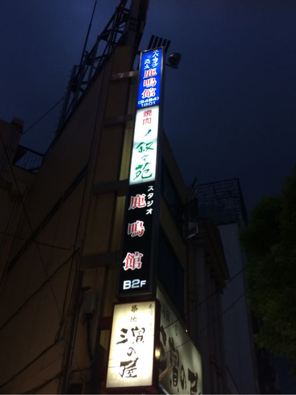
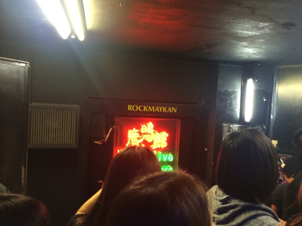
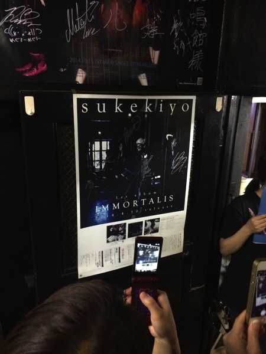

---
categories:
- sukekiyoのLIVEレポ
date: Wed, 10 Sep 2014 13:40:24 +0000
slug: post-6197
tags:
- LIVEレポ
- sukekiyo
title: 【ライブレポ】sukekiyo二〇一四年公演「鳳凰の間」2014_9_10@目黒鹿鳴館
---

大雨洪水警報が出る中、sukekiyo海外公演の直前、目黒鹿鳴館で行われた「鳳凰の間」に行ってきました。

<!--more-->

ぼくはビジュアル系を好む割りに、聖地鹿鳴館には行ったことがありませんでした。そう、これが巷で話題の鹿鳴館童貞です。

ギャのくせに(ビジュアル系好きなくせに)鹿鳴館行ったことないなんて、本当にありえません。Apple好きとか言ってるくせに実はWindowsしか使ったことがないくらいやばいです。そう勝手に思ってました。

<a style="color: #0070c5;" href="https://www.warawareotoko.com/2014/07/29/post-5985/" target="_blank" rel="noopener">バンギャ的立ち位置が中途半端なピエラー出身の男子はぼくだけじゃないはず | Gadget Zombie Parasite</a> 
そんなぼくも今回鹿鳴館に訪れる機会を与えられ晴れて童貞卒業です。本当にありがとうございました。
<h2>sukekiyo鳳凰の間@鹿鳴館ライブレポ</h2>

まずはメンバーの衣装
京さんは、ハットに黒いノースリーブのジャケット？を素肌に着て首飾りをつけていました。金色の短髪は坊主に近く、アジャコングの様でした。

匠氏は相変わらず、Yuchi氏もさら毛で、UTA氏もいつも通り。。。

未架さんは、痩せていました。そしてメイクをされていて別人の様でした。
<h3>各メンバーの様子を五月雨で</h3>
<blockquote class="twitter-tweet" lang="ja">多分うたさんって京のお気に入り。ずーっっっっとみてた。ずーーーーーっと。。にらみまくって。ずーーーーーっと。

— しんぺー@鳳凰の間 (@s_s_p_y) <a href="https://twitter.com/s_s_p_y/status/509670337911341057">2014, 9月 10</a></blockquote>

例えるなら、前同じ部署で異動して違う部署になった後輩を飲み会中ずーっと絡むみたいな感じです。w（？）恐らく京さんの目線の30％はUTA氏に注がれておりました。匠へは0.3％ww背中で感じるって感じでした。

それとモシャモシャしてるUTA氏をみて匠さん微笑んでた。凄い大人の色気のある笑顔だった。渋いぜ。

すいません、ほとんどUTAさんと京しか見ていなかった。とりあえずUTAさんのギターの指がはやかった。

あとmamaでサビらへんでこっちにマイクを向ける京
当然のごとく合唱が起きるはずもなく。ぼくは、え？歌って良いんすか？って感じでうずうず準備しておりました。まだかまだか！と思ってる間に終了。
たしか、恵比寿リキッドルームで「黙れ」とおっしゃったのはあなただったかと記憶しております。

<a style="color: #0070c5;" href="https://www.warawareotoko.com/2014/04/28/post-5216/" target="_blank" rel="noopener">sukekiyo「鳳凰の間」＠恵比寿LIQUIDROOM | Gadget Zombie Parasite</a> 
<h2>セトリ</h2>
SE destrudo
1. aftermath
2. elisabeth addict
3. latour
4. nine melted fiction
5. the daemon's cutlery

SE

6. 新曲
7. scars like velvet
8. zephyr
9. hidden one
10. hemimetabolism
11. 烏有の空
12. vandal
13. 斑人間
14. 304号室、舌と夜
15. 鵠
16. mama
17. in all weathers

そう、あまりに馴染み過ぎていたのですが新曲がありました。
三味線の様な音色から始まり、演歌の様な感じでした。
<h2>ライブの感想</h2>
新曲前までは、とにかくいつもと同じく眠かったです。新曲後は何か鬼気迫るものがありました。

とにかく「怖い」と感じるほどの迫力でした。京がステージ端に立ち、その影が壁に映される光景は仏と逆の立場にいるソレのようでした。

他のメンバーに関しても同様。繰り返しになりますが、とくにUTA氏。奇怪な手足の動きは、千と千尋の釜じいの様な印象でした。

それとぼくとしては、zephyrからは、今この場に来れていることの感謝を強く感じました。個人的過ぎるレビューですけど、なんとなくそんな感じでした。今までしてきた選択の結果、今日この場所にいること、小さい時に自営業の家が忙しく土日に遊びに行くことは稀で、平日も休日も与えられた特撮とドラえもんを見て過ごしました。その影響がぼくに、DIR EN GREYを選ばせ、そしてsukekiyoに至る道を作ったのだとまざまざと自覚しました。その事実にただ感謝の気持ちしか湧きませんでした。

そしてそれはsukekiyoに対しての強い感謝の気持ち。この時思い浮かんだことはドロドロに溶かした京さんを一気飲みしたい。表現がグロテスクで気持ち悪過ぎるかもしれませんが、ハンターハンターで自分の身を溶かして王に与えたプフとユピーのあの描写がピッタリだと思います。それくらいの「愛」を感じました。逆だけど

DIR EN GREYとまた違う種類の感情を覚えるsukekiyoのライブです。そんなsukekiyoの青年館でのチケットが1枚余ってます。行きたい人！お声かけください！

すいません、情報アフィリエイトみたいになっちゃった。◯沢翼ではありませんよ。
<h3>補足事項</h3>
クローク前にメンバーのポスターなんか貼ったら階段混むよ！

あと、物販なんですけど写真集とか漆黒パーカーが売ってた。手に入れ損ねた人は是非この機会に購入するといいです。
(<a href="https://www.warawareotoko.com/2014/01/16/post-4046/">漆黒パーカーのレビューはこちら</a>)
<h2>しんぺーはこう思った。</h2>
sukekiyo史上最高のライブだったとつぶやかれてる方がいましたが、そう言っても過言ではないくらいのライブでした。

本当に「よかった」です。

帰国後は、どんな世界を生み出すのか楽しみです。それと同時にゲストがゲストの「異形の間」が少し心配です。向こうのファンは来るのかしら？
と言ったところで本日は以上になります。おやすみなさい。