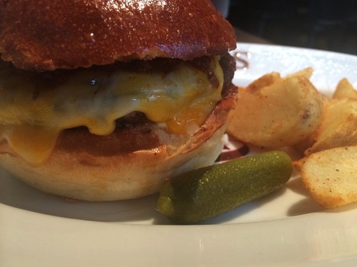

---
categories:
- グルメ
date: Mon, 15 Sep 2014 02:48:54 +0000
slug: post-6316
tags:
- グルメ
title: 恵比寿激ウマハンバーガー「ブラッカウズ」がおすすめ
---

ハローしんぺー(<a href="https://twitter.com/s_s_p_y" target="_blank">@s_s_p_y</a> )です。
オフィより詳しくて、wikiよりも有用なsukekiyo情報サイト「ガジェットゾンビィパラサイト」へようこそ。<!--more--><!--more-->恵比寿っていったら、お洒落で美味しいお店が沢山あると思いますが、ハンバーガーが食べたかったらここがおすすめ。

恵比寿のブラッカウズ。ここは五反田にあるミート矢澤が出してるお店なので肉に関しては信頼できるのです。

はい、ごたごた言わずにこれをご覧ください。
ミートソースバーガーです。

店内もおっしゃれです。ディテールに凝ったインテリア。

メニューはこちら

やっぱりこれくらいのグルメバーガーになると、1000円は軽く超えて1500円前後になります。でもそれくらいの価値はあります。

たかだかハンバーガーと思われるかもしれませんが、マクドナルドとは全くの別の食べ物です。恵比寿にお越しの際はぜひ足をお運びください。

<strong><a href="http://tabelog.com/tokyo/A1303/A130302/13096437/" target="_blank">ブラッカウズ</a></strong>

<strong>関連ランキング：</strong><a href="http://tabelog.com/rstLst/hamburger/">ハンバーガー</a> | <a href="http://tabelog.com/tokyo/A1303/A130303/R5661/rstLst/">代官山駅</a>、<a href="http://tabelog.com/tokyo/A1303/A130302/R1528/rstLst/">恵比寿駅</a>、<a href="http://tabelog.com/tokyo/A1317/A131701/R7118/rstLst/">中目黒駅</a>

<h2>しんぺーはこう思った。</h2>
美味しい！けど一つだけ気に入らないところ！それはケチャップとマスタードの提供の仕方ね。小分け袋に入ってるの。でもぼくはこういう奴の方が好き。

<a href="http://www.amazon.co.jp/exec/obidos/ASIN/B0076TUF0I/warawareotoko-22/ref=nosim/" rel="nofollow" target="_blank">ハインツ トマトケチャップ逆さボトル 460g×4本</a>
posted with <a href="http://kaereba.com" rel="nofollow" target="_blank">カエレバ</a>

 ハインツ日本     

だってこっちの方がアメリカンでしょ？w
と言ったところで本日は以上になります。おやすみなさい。