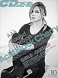

---
categories:
- sukekiyo
date: Wed, 17 Sep 2014 16:10:27 +0000
slug: post-6318
tags:
- sukekiyo
title: 鬼束ちひろと京の対談「CD&DLでーた」交際の噂のソースが雑誌ということに草生えるw
---

ハローしんぺー(<a href="https://twitter.com/s_s_p_y" target="_blank">@s_s_p_y</a> )です。
オフィより詳しくて、wikiよりも有用なsukekiyo情報サイト「Gadget Zombie Parasite(ガジェットゾンビィパラサイト)」へようこそ。<!--more--><!--more-->ということで、もう読みましたか？CD&DLでーたの京と鬼束ちひろの対談

ご存知の通り、この二人の初対面はsukekiyoの「in all weathers」のMV撮影です。

<iframe width="560" height="315" src="//www.youtube.com/embed/zT-NBH-SXE4" frameborder="0" allowfullscreen></iframe>

このMV撮影の日は京の誕生日で、初対面にも関わらずバースデーソングを歌いながら遠くから歩いてきた鬼束に京はどん引きだったというエピソードがあります。

対談の内容も、かなりぶっ飛んでおります。
特に鬼束さんは、インタビューにも関わらず意味不明な内容で、さすがの京も「？」っていう感じだったのではないでしょうか。

しかしながら、何となく２人に共通するような点もあったりして面白い対談になっています。

構成は見開きの写真、対談3ページ、写真１ページの計6ページになっていて、「２人の出会いとPV出演のきっかけ」「歌に対して譲れないこと」「嫌いなもの」「最近、気になること」「芸術の秋にオススメする映画」の５つのテーマで対談が進んで行きます。

最後にはお互い、また何かの形で一緒に何かできればいいなという感じで終わっております。

<h2>しんぺーはこう思った。</h2>
異形の間へのかまってちゃん出演など、今までにないジャンルとのからみが増えてきている昨今。

恐らくこちら以上に京自身が一番楽しんでいるんでしょうね。

と言ったところで本日は以上になります。おやすみなさい。

<a href="http://www.amazon.co.jp/exec/obidos/ASIN/B00N3UZKZ4/warawareotoko-22/ref=nosim/" rel="nofollow" target="_blank">CD & DLでーた 2014年 10月号 [雑誌]</a>
posted with <a href="http://kaereba.com" rel="nofollow" target="_blank">カエレバ</a>

 KADOKAWA/エンターブレイン 2014-09-13    

