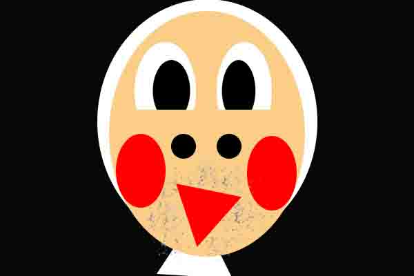
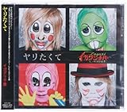
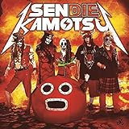

---
categories:
- ブログ
date: Mon, 22 Sep 2014 15:40:34 +0000
slug: post-6342
tags:
- ブログ
title: 面白い顔してるだろ？仙台貨物ってナイトメアなんだぜ
---

ハローしんぺー(<a href="https://twitter.com/s_s_p_y" target="_blank">@s_s_p_y</a> )です。
オフィより詳しくて、wikiよりも有用なsukekiyo情報サイト「Gadget Zombie Parasite(ガジェットゾンビィパラサイト)」へようこそ。<!--more--><!--more--><!--TOC-->

仙台貨物というバンドをご存知でしょうか？当然知ってると思います。

<iframe width="560" height="315" src="//www.youtube.com/embed/twFZ6kivB3M" frameborder="0" allowfullscreen></iframe>

実はぼくはあまりこのバンドを知りません。何かギャグっぽいけど活動歴もそこそこ長そうだし、しかもなんか人気があるっていう認識をしておりました。しかもナイトメアのメンバーが一部加入していて、割と技術的な面でも信頼できそうな印象を持っていました。

でも、疑問なのがボーカルの人。

<blockquote class="twitter-tweet" lang="ja">
Dir しんやさんと千葉さん♡&#10;ペロペロw <a href="http://t.co/mPZSnEvZ38">pic.twitter.com/mPZSnEvZ38</a>
&mdash; イガグリ千葉 (@IGAGURI_Chiba) <a href="https://twitter.com/IGAGURI_Chiba/status/511437891910660096">2014, 9月 15</a></blockquote>

存在そのものがギャグっぽい。しかもすっげーなまってるし。
しかしながら、解せないのがその人気っぷりっていうか、なぜかの黄色い声援。何これ意味解んない。

<iframe width="560" height="315" src="//www.youtube.com/embed/kZbQxzXydr4" frameborder="0" allowfullscreen></iframe>

そんな中Twitterでこんなもん見かけたわけ
<blockquote class="twitter-tweet" lang="ja">
(色んな意味で怒らないで下さい。) pic.twitter.com/P7QvGyPO8o
&mdash; まじろ。 (@jmk_opal) 2014, 9月 17</blockquote>

で、ふとこんなつぶやきをしたんですわ。

<blockquote class="twitter-tweet" lang="ja">
全く知らないんだけど仙台貨物のボーカルってナイトメアのボーカルなの？
&mdash; しんぺー@異形の間 (@s_s_p_y) <a href="https://twitter.com/s_s_p_y/status/512815289830875136">2014, 9月 19</a></blockquote>

するとくるわくるわ「仙台貨物の千葉さんはナイトメアのボーカルですよ」的なリプ

ええええええーーーーー！！！！
まじっすか？だってさ、前も確か気になって調べたんだよ？
でwikiとかにこんな風に書いてあるし

<blockquote>
千葉（チバ）… イガグリ・ボーカル
勤務歴3年。部署:配達部。162cm 50kg。14歳（現24歳）・A型。（オフィシャルサイト・社員情報による、以下社員同）
元の素顔がわからないくらいに、マンガのキャラクターのような濃いメイクが特徴。ライブなどでは下ネタ発言、変態行動が多い。
黒いカラーコンタクトを着けている。
NIGHTMAREのボーカル"YOMI"の弟（という設定）。

引用元：<a href="http://ja.wikipedia.org/wiki/仙台貨物">wikipedia</a>
</blockquote>

弟というのが嘘だとしても、まーそういう設定なんだろうと思ったわけ

だって、全然違うから。

あとそう思った原因の一つがナイトメアも仙台貨物もメンバーにフルフェイスこと柩がいるということ
この人は見てすぐ解ったわけ。だから、きっと色んなバンドのメンバーがいるユニットなんだって勝手に思ったわけです。

しかしながら驚くべきことに、ナイトメア＝仙台貨物だったという•••

信じられない。。。何が信じられないって、この振り切り方ね。
しかも、仙台貨物の方も全然手を抜いてやってないっぽくて、ちゃんとギャグとしてやりつつも曲とかすっげーいいし、しかも歌詞も何気にいいんだわこれが！！

さらにさらに、ビジュアル系のパロディ（という所が個人的にはロックでパンクだと思ってる）であるゴールデンボンバーをさらにパロってる「ヤリたくて」って曲やってたりして•••

<a href="http://www.amazon.co.jp/exec/obidos/ASIN/B00F64TSJE/warawareotoko-22/ref=nosim/" rel="nofollow" target="_blank">ヤリたくて</a>
posted with <a href="http://kaereba.com" rel="nofollow" target="_blank">カエレバ</a>

イガグリ千葉 Zany Zap 2013-10-09    

本当にセンスがヤバい

ちょっとこれは注目のバンドでた！！って感じで聞きまくること必定です。

<a href="http://www.amazon.co.jp/exec/obidos/ASIN/B00KIIEVI6/warawareotoko-22/ref=nosim/" rel="nofollow" target="_blank">SENDIE KAMOTSU (MINI AL+DVD)</a>
posted with <a href="http://kaereba.com" rel="nofollow" target="_blank">カエレバ</a>

仙台貨物 avex trax 2014-07-30    

<h2>しんぺーはこう思った。</h2>
きっと、何を今更とかって思われてそうですけど、だってそんくらい衝撃だったからw
まさか本人だったとは思わなかった。むしろナイトメアって全く聞いたことないからどういうキャラかも知らないけれど、こういうことしてファンはどう思ってるんだろうか。

自分の身に置き換えて京がソロでsukekiyoやりまーっすって言って、顔面総メイクで真っ白坊主で逆立ちしてひゃっほーい！とか言って出てきたらどうしよ•••

あ、全部やってるかそうですか
と言ったところで本日は以上になります。おやすみなさい。