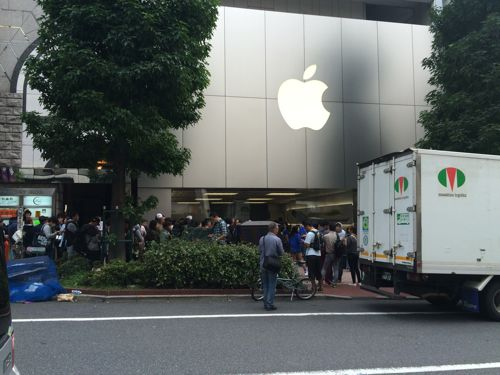
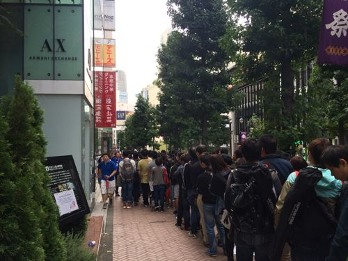
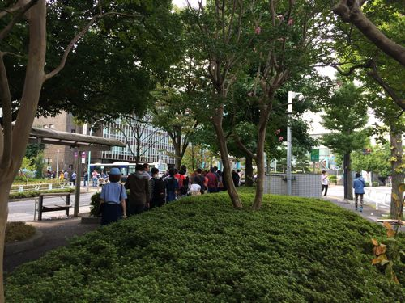
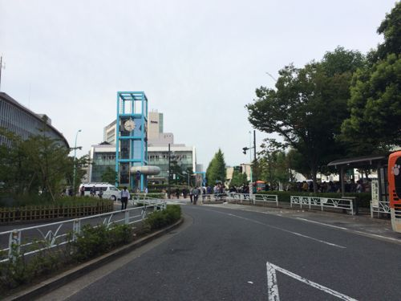

---
categories:
- LIVEのお作法
date: Tue, 23 Sep 2014 16:19:49 +0000
slug: post-6356
tags:
- apple
- iPhone
title: iPhone6の列に並んだ中国人が海外でも暴れたらしいけど、物販の列に横入りしてくる奴もなんなのよって話
---

ハロー。しんぺー(<a href="https://twitter.com/s_s_p_y" target="_blank">@s_s_p_y</a> )です。

オフィより詳しくて、wikiよりも有用なsukekiyo情報サイト「Gadget Zombie Parasite(ガジェットゾンビィパラサイト)」へようこそ。<!--more--><!--more-->
今回のiPhone6、iPhone6Plusの世界同時発売日は9/19でした。しかしながら、それに中国は含まれておらず、さらに発売日も未定でした。加えて、今回日本でもSIMロックフリーのiPhoneを販売することがわかっていましたので、中国人が大挙してAppleStoreに並びました。

ここまでは良かった。

<h2>iPhone6、iPhone6plus発売日のAppleStore渋谷店の行列の様子
</h2>

最後尾の方はこんな感じ

発売時間が過ぎたあたりだと、渋谷公会堂まで並んでいました。

動画も撮影したのですが、ご覧いただければわかりますが日本語が一切聞こえてこない•••しかも列乱れ過ぎだし、ゴミ捨て過ぎ•••

http://youtu.be/AtN3DWNBv1I

iPhone5Sで銀座に並んだ時はもっと整然としてたし、しかも周り助け合ってたし。

ちなみにこの日は心斎橋店で店内で中国人が暴れて警察も来たみたいですが、渋谷店の列にも警戒のためか警察が来ていました。それと銀座の方では大量の横入りと、後ろの方に並んでいた人達が前の方にいったりとか、そりゃぁもうカオスだったみたいです。

なお、今回の列には純粋にiPhoneを手に入れたいがためにならんだ人ばかりではなく、中国本土での転売目的のために並んだ人も多くいたようです。

確かにホームレス風の人も多くいました。

しかしながら、ぼくが列の様子を見にいった時点では店員の方が「SIMフリーソールドアウト」と叫んでいたので、実際てに入れられた人は少なかったはずです。

<h3>中国人日本以外でも大暴れ</h3>

これ日本だけかと思ったらアメリカでも同様だったみたい。

<iframe width="560" height="315" src="//www.youtube.com/embed/Ef_BznBwktw" frameborder="0" allowfullscreen></iframe>

<h3>今回何でこんなふうになっちゃたのか</h3>

日本ではau、SoftBank、docomoなどのキャリアが端末代を負担してくれてるので実は日本に住んでる人は安く端末を買うことができます。

しかしながら海外ではiPhoneは高価なスマートフォンになるため、基本的にはお金に余裕がある人しか持つことができないらしいです。(だからiPhone5Cなんていう廉価版を出したりもしましたが)

そのためiPhoneを使うということが一種のステータスになっているそうです。中国人の富裕層なんかは最新のスマートフォンをいち早く使いたいなんていう人が沢山いるみたいで、十二分なニーズがあるため組織化された人達がこぞって「仕入れ」にやってきたというのが真相のようです。

だって、本土まで持って行けば倍以上の値段で売れるらしい。

<h2>LIVEの物販の列に横入り、割り込みしてくる奴しね</h2>

これと似た様な事例でいうとLIVEの物販に並んでる時に、前にいた人のところに後から友達がきて膨れ上がるやつね。

sukekiyoの初お披露目の時のレコード買えなくなると思って本当に腹立たしかったわ。

こっちはボッチで並んでるんだし大半の人もそうなのに友達来たら一緒に後ろで並び直せやって思う。まぁ程度の問題とか受け取り方の問題の気もするけど、1グループだけじゃなくて複数のグループでそれやられるとマジで買えなくなるから辞めてほしい。程度の問題とか受け取り方の問題かもしれないけど、後ろにいる身としては不快です。

今回言いたいのはここです。

<h2>横入り、割り込みって軽犯罪法に触れるって知ってました？</h2>

<blockquote>
第一条 　左の各号の一に該当する者は、これを拘留又は科料に処する。

十三 　公共の場所において多数の人に対して著しく粗野若しくは乱暴な言動で迷惑をかけ、又は威勢を示して汽車、電車、乗合自動車、船舶その他の公共の乗物、演劇その他の催し若しくは割当物資の配給を待ち、若しくはこれらの乗物若しくは催しの切符を買い、若しくは割当物資の配給に関する証票を得るため待つている公衆の列に割り込み、若しくはその列を乱した者

第二条 　前条の罪を犯した者に対しては、情状に因り、その刑を免除し、又は拘留及び科料を併科することができる。
第三条 　第一条の罪を教唆し、又は幇助した者は、正犯に準ずる。

<a href="http://law.e-gov.go.jp/htmldata/S23/S23HO039.html"target="_blank">軽犯罪法</a>
</blockquote>

そうらしいです。なんでこんな法律があるかっていうと確か戦後の配給制度の時に配給の列に割り込む奴がいたから云々。実はこの配給制度って現在のダフ屋行為の禁止にもつながってくる話というのはスーパー余談です。はい。

<h2>しんぺーはこう思った。</h2>
多分ですけど、今回のAppleの騒動はApple側が毅然とした対応をすべきでした、と思います。現場で並んでいたわけではないんですけどね。

LIVE中の物販の列に関してはそこまで厳しくなくてもいいし、それを運営側に求めるのもどうかとう気もしますが。

とりあえず<b>不快に思う人がいるんだぜ！っていうことと、ぼくはそう思ってるぜ！ってことをここに表明しておきます！</b>と言ったところで本日は以上になります。おやすみなさい。