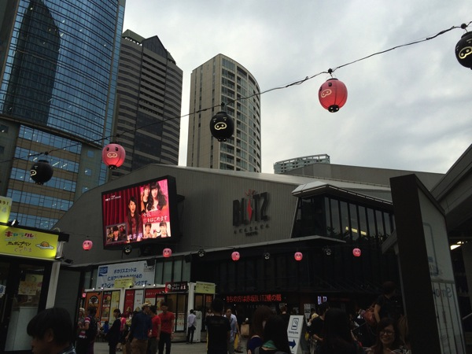
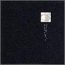
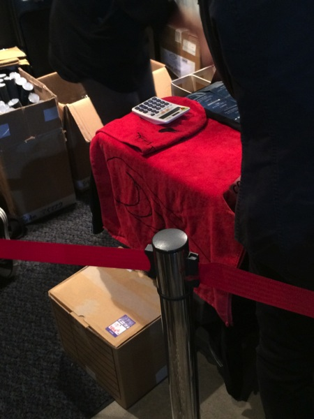
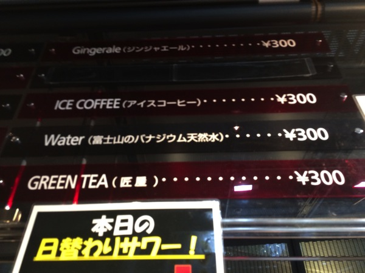

---
categories:
- sukekiyoのLIVEレポ
date: Sat, 04 Oct 2014 18:11:39 +0000
slug: post-6376
tags:
- LIVEレポ
- sukekiyo
title: 【ライブレポ】sukekiyo「異形の間」2014_10_4@赤坂BLITZ
---

ハローしんぺー(<a href="https://twitter.com/s_s_p_y" target="_blank">@s_s_p_y</a> )です。
オフィより詳しくて、wikiよりも有用なsukekiyo情報サイト「Gadget Zombie Parasite(ガジェットゾンビィパラサイト)」へようこそ。<!--more--><!--more-->

<!--TOC-->

本日、sukekiyo初主催興行「異形の間」に参列してまいりました。

今回の興行は出演者発表時から物議を醸しておりました。というのも、かかまってちゃんのみについてですが•••

さてさて、どうなるかとの想いを胸に会場へ

本日の会場は、TBSのお膝元赤坂blitz

DIR EN GREY関連でこの会場が使われたのは確か、5days以来。ぼくが建て直した後に来たのは、中島卓偉以来。その時は、会場が小さくなったイメージはなかったんだが、今日は凄い狭く感じた。新木場スタジオコーストより、ひとまわりもふたまわりも狭かったように思う。それに比べて天井がとてつもなく高く感じた。

さて、LIVEレポです。

<h2>MERRY</h2>

メリーのLIVEは数回見たことがあります。それのどれよりもかっこ良く感じました。
幕が左右に開くと、学習机に乗ったガラが現れ、杖を持って煽動。sukekiyo主催とは言え、sukekiyoのステージではないので皆さんステージ目がけて前に詰める詰める。

それにしても、ガラってやっぱりめちゃめちゃ巨大だ。187cmと<a href="http://ja.wikipedia.org/wiki/MERRY">wikipedia</a>にでてるけど、マジででかい。手足も長いし細身だから、奇怪な操り人形のような動きが、メリーの世界観と凄いあってる。。。って言うのも変な言い方だけど、声、動き、全てがメリーって感じがしてめちゃくちゃかっこよかった。

そして数曲演奏して、そろそろ終わりかな？という感じでガラが下手にはけていった。終わらない演奏、ガラ不在なのに始まる前奏。すると金色の短髪と見慣れた革ジャンの小さなお人が跳んできた。京！！！！この時が恐らく今日一番この会場が湧いた瞬間だったと思う。

ステージを所狭しと歌いつくした後で、ドラムのネロとハイタッチしてはけていった。

再び現れたガラがジャニーズモダニストで再び会場をわかした。

少し長丁場の今日のイベントが、間延びしてしまわないかが心配だったけど、このサプライズで一気に興奮した。

ちなみに京が歌ったのは「頭がザクロ」
現代ストイックに収録されております。

<table  border="0" cellpadding="5" style="border:none"><tr><td valign="top" style="border:none"></td><td valign="top" style="border:none;text-align:left">
<a href="http://www.amazon.co.jp/exec/obidos/ASIN/B00008PTE1/warawareotoko-22/ref=nosim/" rel="nofollow" target="_blank">現代ストイック</a>

メリー インディーズ・メーカー 2003-04-13

売り上げランキング : 311144
<table style="border:none;margin-top:10px"><tr><td style="border:none;text-align:left;">
<a href="http://www.amazon.co.jp/gp/search?keywords=%8C%BB%91%E3%83X%83g%83C%83b%83N&__mk_ja_JP=%83J%83%5E%83J%83i&tag=warawareotoko-22" rel="nofollow" target="_blank" title="アマゾン" >Amazon</a>

<a href="http://hb.afl.rakuten.co.jp/hgc/121ed5e1.954a9ce3.121ed5e2.9fc704ba/?pc=http%3A%2F%2Fsearch.rakuten.co.jp%2Fsearch%2Fmall%2F%25E7%258F%25BE%25E4%25BB%25A3%25E3%2582%25B9%25E3%2583%2588%25E3%2582%25A4%25E3%2583%2583%25E3%2582%25AF%2F-%2Ff.1-p.1-s.1-sf.0-st.A-v.2%3Fx%3D0%26scid%3Daf_ich_link_urltxt%26m%3Dhttp%3A%2F%2Fm.rakuten.co.jp%2F" rel="nofollow" target="_blank" title="楽天市場" >楽天市場</a>

<a href="http://ck.jp.ap.valuecommerce.com/servlet/referral?sid=3041033&pid=882528283&vc_url=http%3A%2F%2Fshopping.search.yahoo.co.jp%2Fsearch%3FuIv%3Don%26ei%3DUTF-8%26tab_ex%3Dcommerce%26slider%3D0%26va%3D%25E7%258F%25BE%25E4%25BB%25A3%25E3%2582%25B9%25E3%2583%2588%25E3%2582%25A4%25E3%2583%2583%25E3%2582%25AF" rel="nofollow"  target="_blank" title="Yahooショッピング" >Yahooショッピング</a>

<a href="http://ck.jp.ap.valuecommerce.com/servlet/referral?sid=3041033&pid=882660047&vc_url=http%3A%2F%2Fauctions.search.yahoo.co.jp%2Fsearch%3Fvo%3D%26ve%3D%26auccat%3D0%26aucminprice%3D%26aucmaxprice%3D%26aucmin_bidorbuy_price%3D%26aucmax_bidorbuy_price%3D%26loc_cd%3D0%26abatch%3D0%26istatus%3D0%26filtered%3D1%26ei%3DUTF-8%26tab_ex%3Dcommerce%26va%3D%25E7%258F%25BE%25E4%25BB%25A3%25E3%2582%25B9%25E3%2583%2588%25E3%2582%25A4%25E3%2583%2583%25E3%2582%25AF" rel="nofollow"  target="_blank" title="ヤフオク!" >ヤフオク!</a>
</td><td style="vertical-align:bottom;padding-left:10px;font-size:x-small;border:none">by <a href="http://kaereba.com" rel="nofollow" target="_blank">カエレバ</a></td></tr></table></td></tr></table>

<h3>セトリ</h3>

薔薇の片隅のブルース
ツンデレラ
不均衡キネマ
頭がザクロ feat.Kyo
ジャパモダ
梟

<h2>神聖かまってちゃん</h2>

始まると同時に複数人がでていったわw対してステージ前方にはかまってちゃんファンが集結
なお、会場にてかまってちゃんファンと思われる人数を数えましたが、50人くらいでした。その後の妖精帝国の時も数えましたが、こちらも50人くらいでした。

感想ですが、MCが面白かったのとボーカルがいちいちマイクスタンド倒すからスタッフの人がいちいち直すので大変そうでした。

ちなみに、ぼくが知っていたのは「ロックンロールは鳴り止まない」だけでしたわw

それとキーボードの人が言ってた言葉が凄いいいなと思った。

「お前ら寝ても醒めても寝てらんねーぞ！」

おおおってちょっと思った。

<h3>セトリ</h3>

不明。探してもでてこなかった。
あまりそっちの方々は、セトリまとめたりしないのかな

<h2>鳥肌実</h2>

えーっと、この人のせいでかまってちゃん吹き飛んだわw

ステージの転換がラストの妖精帝國用だったのか、すぐに始まりました。

ちょっと色々問題あるんで割愛しますねwww

でもサムライブルーがなんでブルーかってことに納得いかない話は納得
マリッジブルーとかなんとかブルーとか確かにネガティブな印象がある。

<h2>妖精帝國</h2>

よく知りません。一番よく知りません。

なるほど独特の世界観。しかもボーカルのYUI様は声優なのか。

んーなんか今日久々にバンドを見たなーという感じwメリー以来w

骨太のサウンドなんだが、ボーカルの音が少し小さかったのかなーという印象

<h3>セトリ</h3>

dogma
救世
Elusion
the creator
孤高の創世
メソロギ

<h2>sukekiyo</h2>

１曲目は、<a href="https://www.warawareotoko.com/2014/05/01/post-5235/">「別れを哀しむフリは貴方の為」@日本青年館の初日</a>の時のようにメンバーで向かい合ってのアコースティックセッションでのエリザベス

が、なんだか京さんの調子が少し悪そう。
さらにはメンバーも所々間違ったりして、少し緊張してたのかなって感じです。

京は途中でイヤモニの音量が大き過ぎたのか、上手スタッフに下げるように指示したり、音程も所々危なげな感じでした。

しかしながら、その後はいつも通りのsukekiyoらしいステージでした。

途中、このままの流れでmamaやらないかなーなんて思ってて京がはけました。
その後、照明が暗くなってハットをかぶったシルエット。。。京、じゃない•••
身長が倍　予感はしてました。mamaでくるんじゃないかなと

まるで自分の歌かのように、歌い上げたガラ

ふと関係者席を見ると増田さんが睨むように見つめておりました。
それにしてもガラめちゃくちゃかっこよかったなぁ。

その後いつも通り「in all weathers」の最後のピアノで締め、からの「おやすみ」ですが匠氏がワンテンポ遅れてた気がします。京もピクってなってた。

<h3>セトリ</h3>

elisabeth addict
destudo
aftermath
zephyr
新曲
304号室、舌と夜
hemimetabolism
烏有の空
vandal
斑人間
mama
in all weathers

<h2>しんぺーはこう思った。</h2>
とても楽しい興行でした。海外公演を経て各メンバーにも余裕が感じられるような気がしてきました。
また間を置かずに年明けくらいにやってもらいたいなー。また意外なメンバーを期待！意外じゃなくてもいいからすげーメンバーでもいい！！

個人的にはPIERROT、cali≠gari、ムックとかとかねw

あと、こぼれ話だけど、今年のハロウィンもペニュのフード付きタオルが販売予定っぽいぞ！前回手に入れ損ねた人は必見！ぼくも逃したし今年はほしいな。

あ、それと余談ですがバーのスーパードライのスペシャルバージョンみたいなのがめちゃくちゃおいしかった。あとsukekiyo的なお茶も売ってたので思わず買っちゃいました。

それがこれ。匠屋ですw

と言ったところで本日は以上になります。おやすみなさい。