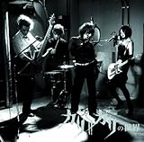
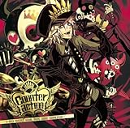
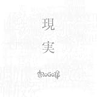

---
categories:
- music
date: Mon, 06 Oct 2014 05:14:54 +0000
slug: post-6392
tags:
- nogod
title: NoGodとかいうヴィジュアル系バンドってエレキテル連合のパクリだろ？
---

ハローしんぺー(<a href="https://twitter.com/s_s_p_y" target="_blank" rel="noopener">@s_s_p_y</a> )です。
オフィより詳しくて、wikiよりも有用なsukekiyo情報サイト「Gadget Zombie Parasite(ガジェットゾンビィパラサイト)」へようこそ。<!--more-->先日TSUTAYAでひっさしぶりにCDを数枚借りてきました。
それがどれもこれもくっそかっこいいのばっかでマジで脱帽しました。

借りてきたのはこれ。

cali≠gariの世界
Counteraction ―V-Rock covered Visual Anime songs Compilation―
シャングリラ
PANDORA
現実
<table style="border: none;" border="0" cellpadding="5">
<tbody>
<tr>
<td style="border: none;" valign="top"></td>
<td style="border: none; text-align: left;" valign="top">

<a href="http://www.amazon.co.jp/exec/obidos/ASIN/B001XXJIMY/warawareotoko-22/ref=nosim/" target="_blank" rel="nofollow noopener">cali≠gariの世界</a>

cali gari ビクターエンタテインメント 2009-05-20

売り上げランキング : 50370

<table style="border: none; margin-top: 10px;">
<tbody>
<tr>
<td style="border: none; text-align: left;">

<a title="アマゾン" href="http://www.amazon.co.jp/gp/search?keywords=cali%81%82gari&amp;__mk_ja_JP=%83J%83%5E%83J%83i&amp;tag=warawareotoko-22" target="_blank" rel="nofollow noopener">Amazon</a>

<a title="楽天市場" href="http://hb.afl.rakuten.co.jp/hgc/121ed5e1.954a9ce3.121ed5e2.9fc704ba/?pc=http%3A%2F%2Fsearch.rakuten.co.jp%2Fsearch%2Fmall%2Fcali%25E2%2589%25A0gari%2F-%2Ff.1-p.1-s.1-sf.0-st.A-v.2%3Fx%3D0%26scid%3Daf_ich_link_urltxt%26m%3Dhttp%3A%2F%2Fm.rakuten.co.jp%2F" target="_blank" rel="nofollow noopener">楽天市場</a>

<a title="Yahooショッピング" href="http://ck.jp.ap.valuecommerce.com/servlet/referral?sid=3041033&amp;pid=882528283&amp;vc_url=http%3A%2F%2Fshopping.search.yahoo.co.jp%2Fsearch%3FuIv%3Don%26ei%3DUTF-8%26tab_ex%3Dcommerce%26slider%3D0%26va%3Dcali%25E2%2589%25A0gari" target="_blank" rel="nofollow noopener">Yahooショッピング</a>

<a title="ヤフオク!" href="http://ck.jp.ap.valuecommerce.com/servlet/referral?sid=3041033&amp;pid=882660047&amp;vc_url=http%3A%2F%2Fauctions.search.yahoo.co.jp%2Fsearch%3Fvo%3D%26ve%3D%26auccat%3D0%26aucminprice%3D%26aucmaxprice%3D%26aucmin_bidorbuy_price%3D%26aucmax_bidorbuy_price%3D%26loc_cd%3D0%26abatch%3D0%26istatus%3D0%26filtered%3D1%26ei%3DUTF-8%26tab_ex%3Dcommerce%26va%3Dcali%25E2%2589%25A0gari" target="_blank" rel="nofollow noopener">ヤフオク!</a>
</td>
<td style="vertical-align: bottom; padding-left: 10px; font-size: x-small; border: none;">by <a href="http://kaereba.com" target="_blank" rel="nofollow noopener">カエレバ</a></td>
</tr>
</tbody>
</table>
&nbsp;</td>
</tr>
</tbody>
</table>
<table style="border: none;" border="0" cellpadding="5">
<tbody>
<tr>
<td style="border: none;" valign="top"></td>
<td style="border: none; text-align: left;" valign="top">

<a href="http://www.amazon.co.jp/exec/obidos/ASIN/B007N6SD80/warawareotoko-22/ref=nosim/" target="_blank" rel="nofollow noopener">Counteraction ―V-Rock covered Visual Anime songs Compilation―</a>

V.A. ビクターエンタテインメント 2012-05-23

売り上げランキング : 70040

<table style="border: none; margin-top: 10px;">
<tbody>
<tr>
<td style="border: none; text-align: left;">

<a title="アマゾン" href="http://www.amazon.co.jp/gp/search?keywords=Counteraction%3A%20V-Rock%20covered%20Visual%20Anime%20songs%20Compilation&amp;__mk_ja_JP=%83J%83%5E%83J%83i&amp;tag=warawareotoko-22" target="_blank" rel="nofollow noopener">Amazon</a>

<a title="楽天市場" href="http://hb.afl.rakuten.co.jp/hgc/121ed5e1.954a9ce3.121ed5e2.9fc704ba/?pc=http%3A%2F%2Fsearch.rakuten.co.jp%2Fsearch%2Fmall%2FCounteraction%253A%2520V-Rock%2520covered%2520Visual%2520Anime%2520songs%2520Compilation%2F-%2Ff.1-p.1-s.1-sf.0-st.A-v.2%3Fx%3D0%26scid%3Daf_ich_link_urltxt%26m%3Dhttp%3A%2F%2Fm.rakuten.co.jp%2F" target="_blank" rel="nofollow noopener">楽天市場</a>

<a title="Yahooショッピング" href="http://ck.jp.ap.valuecommerce.com/servlet/referral?sid=3041033&amp;pid=882528283&amp;vc_url=http%3A%2F%2Fshopping.search.yahoo.co.jp%2Fsearch%3FuIv%3Don%26ei%3DUTF-8%26tab_ex%3Dcommerce%26slider%3D0%26va%3DCounteraction%253A%2520V-Rock%2520covered%2520Visual%2520Anime%2520songs%2520Compilation" target="_blank" rel="nofollow noopener">Yahooショッピング</a>

<a title="ヤフオク!" href="http://ck.jp.ap.valuecommerce.com/servlet/referral?sid=3041033&amp;pid=882660047&amp;vc_url=http%3A%2F%2Fauctions.search.yahoo.co.jp%2Fsearch%3Fvo%3D%26ve%3D%26auccat%3D0%26aucminprice%3D%26aucmaxprice%3D%26aucmin_bidorbuy_price%3D%26aucmax_bidorbuy_price%3D%26loc_cd%3D0%26abatch%3D0%26istatus%3D0%26filtered%3D1%26ei%3DUTF-8%26tab_ex%3Dcommerce%26va%3DCounteraction%253A%2520V-Rock%2520covered%2520Visual%2520Anime%2520songs%2520Compilation" target="_blank" rel="nofollow noopener">ヤフオク!</a>
</td>
<td style="vertical-align: bottom; padding-left: 10px; font-size: x-small; border: none;">by <a href="http://kaereba.com" target="_blank" rel="nofollow noopener">カエレバ</a></td>
</tr>
</tbody>
</table>
&nbsp;</td>
</tr>
</tbody>
</table>
<table style="border: none;" border="0" cellpadding="5">
<tbody>
<tr>
<td style="border: none;" valign="top"></td>
<td style="border: none; text-align: left;" valign="top">

<a href="http://www.amazon.co.jp/exec/obidos/ASIN/B009GN76SQ/warawareotoko-22/ref=nosim/" target="_blank" rel="nofollow noopener">シャングリラ</a>

ムック SMAR 2012-11-28

売り上げランキング : 85947

<table style="border: none; margin-top: 10px;">
<tbody>
<tr>
<td style="border: none; text-align: left;">

<a title="アマゾン" href="http://www.amazon.co.jp/gp/search?keywords=%83V%83%83%83%93%83O%83%8A%83%89&amp;__mk_ja_JP=%83J%83%5E%83J%83i&amp;tag=warawareotoko-22" target="_blank" rel="nofollow noopener">Amazon</a>

<a title="楽天市場" href="http://hb.afl.rakuten.co.jp/hgc/121ed5e1.954a9ce3.121ed5e2.9fc704ba/?pc=http%3A%2F%2Fsearch.rakuten.co.jp%2Fsearch%2Fmall%2F%25E3%2582%25B7%25E3%2583%25A3%25E3%2583%25B3%25E3%2582%25B0%25E3%2583%25AA%25E3%2583%25A9%2F-%2Ff.1-p.1-s.1-sf.0-st.A-v.2%3Fx%3D0%26scid%3Daf_ich_link_urltxt%26m%3Dhttp%3A%2F%2Fm.rakuten.co.jp%2F" target="_blank" rel="nofollow noopener">楽天市場</a>

<a title="Yahooショッピング" href="http://ck.jp.ap.valuecommerce.com/servlet/referral?sid=3041033&amp;pid=882528283&amp;vc_url=http%3A%2F%2Fshopping.search.yahoo.co.jp%2Fsearch%3FuIv%3Don%26ei%3DUTF-8%26tab_ex%3Dcommerce%26slider%3D0%26va%3D%25E3%2582%25B7%25E3%2583%25A3%25E3%2583%25B3%25E3%2582%25B0%25E3%2583%25AA%25E3%2583%25A9" target="_blank" rel="nofollow noopener">Yahooショッピング</a>

<a title="ヤフオク!" href="http://ck.jp.ap.valuecommerce.com/servlet/referral?sid=3041033&amp;pid=882660047&amp;vc_url=http%3A%2F%2Fauctions.search.yahoo.co.jp%2Fsearch%3Fvo%3D%26ve%3D%26auccat%3D0%26aucminprice%3D%26aucmaxprice%3D%26aucmin_bidorbuy_price%3D%26aucmax_bidorbuy_price%3D%26loc_cd%3D0%26abatch%3D0%26istatus%3D0%26filtered%3D1%26ei%3DUTF-8%26tab_ex%3Dcommerce%26va%3D%25E3%2582%25B7%25E3%2583%25A3%25E3%2583%25B3%25E3%2582%25B0%25E3%2583%25AA%25E3%2583%25A9" target="_blank" rel="nofollow noopener">ヤフオク!</a>
</td>
<td style="vertical-align: bottom; padding-left: 10px; font-size: x-small; border: none;">by <a href="http://kaereba.com" target="_blank" rel="nofollow noopener">カエレバ</a></td>
</tr>
</tbody>
</table>
&nbsp;</td>
</tr>
</tbody>
</table>
<table style="border: none;" border="0" cellpadding="5">
<tbody>
<tr>
<td style="border: none;" valign="top"></td>
<td style="border: none; text-align: left;" valign="top">

<a href="http://www.amazon.co.jp/exec/obidos/ASIN/B00ENWO156/warawareotoko-22/ref=nosim/" target="_blank" rel="nofollow noopener">PANDORA</a>

SiM Nayutawave Records 2013-10-23

売り上げランキング : 2654

<table style="border: none; margin-top: 10px;">
<tbody>
<tr>
<td style="border: none; text-align: left;">

<a title="アマゾン" href="http://www.amazon.co.jp/gp/search?keywords=SiM%20pandra&amp;__mk_ja_JP=%83J%83%5E%83J%83i&amp;tag=warawareotoko-22" target="_blank" rel="nofollow noopener">Amazon</a>

<a title="楽天市場" href="http://hb.afl.rakuten.co.jp/hgc/121ed5e1.954a9ce3.121ed5e2.9fc704ba/?pc=http%3A%2F%2Fsearch.rakuten.co.jp%2Fsearch%2Fmall%2FSiM%2520pandra%2F-%2Ff.1-p.1-s.1-sf.0-st.A-v.2%3Fx%3D0%26scid%3Daf_ich_link_urltxt%26m%3Dhttp%3A%2F%2Fm.rakuten.co.jp%2F" target="_blank" rel="nofollow noopener">楽天市場</a>

<a title="Yahooショッピング" href="http://ck.jp.ap.valuecommerce.com/servlet/referral?sid=3041033&amp;pid=882528283&amp;vc_url=http%3A%2F%2Fshopping.search.yahoo.co.jp%2Fsearch%3FuIv%3Don%26ei%3DUTF-8%26tab_ex%3Dcommerce%26slider%3D0%26va%3DSiM%2520pandra" target="_blank" rel="nofollow noopener">Yahooショッピング</a>

<a title="ヤフオク!" href="http://ck.jp.ap.valuecommerce.com/servlet/referral?sid=3041033&amp;pid=882660047&amp;vc_url=http%3A%2F%2Fauctions.search.yahoo.co.jp%2Fsearch%3Fvo%3D%26ve%3D%26auccat%3D0%26aucminprice%3D%26aucmaxprice%3D%26aucmin_bidorbuy_price%3D%26aucmax_bidorbuy_price%3D%26loc_cd%3D0%26abatch%3D0%26istatus%3D0%26filtered%3D1%26ei%3DUTF-8%26tab_ex%3Dcommerce%26va%3DSiM%2520pandra" target="_blank" rel="nofollow noopener">ヤフオク!</a>
</td>
<td style="vertical-align: bottom; padding-left: 10px; font-size: x-small; border: none;">by <a href="http://kaereba.com" target="_blank" rel="nofollow noopener">カエレバ</a></td>
</tr>
</tbody>
</table>
&nbsp;</td>
</tr>
</tbody>
</table>
<table style="border: none;" border="0" cellpadding="5">
<tbody>
<tr>
<td style="border: none;" valign="top"></td>
<td style="border: none; text-align: left;" valign="top">

<a href="http://www.amazon.co.jp/exec/obidos/ASIN/B0051RHSEI/warawareotoko-22/ref=nosim/" target="_blank" rel="nofollow noopener">現実[通常盤]</a>

NoGoD キングレコード 2011-08-03

売り上げランキング : 95052

<table style="border: none; margin-top: 10px;">
<tbody>
<tr>
<td style="border: none; text-align: left;">

<a title="アマゾン" href="http://www.amazon.co.jp/gp/search?keywords=nogod&amp;__mk_ja_JP=%83J%83%5E%83J%83i&amp;tag=warawareotoko-22" target="_blank" rel="nofollow noopener">Amazon</a>

<a title="楽天市場" href="http://hb.afl.rakuten.co.jp/hgc/121ed5e1.954a9ce3.121ed5e2.9fc704ba/?pc=http%3A%2F%2Fsearch.rakuten.co.jp%2Fsearch%2Fmall%2Fnogod%2F-%2Ff.1-p.1-s.1-sf.0-st.A-v.2%3Fx%3D0%26scid%3Daf_ich_link_urltxt%26m%3Dhttp%3A%2F%2Fm.rakuten.co.jp%2F" target="_blank" rel="nofollow noopener">楽天市場</a>

<a title="Yahooショッピング" href="http://ck.jp.ap.valuecommerce.com/servlet/referral?sid=3041033&amp;pid=882528283&amp;vc_url=http%3A%2F%2Fshopping.search.yahoo.co.jp%2Fsearch%3FuIv%3Don%26ei%3DUTF-8%26tab_ex%3Dcommerce%26slider%3D0%26va%3Dnogod" target="_blank" rel="nofollow noopener">Yahooショッピング</a>

<a title="ヤフオク!" href="http://ck.jp.ap.valuecommerce.com/servlet/referral?sid=3041033&amp;pid=882660047&amp;vc_url=http%3A%2F%2Fauctions.search.yahoo.co.jp%2Fsearch%3Fvo%3D%26ve%3D%26auccat%3D0%26aucminprice%3D%26aucmaxprice%3D%26aucmin_bidorbuy_price%3D%26aucmax_bidorbuy_price%3D%26loc_cd%3D0%26abatch%3D0%26istatus%3D0%26filtered%3D1%26ei%3DUTF-8%26tab_ex%3Dcommerce%26va%3Dnogod" target="_blank" rel="nofollow noopener">ヤフオク!</a>
</td>
<td style="vertical-align: bottom; padding-left: 10px; font-size: x-small; border: none;">by <a href="http://kaereba.com" target="_blank" rel="nofollow noopener">カエレバ</a></td>
</tr>
</tbody>
</table>
&nbsp;</td>
</tr>
</tbody>
</table>
<h2>久しぶりにすばらしい若手バンドに巡り会えた！！！</h2>
で、そんな中一番意外だったのがNoGodとかいうバンド
今まで存在は認識していたものの、ボーカルの人のギャグぽいメイクに食わず嫌いしてました。どうせギャグバンドかなんかなんだろ？とか思っていました。ってか最近流行のエレキテル連合かと思っていまいした。「ダメよダメダメ」ってやつ

本当にすいませんした！！！

アルバム冒頭から衝撃。「え？メタルですか？」
聞き進んで行くと、歌詞がめちゃくちゃいいい！！！なにゃこれ！！

http://youtu.be/lilJSVlUUPk

この見た目との裏腹感！！聖飢魔Ⅱ以来の衝撃でした。

マジで演奏がくっそうまい、歌もうまい、歌詞もいい！

LIVEに行きたい！
<blockquote>2005年初頭「神の啓示を受けた団長が使徒を招集しうっかり結成」という設定で、ライブを「布教」、ファンを「信者」、曲を「教え」、差し入れを「お供え物」と呼ぶなど「新興宗教楽団」としての世界観を持っていた。

中略

ヴィジュアルの奇抜さゆえ色物的に捉えられがちであるが、メンバー各々のテクニックが非常に優れており、ヴィジュアル系バンド界でトップクラスであるといっても過言ではない。

引用元:<a href="http://ja.wikipedia.org/wiki/NoGoD">wikipedia</a></blockquote>
<h3>団長という人</h3>
なんていうか、この人すっごいわかってるわー
しかもそれを敢えて言っちゃうっていうねwなんかキリトを彷彿とさせる。
<blockquote>人より目立ちたいがために化粧を始めたのが「ヴィジュアル系」だったはずなのに、人と同じような化粧をすることが目的になった時点で、このジャンルの精神は死んでるんです。

引用元：<a href="http://news.ameba.jp/20121231-104/">【V系】ヴィジュアル系はもう「終わり」?「2012年のV系を振り返る」第3回(ゲスト:NoGoD 団長)</a></blockquote>
<blockquote>自分がバンドを始めるような年齢になった時、当時通っていた専門学校の近くに有名なヴィジュアル系のライブハウスがあったんで行ってみたんです。そしたら、みんな同じような格好をして、同じような曲をやってる。「5バンドのイベントなのにこいつら全部一緒じゃねーか！」と、それですごく偏見を持つようになったんですね。</blockquote>
この人、本当の意味でロックだな。
なんかぼくが昔キリトを崇め奉った要因をもしかして持ってらっしゃるのかも•••
<h2>NoGodは物真似バンドです。</h2>
たまったま一緒にかりた若手バンドのカバーアルバムにNoGodも参加していました。知らずに聞いていたらなぜかTMレボリューションが入ってました。

で、ふとiPhoneを見ると

まじか•••
気になってさらにiTunesでNoGodで検索。そしたらシャムシェイドの1/3の純情な感情もカバーしてて、聞いたら、まんまシャムシェイドでした。

それがボーカルだけじゃないんですよ。演奏もなんですよねえさん。

マジ完コピも良いところです。
まじコルトピのギャラリーフェイクかハタケカカシかと思いました。
<h2>しんぺーはこう思った。</h2>
久々に良いバンドと巡りあった！これはヤバい！年明けにDIR EN GREYが落ち着いた頃にLIVE行きたいわ。それまでに全曲聞いておかなきゃなこれw

もしかして、割とぼくよりも年上の人も多そうな気もするわこのバンドw
だって、なんつーか若者好みじゃないでしょwこれwww

久しぶりにダークではなく、かといって軽くない、芯の通った音楽だった！

NoGodマジ注目したい。
と言ったところで本日は以上になります。おやすみなさい。

<iframe style="width: 120px; height: 240px;" src="http://rcm-fe.amazon-adsystem.com/e/cm?lt1=_blank&amp;bc1=000000&amp;IS2=1&amp;bg1=FFFFFF&amp;fc1=000000&amp;lc1=0000FF&amp;t=warawareotoko-22&amp;o=9&amp;p=8&amp;l=as4&amp;m=amazon&amp;f=ifr&amp;ref=ss_til&amp;asins=B004XES2K4" width="300" height="150" frameborder="0" marginwidth="0" marginheight="0" scrolling="no"></iframe><iframe style="width: 120px; height: 240px;" src="http://rcm-fe.amazon-adsystem.com/e/cm?lt1=_blank&amp;bc1=000000&amp;IS2=1&amp;bg1=FFFFFF&amp;fc1=000000&amp;lc1=0000FF&amp;t=warawareotoko-22&amp;o=9&amp;p=8&amp;l=as4&amp;m=amazon&amp;f=ifr&amp;ref=ss_til&amp;asins=B00NGJIU8G" width="300" height="150" frameborder="0" marginwidth="0" marginheight="0" scrolling="no"></iframe>