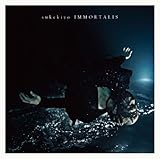
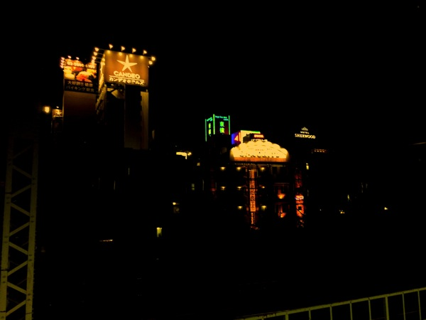
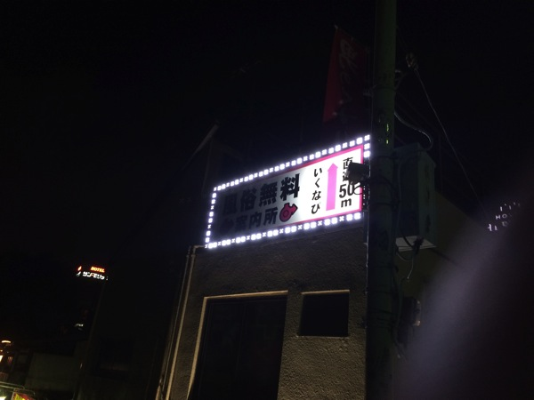
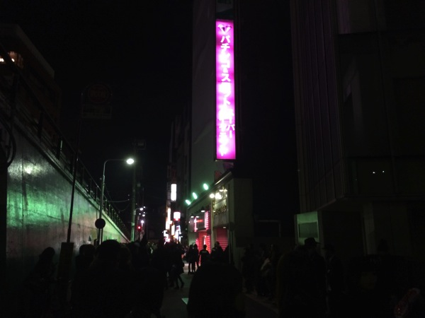
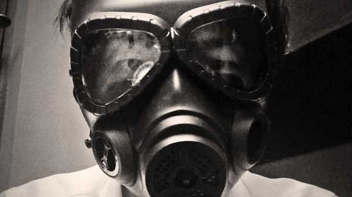

---
categories:
- sukekiyoのLIVEレポ
date: Thu, 16 Oct 2014 17:45:16 +0000
slug: post-6429
tags:
- sukekiyo
title: sukekiyo 二〇一四年公演「雨上がりの優詩」-ハロウィン殺しの漆黒の儀-＠東京キネマ倶楽部
---

ハローしんぺー(<a href="https://twitter.com/s_s_p_y" target="_blank">@s_s_p_y</a> )です。
オフィより詳しくて、wikiよりも有用なsukekiyo情報サイト「Gadget Zombie Parasite(ガジェットゾンビィパラサイト)」へようこそ。<!--more--><!--more-->

<!--TOC-->

ついにIMMORTALISのツアーが終了しました。

<a href="http://www.amazon.co.jp/exec/obidos/ASIN/B00IMKDX3G/warawareotoko-22/ref=nosim/" rel="nofollow" target="_blank">IMMORTALIS(初回生産限定盤)</a>
posted with <a href="http://kaereba.com" rel="nofollow" target="_blank">カエレバ</a>

sukekiyo SMD itaku (music) 2014-04-30    

<a href="http://www.amazon.co.jp/gp/search?keywords=IMMORTALIS&__mk_ja_JP=%83J%83%5E%83J%83i&tag=warawareotoko-22" rel="nofollow" target="_blank" title="アマゾン" >Amazon</a>

<a href="http://hb.afl.rakuten.co.jp/hgc/121ed5e1.954a9ce3.121ed5e2.9fc704ba/?pc=http%3A%2F%2Fsearch.rakuten.co.jp%2Fsearch%2Fmall%2FIMMORTALIS%2F-%2Ff.1-p.1-s.1-sf.0-st.A-v.2%3Fx%3D0%26scid%3Daf_ich_link_urltxt%26m%3Dhttp%3A%2F%2Fm.rakuten.co.jp%2F" rel="nofollow" target="_blank" title="楽天市場" >楽天市場</a>

<a href="http://ck.jp.ap.valuecommerce.com/servlet/referral?sid=3041033&pid=882528283&vc_url=http%3A%2F%2Fshopping.search.yahoo.co.jp%2Fsearch%3FuIv%3Don%26ei%3DUTF-8%26tab_ex%3Dcommerce%26slider%3D0%26va%3DIMMORTALIS" rel="nofollow"  target="_blank" title="Yahooショッピング" >Yahooショッピング</a>

<a href="http://ck.jp.ap.valuecommerce.com/servlet/referral?sid=3041033&pid=882660047&vc_url=http%3A%2F%2Fauctions.search.yahoo.co.jp%2Fsearch%3Fvo%3D%26ve%3D%26auccat%3D0%26aucminprice%3D%26aucmaxprice%3D%26aucmin_bidorbuy_price%3D%26aucmax_bidorbuy_price%3D%26loc_cd%3D0%26abatch%3D0%26istatus%3D0%26filtered%3D1%26ei%3DUTF-8%26tab_ex%3Dcommerce%26va%3DIMMORTALIS" rel="nofollow"  target="_blank" title="ヤフオク!" >ヤフオク!</a>

リリースが4月30日、なんと半年もたっていないのですね。もう1年近くツアーをやってたんじゃないかっていう濃さです。

思えば、アルバム発売前に開催された鳳凰の間。何も解らず突っ立って、絞りだした歓声に「黙れ」の一言が、遠い昔のようです。sukekiyoのLIVEはかくあるべき、というのがいつの間にかできて、それがあたかもずっとそうであったかのような完成されたLIVEが繰り広げられました。

そのツアーもいよいよ本日で最終日。もう二度と今のこの空気感を味わうことはかなわないでしょう。

本日のステージは、東京キネマ倶楽部。鴬谷という怪しげな立地と内装の豪華さと裏腹のアングラ感をもった会場が、まさにsukekiyoのぴったりと言えます。

会場につくと、いるわいるわ黒服の人たち。もはやLIVEというよりもサバト（魔女の集会）のようになっています。本日のLIVEは黒服+仮装がドレスコードということで、皆様凝った衣装を切られておりました。

ぼくはというとこんな感じ

今日の朝届いたガスマスクです。

<a href="http://www.amazon.co.jp/exec/obidos/ASIN/B008F4T8TM/warawareotoko-22/ref=nosim/" rel="nofollow" target="_blank">M04ガスマスク型　フルフェイスゴーグル　BK　[くもり防止ファン搭載]</a>
posted with <a href="http://kaereba.com" rel="nofollow" target="_blank">カエレバ</a>

 militarygarage     

<a href="http://www.amazon.co.jp/gp/search?keywords=M04%83K%83X%83%7D%83X%83N%8C%5E&__mk_ja_JP=%83J%83%5E%83J%83i&tag=warawareotoko-22" rel="nofollow" target="_blank" title="アマゾン" >Amazon</a>

<a href="http://hb.afl.rakuten.co.jp/hgc/121ed5e1.954a9ce3.121ed5e2.9fc704ba/?pc=http%3A%2F%2Fsearch.rakuten.co.jp%2Fsearch%2Fmall%2FM04%25E3%2582%25AC%25E3%2582%25B9%25E3%2583%259E%25E3%2582%25B9%25E3%2582%25AF%25E5%259E%258B%2F-%2Ff.1-p.1-s.1-sf.0-st.A-v.2%3Fx%3D0%26scid%3Daf_ich_link_urltxt%26m%3Dhttp%3A%2F%2Fm.rakuten.co.jp%2F" rel="nofollow" target="_blank" title="楽天市場" >楽天市場</a>

<a href="http://ck.jp.ap.valuecommerce.com/servlet/referral?sid=3041033&pid=882528283&vc_url=http%3A%2F%2Fshopping.search.yahoo.co.jp%2Fsearch%3FuIv%3Don%26ei%3DUTF-8%26tab_ex%3Dcommerce%26slider%3D0%26va%3DM04%25E3%2582%25AC%25E3%2582%25B9%25E3%2583%259E%25E3%2582%25B9%25E3%2582%25AF%25E5%259E%258B" rel="nofollow"  target="_blank" title="Yahooショッピング" >Yahooショッピング</a>

<a href="http://ck.jp.ap.valuecommerce.com/servlet/referral?sid=3041033&pid=882660047&vc_url=http%3A%2F%2Fauctions.search.yahoo.co.jp%2Fsearch%3Fvo%3D%26ve%3D%26auccat%3D0%26aucminprice%3D%26aucmaxprice%3D%26aucmin_bidorbuy_price%3D%26aucmax_bidorbuy_price%3D%26loc_cd%3D0%26abatch%3D0%26istatus%3D0%26filtered%3D1%26ei%3DUTF-8%26tab_ex%3Dcommerce%26va%3DM04%25E3%2582%25AC%25E3%2582%25B9%25E3%2583%259E%25E3%2582%25B9%25E3%2582%25AF%25E5%259E%258B" rel="nofollow"  target="_blank" title="ヤフオク!" >ヤフオク!</a>

さていよいよLIVEレポです。

<h2>LIVEレポ「雨上がりの優詩」-ハロウィン殺しの漆黒の儀-＠東京キネマ倶楽部</h2>

<h3>メンバー衣装</h3>
開始はいつも通りベルが告げます。
SEに合わせて現れるメンバー。全員着物風の出で立ちです。
未架さん、YUCHI氏はオールバック。匠氏は羽織をはおっていました。UTAさんはちゃんと見えませんでした。なお、本日のぼくの立ち位置はドセンです。繰り返しますドセンの神整番です。ありがとうございます。

最後に現れた京。花魁です。これは恐らく京都公演寡黙の儀の時と酷似しています。ただ、今回お方がより花魁でした。
崩れた髪の毛（カツラ）、元の髪型は恐らく江戸時代の女性の髪型と言えばつたわると思います。（参考リンク）

さらに着物の下には、黒い細い紐が巻かれていました。ブラジャーかと思いました。
恐らく、これは縄で縛り上げられた跡を表現してるんじゃないかと想像しました。そこで後述しますがある仮説が浮かびました。

<h3>セトリ</h3>

1. aftermath
2. latour
3. nine melted fiction
4. the daemon's cutlery
5. 新曲
6. hidden one
7. zephyr
8. scars like velvet
9. hemimetabolism
10. 烏有の空
11. 304号室、舌と夜
12. vandal
13. 斑人間
14. 鵠
15. mama
16. 二人静(cover)
17. in all weathers
SE destrudo

注目すべきはmamaのあとの「二人静」
演奏前に、匠がMacの前におもむろに楽譜？をおいて演奏をしだしました。新曲だから覚えていないのかな？って思いました。さらにぼくは、お恥ずかしながらこの曲をしらなかったので完全に新曲かと思いました。ちなみにこの曲ですね。

<a href="http://www.amazon.co.jp/exec/obidos/ASIN/B00B93BP5Q/warawareotoko-22/ref=nosim/" rel="nofollow" target="_blank">二人静（ふたりしずか）-「天河伝説殺人事件」より</a>
posted with <a href="http://kaereba.com" rel="nofollow" target="_blank">カエレバ</a>

中森明菜 WM Japan 2008-12-10    

<a href="http://www.amazon.co.jp/gp/search?keywords=%93%F1%90l%90%C3&__mk_ja_JP=%83J%83%5E%83J%83i&tag=warawareotoko-22" rel="nofollow" target="_blank" title="アマゾン" >Amazon</a>

<a href="http://hb.afl.rakuten.co.jp/hgc/121ed5e1.954a9ce3.121ed5e2.9fc704ba/?pc=http%3A%2F%2Fsearch.rakuten.co.jp%2Fsearch%2Fmall%2F%25E4%25BA%258C%25E4%25BA%25BA%25E9%259D%2599%2F-%2Ff.1-p.1-s.1-sf.0-st.A-v.2%3Fx%3D0%26scid%3Daf_ich_link_urltxt%26m%3Dhttp%3A%2F%2Fm.rakuten.co.jp%2F" rel="nofollow" target="_blank" title="楽天市場" >楽天市場</a>

<a href="http://ck.jp.ap.valuecommerce.com/servlet/referral?sid=3041033&pid=882528283&vc_url=http%3A%2F%2Fshopping.search.yahoo.co.jp%2Fsearch%3FuIv%3Don%26ei%3DUTF-8%26tab_ex%3Dcommerce%26slider%3D0%26va%3D%25E4%25BA%258C%25E4%25BA%25BA%25E9%259D%2599" rel="nofollow"  target="_blank" title="Yahooショッピング" >Yahooショッピング</a>

<a href="http://ck.jp.ap.valuecommerce.com/servlet/referral?sid=3041033&pid=882660047&vc_url=http%3A%2F%2Fauctions.search.yahoo.co.jp%2Fsearch%3Fvo%3D%26ve%3D%26auccat%3D0%26aucminprice%3D%26aucmaxprice%3D%26aucmin_bidorbuy_price%3D%26aucmax_bidorbuy_price%3D%26loc_cd%3D0%26abatch%3D0%26istatus%3D0%26filtered%3D1%26ei%3DUTF-8%26tab_ex%3Dcommerce%26va%3D%25E4%25BA%258C%25E4%25BA%25BA%25E9%259D%2599" rel="nofollow"  target="_blank" title="ヤフオク!" >ヤフオク!</a>

あと、どうも京はsukekiyoでは女性的な部分を表現しているのか随所に喘ぎ声やら嫌らしい動き、ヨダレなどなどを盛り込んだいやらしく、艶かしい動きでした。

あと、どこかの曲。未架さんが和太鼓のようなドラミングをしておりました。それとin all weathersの最後の匠のキーボードが入る部分で、ワンテンポ匠の入りが遅れるといつも京がぴくっとします。今日もしてました。確か前回の<a href="https://www.warawareotoko.com/2014/09/10/post-6197/">鹿鳴館</a>でもしていました。

<h2>しんぺーはこう思った。</h2>
さて、いくつか仮説を

<h3>未亡人＝京</h3>

これは以前から思っていました。そもそもsukekiyoファンを未亡人と称するのにも違和感を覚える要因がこれです。

今回のIMMORTALISツアーである「別れを惜しむフリは貴方の為」「雨上がりの優詩」のテーマは、主人に先立たれた女性＝未亡人というのがあると感じています。そして京都公演の寡黙の儀で京が女装して現れた時、確認しました。

京自身が未亡人であり、今回のツアーは先立った主人の葬式であり、だからこそ我々は参列者なのです。

そして「別れを惜しむフリは貴方の為」のファイナルである下北沢GARDENでは未亡人を葬り幕引きをしたのです。
<blockquote class="twitter-tweet" lang="ja">
今までのツアーは京自身が未亡人で夫の葬式をしてるって感じ。でも今日は京もその参列者。つまりこのツアー自体は今日で幕引きってことをあらわしてるんじゃないかと
&mdash; しんぺー@ハロウィン殺しの漆黒の儀 (@s_s_p_y) <a href="https://twitter.com/s_s_p_y/status/468747674267549696">2014, 5月 20</a></blockquote> 

<a style="color:#0070C5;" href="https://www.warawareotoko.com/2014/05/21/post-5380/" target="_blank">sukekiyo2014ツアーファイナル「別れを惜しむフリは貴方の為-漆黒の儀-」@下北沢GARDEN | Gadget Zombie Parasite</a>  

やはり今日も同じことを思いました。そしてsukekiyoのバックドロップに使われるあの掛け軸５枚。あの女性のへそと京のへそがなんとなく同じ形に見えて。考えすぎかもしれないけど

<blockquote class="twitter-tweet" lang="ja">
一時期京がぽっちゃりした時あったやないですか。日武終わってから。でsukekiyoのバックにかかってる女性の5枚の絵あるやないですか、あれって京なんじゃないかなと思ったんですよ。であれの絵描くためもしくは加工する写真撮影のためにふとったんじゃないかと。つまりあれは京なんじゃ
&mdash; しんぺー@ハロウィン殺しの漆黒の儀 (@s_s_p_y) <a href="https://twitter.com/s_s_p_y/status/522764442904195072">2014, 10月 16</a></blockquote> 

<blockquote class="twitter-tweet" lang="ja">
ヘソの位置がね、一緒な気がしたんですよね。つまりあれが京の女体化だとすると未亡人は京自身なわけで、そう考えるとやっぱり今日の衣装の意味もしっくりくる
&mdash; しんぺー@ハロウィン殺しの漆黒の儀 (@s_s_p_y) <a href="https://twitter.com/s_s_p_y/status/522764733170978817">2014, 10月 16</a></blockquote> 

ということで未亡人とは京の女体化なんだろうと思うのでした。

<h3>ハロウィン殺しというタイトルは、違うハロウィンパーティーを殺すっていう意味</h3>

<blockquote class="twitter-tweet" lang="ja">
あれ？ハロウィン殺しってあっちのハロパを殺すぜってこと？
&mdash; しんぺー@ハロウィン殺しの漆黒の儀 (@s_s_p_y) <a href="https://twitter.com/s_s_p_y/status/522763368260579328">2014, 10月 16</a></blockquote> 

今年もVAMPS主催のハロウィンパーティーが幕張で開催されます。
<a href="http://www.halloweenparty2014.com">http://www.halloweenparty2014.com</a>

しかも、明日から
ということで、このイベントを殺すぜっていうシャレなんじゃないかと思うのです。

そして、それに対抗するかのように我らが天使ヤモエルが本日もお出かけ前の美容室へ赴かれたようです。

<blockquote class="twitter-tweet" lang="ja">
DIR EN GREY(ディルアングレイ)のShinyaさん☆☆☆&#10;カラー＆トリートメントでRISEL来たよ♪&#10;Νewカラーはハイライトをしっかり入れたパール系オシャレカラー♪♪&#10;そしてサラサラに♪♪ <a href="http://t.co/R0MjAENZSU">pic.twitter.com/R0MjAENZSU</a>
&mdash; RISEL朝長祐介 (@snowdrop4687) <a href="https://twitter.com/snowdrop4687/status/522753727841579009">2014, 10月 16</a></blockquote> 

これは気合い十分と言ったところでしょうか。

さてさて、実は今日はぼくの誕生日です。
生まれ落とされたこの日に、こんなすばらしいLIVEに参列できたことを嬉しく思います。

今まで自分がしてきた選択肢が全て正しかったと確信できるLIVEでした。

ただガスマスクは暑いし、臭いし、気持ち悪くて倒れるかと思いました。

次回のsukekiyoに備えてチャージ（貯金）をせねば。
さてsukekiyoも終わったことでし、次はARCHE•••の前に青春のおとしまえPIERROTがあります。今からピエラーモードに切り替えねば！

年はとってもまだまだ、死ぬまでやりたいことをやりつづけてやるぜ！！！

プレゼントは<a href="https://www.warawareotoko.com/2014/06/17/post-5713/">こちら</a>からw

と言ったところで本日は以上になります。おやすみなさい。