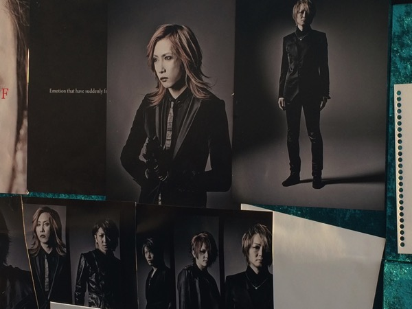

---
categories:
- PIERROT
date: Fri, 24 Oct 2014 08:12:00 +0000
slug: post-6454
tags:
- pierrot
title: ここまで長かった。。。PIERROT DICTATORS CIRCUS FAINAL at埼玉スーパーアリーナ
---

今、D'espairsRayを聞いてます。別に意味はないです。たまたまです。<!--more-->

マクドナルドでこれを書いているんですが、物販の列や駅を行き交うピエラーを見て「これぞLIVEだ」と実感しました。
普段の生活で自分の場所なんかなくて、地味で友達もいない根暗な奴らがこの時だけは、本当の自分を解放する場所。

その本当の自分ってのも、実はこの場所に適用するために形成されたものでもあるんだけど。要はオタクによるオタクのコミュニティー、それがPIERROTのLIVE

他から理解されないし、自分達が理解できていればいい
誰にはばかることなく、今この瞬間を本気で楽しもうと、そしてこの瞬間に何かを感じようとする個人の集まり。それがPIERROTのLIVEだと思う。

みんなー一つにナローゼーウェーイとか言って肩組んで一体感演出するわけじゃない
みんな孤独、それがぼくたちのつながり

少なくともぼくは当時そう感じてた。LIVE会場で特別仲のいい人がいたわけじゃないけどね。

でもPIERROTっていう文化はそういう土壌の上に間違いなくたってると思う。

そしてぼくは、人が好きにならないようなこんなものを好きになった自分を嫌って否定してた。みんなが好きなものが嫌いな自分を嫌ってた。

「罪と罰」を背負いながらぼくは今を選ぼう

罪って自分を許せないこと、罰とはそれゆえに生まれる孤独と隔絶だと思う

だから、birthdayで「ぼくが祝福してあげるから」って「そこにいるだけでいいから」って言ってるんだなさと思った。

ギルティ、ノットギルティもそう。死刑台に赴くのは自らの足でなんだから、それを自分で決めろってことだと思う。

そして最終的には「難解な駆け引きにもう意味はなくて」と断じてる。

PIERROTを初めて聞いた日からもう15年以上たった。

お互いにもとめあってる、それが答えさ

というわけで、ぬるくなったマックのラテをすすりながら、まだ開場をまつぼくでした。

<a href="http://www.amazon.co.jp/exec/obidos/ASIN/B00MYED25U/warawareotoko-22/ref=nosim/" rel="nofollow" target="_blank">HELLO COMPLETE SINGLES AND PV COLLECTION(DVD付)</a>
posted with <a href="http://kaereba.com" rel="nofollow" target="_blank">カエレバ</a>

PIERROT SWEET-HEART RECORD 2014-10-22    

