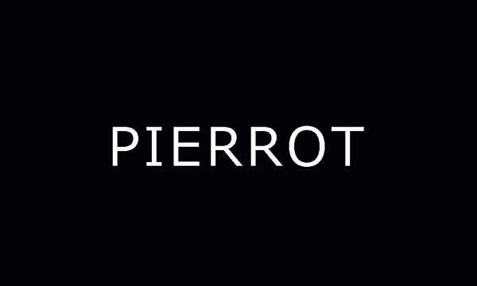

---
categories:
- PIERROT
date: Fri, 24 Oct 2014 09:21:00 +0000
slug: post-6458
tags:
- pierrot
title: 開演前に思うこと。PIERROT DICTATORS CIRCUS FINAL at 埼玉スーパーアリーナ
---

久しぶりに広い開場で戸惑う。開場入ってみて、そんなに広くないじゃんと思いつつステージまで遠い。。。<!--more-->
でも思えば、最初のLIVE、生まれて初めてのLIVEだった横浜アリーナの時なんかすぐ後ろが最後尾の壁だったしPIERROTのLIVEに、空間的な近い遠いなんてないと思ってます。というか近くで見たことないからそう思ってるのかもしれないけど。

配布されたフライヤーが入った袋は、さすがアリーナクラスといった感じの重さで諸々入っておった。アンジェロのDVDとか。多分今日さすごいいい宣伝になるんだと思う。

それと開場前は高まってたけど、中に入るとなんかドキドキ感なくなった。なんだこれ。すごい落ち着いてる。大丈夫かな

それととりあえず見渡す限り席埋まってるぽかったのでよかったよかった。キリトの破産もなさそうだなこりゃ。

あとみんな年取ったなぁ。老けまくった人もいれば、綺麗になったであろう人もいる。元を知らないすれ違う人を見てつまらない判断をしてるだけなんだけど、ごく稀にいる超絶美人はなんなんだろうなあれ。

わりと今日は同じくらいの年か歳下ぽい人多いな

じゃ明日は年齢層もっと上がるのかな

あ、それとDIR EN GREYからの華はありませんでした。

それではあと10分です。べんべん

<a href="http://www.amazon.co.jp/exec/obidos/ASIN/B00MYED25U/warawareotoko-22/ref=nosim/" rel="nofollow" target="_blank">HELLO COMPLETE SINGLES AND PV COLLECTION(DVD付)</a>
posted with <a href="http://kaereba.com" rel="nofollow" target="_blank">カエレバ</a>

PIERROT SWEET-HEART RECORD 2014-10-22    

