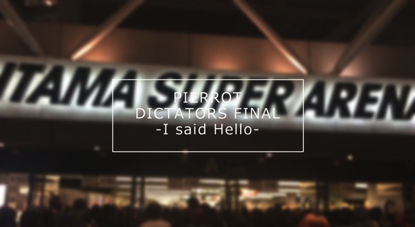
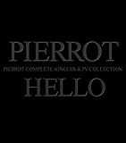

---
categories:
- PIERROTのLIVEレポ
date: Fri, 24 Oct 2014 13:14:00 +0000
slug: post-6463
tags:
- LIVEレポ
- pierrot
title: 【ライブレポ】 PIERROT DICTATORS CIRCUS FINAL「I said hello」2014_10_24@埼玉スーパーアリーナ
---

やっぱhelloで始まった、PIERROT DICTATORS CIRCUS FINAL at 埼玉スーパーアリーナ「I said hello」は素晴らしいLIVEだった。<!--more-->ハロー。しんぺー(<a href="https://twitter.com/s_s_p_y" target="_blank" rel="noopener">@s_s_p_y</a> )です。

オフィより詳しくて、wikiよりも有用なsukekiyo情報サイト「Gadget Zombie Parasite(ガジェットゾンビィパラサイト)」へようこそ。

今日はPIERROTです。青春の落とし前ということで、皆さんと同様ぼくも参戦してきました。

ビジュアル系とは様式美なんだなと思いました。PIERROTの振りは、他のバンドに比べてもやっぱり、独特な部分がある。それは一体感とかノリを重視しているのではなく、PIERROTのLIVEがつかり出す政治的宗教的表現の一つとして機能しているという性格が強いから。

そしてDIR EN GREYなんかもこの様式美に則ってビジュアル系の王道を守ってデビューしたわけだけど、その辺うまく守破離ができて今に至ってると思う。

そういう意味ではPIERROTは真逆。ひたすらこの形式美を極めんとしてLIVEを行っている。

今日は、そんなPIERROTの王道とも言えるLIVEだった。
新旧•••新てこともないんだけどインディーズ時代の曲からメジャーまで網羅した構成だった。
<h2>セトリ</h2>
1. HELLO
2．PIECES
3．PSYCHEDELIC LOVER
4．ENEMY
5．Adolf
6．脳内モルヒネ
7．トリカゴ
8．壊れていくこの世界で
9．REBIRTH DAY
10．PURPLE SKY
11．COCOON
12．AGITATOR
13．ネオグロテスク
14．ゲルニカ
15．MAD SKY-鋼鉄の救世主-
16．MYCLOUD
17．ATENA
18．CREATURE
[ENCORE]
1．THE LAST CRY IN HADES(NOT GUILTY)
2．鬼と桜
3．HILL-幻覚の雪-
4．満月に照らされた最後の言葉
5．*自主規制
6．蜘蛛の意図
7．SEPIA
ラストは、あの日最後に演奏された曲「SEPIA」で締めくくられた。
<h3>WOWOWでの放送</h3>
いつも通りの「キチガイ」発言
しかも、今日は生放送と断ってからのw生放送ではそのまま放送されたのかな？
<h2>しんぺーはこう思った。</h2>
LIVE行く前のぼくの思った
https://twitter.com/s_s_p_y/status/525509305668096000

https://twitter.com/s_s_p_y/status/525509377407455232

https://twitter.com/s_s_p_y/status/525509418494869504

https://twitter.com/s_s_p_y/status/525509433468526593

まさに、これを証明するかのようなセトリだった。

望んだものは手に入らない、壊れたものはもう戻らない。

だから、生きていく

罪と罰を背負いながら

今を選んで

冒頭数曲で泣いた。あれだけノスタルジーにふけらないとか言っておきながら。でもそのあとは、PIERROTの独特の世界観の中で必死に振りをしてた。

多分、PIERROTってDIR EN GREYと違ってフォロワーが少ない。という見当たらない。DIR EN GREYのコピーみたいなバンドはいくらでもいるけど、PIERROTみたいな空気感を再現できるバンドって皆無だと思う。

そして今日と明日でこの世界が終わることに気がついてまた泣いた。

PIERROTというバンドがぼくの人格形成上かなり大きな割合をしめてる要素で、その事実は何があろうとも絶対変わらない事実なんだと思った。

ノットギルティで、この痛みがぼくを明日へ突き放すってあるけど、痛みが生きる糧になるってことなのだなーと思った。

とりあえずメモ書きです。

といったところで、本日は以上です。おやすみなさい。

<a href="http://www.amazon.co.jp/exec/obidos/ASIN/B00MYED25U/warawareotoko-22/ref=nosim/" target="_blank" rel="nofollow noopener">HELLO COMPLETE SINGLES AND PV COLLECTION(DVD付)</a>

posted with <a href="http://kaereba.com" target="_blank" rel="nofollow noopener">カエレバ</a>

PIERROT SWEET-HEART RECORD 2014-10-22

