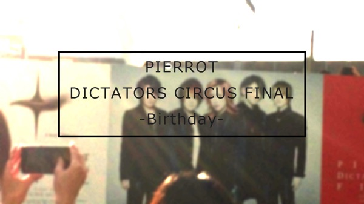

---
categories:
- PIERROTのLIVEレポ
date: Sat, 25 Oct 2014 11:18:00 +0000
slug: post-6470
tags:
- LIVEレポ
- pierrot
title: 【ライブレポ】 PIERROT DICTATORS CIRCUS FINAL「Birthday」2014_10_25@埼玉スーパーアリーナ
---

解散LIVEかと思いきや、スケジュール白紙の再結成LIVEでした。<!--more-->ハロー。しんぺー(<a href="https://twitter.com/s_s_p_y" target="_blank">@s_s_p_y</a> )です。

オフィより詳しくて、wikiよりも有用なsukekiyo情報サイト「Gadget Zombie Parasite(ガジェットゾンビィパラサイト)」へようこそ。

前置きは省いて、結論から言おう本篇最悪だったな！ぬぁんだぁ！？あのセトリは！？？？B面ばっかで暴れ曲無しで、やっときたMAD SKYは冒頭コケるし、キリト本人もオーディエンスがのってないことがわかったみたいで、しきりに煽りではないお願いをしてましたな。

次は何？？次は何？ってイントロ流れてもしばらくえーっとてなる曲ばっかだった。

本編の方はね。

<h2>セトリ</h2>
01.HEAVEN
02.新月
03.ENEMY
04.Adolf
05.脳内モルヒネ
06.Screen1 トリカゴ
07.真っ赤な花
08.深い眠りが覚めたら
09.ANSWER
10.PIECES
11.神経が割れる暑い夜
12.ネオグロテスク
13.夕闇スーサイド
14.MAGNET HOLIC
15.MAD SKY-鋼鉄の救世主-
16.薔薇色の世界
17.ATENA
18.クリア・スカイ

EN1
01.ラストレター
02.BIRTHDAY
03.SUPER STRING THEORY
04.ドラキュラ
05.SEPIA
06.HUMAN GATE
07.CHILD

EN2
01.蜘蛛の意図

<h3>こういうセトリだったらよかったのに</h3>

01.HEAVEN
02.新月
03.ENEMY
04.Adolf
05.脳内モルヒネ
06.Screen1 トリカゴ
07.真っ赤な花→DOMESTIC NEO ANNIVERSARY
08.深い眠りが覚めたら
09.ANSWER
10.PIECES
11.神経が割れる暑い夜→FOLLOWER
12.ネオグロテスク
13.夕闇スーサイド→keyword
14.MAGNET HOLIC
15.MAD SKY-鋼鉄の救世主-
16.薔薇色の世界→自殺の理由
17.ATENA→パラノイア
18.クリア・スカイ
→19.Birthday

EN1
01.ラストレター→ハルカ•••
02.BIRTHDAY→ラストレター
03.SUPER STRING THEORY
04.ドラキュラ
05.SEPIA→Hello
06.HUMAN GATE
07.CHILD

EN2
01.蜘蛛の意図

要は後期のしかもB面曲は今日は求めてないです。

<h3>こぼれ話</h3>

キリト曰く、「感動とかそういうのやってないんで」

アンコ終わってからのアンコがさらに終わって再びアンコの声援に「キリがないから！昔とは違うだよ！」

<h2>しんぺーはこう思った。</h2>

アンコが良かったかっていうとアンコール冒頭まで微妙だった。なんか本編の拍子抜けさに心ここに在らずでした。

マジで？解散LIVEでこれですか？思うに昨日はピエラーのためのセトリで、今日は自分たちのためのセトリ。やりたい曲をやったって感じがする。途中ブーちゃん出てきたりしたけど、それもちょい微妙すぎる演出だった。

現存する全ての曲の中で1番好きな、聞くだけで涙が出るBirthdayがまったくなけなかった。なにこれ。

最後CHILDでのキリトのMCでやっと引き込まれた。ぼくにとってキリトって、小さい頃のウルトラマンとか仮面ライダーとか以降初めての崇拝対象だから、その人が傷つき苦悩するイメージがなかったんだけど、初めて弱いキリトを見た気がした。

そして、これが約束のできない再結成LIVEだということが告げられてやっと心に火がついた。もしかしたらどこか傷つくというか終わることへの拒否反応があったのかもしれない。

今後の活動は未定、決まっていることはやりたいときにやるってことだけ。

様式美を極めたバンドだからこそ、行き詰まり解散した。そして8年の時を経て目指すものは何なんだろう。

最後に、DIR EN GREYのGAUZEツアーでもそうだったけど、はっきり言って中身はそれなりだった。そこには表現すべき未来がないわけで、曲も今の心境と全く違うわけで。だからこそ何か違和感を持って見てました。

今日のLIVEも似た感じでした。昨日のLIVEはメッセージがあり8年ぶりということへの気概があった。

今日のLIVEで唯一メッセージを感じ取れたのはCHILDだけだった。でもそれはきっと、過去への決別とか未来への決意とかじゃなくて、今、ここにいることが全てで、明日も今の連続なんだということを表現してたからだと思う。

どちらにしろ、また、明日から生きていく楽しみが増えたことに変わりはない。

お疲れ様でした。今日はしっかり首を休めましょう。

といったところで、本日は以上です。おやすみなさい。