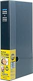

---
categories:
- music
date: Thu, 30 Oct 2014 17:14:32 +0000
slug: post-6487
tags:
- LIVE
- チケット
title: チケットを公式転売できる劇団四季の「ケータイQRチケット」が凄い仕組みだった件
---

全然知らなかった！高額でのチケット転売を防げる上にリターンも期待できるし、行けなかった人も行けるようになるという夢のシステムを数年前に劇団四季がリリースしていたらしい。

<!--more-->

ハローしんぺー(<a href="https://twitter.com/s_s_p_y" target="_blank" rel="noopener">@s_s_p_y</a> )です。
オフィより詳しくて、wikiよりも有用なsukekiyo情報サイト「Gadget Zombie Parasite(ガジェットゾンビィパラサイト)」へようこそ。<!--TOC-->
<h2>劇団四季のチケット出品サービス「ケータイQRチケット」</h2>
なんと自分が申し込んだチケットの日程の２日前までに売買が成立すれば、コードが発行されて次回の申し込みの際に利用できるらしい。

一応利用するには、「四季の会会員」で、「売買が成立したら代金は四季ギフトカードにチャージ」される仕組みのようです。

<a href="http://www.shiki.gr.jp/id_service/">http://www.shiki.gr.jp/id_service/</a>

これって、つまりは行けなくなった人も損をせずに済むし、チケットなかった人も見ることができるようになるし、主催者側も次来てもらうこととか物販売上にもつなげられるし、まじで誰も損をしないwww
<h3>四季の会</h3>
ちなみに四季の会ってのは、ファンクラブみたいなものです。
DIR EN GREYでいうところのa knotです。

<a style="color: #0070c5;" href="https://www.warawareotoko.com/2014/08/06/post-6053/" target="_blank" rel="noopener">GAUZEツアー初日にてスタッフさんがa knotをエーノットと呼ぶ事案が発生。ノットじゃなかったの！？ | Gadget Zombie Parasite</a> 
会報誌（毎月！！！！）、先行予約やら託児所なんかの利用もできるみたい。で年会費がなんと驚きの<em>2000円</em>です。我々バンギャ（ぼく男ですけど）からすると驚愕の安さですね。
<h2>劇団四季のチケットサービスはマジで伊達じゃない！</h2>
当日予約して、携帯でチケットを受け取って現地でQRコードをかざすとか、遠隔地にいる同行者にメールでチケットを送って、その人がQRコードで受け取れるとか。

何、これ、マジでバンギャ的に（ぼく男だけど）すんげー利便性あがるんじゃね？？？

だってさ、もし北海道から遠征する人が、関東〜関西〜九州って行くときにチケとがまだ全部手元に届いてなくて自宅に郵送されるけど、いやいやいや自宅まで戻れねーし、親に送ってもらうにも日数かかってアウトだしみたいな

あと、大雨で線路壊れて遠征先から自宅まで帰れなくなってチケット取りに行けないとか

なんか、そういう時にこういうのが超絶便利なんじゃね？と可能性感じたわ
<h2>しんぺーはこう思った。</h2>
いやー、もうすでにご存知の方もいらっしゃるかもしれませんが、本当に目からウロコでした。

それにしても、チケットが電子化しちゃうのはちょっとぼく的にはいやだなーなんて気持ちもあります。

なぜなら、今まで行ったライブの半券を全てとってファイリングしているのです。

写真とかのアルバム一切ないけど、これだけは本当に自分の歴史として残しているものwそうだ、葬式の時棺桶に入れてもらおww

と言ったところで本日は以上になります。おやすみなさい。

<a href="http://www.amazon.co.jp/exec/obidos/ASIN/B000IGS9AY/warawareotoko-22/ref=nosim/" target="_blank" rel="nofollow noopener">ナカバヤシ フォトホルダー 360枚 黒台紙 ポケットアルバム ブラック PH1036D</a>

posted with <a href="http://kaereba.com" target="_blank" rel="nofollow noopener">カエレバ</a>

ナカバヤシ 2008-01-02

<a title="アマゾン" href="http://www.amazon.co.jp/gp/search?keywords=%83t%83%40%83C%83%8B%81%40%83A%83%8B%83o%83%80&amp;__mk_ja_JP=%83J%83%5E%83J%83i&amp;tag=warawareotoko-22" target="_blank" rel="nofollow noopener">Amazon</a>

