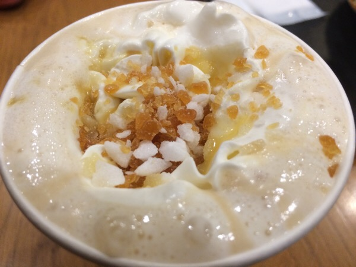
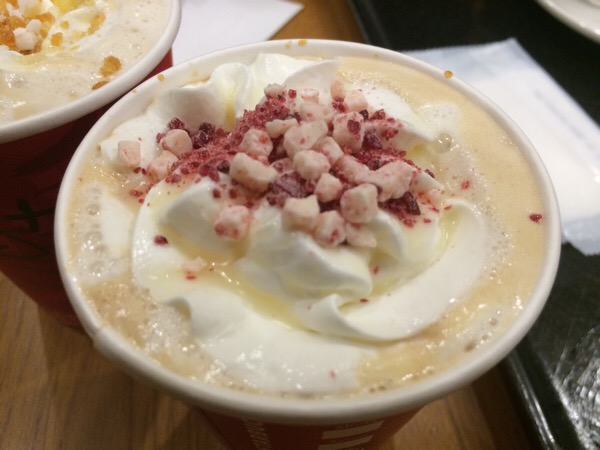
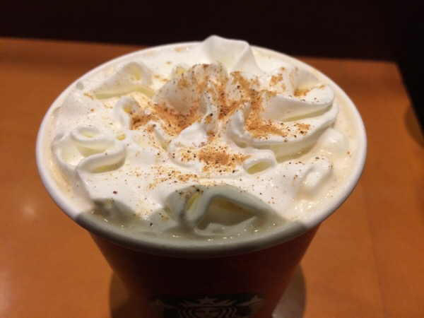

---
categories:
- グルメ
date: Sat, 01 Nov 2014 03:32:12 +0000
slug: post-6497
tags:
- スタバ
title: スタバ新作「スノーメープルトフィーラテ」「クランベリーブリスホワイトモカ」「ジンジャーブレットラテ」カロリーと値段と感想
---

いよいよ今日からスターバックスコーヒーのクリスマスプロモーションが始まります！本日１１月１日からはフェーズ１ということで、<strong>スノーメープルトフィーラテ</strong>と<strong>クランベリーブリスホワイトモカ</strong>、<strong>ジンジャーブレッドラテ</strong>が登場！早速飲んでみました！
<!--more-->

ハローしんぺー(<a href="https://twitter.com/s_s_p_y" target="_blank">@s_s_p_y</a> )です。
オフィより詳しくて、wikiよりも有用なsukekiyo情報サイト「Gadget Zombie Parasite(ガジェットゾンビィパラサイト)」へようこそ。<!--TOC-->

■販売期間：2014年11月1日(土)～2014年12月25日(木)
■取扱店舗：全国のスターバックス店舗(一部店舗を除く)

まぁ大抵の店では売っていますし、おそらく今までのような売り切れは、そうそうないと思いますので、時間がある時にいくことをおすすめします。

<h2>スノーメープルトフィーラテ</h2>

ホイップをのせて、その上にメイプルキャンディとシュガーをまぶしたラテです。
ラテの中にはシロップが入っています。

かなり甘い仕上がりですが、寒い季節にじんわーりあったまるにはぴったり！

<h3>スノーメープルトフィーラテの値段</h3>

ショート454円、トール497円、グランデ540円、ベンティ583円

<h3>スノーメープルトフィーラテのカロリー</h3>

[table id=1 /]

<h3>スノーメープルトフィーラテの味の感想</h3>

砂糖がジャリジャリします。苦手な人は苦手かも。どこかディズニーランドぽい甘さを感じます。多分メイプルのせい
ちょっと甘々か味です。ただエスプレッソの苦味も若干感じることができる絶妙なバランスです。

<h2>クランベリーブリスホワイトモカ</h2>

いちご風の粉末とホワイトチョコレートがのってます。
かき混ぜて溶かしながら飲むと美味しい！

<h3>クランベリーブリスホワイトモカの値段</h3>

ショート454円、トール497円、グランデ540円、ベンティ583円

<h3>クランベリーブリスホワイトモカのカロリー</h3>

[table id=2 /]

<h3>クランベリーブリスホワイトモカの味の感想</h3>

ホワイトモカベースなので、ホワイトモカ好きにはたまらないかも
こちらは容赦ない甘さなので、疲れてる時とかにいいかも

<h2>ジンジャーブレッドラテ</h2>

これはスタバ毎年の定番だったドリンクです。
アメリカの家庭でよくつくられるジンジャーブレッドの味をドリンクにしたものになります。他の２つのドリンクに比べると少しは甘さが控えめに感じますで、甘すぎるという方はこちらがおすすめ。

それでも甘ければシロップ少なめでオーダーするのがいいかと思います！

<h3>ジンジャーブレッドラテの値段</h3>

ショート442円、トール486円、グランデ529円、ベンティ572円

<h3>ジンジャーブレッドラテのカロリー</h3>

[table id=3 /]

<h3>ジンジャーブレッドラテの味の感想</h3>

やっぱり、３つのの中では1番甘さ控えめな気がします。エスプレッソショットを追加して苦味を楽しむのにも合いそうです。

<h2>しんぺーはこう思った。</h2>
スタバが1年でもっとも輝く時期が、このホリデーシーズンです。
ペストリー（食べ物）の方もバリエーションがいつもよりも豊富です！そちらのご紹介も今後していこうと思います！

と言ったところで本日は以上になります。おやすみなさい。