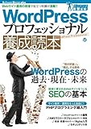

---
categories:
- ブログ
date: Sat, 01 Nov 2014 05:55:15 +0000
slug: post-6500
tags:
- ブログ
title: 「WordPressプロフェッショナル養成読本」サイト運営者なら読んでおいて損なし！！
---

会社から早く帰りたい、こんな仕事をしていても将来なんの役にも立たない。かといって今辞めて次に活かせるスキルもない。嫌だから転職活動をしても、なんで転職活動を？という問いに嫌だからですって、そんなモチベーションで転職活動をしても、結局いい結果なんて出やしない。そんな時に何かの突破口にと思って始めたのがブログでした。<!--more--><!--more-->

ハローしんぺー(<a href="https://twitter.com/s_s_p_y" target="_blank">@s_s_p_y</a> )です。
オフィより詳しくて、wikiよりも有用なsukekiyo情報サイト「Gadget Zombie Parasite(ガジェットゾンビィパラサイト)」へようこそ。
今回は、著者の1人である染谷昌利さんから頂いたこちらの本のご紹介です。

<a href="http://www.amazon.co.jp/exec/obidos/ASIN/4774167878/warawareotoko-22/ref=nosim/" rel="nofollow" target="_blank">WordPressプロフェッショナル養成読本 [Webサイト運用の現場で役立つ知識が満載! ] (Software Design plus)</a>
posted with <a href="http://kaereba.com" rel="nofollow" target="_blank">カエレバ</a>

高野直子,後藤賢司,染谷昌利,岡本雄樹,深海寛信,岡本 渉,松本悦宜 技術評論社 2014-10-16    

当ブログは、アメブロやlivedoor blogなどの無料ブログとは異なり、自分でレンタルサーバーを契約し、URLも独自のものを使用しています。こう聞くと、何か専門的なことをしていそうな気がするかもしれませんが、そうではありません。wordpressというシステムを利用し、簡単にブログの運用を行なっております。この本は、そのwordpressに関しての初級〜中級レベルくらいの本になります。

<!--TOC-->

<h2>WordPressの過去・現在・未来</h2>

この手の技術本ってなんで、歴史から始まるのやら。
とりあえず、WordPressっていうシステムはサイトの運営が簡単にできるよーってものになります。

サーバーにインストールして使いますが、管理画面から簡単に更新することができますし、テーマをインストールすることで見た目を簡単に買えることができます。

知識がなくてもある程度のことは、簡単にできます！

その簡単さが、WordPressの歴史を支え、繁栄させてきたのです。

<h2>WordPressサイトの運用</h2>

ブロガーの人はこの辺は読み飛ばしてもいいと思います。ただ、会社や仕事でwordpressを使ってサイト運営をするなら読むべき項目です。

wordpress云々というよりもサイト運営のためのノウハウが書かれています。

運用のためのPDCAさらにアクセス解析に関しても書かれています。
サイトは作って終わりではありません。作ったところからがスタートなのです。

<h2>SEOの基本</h2>

最近SEOの勉強を少しずつしているんですが、この章ではSEOのエッセンス的なことが書かれていて非常にためになります。

おそらく普通にブログとしてwordpressを使っている人、いわゆるブロガーにとっては歴史とかセキュリティとかってあんまり関係ないのかもしれませんが、このSEOの項目に関しては大いに関係ありです。

サイト運営する上で、よほどのクローズドサイトでない限りはSEOは必須だと思います。

最低限の知識とやってはいけないことくらいは勉強しておくべき常識だと思います。

<h2>PHPプログラミング超入門</h2>

正直この章が一番役に立ちました！ぼく、アプリのプログラミングも勉強しているんですけど、そのあたりにでてくるalocとかinitとかってなんなんだろうって思ってたらここに書いてあったwwwまさかの

すごいわかりやすく書いてあって納得できました。

このPHPによるプログラミングもブロガーなら知っておくべき項目だと思います。
個人的にはwebデザイナーのブロガーってチートだと思ってるんですけど、そうは言っても少しずつ勉強して自分でテーマをいじれるようにならないといけないなーと思います。

トラブルが起きた時や、アドセンスなどの収益を少しでもあげていきたいと考えるならテーマをいじっていかなければいけないと思うので

この変も入門レベルのエッセンスだ書かれていました。ただ途中から？？？って感じでレベルがあがってしまったので、少し読み飛ばしましたw

この辺は別に入門書買って勉強していくか、必要に応じてググって独学でやっていくかかなという感じです。

<h2>AWSでスケーラブルWordPress</h2>

むむむー、、、ちょっとシステムよりん話かなー？
サーバー云々という話題です。

ブロガーには全くといっていいほど関係ない項目かな。

ただサイト運営者であれば、少しは知っていても損はないのかなという感じです。

<h2>WordPressユーザのためのNginx入門</h2>

おおーーっと、これまたシステムよりのお話です。正直何が書いてあるのか•••

<h2>WordPressセキュリティ</h2>

上記２つの項目含め再度読み直して後日アップします。。悪しからず。むずい

<h2>しんぺーはこう思った。</h2>この本で唯一書かれていないことがあります。ブログ的な点において

それは良質なコンテンツがキングということです。

技術書なんで当たり前ですが。。。

でも、さらに思うのが、良質なコンテンツを適切に継続的に届けるにはやはり最低限の運営の知識がないといけないと感じる今日この頃です。

ブログを始めて１年半くらいになります。

同じくらいかもしくはもっと短い人でもぼくよりもよっぽど読まれる、つまりPVが高い人なんていくらでもいます。

焦らずに、少しずつ勉強していきたいと思います。

精進精進

と言ったところで本日は以上になります。おやすみなさい。

<a href="http://www.amazon.co.jp/exec/obidos/ASIN/4774167878/warawareotoko-22/ref=nosim/" rel="nofollow" target="_blank">WordPressプロフェッショナル養成読本 [Webサイト運用の現場で役立つ知識が満載! ] (Software Design plus)</a>
posted with <a href="http://kaereba.com" rel="nofollow" target="_blank">カエレバ</a>

高野直子,後藤賢司,染谷昌利,岡本雄樹,深海寛信,岡本 渉,松本悦宜 技術評論社 2014-10-16    

