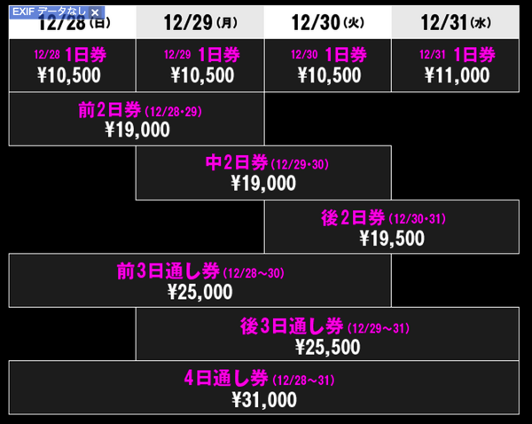

---
categories:
- DIR EN GREY
- sukekiyo
date: Thu, 06 Nov 2014 13:44:00 +0000
slug: post-6533
tags:
- DIR EN GREY
- sukekiyo
title: sukekiyoとDIR EN GREY「COUNT DOWN JAPAN 14_15」に出るってよ
---

ついに恐れていたことが現実に•••、sukekiyoとDIR EN GREYがCOUNT DOWN JAPANに出ることが発表されました。<!--more-->ハロー。しんぺー(<a href="https://twitter.com/s_s_p_y" target="_blank">@s_s_p_y</a> )です。

予感してた最悪の事態が起きた。sukekiyoとDIR EN GREYが別日程で出演。さらには最終日じゃない！という。

確かに主催側としては、同じ日には出さないですよね。。

それにしても、まさかこんな形になるとは！

単独公演でカウントダウンだかアップだかやってたのが懐かしい。DIR EN GREYで年越しできる日はまた来るのだろうか。

<h2>DIR EN GREYがCOUNT DOWN JAPAN 2012/2013に出た時のこと</h2>

当時、DIR EN GREYが国内ロックファンの本格的な囲い込みに動き出したとかでかなり話題になっておりました。日本国内フェスへの初参戦だったかしら。

確かにその前に演奏してたHIATUSのステージとは打って変わって、「いつも通り」の幕をかけられ、楽器の調整の間中激しいバスドラの音が鳴り響いていたのを思い出します。

その幕を見て妙に安心したのを覚えています。多分DIR EN GREYの出演条件が「いつも通りにやらせろ」だったのかなと予想されます。

狂骨とTHE BLOSSOMING BELZEBUBで始まり、幕には「いつも通り」の映像が映し出されました。

一瞬映った家族写真の、父親の笑顔に何も知らないパンピーから笑いが起きたのを覚えています(笑)
そして次の瞬間、蛆虫の群がるハンバーグを食べるシーン、さっき笑いが起きた写真に群がる蛆虫、次々に映し出される「見慣れない」映像に会場にいたパンピーがドン引きするのを見て、今度はこっちがニンマリ。目を背ける女の子、引き攣る彼氏www

そして輪郭の映像美とインワードスクリームで、さらにパンピを黙らせ

終わった後は理解不能と阿鼻叫喚のパンピーのタイムラインを眺めておりました。

<h2>sukekiyoがCOUNT DOWN JAPAN 2013/2014に出た時のこと</h2>

数日前に謎だったsukekiyoの正体がわかり、幸運にもチケットをもった方々が参戦•••、いや参列されましたね。ぼくは行っていませんが。
当日は事前告知なしだったから当然のごとくステージに見合わない程、人が少なく、静まり返ったLIVEだったとかなんとか。(でも多分今の方が静まり返ってるけど)

思えば、当時のドキドキ感てもう感じられないよなー
正体不明のsukekiyoの謎を解き明かすために(笑)最初は音源買うためだけにならんだ物販、思わず当日券を買って初めて見たスギゾー氏と筋肉マッチョ。そして出てきた京

<a style="color:#0070C5;" href="https://www.warawareotoko.com/2013/12/29/post-3842/" target="_blank">sukekiyo直前情報。sukekiyo=kyo関連確定 | Gadget Zombie Parasite</a>  

<h2>今年のCOUNT DOWN JAPANのチケット代は•••</h2>

チケットは1日10,500円2日通し券で19,000円です。

3日通し券で25,000円です。

4日通し券で31,000円です。

dir en greyは12月29日、sukekiyoは30日

メリーも30日でした！

詳細はこちら
<blockquote>
[第5次抽選先行受付]
11/5(水)21:00～11/9(日)23:59
[一般発売]
未定
※詳細は公式サイトをご確認ください。
 
[公式サイト] <a href="http://countdownjapan.jp/">http://countdownjapan.jp/</a> (PC・携帯共通)
[問合せ] ディスクガレージ 050-5533-0888(平日12:00～19:00)
</blockquote>

<h2>しんぺーはこう思った。</h2>

いや、今回は両日ともお預けにいたしますよぼくは。

sukekiyoの方は言わずもがな、DIR EN GREYの方も絶賛ツアー中でしょうに。さらにはsukekiyo絶対また元旦に音源とか出すんじゃね？とか勘ぐったり。さらにもう、京氏レコーディングというか歌撮り終わってるんじゃね？とか

そうすると春にはアルバムが出たりとか、何気に今年と同じ様なスケジュールになるのではとか考えたり。。。

年末年始はお家でゲームでもしてますね！

といったところで、本日は以上です。おやすみなさい。