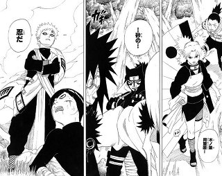
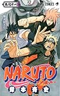

---
categories:
- アニメ
date: Mon, 10 Nov 2014 13:24:06 +0000
slug: post-6564
tags:
- 漫画
title: NARUTOを途中で読むのやめた奴は大抵言う。1番面白かったのは「木の葉同盟国、砂の忍だ」
---

NARUTOを途中で読むのやめた奴は大抵言う。1番面白かったのは「木の葉同盟国、砂の忍だ」
本日で少年ジャンプのNARUTOの連載が完結しました。というかしたらしい。見てないけど。

ハロー。しんぺー(<a href="https://twitter.com/s_s_p_y" target="_blank" rel="noopener">@s_s_p_y</a> )です。

オフィより詳しくて、wikiよりも有用なsukekiyo情報サイト「Gadget Zombie Parasite(ガジェットゾンビィパラサイト)」へようこそ。

以下読むのが面倒な方はYoutubeで音声配信していますのでどうぞ（<a href="http://youtu.be/Qtf2FCDiuUA">http://youtu.be/Qtf2FCDiuUA</a>）

いつからだ？NARUTOの単行本を買うのをやめたのは

いつからだ？立ち読みですらNARUTOを読むのをやめたのは

いつからだ？NARUTOは子ども向けの漫画だと切り捨てたのは

そうじゃなかっただろ？最初は何度も涙して、繰り返し読んで涙してたはずだ

読み切りで初めて読んで涙して。連載始まって波の国編の鬼人で涙し。中忍試験の「ガイ先生•••認めてください•••今こそ••自分のつらぬき守り通す時！！」で何度も涙し、そして我愛羅の過去で何度も何度も涙し、木の葉舞う所に火は燃ゆるで何度も•••

そう、今これを書いている時もなみだぐんでます。
とくにぼくが好きなキャラはリーと我愛羅でした。リーに関しては、忍術が苦手で全く使えないにもかかわらず、唯一残った体術を極めて強くなったというその設定がめちゃくちゃ好きです。（本当にこれ打ってるだけで涙ぐんでくるわ）

そして我愛羅。これは本当に当時の自分に重ねてめちゃくちゃ親近感がわく。別に変に厨二的な意味あいではなく（いや、そうかもしれない）

あと話一瞬それるけどONE PIECEのチョッパーも同じような存在だと思う。自分は何も悪くないはずなのに、周りから断絶され拒絶され、やがて自分が悪いんだとそうじゃないと、周りの自分への仕打ちが筋が通らない。

だから自分は周りを否定し、自分を否定する。

でも、自分はそのままでそこにいていい。それをナルトだったりルフィーだったりに教えてもらうわけです。また一瞬それるけど、エヴァのTV版最終話もそれと同じことを表現してるんだと思う。

そして、本当にごめん、また一瞬ずれるんだけど、PIERROTのBirthdayって曲も同じこと言ってる。「そこにいるだけでいいから〜」

で、元に戻りますがとにかくこの２人のキャラが好きだった。

でーーーー！！！！

本題に、本題に移ります！！！

ぼくは、いつNARUTOの単行本を買うのをやめたか、覚えてすらいない。立ち読みで読むのをやめたのもいつだろう？多分、からだに木炭みたいなアンテナが生えまくった、ガリガリのやつの話あたりだろうと思う。オビト？もはや思い出せない。

で、なぜ読むのをやめたか•••もはや何でもありになっちゃってたから

あー思い出してきた。なんか写輪眼の力でスサノオってやつを使えるっていうようになってからあたりだな。毎週毎週、なにこれ、もう魔法じゃんっていうね

設定に都合よく忍術生み出すなやって思って。もう魔法なんだよね。これ本当に。

あー思い出してきたーその頃からかなーハンターハンターの影響も見え隠れして、風は火を土は雷を的な設定が突然現れたの

いやいやいやいやいやいや、それっさ
普通は修行の初歩でやるでしょ？義務教育じゃねーんだよ？忍術アカデミーはよー
国家を守るための兵隊の訓練所だよ？ちゃんと配置される部隊に即した人材育成をしないでどうするんですか？？？？

そこまでは当時考えてなかったけど、まー、あーいう新しい設定がでてきた時には大抵一部のファンは離れるもんです。ハンターハンターのときもそうでしょう？

で、結局そのあたりで読むのやめたんじゃないかと思います。

で、そんなぼくが思う、NARUTOの一番面白い、ピーク、絶頂は、最高にクラマックスなシーンはこれだ！！！！！！！！！！！！！！！！！！！！！！！！！！！！！！！！！！！！！！！！！！！！！！！

(via by NARUTO）

それまで怒涛の木の葉崩し編が完結したかと思ったら、もう次の話サスケが里を抜ける話が始まってた。しっかも、今までベールに包まれていた大蛇丸の側近4人の力が明かされ、さらにさらに新キャラも登場！！！しかも全員命がけ！「これを使ったら必ず死ぬ」で死ななかったのはいいとして、全員命がけで戦い、相手も見たことのない能力をどんどん使って、それでもやられそうになる。で、そんな時に現れたのが意外や意外、その直前まで敵として戦ってた「砂の忍」

しかも「木の葉同盟国」って言い切る！！ドン！

これがぼくが思うNARUTOのクライマックスです。

多分、途中でついていけなくなって読むのやめた人は大抵同意見だと思います。

と、まーめちゃくちゃに書きなぐってきましたが、とりあえずNARUTOが１日１巻ずつ配信されるということらしいので、この機会に読み返してみようと思います。

<a href="https://itunes.apple.com/jp/app/naruto-naruto-wu-liaomanga/id912797439?mt=8&amp;uo=4&amp;at=11ld5P" target="_blank" rel="noopener">NARUTO-ナルト- 無料マンガ連載&amp;無料アニメ放送公式アプリ</a>

無料

(2014.11.10時点)

<a style="width: 60px; color: #ffffff; background: #000000; font-size: 8px; font-weight: bold; text-align: center; display: inline; text-decoration: none; border: 0px; padding: 2px; border-radius: 5px; white-space: nowrap;" href="https://itunes.apple.com/jp/app/naruto-naruto-wu-liaomanga/id912797439?mt=8&amp;uo=4&amp;at=11ld5P" target="_blank" rel="noopener">App Store</a>

<a href="https://itunes.apple.com/jp/artist/shueisha-inc./id386723683?uo=4&amp;at=11ld5P" target="_blank" rel="noopener">SHUEISHA Inc.</a>

posted with <a href="http://pochireba.com" target="_blank" rel="nofollow noopener">ポチレバ</a>

<h2>しんぺーはこう思った。</h2>
とりあえず書いててすごい気持ちのいい記事ですたん。
<blockquote class="twitter-tweet" lang="ja">liveレポもそうだけど、大抵改行とかSEO的なこととか、そんなもん気にしないでとにかく書きなぐった記事ってはすごい書いてて気持ちがいいんだわ。伝わってようと伝わっていまいともはやどっちでもいい。思うこと書いた！読みたいやちは読んでいけ！！って胸張って言える。

— しんぺー@ノ限チッタ (@s_s_p_y) <a href="https://twitter.com/s_s_p_y/status/531800177674178561">2014, 11月 10</a></blockquote>

<blockquote class="twitter-tweet" lang="ja">あーなるほどなー、思いのたけを書きなぐった文章が結果的に面白かったり、SEO的に優れていたりっていうレベルまで、気がついたらそうなってたってのはきっと訓練なんだろうなと

— しんぺー@ノ限チッタ (@s_s_p_y) <a href="https://twitter.com/s_s_p_y/status/531800584186130433">2014, 11月 10</a></blockquote>

それよりハンターハンターまだー
と言ったところで本日は以上になります。おやすみなさい。

<a href="http://www.amazon.co.jp/exec/obidos/ASIN/408880208X/warawareotoko-22/ref=nosim/" target="_blank" rel="nofollow noopener">NARUTO―ナルト― 71 (ジャンプコミックス)</a>

posted with <a href="http://kaereba.com" target="_blank" rel="nofollow noopener">カエレバ</a>

岸本 斉史 集英社 2014-11-04

<a title="アマゾン" href="http://www.amazon.co.jp/gp/search?keywords=NARUTO&amp;__mk_ja_JP=%83J%83%5E%83J%83i&amp;tag=warawareotoko-22" target="_blank" rel="nofollow noopener">Amazon</a>

