---
categories:
- ブログ
date: Sun, 16 Nov 2014 15:46:50 +0000
slug: post-6589
tags:
- facebook
title: facebookで特定の人をブロックする方法
---

いやーこまりました。あらゆる手段を用いてブロックしている人がfacebookを始めたみたいで、友達ですか？にでてきちゃってーで急いでブロックしました。ということで今回はブロックの仕方をご紹介<!--more--><!--more-->ハローしんぺー(<a href="https://twitter.com/s_s_p_y" target="_blank">@s_s_p_y</a> )です。
オフィより詳しくて、wikiよりも有用なsukekiyo情報サイト「Gadget Zombie Parasite(ガジェットゾンビィパラサイト)」へようこそ。
あんまりやることはないと思いきや、意外と使う機能なんじゃないかと思ったりします。

<h2>ブロックするとどうなる？</h2>

ブロックすると相手との関係はこんな風になります。
<ul>
	<li>相手があなたのタイムラインの投稿を見ることができなくなります。</li>
	<li>相手があなたをタグ付けできなくなります。</li>
	<li>相手があなたをイベントやグループへ招待できなくなります。</li>
	<li>相手があなたと会話をできなくなります。</li>
	<li>相手があなたと友達になれなくなります。</li>
	<li>すでに友達である人をブロックした場合、両者の友達から削除されます。相手に通知は行きません。</li>
</ul>

設定の仕方は簡単。

<h2>facebookで特定の人をブロックする方法〜相手のページからブロックする方法〜</h2>

<h3>【PC】からブロックする方法</h3>

まずはブロックしたい相手のページに行きます。

次にこちらをぽっちします。するとブロックとでてきますので、そちらをぽちっとします。
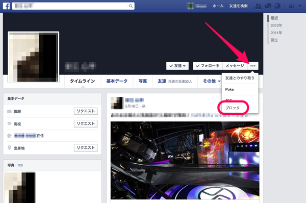

これでOK。するとこんな感じのものがでてきますので、そしたら「認証」をチェック
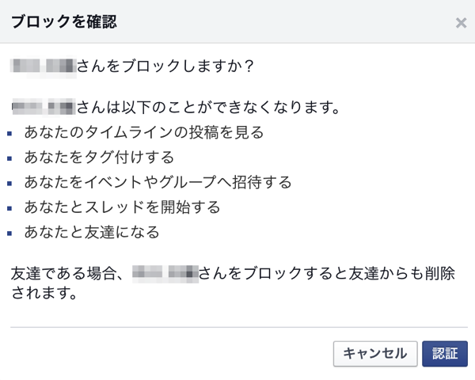

これで完了！！

<h3>【アプリ】からブロックする方法</h3>

次にスマホのアプリからのブロックの仕方です。同じくブックしたい相手のページに行きます。

あとはPCの時と同じです。こんな感じです。
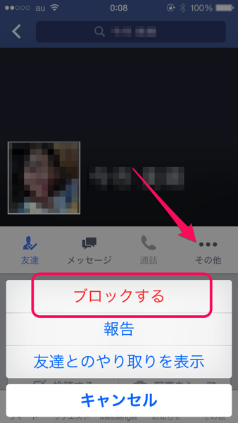

<h2>facebookで特定の人をブロックする方法〜検索してブロックする方法〜</h2>

<h3>【PC】から検索してブロックする方法</h3>

自分のページの右上の鍵マークをクリック、その他の設定をクリック
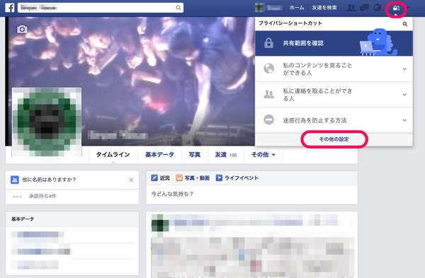

左のところのブロックをクリック
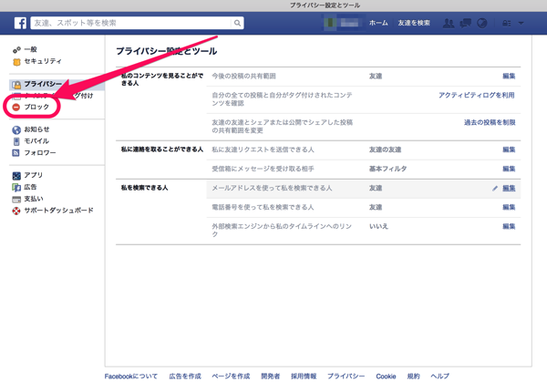

画面が切り替わります。ブロックしたい人の名前を入れて、「ブロック」をクリックします。
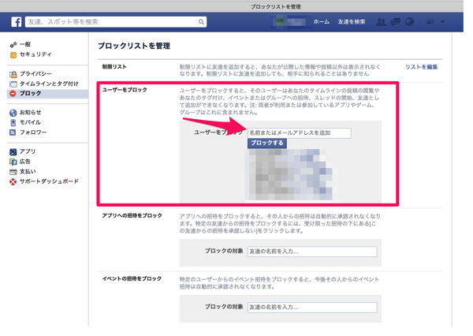

すると候補がでてきますので、該当の人をブロック
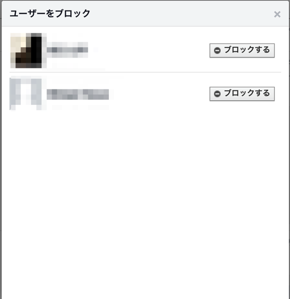

これで完了

<h3>【アプリ】から検索してブロックする方法</h3>

基本的にはPCと同じですが、場所がちょっとわかりにくいです。

iPhoneアプリだと一番右の設定アイコンをタップします。で、下の方にある「設定」を見つけてタップ
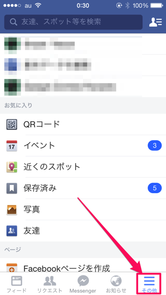

下の方にあります。
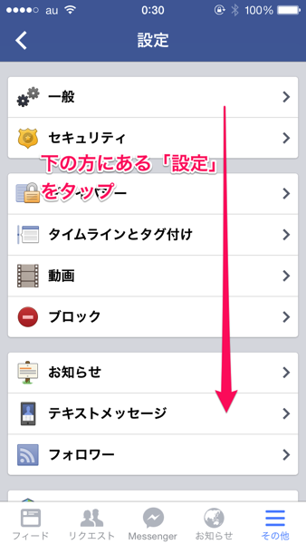

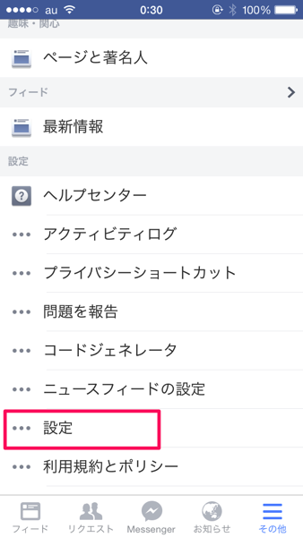

ここからはPCと同じです。名前を入れて、候補だでてきて、ブロック。
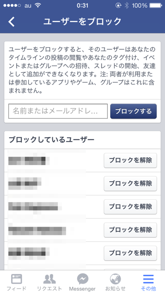

これで完了です。

<h3>注意事項</h3>

注意事項は、ブロックした人のブロックを解除するとなんと48時間は再度ブロックすることができません。
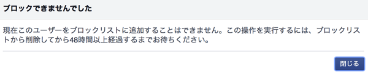

<h2>解除方法</h2>

ブロックするくらいの相手なんで、きっと解除は必要ないと思いますが•••
解除方法はかんたん、上記の検索してブロックする方法のところまでいってください。
するとブロックした人がリストになってでてきます。その名前の横の「ブロックを解除」を押せば解除できます。

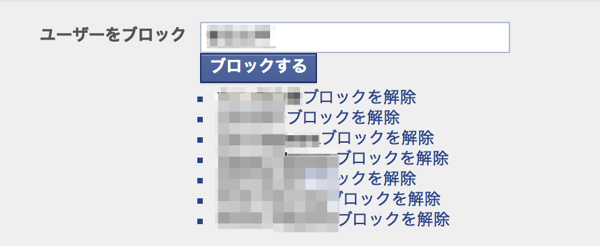

<h2>しんぺーはこう思った。</h2>

いやー困ったことになりました。

突然ブロックしたい人がでてきて、ブロックしたはいいものの、こん記事を書くために解除したら再ブロックまで48時間かかるっちゅーことで、それまでみつからないことを祈ります。

と言ったところで本日は以上になります。おやすみなさい。