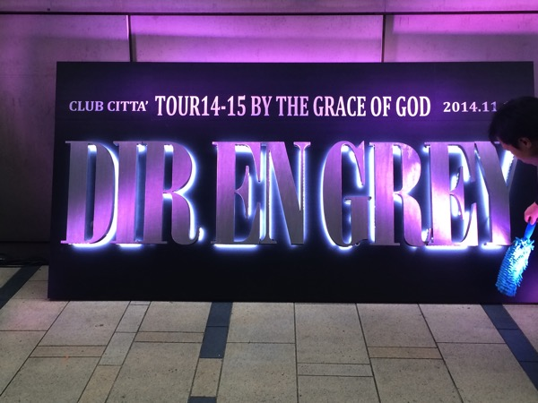
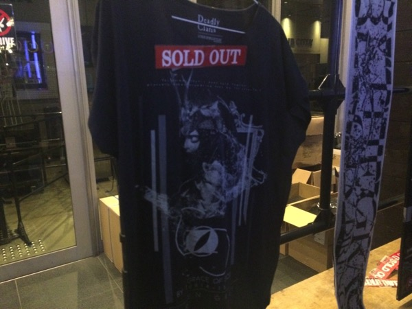
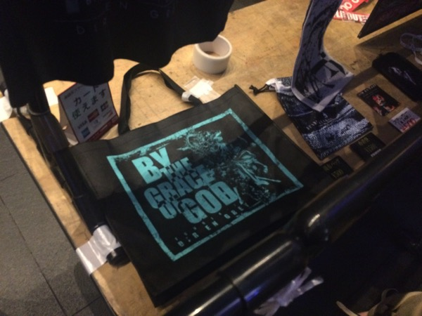
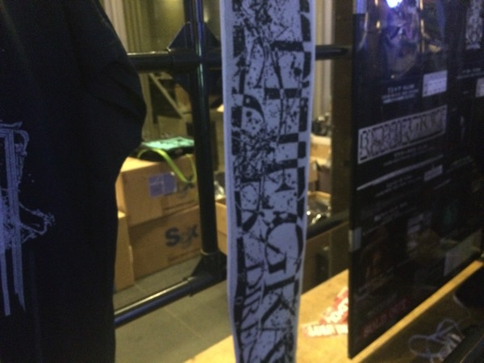
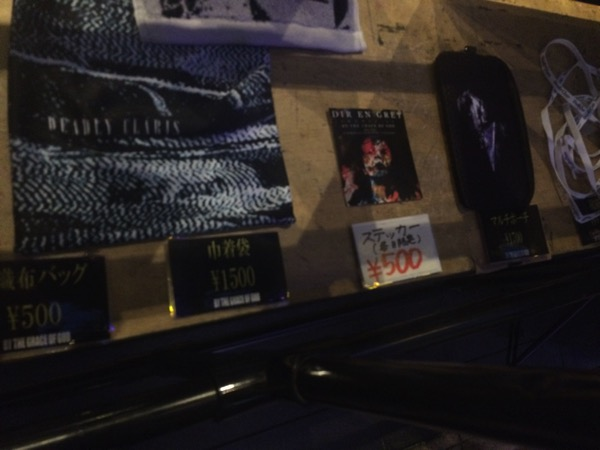
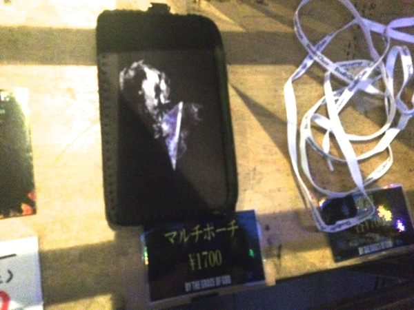
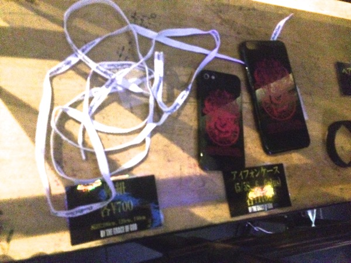
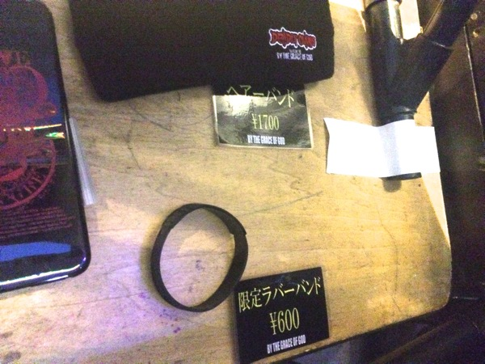
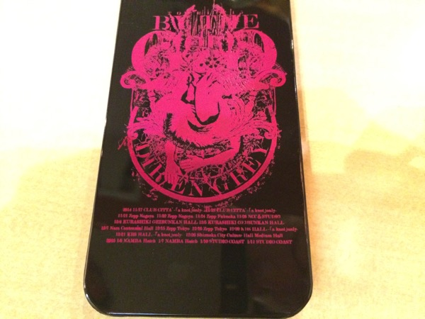

---
categories:
- DIR EN GREYのLIVEレポ
- TOUR14-15 BY THE GRACE OF GOD
date: Mon, 17 Nov 2014 15:23:40 +0000
slug: post-6601
tags:
- DIR EN GREY
- LIVEレポ
title: 【ライブレポ】DIR EN GREY TOUR14-15 BY THE GRACE OF GOD-a knot only-2014_11_17@CLUB
  CITTA’
---

DIR EN GREY TOUR14-15 BY THE GRACE OF GODツアー初日。
今日から始まるDIR EN GREYの新しい歴史。
それは新しく、そしてDIR EN GREYの根源を晒す歴史。
人の儚さ、汚さ、愚かさ、そして痛みを体現する歴史。

アルバム制作が遅れたことが功を奏して、新鮮な気持ちで聞けた曲たちは、初めて聞くのにそんなきがしなかった。この曲たちが今後どのように進化していくのか。もちろん見届けるつもりである。<!--more-->

ハロー。しんぺー(<a href="https://twitter.com/s_s_p_y" target="_blank" rel="noopener noreferrer">@s_s_p_y</a> )です。

オフィより詳しくて、wikiよりも有用なsukekiyo情報サイト「Gadget Zombie Parasite(ガジェットゾンビィパラサイト)」へようこそ。

ということで行ってまいりました！！！！！！ひっさしぶりのLIVEらしいLIVEでした！体が動かせるって意味でwGazeツアー依頼だ！！

じゃーいくぜ！！！

<h2>物販</h2>
限定Tシャツ！！薄手で日武の時の限定Tシャツと同じような感じだ！えりが広い！！
色はネイビーらしいけど、黒目だ！思っている以上に黒いぜ！

タオルは割と脆いらしい。爪とかひっけるとびよーんてほつれるので気をつけて

マルチポーチ

レースシューというか靴紐な。超貧相です。細い紐にdeadly clarisって書いてあるだけ

ラバーバンドとヘアバンド

iPhoneケースです。ハードタイプです。肌触りは少しやわらないけどね。裏のプリントは１ヶ月もしたら禿げそう。

<h2>セトリ</h2>
新曲？（一説によるとGHOULツアーの時のオープニングSEらしいけど）
新曲1（Gazeツアーの時にやったやつ。多分これが「Un deux」）
Sustain the untruth
新曲
the bottom of deathvallay
新曲
新曲
輪郭
新曲
欲巣にDREAMBOX」あるいは成熟の理念と冷たい雨」
新曲
獣欲
obscure
新曲2Gazeツアーの時にやったやつ。）

アンコール
Stuckman
Agitated screams of maggots
Beautiful dirt
激しさとこの胸の中で絡みついた灼熱の闇
新曲
<h2>セット</h2>
シンプル。余計なスピーカーを排してた。バックスクリーンと照明付きのLEDの柱みたいなのが設置されていました。LEDの板は透けていて裏側が見えるようなものでした。

あとDieのマイクスタンドにいつもはない、エフェクター的なものがついてた。それを手でぐにぐにいじって本編は終了
<h2>メンバーの衣装</h2>
薫は黒いジャケットと中はたけが長いアシメの「布」
Toshiyaは古代ローマ人みたいな衣装。アー写と同じ
Shinyaは白！！多分アー写と同じ
Dieは髪型は赤と黒を半分半分くらいにいれて、フード付きの長い袖なしパーカー。ギター弾くのすごい邪魔そうな、というか邪魔で何度も高速に弾きながら振り払ってた。

京は上下黒でジャケットの下は裸。ジャンケットの右胸には王冠マーク。髪型は単発でアシメ。毛先だけ金髪。
<h2>LIVEレポ</h2>
そもそも最初から違ってた。いつもどおりの順番ででてこなかったのはいつぞやの新木場での鼓動スタートでなおかつ暗転せずにメンバー全員ででてきた時依頼だった。

まず薫がでてきて、ギターをおもむろにひき、Die、Shinya、Toshiya、の順番ででてきた。

新曲の中にも古い曲がまざってたのですごい自然にのれた。
新曲たちもどれも初めて聞く気がしないくらいだったし、これは明日がさらに楽しみですね（参戦しないけど）

新曲たちは勢いというよりも聞かせるようなものが多いきがした。だからといってスローテンポかというと決してそんなことなくて、激しいけど聞かせるっていう重厚感がある。

それどこか妖精帝國のような感じの曲やsukekiyoからの影響を受けていそうな曲もあって、これまた多彩な色を放つアルバムになりそう。

一応LIVEレポとしてはこんな感じで。
<h3>こぼれ話</h3>
<blockquote class="twitter-tweet" lang="ja">【速報】京流血

— しんぺー@ノ限チッタ (@s_s_p_y) <a href="https://twitter.com/s_s_p_y/status/534313041983074304">2014, 11月 17</a></blockquote>

突然後半の方、京の顔に血がついていたので、自傷か！？と思った。Beautiful dirtとかやって昔を思い出したのかなとか思ってすこぶる心配だった。だって、出てる血の量が半端ないから。これカミソリとか持ってて思いの外強く切っちゃったのかな？とかマジで心配だったんだけど、どうも様子がおかしい。
京自身がちらちらと血が出てると思われる右手を見てる。血がしたたるほど出てる。

どうもどこかで切ってしまったらしい。話によると最初から絆創膏的なものをして、血が滲んでたとのことなので、楽屋かどっかで怪我したのかも。開演がおしたのはそのせい？
<blockquote class="twitter-tweet" lang="ja">激闇の煽りでもう一回「いけんのかー？！！！」て言おうとしたらやもさんが叩き出したから「ーぃ•••激しさ」って感じで始まった

— しんぺー@ノ限チッタ (@s_s_p_y) <a href="https://twitter.com/s_s_p_y/status/534321633486327808">2014, 11月 17</a></blockquote>

順番前後しますが、そんな感じでしたwまだ新曲のツアーってことで色々とメンバーの方も噛み合ってないのかしら？
<blockquote class="twitter-tweet" lang="ja">きっと開演遅れたのは楽屋でココアの入ったマグカップをわっちゃってそれで手を切ってしまったに違いない。。。と想像するくらいに最後のタオル投げ損ねた時の笑顔が可愛かった

— しんぺー@ノ限チッタ (@s_s_p_y) <a href="https://twitter.com/s_s_p_y/status/534324826714820608">2014, 11月 17</a></blockquote>

これまた、怪我の影響かタオルを投げ損ねた京。そして、恥ずかしそうに八重歯を見せて笑ってたwかわいいいいいいいいいいいいいいいいいいいいいいいいいいいいい

かわいい姿とは裏腹に筋肉が、なんていうかパーツが巨大化してた。鎧ですか？
<h2>しんぺーはこう思った。</h2>
すんげーーーーーーー楽しかったぞ！！！！！！！！！

マジで！！

それと怪我が心配。多分あれ縫わなきゃいけないくらいなんじゃね？

大丈夫かしら

といったところで、本日は以上です。おやすみなさい。

<a href="http://www.amazon.co.jp/exec/obidos/ASIN/B00N81CF06/warawareotoko-22/ref=nosim/" target="_blank" rel="nofollow noopener noreferrer">ARCHE(完全生産限定盤)(Blu-ray Disc付)</a>

posted with <a href="http://kaereba.com" target="_blank" rel="nofollow noopener noreferrer">カエレバ</a>

DIR EN GREY SMD itaku (music) 2014-12-10

<a title="アマゾン" href="http://www.amazon.co.jp/gp/search?keywords=dir%20en%20grey&amp;__mk_ja_JP=%83J%83%5E%83J%83i&amp;tag=warawareotoko-22" target="_blank" rel="nofollow noopener noreferrer">Amazon</a>

<a title="楽天市場" href="http://hb.afl.rakuten.co.jp/hgc/0f6e221b.2eb9748a.0f6e221c.35cc1e84/?pc=http%3A%2F%2Fsearch.rakuten.co.jp%2Fsearch%2Fmall%2Fdir%2520en%2520grey%2F-%2Ff.1-p.1-s.1-sf.0-st.A-v.2%3Fx%3D0%26scid%3Daf_ich_link_urltxt%26m%3Dhttp%3A%2F%2Fm.rakuten.co.jp%2F" target="_blank" rel="nofollow noopener noreferrer">楽天市場</a>

<a title="Yahooショッピング" href="http://ck.jp.ap.valuecommerce.com/servlet/referral?sid=3041033&amp;pid=882528283&amp;vc_url=http%3A%2F%2Fshopping.search.yahoo.co.jp%2Fsearch%3FuIv%3Don%26ei%3DUTF-8%26tab_ex%3Dcommerce%26slider%3D0%26va%3Ddir%2520en%2520grey" target="_blank" rel="nofollow noopener noreferrer">Yahooショッピング</a>

<a title="ヤフオク!" href="http://ck.jp.ap.valuecommerce.com/servlet/referral?sid=3041033&amp;pid=882528283&amp;vc_url=http%3A%2F%2Fauctions.search.yahoo.co.jp%2Fsearch%3Fvo%3D%26ve%3D%26auccat%3D0%26aucminprice%3D%26aucmaxprice%3D%26aucmin_bidorbuy_price%3D%26aucmax_bidorbuy_price%3D%26loc_cd%3D0%26abatch%3D0%26istatus%3D0%26filtered%3D1%26ei%3DUTF-8%26tab_ex%3Dcommerce%26va%3Ddir%2520en%2520grey" target="_blank" rel="nofollow noopener noreferrer">ヤフオク!</a>

