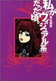
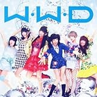
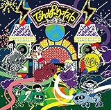

---
categories:
- でんぱ組
date: Sat, 29 Nov 2014 03:30:57 +0000
slug: post-6636
tags:
- でんぱ組.inc
title: 「でんぱ組.inc」の「W.W.D」って曲がすげーいい！バンギャにこそおすすめしたい！
---

でんぱ組知ってますか？名前を聞いたかとはあると思います。

確か渋谷のタワレコにDIR EN GREYの「The Unravelling」を買いに行った時に等身大パネルが置いてあったと思います。

本日はこのバンドじゃなくてアイドルグループを聞いてみたらめちゃくちゃよかったのでご紹介します。

<!--more-->

ハローしんぺー(<a href="https://twitter.com/s_s_p_y" target="_blank" rel="noopener">@s_s_p_y</a> )です。
オフィより詳しくて、wikiよりも有用なsukekiyo情報サイト「Gadget Zombie Parasite(ガジェットゾンビィパラサイト)」へようこそ。
<h2>でんぱ組incとは</h2>
&nbsp;
<blockquote>ホームグラウンドは、結成の場所でもあり、メンバーがかつて店員として勤務していた東京・秋葉原のライブ&amp;バー「秋葉原ディアステージ」。一般的なオーディションを通過して集められた様な女性アイドルグループではなく、自主的に活動していたアイドルが寄り集まってグループが形成されている。また、全メンバーが生粋のヲタク（オタク）的要素を持ち合わせており、それぞれにヲタクジャンルが設けられている。全員の年齢や本名が不詳な点も特徴。

引用元：<a href="http://ja.wikipedia.org/wiki/%E3%81%A7%E3%82%93%E3%81%B1%E7%B5%84.inc"> wikipedia</a></blockquote>
オタク系アイドルグループらしいです。メンバーそれぞれが何かのオタクで、アキバ系です。

こんな風に聞くと何その設定とか思うかもしれないけど、リアルにそれぞれコスプレイヤーやら踊り子やらゲーマーやらメイドやら元美大生←やらでリアルっぽいです。

さらに、それぞれに引きこもりやらいじめられっ子やらというオタクにありがちなバックグランドを持っています。
<h2>「W.W.D」って曲がめちゃくちゃいい！！ビジュアル系っぽい曲だと思う</h2>
泣きそうになる。

この曲をとりあえず聴いてくれ。

http://youtu.be/QddDPHoJOyA

曲調。息を吐かせないテンポ。
言葉選びや歌詞の言い回し

そして何よりもネガティヴなポイントを胸張って歌ってることと
歌自身が自分たちに向かっての歌を歌ってるってこと

可愛くないし歌下手だし、だいたい生主のキチガイ引きこもりクソサブカル美大生アニオタとかで本来なら日の当たる場所とかコミニュティ外で生きていけないような奴ら

にもかかわらず、「でも」「だからこそ」というカウンターパートとして存在してる。ただの地下アイドルならこんなバックグランドは必要ない。にもかかわらずそこを武器にしてるってことは、歌詞にもある通り天下目指してるからだと思う。そして最初から日本市場ではなく世界市場にスケールしてる点がすごい。

KPOP のマネみたいなクソアイドル集団なんかじゃなくて、これが21世紀のジャパニーズカルチャーだ！っていう売り方してる。これがいわゆるkawaii

カラフルな色使い
秋葉原に根ざしたオタク文化
何を言ってるかわからない単語をつなげてメロディーにのせる曲調
早いテンポ

これが今のジャパニーズカルチャーだと思う

クールジャパンなんて言われた時代は終わって、ジャパン文化を輸入してみたものの結局はサブカルを輸入したからメジャーにならなかった
けど、そのサブカルがでかくなってきて、日本のサブカルがサブカルのままメジャーになったってのが今のカワイイ文化だと思う。
オタク文化への拒絶を内包したまま容認と許容が拡大するのは、日本でも同じ

そしてサブカルな上にカウンターパートっていう圧倒的に不利でキャッチーな存在それがでんぱ組だと思います。

その存在自体がカウンターパートだから、他と比較すらできない。AKBに比べて〜とか
ももクロと違って〜とか全ての比較が意味をなさない。なぜなら最初から「マイナスのスタート」だから

本当にこの、「だからこそ」って部分が全魅力だと思う。

確かその昔、<a href="http://ja.wikipedia.org/wiki/%E5%B8%82%E5%B7%9D%E5%93%B2%E5%8F%B2">市川哲史</a>さんが『私が「ビジュアル系」だった頃。』で言ってた。

ビジュアル系って、自己否定とかコンプレックスとかっていう本来なら声を潜めて隠すようなネガティブな部分を声高に美化して喧伝する極めてポジティブな行為とかって。

<a href="http://www.amazon.co.jp/exec/obidos/ASIN/4812421918/warawareotoko-22/ref=nosim/" target="_blank" rel="nofollow noopener">私が「ヴィジュアル系」だった頃。</a>

posted with <a href="http://kaereba.com" target="_blank" rel="nofollow noopener">カエレバ</a>

市川 哲史 竹書房 2005-07

<a title="アマゾン" href="http://www.amazon.co.jp/gp/search?keywords=%8E%84%82%AA%83r%83W%83%85%83A%83%8B%8Cn%82%BE%82%C1%82%BD&amp;__mk_ja_JP=%83J%83%5E%83J%83i&amp;tag=warawareotoko-22" target="_blank" rel="nofollow noopener">Amazon</a>

<a title="楽天市場" href="http://hb.afl.rakuten.co.jp/hgc/0f6e221b.2eb9748a.0f6e221c.35cc1e84/?pc=http%3A%2F%2Fsearch.rakuten.co.jp%2Fsearch%2Fmall%2F%25E7%25A7%2581%25E3%2581%258C%25E3%2583%2593%25E3%2582%25B8%25E3%2583%25A5%25E3%2582%25A2%25E3%2583%25AB%25E7%25B3%25BB%25E3%2581%25A0%25E3%2581%25A3%25E3%2581%259F%2F-%2Ff.1-p.1-s.1-sf.0-st.A-v.2%3Fx%3D0%26scid%3Daf_ich_link_urltxt%26m%3Dhttp%3A%2F%2Fm.rakuten.co.jp%2F" target="_blank" rel="nofollow noopener">楽天市場</a>

<a title="Yahooショッピング" href="http://ck.jp.ap.valuecommerce.com/servlet/referral?sid=3041033&amp;pid=882528283&amp;vc_url=http%3A%2F%2Fshopping.search.yahoo.co.jp%2Fsearch%3FuIv%3Don%26ei%3DUTF-8%26tab_ex%3Dcommerce%26slider%3D0%26va%3D%25E7%25A7%2581%25E3%2581%258C%25E3%2583%2593%25E3%2582%25B8%25E3%2583%25A5%25E3%2582%25A2%25E3%2583%25AB%25E7%25B3%25BB%25E3%2581%25A0%25E3%2581%25A3%25E3%2581%259F" target="_blank" rel="nofollow noopener">Yahooショッピング</a>

<a title="ヤフオク!" href="http://ck.jp.ap.valuecommerce.com/servlet/referral?sid=3041033&amp;pid=882528283&amp;vc_url=http%3A%2F%2Fauctions.search.yahoo.co.jp%2Fsearch%3Fvo%3D%26ve%3D%26auccat%3D0%26aucminprice%3D%26aucmaxprice%3D%26aucmin_bidorbuy_price%3D%26aucmax_bidorbuy_price%3D%26loc_cd%3D0%26abatch%3D0%26istatus%3D0%26filtered%3D1%26ei%3DUTF-8%26tab_ex%3Dcommerce%26va%3D%25E7%25A7%2581%25E3%2581%258C%25E3%2583%2593%25E3%2582%25B8%25E3%2583%25A5%25E3%2582%25A2%25E3%2583%25AB%25E7%25B3%25BB%25E3%2581%25A0%25E3%2581%25A3%25E3%2581%259F" target="_blank" rel="nofollow noopener">ヤフオク!</a>

曲の話に戻るけど、すげー合いの手が入れやすい曲調だし！！
曲も精神性もビジュアル系に共通してるってばよ！！
<h2>バンギャとの共通性</h2>
だって、ビジュアル系好きな人なんてみんなそうだと思うんすよ

少なくともぼくはそう。

<strong>生きる場所なんて、どこにも無かったんだ</strong>

<strong>ドン底も経験してんだ</strong>

って感じで多少なりとも自分を自分で虐げてきたでしょ？

それでも、今ここに生きてるってことは、自分がしてきた選択の結果で

いつか選んだ点と点が一つの線になった結果で

そんな今だからこそ
<blockquote>”あの日泣いてた自分自身に感謝”</blockquote>
できるし

捨てるものなんかない何もないと思う
<blockquote>マイナスからのスタートなめんな</blockquote>
で、最後にこういう歌詞あるけど
うちらのスタイルで勝ち取るよ天下

これってつまりは、もう天下とってるんだと思う。

売上が〜とか動員が〜とかじゃなくて、誰かを魅せた時点で、絶対評価としてナンバーワンになれてるわけだし

少なくともぼくは心打たれました。
<h2>しんぺーはこう思った。</h2>
てな具合でめちゃくちゃいいんだよね、このグループ

アイドルでファンは男ばっかだと思うけどぜひバンギャにもおすすめなんじゃねーかと思ったわけです。

すごいいいです。

話によるとBisってもう解散しちゃったグループもいいらしいんでちょっとそっちもチェックしてみようと思います。

と言ったところで本日は以上になります。おやすみなさい。

&nbsp;

<a href="https://itunes.apple.com/jp/album/world-wide-dempa/id793063039?uo=4&amp;at=11ld5P" target="_blank" rel="noopener">WORLD WIDE DEMPA</a>

2,000円

(2014.11.29時点)

<a style="width: 60px; color: #ffffff; background: #000000; font-size: 8px; font-weight: bold; text-align: center; display: inline; text-decoration: none; border: 0px; padding: 2px; border-radius: 5px; white-space: nowrap;" href="https://itunes.apple.com/jp/album/world-wide-dempa/id793063039?uo=4&amp;at=11ld5P" target="_blank" rel="noopener">App Store</a>

<a href="https://itunes.apple.com/jp/artist/denpa-zu.inc/id475290252?uo=4&amp;at=11ld5P" target="_blank" rel="noopener">でんぱ組.inc</a>

posted with <a href="http://pochireba.com" target="_blank" rel="nofollow noopener">ポチレバ</a>

<a href="http://www.amazon.co.jp/exec/obidos/ASIN/B009QTW8HE/warawareotoko-22/ref=nosim/" target="_blank" rel="nofollow noopener">W.W.D / 冬へと走りだすお! 通常盤</a>

posted with <a href="http://kaereba.com" target="_blank" rel="nofollow noopener">カエレバ</a>

でんぱ組.inc トイズファクトリー 2013-01-16

<a title="アマゾン" href="http://www.amazon.co.jp/gp/search?keywords=W.W.D&amp;__mk_ja_JP=%83J%83%5E%83J%83i&amp;tag=warawareotoko-22" target="_blank" rel="nofollow noopener">Amazon</a>

<a title="楽天市場" href="http://hb.afl.rakuten.co.jp/hgc/0f6e221b.2eb9748a.0f6e221c.35cc1e84/?pc=http%3A%2F%2Fsearch.rakuten.co.jp%2Fsearch%2Fmall%2FW.W.D%2F-%2Ff.1-p.1-s.1-sf.0-st.A-v.2%3Fx%3D0%26scid%3Daf_ich_link_urltxt%26m%3Dhttp%3A%2F%2Fm.rakuten.co.jp%2F" target="_blank" rel="nofollow noopener">楽天市場</a>

<a title="Yahooショッピング" href="http://ck.jp.ap.valuecommerce.com/servlet/referral?sid=3041033&amp;pid=882528283&amp;vc_url=http%3A%2F%2Fshopping.search.yahoo.co.jp%2Fsearch%3FuIv%3Don%26ei%3DUTF-8%26tab_ex%3Dcommerce%26slider%3D0%26va%3DW.W.D" target="_blank" rel="nofollow noopener">Yahooショッピング</a>

<a title="ヤフオク!" href="http://ck.jp.ap.valuecommerce.com/servlet/referral?sid=3041033&amp;pid=882528283&amp;vc_url=http%3A%2F%2Fauctions.search.yahoo.co.jp%2Fsearch%3Fvo%3D%26ve%3D%26auccat%3D0%26aucminprice%3D%26aucmaxprice%3D%26aucmin_bidorbuy_price%3D%26aucmax_bidorbuy_price%3D%26loc_cd%3D0%26abatch%3D0%26istatus%3D0%26filtered%3D1%26ei%3DUTF-8%26tab_ex%3Dcommerce%26va%3DW.W.D" target="_blank" rel="nofollow noopener">ヤフオク!</a>

<a href="http://www.amazon.co.jp/exec/obidos/ASIN/B00O0GFP9Q/warawareotoko-22/ref=nosim/" target="_blank" rel="nofollow noopener">でんぱーりーナイト(初回限定盤A)</a>

posted with <a href="http://kaereba.com" target="_blank" rel="nofollow noopener">カエレバ</a>

でんぱ組.inc トイズファクトリー 2014-11-26

<a title="アマゾン" href="http://www.amazon.co.jp/gp/search?keywords=%82%C5%82%F1%82%CF%91g&amp;__mk_ja_JP=%83J%83%5E%83J%83i&amp;tag=warawareotoko-22" target="_blank" rel="nofollow noopener">Amazon</a>

<a title="楽天市場" href="http://hb.afl.rakuten.co.jp/hgc/0f6e221b.2eb9748a.0f6e221c.35cc1e84/?pc=http%3A%2F%2Fsearch.rakuten.co.jp%2Fsearch%2Fmall%2F%25E3%2581%25A7%25E3%2582%2593%25E3%2581%25B1%25E7%25B5%2584%2F-%2Ff.1-p.1-s.1-sf.0-st.A-v.2%3Fx%3D0%26scid%3Daf_ich_link_urltxt%26m%3Dhttp%3A%2F%2Fm.rakuten.co.jp%2F" target="_blank" rel="nofollow noopener">楽天市場</a>

<a title="Yahooショッピング" href="http://ck.jp.ap.valuecommerce.com/servlet/referral?sid=3041033&amp;pid=882528283&amp;vc_url=http%3A%2F%2Fshopping.search.yahoo.co.jp%2Fsearch%3FuIv%3Don%26ei%3DUTF-8%26tab_ex%3Dcommerce%26slider%3D0%26va%3D%25E3%2581%25A7%25E3%2582%2593%25E3%2581%25B1%25E7%25B5%2584" target="_blank" rel="nofollow noopener">Yahooショッピング</a>

<a title="ヤフオク!" href="http://ck.jp.ap.valuecommerce.com/servlet/referral?sid=3041033&amp;pid=882528283&amp;vc_url=http%3A%2F%2Fauctions.search.yahoo.co.jp%2Fsearch%3Fvo%3D%26ve%3D%26auccat%3D0%26aucminprice%3D%26aucmaxprice%3D%26aucmin_bidorbuy_price%3D%26aucmax_bidorbuy_price%3D%26loc_cd%3D0%26abatch%3D0%26istatus%3D0%26filtered%3D1%26ei%3DUTF-8%26tab_ex%3Dcommerce%26va%3D%25E3%2581%25A7%25E3%2582%2593%25E3%2581%25B1%25E7%25B5%2584" target="_blank" rel="nofollow noopener">ヤフオク!</a>

