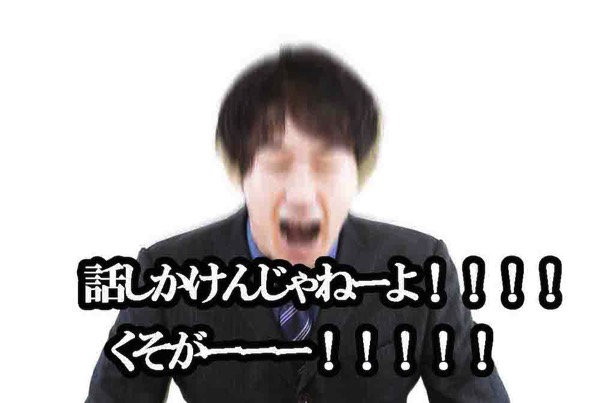
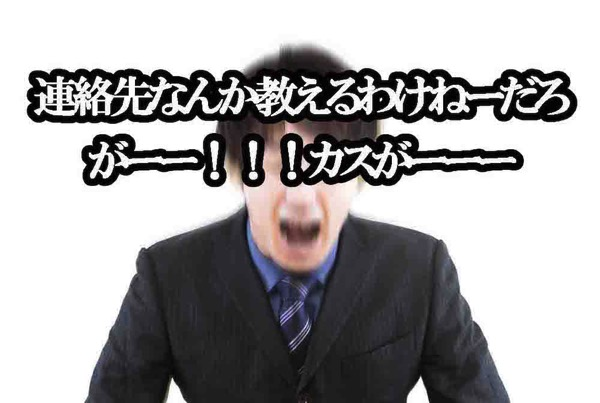

---
categories:
- ブログ
date: Mon, 01 Dec 2014 14:42:32 +0000
slug: post-6642
tags:
- 最近のできごと
title: 俺氏、渋谷で美味しいラーメン屋を知ってるか聞かれる事案多発
---

男にwww

<!--more-->

ハローしんぺー(<a href="https://twitter.com/s_s_p_y" target="_blank">@s_s_p_y</a> )です。
オフィより詳しくて、wikiよりも有用なsukekiyo情報サイト「Gadget Zombie Parasite(ガジェットゾンビィパラサイト)」へようこそ。

ナンパって言っても「あーーーー！」事案じゃないから、BL臭に引き寄せられた腐女子はここで帰ってください。

で、どういうことかというと大抵男二人組にこう聞かれます。

「この辺で美味しいラーメン屋ありませんか？」

しかも、すでに１０回以上聞かれています。

そんなにラーメン屋に詳しそうに見える？

普段、人見知りだし、話掛けるなオーラ全開なのに何故かやたらと話かけられる。
しかも必ずラーメンな

で、そんな時どう答えるかというと•••

「がっつり食べたい系ですか？」

とか、聞いちゃうの。お前何思いっきりキュレーションしようとしてるの？アホなの？通気取ってるの？

でもさ、やっぱりせっかく聞かれたんだから、教えてあげたいじゃない？で、しかも割と最適のソリューションを提供したじゃない？

で、大抵おすすめするのがこちらの2店舗

<h2>横浜家系 侍 渋谷店</h2>

<strong><a href="http://tabelog.com/tokyo/A1303/A130301/13099685/" target="_blank">横浜家系 侍 渋谷店</a></strong>

<strong>関連ランキング：</strong><a href="http://tabelog.com/rstLst/ramen/">ラーメン</a> | <a href="http://tabelog.com/tokyo/A1303/A130301/R4698/rstLst/">渋谷駅</a>、<a href="http://tabelog.com/tokyo/A1303/A130303/R5661/rstLst/">代官山駅</a>

ここはいわゆる「家系」の店です。豚骨です。店の床も油でつるつるします。こってりです。食べた次の日お腹痛くなるかも。でも、そこまででもないです。
とにかく美味しいです。男性にぴったりです。

<h2>道玄坂　マンモス</h2>

<strong><a href="http://tabelog.com/tokyo/A1303/A130301/13122700/" target="_blank">道玄坂　マンモス</a></strong>

<strong>関連ランキング：</strong><a href="http://tabelog.com/rstLst/MC11/">つけ麺</a> | <a href="http://tabelog.com/tokyo/A1303/A130301/R5207/rstLst/">神泉駅</a>、<a href="http://tabelog.com/tokyo/A1303/A130301/R4698/rstLst/">渋谷駅</a>

こっちは、つけ麺です。吉祥寺にある「えん寺」の姉妹店です。
味はほとんど同じですが、正直自分は吉祥寺の「えん寺」の方が好きです。こっちの方が量が多い気がします。

先に紹介しました「侍」に比べるとお腹一杯になります。ってか残します。

でも、美味しいです！！

がっつりがいいですか？とか聞いておきながら、どっちも結構がっつりこってりなんですわw
で、どっちも紹介して行ってもらうって感じです。

<h2>連絡先はきいてくんじゃねーよカス</h2>

で、この前あったのが「ぼくたち普段品川いるんですけど、行きつくしちゃって、渋谷に来たんですけど、今度一緒にどっかいきませんか？連絡先教えてください」

はーーーーー？？？？なんで教えなきゃいけないんだよ！！ぼくは別に君らとラーメン食べたくねーーーんだわ！もし行くんだとしたら相沢梨沙ちゃんとか夢眼ねむちゃんがいいわーーーー！！！はーーーーー！！！？？？

「はい、いいですよ」

だって、断りずらかったんだもん。しかもLINEの本名見られたし。いろいろ検索されちゃうわ
だから一旦交換してブロックしますた。

<h2>別バージョンきたーーーー！</h2>

会社帰りに本屋でAfterEffectの本探してたんですよ。で、そういった専門書があるコーナーにいたんですよ。音楽聞いてて。
そしたら、肩をトントンとされたわけ。まさか最上もがちゃんか！？とか思ったら、なんかぼくより少し年上くらいの男性が2人いて

「？」

ってなったのよ

したら、「写真加工するにはどうしたらいいですか？」

はーーーーーーー！！！？？？？

知らねーーよ！！！！カスが！！！！だからしゃべりかけてくんじゃねーーーーー！！！！くそが！！！！

ぼく「そうですね、とりあえずPhotoshopの本買って勉強すればいいんじゃないでしょうか」

男「へー」

ぼく「例えば、このシリーズの標準講座ってやつは初心者向けでわかりやすいですよ」といってAfterEffectの本を指さした。「ちなみにそれ動画系のソフトですけど、でもこのシリーズはCD付いてくるしサンプル通りにやればある程度使い方はわかるとおもいますよ」

とかって、また説明始めちゃったんだねーーー

男「でもソフトとか高いんですよね？10万円くらいするんですよね？」

ぼく「いやいや、オンラインだったら5000円から利用できますよ」

男＆男「えーそんなにやすいんですか？！」「お仕事でそういうことされるんですか？」

ぼく「いや趣味で。サイトにあげたりとか、そういうことやってるんで」

男「えー趣味ですか。すごいですね！どういう時にやってるんですか？」

ぼく「仕事終わったあととか、休日とか」

男「すごいですね！」

このあと多分、連絡先聞かれそうな気配がしたのでさよならしました。

ってかさーーーーーまじでさーーー
なんなの！！！本当に！！！！！

<h2>しんぺーはこう思った。</h2>
街中で知らない人ははなしかけないでください。男も女も！！！！！

こえーーーだろうが！！！ツボ売られるかとおもったわ！！！！！

と言ったところで本日は以上になります。おやすみなさい。