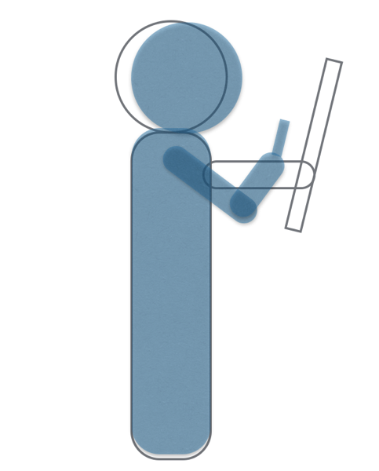

---
categories:
- ブログ
date: Wed, 03 Dec 2014 04:56:15 +0000
slug: post-6656
tags:
- 日常あれこれ
title: 電車で新聞読む迷惑行為そろそろやめてもらっていっすか？
---

スマホ以降どんどん減ってき、今じゃ滅多に見かけないですけど、たまにまだいますよね？電車の中で新聞読むおっさん

あれやめてほしいです。

<!--more--><!--more-->ハローしんぺー(<a href="https://twitter.com/s_s_p_y" target="_blank">@s_s_p_y</a> )です。
オフィより詳しくて、wikiよりも有用なsukekiyo情報サイト「Gadget Zombie Parasite(ガジェットゾンビィパラサイト)」へようこそ。

<h2>なぜ電車内で新聞読むのが迷惑か？</h2>

これを見てくれ

新聞を広げてるともっと迷惑だけど小さくしてても迷惑なのには２つ理由があります。

一つ、目から新聞までのリーチが必要ということ
新聞って近すぎると読めないわけです。だからある程度距離が必要なわけです。

二つ、新聞を読むためには背中と頭が一直線になるのです。
そうするとそいつの後ろとかにいると、背中からの圧迫が増すんです。塗り壁か！ってくらい硬く、ローズマリアってくらいでかいんです。

一方スマホはどうか？

スマホは目との距離が近くても読めます。しかも遠いと読みにくいという新聞とは正反対なんです。しかも腕のリーチを変えることなく、画面を文字にズームすることができます。

比べてみましょう。

どうですか？？全然リーチが違うでしょう？混んでる電車でスマホを見ていても迷惑にはならないけど、新聞は物理的に邪魔なのです。

そろそろiPadとかにすれば？？新聞迷惑ということを認識してほしい。カシャカシャうるさいし

<h2>しんぺーはこう思った。</h2>
あと納得いかないのが、電子版の新聞と普通の新聞が同じくらい高いってことと、あんな半分が広告の媒体に高い金払いたくないってことですね。

どちらにしろ新聞読まないからいいんですけど、ということでとりあえず電車の中で新聞読まないでください！！
と言ったところで本日は以上になります。おやすみなさい。