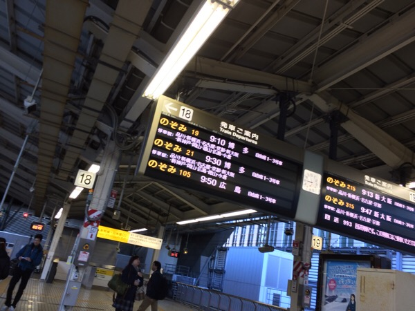
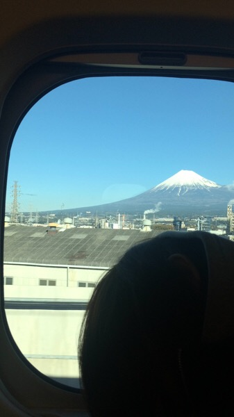
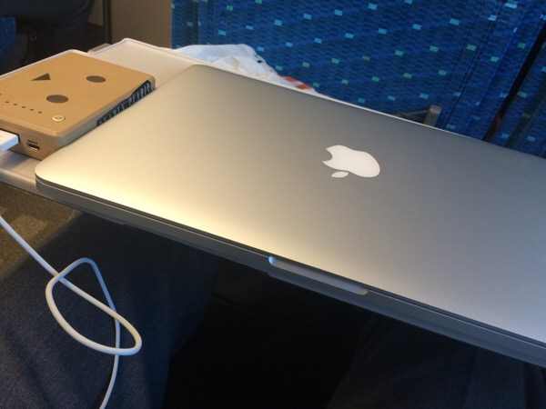

---
categories:
- DIR EN GREY
date: Sat, 06 Dec 2014 01:02:00 +0000
slug: post-6667
tags:
- 遠征記
title: 【遠征記】DIR EN GREY 「TOUR2015 THE GRACE OF GOD」新幹線初めて乗った( ´ ▽ ` )ﾉ
---

普段遠征はしないんですが、今回は会場が気になったのでちょっと遠くまで行ってみようと思いました。<!--more-->ハロー。しんぺー(<a href="https://twitter.com/s_s_p_y" target="_blank">@s_s_p_y</a> )です。

オフィより詳しくて、wikiよりも有用なsukekiyo情報サイト「Gadget Zombie Parasite(ガジェットゾンビィパラサイト)」へようこそ。

本日は、明日のDIR EN GREY TOUR2015 THE GRACE OF GODの奈良100年会館公演に向けて新幹線にて前乗りです。

歴戦のバンギャちゃんなら、もはや何を今更という感じでしょうが、ぼくは遠征経験がUROBOROS -breathing-の時に夜行バスで行ったことくらいしかありません。

ということで、わからないことだらけでした。

<h2>新幹線のお作法</h2>

(さっき東京でたのにもう富士山)

<ol>
<li>きっぷ通してからSuicaピッてやる</li>
<li>乗車券と特急券が必要</li>
<li>新幹線の車両には進行方向前方から乗り込む</li>
<li>来た新幹線にすぐ乗っちゃだめ清掃があるから</li>
<li>新幹線の停車時間は短かった</li>
<li>壁際にはコンセントある</li>
<li>めっちゃ速い</li>
</ol>

なんかよくわからないから、他の方に色々迷惑かけちゃった。チッ初心者がって思われただろな

(WiFiが遅くてMacさんが使えない)

<h2>しんぺーはこう思った。</h2>

夜行バスに比べると尋常じゃないスピード
しかし高い•••

そして大阪までだと中途半端な時間なので寝られない•••眠い

といったところで、本日は以上です。おやすみなさい。