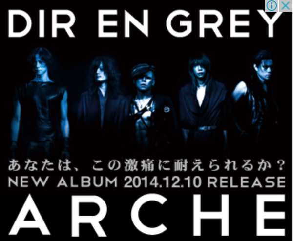
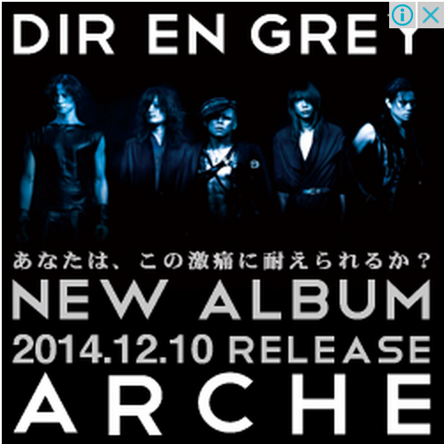
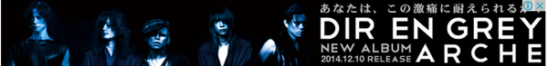
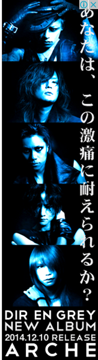
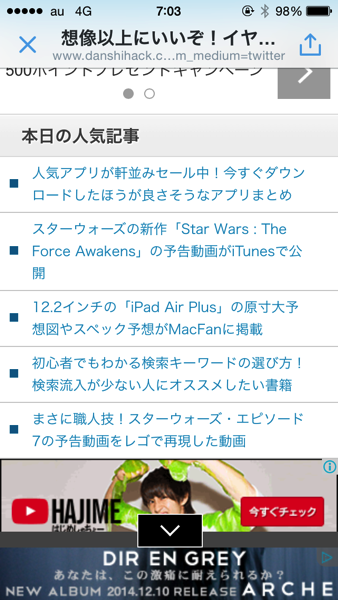
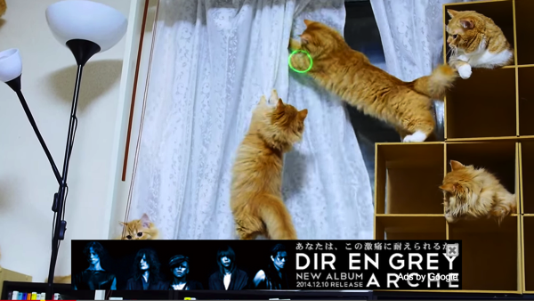

---
categories:
- DIR EN GREY
- 各メンバーの個人イベントレポなど
date: Sat, 06 Dec 2014 14:16:16 +0000
slug: post-6676
tags:
- DIR EN GREY
title: DIR EN GREY「ARCHE」のネット広告が果たして効果があるのか甚だ疑問でしょうがない
---

あなたはいくつの広告を見ましたか？おそらくですが広告の種類は5つです。
これは「Googleアドワーズ」を利用して広告を配信しています。色々な設定の仕方がありますが、簡単に言いますと広告費用のかけ方で出現率が変わります。ということで、今回はネット広告への資金投入がDIR EN GREY史上最大ということが予想されます。<!--more-->ハローしんぺー(<a href="https://twitter.com/s_s_p_y" target="_blank" rel="noopener noreferrer">@s_s_p_y</a> )です。
オフィより詳しくて、wikiよりも有用なsukekiyo情報サイト「Gadget Zombie Parasite(ガジェットゾンビィパラサイト)」へようこそ。
<h2>DIR EN GREY「ARCHE」のネット広告が果たして効果があるのか甚だ疑問でしょうがない</h2>
さて本題に入りますが、今回皆さんが見かけた広告の種類というかサイズは以下の4つとスマホ用の1つかと思います。（追加で動画用もありました）

この広告が出現する仕組みですが、おそらくリターゲティングという出し方をしていると思います。（広告知識あまりないのでなんとも言えませんが）

<blockquote>
リターゲティング広告 【 retargeting advertisement 】 リマーケティング広告

ネット広告の手法の一つで、自社のサイトを訪れたことのある人に限定して、再訪を促すような広告を配信すること。

引用元：<a href="http://e-words.jp/w/E383AAE382BFE383BCE382B2E38386E382A3E383B3E382B0E5BA83E5918A.html">IT用語辞典 e-Words</a>
</blockquote>

そのため虜の皆さんの閲覧するサイトにDIR EN GREYの広告が表示されるのはこれ必定の理です。当たり前なんですねー

で、ここで疑問なんですが、普段DIR EN GREYのサイトを見る人って9割は虜だと思うんですよね。ということはほぼ確実にニューアルバム「ARCHE」を購入するはずです。にもかかわらず、そういう人たちに広告を出して、宣伝をして意味がるの？？って思うわけです。

さらにこの広告ってクリックされるたびに費用が発生するので、その辺でも費用対効果悪すぎるでしょう。虜だったらこれ見て「お！」ってなっておもわずクリックしちゃうでしょう。
買う予定の人が、クリックするということはこれ購買につながってないただの無駄クリックなわけです。

ということで、この広告はリターゲティングでの配信は意味がないというかコスパ悪すぎでは！！と思うのでした。

これ総額でどんくらいかかってるのかしら。

<h2>DIR EN GREYの広告配信ってすげー難しいと思う</h2>

だって、ファンしか買わないじゃん。とくにCDが売れないこの時代。だからこそファンを地道に増やしていくことが最大の宣伝になるわけです。
その昔はLIVEはCDの宣伝行為という位置づけでしたが、CDが売れないこの時代、LIVEがアーティストの収益の中心になっています。つまりLIVEの宣伝がCDという形になっているのです。

と考えると、ツアーの広告を出したほうがいいのでは？って思う。
要は「THE GRACE OF GOD」の広告を出した方がよかったのではと思う。

<h3>今後こうなるんじゃね？って予想</h3>

アルバムのツアーが２段階になる。

まずはファン向け（既存顧客）のツアー。これはいつも通り公演日の大分前に告知して予約開始してっていういわゆる、今まで通りのやり方です。
そして、後半のLIVEはガンガンに新規顧客向けに宣伝をしてLIVEに来てもらう！っていう形になるんじゃないかしらって

なので、今のツアーが終わって海外ツアーが始まる頃、おそらく次の国内ツアーの広告がネットに出てるんじゃないかなって

<h2>しんぺーはこう思った。</h2>
去年の3月11日にDIR EN GREYのサイトがリニューアルしましたが、今までこのサイトをディレクションしてきた人とディレクター変わった？ってちょっと思いました。
なんか、ちょい一般的な作りになったなーって思います。

さらには今までなかったa knotサイトのランディングページなんかも作って、積極的にファンクラブ会員の獲得にネットを利用し出したって感じです。

<a style="color:#0070C5;" href="http://www.direngrey.co.jp/aknot/" target="_blank" rel="noopener noreferrer">DIR EN GREY OFFICIAL SITE</a>  

でも、ちょっと畑が違う人なのかなーって気がします。実績はあるものの、こういうサイト（アーティスト系）を手がけたことがなかった人なのかなって
どうも物販系とか個人向けのサービスサイトとかをやってる事業会社のサイトのディレクターだった人なのでは、、、、とか勝手に予想しちゃいました。

勝手な予想です。

と言ったところで本日は以上になります。おやすみなさい。