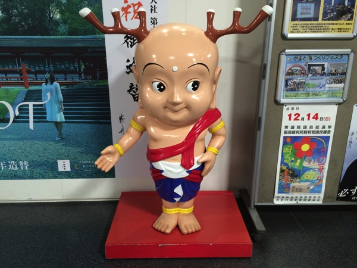

---
categories:
- DIR EN GREYのLIVEレポ
- TOUR14-15 BY THE GRACE OF GOD
date: Sun, 07 Dec 2014 14:49:05 +0000
slug: post-6678
tags:
- DIR EN GREY
- LIVEレポ
title: 【ライブレポ】DIR EN GREY TOUR14-15 BY THE GRACE OF GOD 2014_12_7@なら100年会館
---

あまり遠征したことのないぼくが、今回はなら100年会館での公演に参戦しに遠征いたしました！しかも最近のDIR EN GREYにしては珍しく席ありの会場でした。<!--more-->ハロー。しんぺー(<a href="https://twitter.com/s_s_p_y" target="_blank" rel="noopener noreferrer">@s_s_p_y</a> )です。

オフィより詳しくて、wikiよりも有用なsukekiyo情報サイト「Gadget Zombie Parasite(ガジェットゾンビィパラサイト)」へようこそ。
<h2>セトリ</h2>
01.and Zero
02.Un deux
03.SUSTAIN THE UNTRUTH
04.LOTUS
05.Chain repulsion
06.禍夜想
07.輪郭
08.濤声
09.空谷の跫音
10.「欲巣にDREAMBOX」あるいは成熟の理念と冷たい雨
11.鱗
12.OBSCURE
13.Cause of fickleness
14.激しさと、この胸の中で絡み付いた灼熱の闇

EN
01.逆上堪能ケロイドミルク
02.Agitated Screams of Maggots
03.Spilled Milk
04.羅刹国
05.Ravelation of mankind
<h2>セット</h2>
こちらはぼくが前回参戦した川崎のときと同様でした。

<a style="color: #0070c5;" href="https://www.warawareotoko.com/2014/11/18/post-6601/" target="_blank" rel="noopener noreferrer">【LIVEレポ】DIR EN GREY TOUR14-15 BY THE GRACE OF GOD ｢a knot｣only@ CLUB CITTA’ | Gadget Zombie Parasite</a> 
ただ気が付いたのが、今回のバックに流れてる映像ってプロジェクターで客席上部から映し出してるのね。いつものようにLEDとかモニターとかではなくて。
<h2>LIVEレポ</h2>
<blockquote class="twitter-tweet" lang="ja">Toshiyaハゲ闇のラストで最近荒ぶらない？思い出したかのように荒ぶりだしたし、本編終了時にベースボトッて落としてたし、体調悪し？

— しんぺー@奈良100年 (@s_s_p_y) <a href="https://twitter.com/s_s_p_y/status/541551705800704000">2014, 12月 7</a></blockquote>

<blockquote class="twitter-tweet" lang="ja">なんの曲だったかなー、なんか下手前方の客席に謎のスポットライトが向けられてたけど、あれミスだよね？？

— しんぺー@奈良100年 (@s_s_p_y) <a href="https://twitter.com/s_s_p_y/status/541553015417626624">2014, 12月 7</a></blockquote>

<blockquote class="twitter-tweet" lang="ja">Toshiya最後の方でマイクスタンド後ろの方にポイしてた

— しんぺー@奈良100年 (@s_s_p_y) <a href="https://twitter.com/s_s_p_y/status/541553129590767617">2014, 12月 7</a></blockquote>

<blockquote class="twitter-tweet" lang="ja">京氏途中マイク引き寄せようとケーブルを編みのごとくぴやーって引っ張っておられました

— しんぺー@奈良100年 (@s_s_p_y) <a href="https://twitter.com/s_s_p_y/status/541553753334091777">2014, 12月 7</a></blockquote>

あとは京さん全力投球だったのか終わると同時に両膝ついて疲れ果ててた。包帯はもうとれてたみたい。

それとどれかの新曲の時にいつもにもまして”腰クイッ！”のスピードが速かったぜ！！可愛さがすごかった。
<h2>しんぺーはこう思った。</h2>
普段遠征はしないんですが、今回の会場があまりにも気になったのできてみました。それにしても奈良って修学旅行以来なので、こんな街並みだったんだーという感じでした。

なら100年会館は、おそらくですが市が運営してるのかしら（<a href="http://www.sogozaidan.nara.jp/gaiyo.html">奈良市総合財団</a>）

会場内はとにかく綺麗で、でかくて、荘厳でした。座席番号がみにくいくらいで、座席もいいし、音響もグッドでした。

ただぼくは、３階の最前だったんですがあそこって立っちゃいけない場所なのかしら？まわりの人もたってなかったんで2曲目から座っちゃった。
ってもOBSCURE以降は立ちましたが。。。

今日もいいLIVEでした！

といったところで、本日は以上です。おやすみなさい。