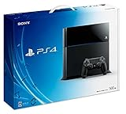

---
categories:
- DIR EN GREY
date: Mon, 08 Dec 2014 23:41:45 +0000
slug: post-6687
tags:
- 遠征記
title: 【遠征記】DIR EN GREY 「TOUR2015 THE GRACE OF GOD」今回の遠征費用はこんくらいかかったよ（・_・;）
---

今回ひっさしぶりに遠征をいたしました！前回は2008年の大阪城ホールの「UROBOROS -breathing-」以来。当時はまだ学生だったので、夜行バスで行って当日帰ってきました。確か危うくバスに乗り遅れるってところだった気がします。その時は超貧乏旅行でしたが、今回は割りとお金を使ってしまったので。。。次のツアーの入金が・・・

<!--more-->ハローしんぺー(<a href="https://twitter.com/s_s_p_y" target="_blank">@s_s_p_y</a> )です。
オフィより詳しくて、wikiよりも有用なsukekiyo情報サイト「Gadget Zombie Parasite(ガジェットゾンビィパラサイト)」へようこそ。

ということで、今回かかった金額をまとめておきます。恐らく、歴戦のバンギャさんたちなら、これの数分の一でいけるじゃないかと

<h2>旅行日程</h2>

12月7日土曜日
東京から新幹線で新大阪へ
その日はUSJにて1日すごしました。

12月8日日曜日
なら100年会館にてDIR EN GREYのLIVE

12月9日月曜日
チェックアウトしてから新幹線にて帰路へ

(USJのジュラシックパーク。なんかカリブの海賊っぽかった)

<h2>実際にかかった費用</h2>

(USJは割りと映像との組み合わせで座席が動く系が多かった。。子供だましもいいところ）

ハイアットリージェンシー
2泊 40,200円(1人あたり20,100円)
USJ
14,410円(1人あたり6,980円)
新幹線
14,250円×2=28,500円

→55,580円

その他雑費
→30,000円

85,580円

えーっとすいません、なんでこんなかかってるんですか？
観光メインだったので、割りと良い目のホテルだったので宿泊費用はこんくらいでいいかなと思います。
USJのチケット代もまー固定費です。
交通費は、最初半額くらいのバスを考えてたんですが、しんどそうだったので新幹線にしてみました。（<a href="https://www.warawareotoko.com/2014/12/06/post-6667/">新幹線に初めてのった感想はこちら</a>）

で•••雑費30,000円ってなんだよ！おい！

覚えているだけ内訳
USJまでのタクシー3,000円が往復で6,000円
ホテルでの夕食ブッフェ3,000円
ホテルでの朝食ブッフェ3,000円
あとは交通費等で5,000円くらい？？
その他、お土産と食事くらいで10,000円くらい使ってたのかも•••

なにこれ。ちょっと贅沢しすぎたんじゃね？

これじゃPS4買えないや

<a href="http://www.amazon.co.jp/exec/obidos/ASIN/B00O0Y0LR4/warawareotoko-22/ref=nosim/" rel="nofollow" target="_blank">PlayStation 4 ジェット･ブラック 500GB (CUH-1100AB01)</a>
posted with <a href="http://kaereba.com" rel="nofollow" target="_blank">カエレバ</a>

 ソニー・コンピュータエンタテインメント 2014-09-30    

<a href="http://www.amazon.co.jp/gp/search?keywords=PS4&__mk_ja_JP=%83J%83%5E%83J%83i&tag=warawareotoko-22" rel="nofollow" target="_blank" title="アマゾン" >Amazon</a>

<a href="http://hb.afl.rakuten.co.jp/hgc/0f6e221b.2eb9748a.0f6e221c.35cc1e84/?pc=http%3A%2F%2Fsearch.rakuten.co.jp%2Fsearch%2Fmall%2FPS4%2F-%2Ff.1-p.1-s.1-sf.0-st.A-v.2%3Fx%3D0%26scid%3Daf_ich_link_urltxt%26m%3Dhttp%3A%2F%2Fm.rakuten.co.jp%2F" rel="nofollow" target="_blank" title="楽天市場" >楽天市場</a>

<a href="http://ck.jp.ap.valuecommerce.com/servlet/referral?sid=3041033&pid=882528283&vc_url=http%3A%2F%2Fshopping.search.yahoo.co.jp%2Fsearch%3FuIv%3Don%26ei%3DUTF-8%26tab_ex%3Dcommerce%26slider%3D0%26va%3DPS4" rel="nofollow"  target="_blank" title="Yahooショッピング" >Yahooショッピング</a>

<a href="http://ck.jp.ap.valuecommerce.com/servlet/referral?sid=3041033&pid=882528283&vc_url=http%3A%2F%2Fauctions.search.yahoo.co.jp%2Fsearch%3Fvo%3D%26ve%3D%26auccat%3D0%26aucminprice%3D%26aucmaxprice%3D%26aucmin_bidorbuy_price%3D%26aucmax_bidorbuy_price%3D%26loc_cd%3D0%26abatch%3D0%26istatus%3D0%26filtered%3D1%26ei%3DUTF-8%26tab_ex%3Dcommerce%26va%3DPS4" rel="nofollow"  target="_blank" title="ヤフオク!" >ヤフオク!</a>

<h2>しんぺーはこう思った。</h2>

（ただハリーポッターエリアは違ってた！ここだけ気合の入れ方が違いすぎる！でティールがやばい！ハリポタ一個も見た事ないけどな）

はい、ということで上級虜の方からのアドバイスをお待ちしております。
気がついてみればもうアルバム発売日、そしてGAUZEDVDにさらに来年の⚪︎⚪︎⚪︎

まじすか

<blockquote class="twitter-tweet" lang="ja">
来年はもう少し消費動向と合わせて消費者の財政面への最適化をしていただきたい。配慮はいいから最適化を
&mdash; しんぺー@ARCHEインスト新宿 (@s_s_p_y) <a href="https://twitter.com/s_s_p_y/status/541814660257701888">2014, 12月 8</a></blockquote> 

と言ったところで本日は以上になります。おやすみなさい。