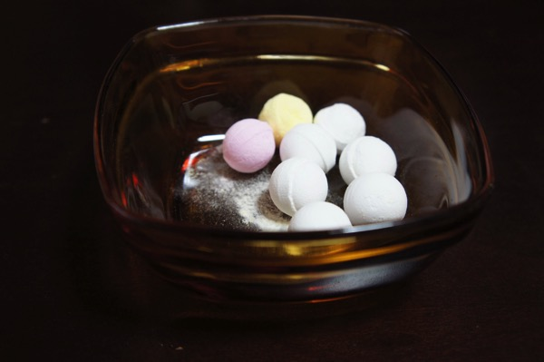

---
categories:
- DIR EN GREY
date: Thu, 11 Dec 2014 13:09:00 +0000
slug: post-6698
title: 奈良の幻のラムネ「レインボーラムネ」を知ってるか？
---

先日のDIR EN GREYのツアーで奈良に行ったので思い出しました。そういや、この前会社でお土産に奈良のなんかラムネ持ってきた人いたなと。このラムネが実は、すんげーレアということで今日はそのご紹介。<!--more-->ハロー。しんぺー(<a href="https://twitter.com/s_s_p_y" target="_blank">@s_s_p_y</a> )です。

オフィより詳しくて、wikiよりも有用なsukekiyo情報サイト「Gadget Zombie Parasite(ガジェットゾンビィパラサイト)」へようこそ。

<h2>イコマ製菓のレインボーラムネ</h2>

公式ホームページによると、購入するためにはまずハガキで応募しなけれぼならないようです。

<a style="color:#0070C5;" href="http://www.ramune.net/" target="_blank">ラムネ菓子のイコマ製菓本舗</a>  

というのも、工場で作れる量の限界が決まってるからだそうです。

<h2>味は</h2>

えーっと、普通でした。
ちょいでかい。ビー玉サイズでした。

まぁ、味は普通です。甘すぎず、シュワっとするわけでもなく、和菓子って感じです。

<h2>しんぺーはこう思った。</h2>

会社の人よくこれあたったな〜。すげー

とりあえず珍しいらしいので、記事にした感ですが•••次のDIR EN GREYのツアーで奈良公演があるのはいつですかね？

ちなみに詳細情報はこのサイトがまとめてます。
<a style="color:#0070C5;" href="http://aoba-mama.com/5308.html" target="_blank">レインボーラムネ/イコマ製菓の味感想は？値段はいくらで購入方法？</a>  

といったところで、本日は以上です。おやすみなさい。