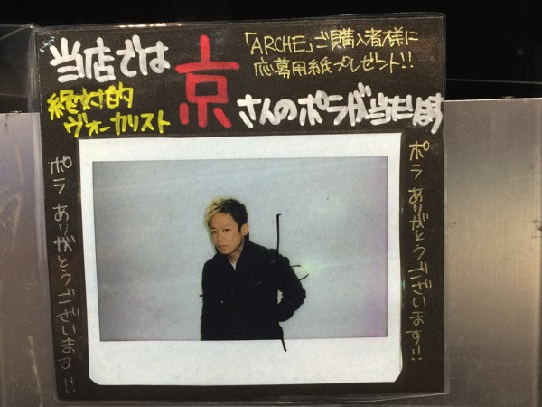
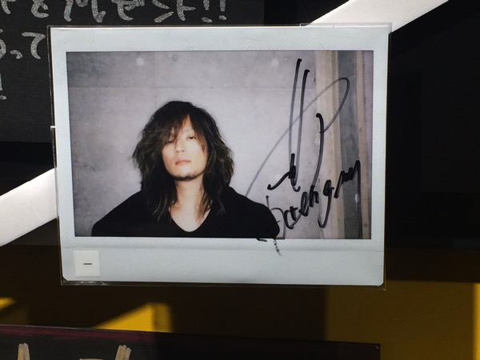
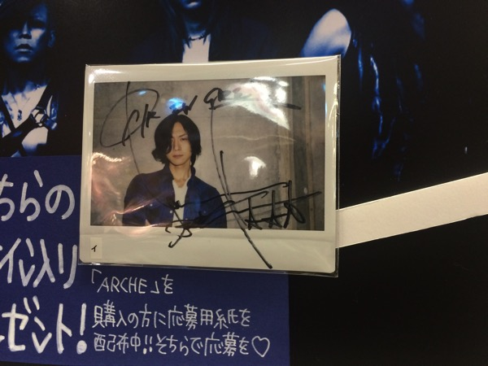
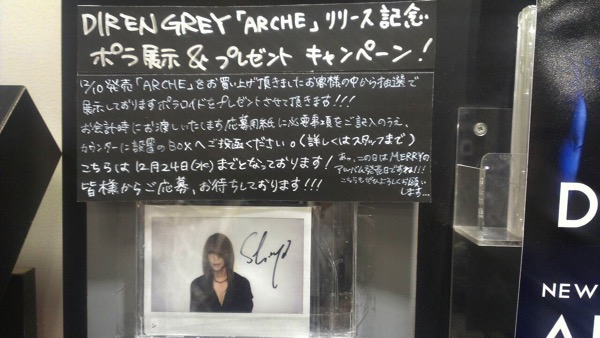
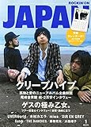

---
categories:
- 解釈・感想・解説
date: Fri, 12 Dec 2014 14:44:47 +0000
slug: post-6711
tags:
- DIR EN GREY
- DIR EN GREYまとめ
title: DIR EN GREY「ARCHE」まとめ（プロモ、メディア情報、そして感想）#DIR_ARCHE
---

ついに発売しましたDIR EN GREY　ニューアルバム「ARCHE」
3月9日に武道館にて発表されて以来、実に半年以上の時間が過ぎました。ついにベールを脱いだ「新しい」DIR EN GREYの全容をまとめてみました。
ちなみに収録曲解説は<a href="https://www.warawareotoko.com/2014/12/23/post-6784/">こちら</a>
<!--more-->ハローしんぺー(<a href="https://twitter.com/s_s_p_y" target="_blank" rel="noopener noreferrer">@s_s_p_y</a> )です。
オフィより詳しくて、wikiよりも有用なsukekiyo情報サイト「Gadget Zombie Parasite(ガジェットゾンビィパラサイト)」へようこそ。

<h2>「ARCHE」感想</h2>

まずは感想です。これを聞いて懐かしいと思うことは一切なかった。
どの曲も今までの、どれかの曲っぽいって感じはしなかったし、空気感も今までにない新しいものという感じがする。

ただ、DUM SPIRO SPEROみたいに暴れ、呆然とする台風のようなあらあらしさよりも、上品かつ吟味して、味わう感じかなと思う。

まだ十数回くらいしか聞けてないので、なんとも言えないけど。

あとsukekiyoっぽい曲もありつつ、確実にそっちからの影響が少なからずあると思った。

前回が重いからといって、今回が軽いのか？と聞かれると疑問しかない。
ただ、確実にここからそのままLIVEにつながる感じがする。

まだまだ、今どうのこうの断じる段階じゃないので、味わってから整理したいと思います。

<h2>「ARCHE」プロモーション</h2>

いつも通り大々的かつきめ細やかなプロモーション施策ううう！！

<h3>各店舗プレゼントポラに隠された謎</h3>
フラゲの日に各地の虜たちからポラ報告がタイムラインを流れましたが、同時に不可解な左下の文字のことも話題となりました。

(TSUTAYA　SHIBUYA)

（タワーレコード渋谷）

(タワーレコード新宿)

（HMV立川）

[table id=6 /]

<h3>店舗へのメンバー出現状況</h3>

<blockquote class="twitter-tweet" lang="ja">
ラジオ収録後たまたま渋谷を通ったら…。 Die <a href="http://t.co/sGmVK2IdSb">pic.twitter.com/sGmVK2IdSb</a>
&mdash; DIR EN GREY (@DIRENGREY_JP) <a href="https://twitter.com/DIRENGREY_JP/status/542592077540782080">2014, 12月 10</a></blockquote> 

<blockquote class="twitter-tweet" lang="ja">
【3F　J-POP】Dir en greyのギター、Dieさんにご来店いただきました！！！ありがとうご&#10;ざいます！！（さく） <a href="http://t.co/jusHl5sjid">pic.twitter.com/jusHl5sjid</a>
&mdash; タワーレコード渋谷店 (@TOWER_Shibuya) <a href="https://twitter.com/TOWER_Shibuya/status/542614193774395392">2014, 12月 10</a></blockquote> 

<blockquote class="twitter-tweet" lang="ja">
今日は薫が収録の帰りにSHIBUYA TSUTAYAさんに寄りました！&#10;2Fで展開されてるコーナーにありますので寄ってみてくださいね。高林 <a href="http://t.co/ZT21Z05hgI">pic.twitter.com/ZT21Z05hgI</a>
&mdash; DIR EN GREY (@DIRENGREY_JP) <a href="https://twitter.com/DIRENGREY_JP/status/543055274135670784">2014, 12月 11</a></blockquote> 

<h3>アドトレーラー目撃情報</h3>

渋谷と新宿を中心に日中走ってるみたいです。
発売日とその翌日20時前後に渋谷のスクランブル交差点付近に30分近くいましたが、一度も通りませんでした。

12日本日の19:00あたりに目撃情報が確認されていますので、おそらく日中から19:00くらいで終わりなんじゃないかと予想しています。

写真撮れ次第アップします。

<h3>各CM及びミュージックビデオ情報</h3>

まずは有名声優によるCMです！期間限定なのでそのうち見られなくなりまっせ！

ベジータの声で曲が全然あたまに入ってこないと話題なのがこれ
<blockquote class="twitter-tweet" lang="ja">
「はやくしろっ！！！！間にあわなくなってもしらんぞーーーっ！！！！」&#10;ベジータ様、堀川りょう様、ありがとうございます！&#10;&#10;DIR EN GREY 9th ALBUM『ARCHE』本日発売！&#10;<a href="https://t.co/xL6mETMDOw">https://t.co/xL6mETMDOw</a>&#10;&#10;マネージャーイノウエ
&mdash; DIR EN GREY (@DIRENGREY_JP) <a href="https://twitter.com/DIRENGREY_JP/status/542610416757522435">2014, 12月 10</a></blockquote> 

君はDIR EN GREYというバンドを知っているか？という問いかけがよくわからない。
<blockquote class="twitter-tweet" lang="ja">
「お手並みは拝見させていただく」&#10;赤い彗星シャア様、池田秀一様、ありがとうございます！&#10;&#10;DIR EN GREY 9th ALBUM『ARCHE』本日発売！&#10;<a href="https://t.co/xTOOvIREHO">https://t.co/xTOOvIREHO</a>&#10;&#10;ニコ生連日放送中！マネージャーイノウエ
&mdash; DIR EN GREY (@DIRENGREY_JP) <a href="https://twitter.com/DIRENGREY_JP/status/542610794727219200">2014, 12月 10</a></blockquote> 

やっぱこの人しっくりくるなー<a href="https://www.warawareotoko.com/2014/12/10/post-6695/">チャットルームに入れない時</a>にこの人の声で「帰れ」と言われた気がしました。
<blockquote class="twitter-tweet" lang="ja">
「乗るなら早くしろ、でなければ帰れ」&#10;碇ゲンドウ様、立木文彦様、ありがとうございます！&#10;&#10;DIR EN GREY 9th ALBUM『ARCHE』本日発売！&#10;<a href="https://t.co/TZTiv8IAcd">https://t.co/TZTiv8IAcd</a>&#10;&#10;3連打sorry！マネージャーイノウエ
&mdash; DIR EN GREY (@DIRENGREY_JP) <a href="https://twitter.com/DIRENGREY_JP/status/542611077335228417">2014, 12月 10</a></blockquote> 

そして、超やばい映像がこれ。本来であれば映像として表現なんかしちゃいけないようなものを、あえて。。といういつも通りのアプローチというのも、手がけたのが近藤廣行監督。恐らく今回はかなり気合が入ってたんじゃないかと思う。DUM SPIRO SPEROの武道館公演で途中リタイヤして、そこで表現できなかったもの、そして彼自身の痛み、彼が持つ問題意識、そんなものが叩きつけられるように表現されている。

<blockquote class="twitter-tweet" lang="ja">
「朔」「鼓動」の続編で、大げさに言うと10年かけて作ったMV。&#10;私なりに楽曲の狂気と「痛み」「根源」を表現しました。&#10;通して主演は五十嵐優次郎君。&#10;今回彼に久しぶりに会い（あああこんなに立派に育って！）と思わず目が潤みました。&#10;<a href="http://t.co/fx4TcA7ZFk">http://t.co/fx4TcA7ZFk</a>
&mdash; 近藤廣行＠ギ装置 (@VThiroyukikondo) <a href="https://twitter.com/VThiroyukikondo/status/542608241771823105">2014, 12月 10</a></blockquote> 

<h2>メディア情報</h2>

FM　FUJI「Slash&Burn」
FM AICHI「A-1 COUNTDOWN」
それと各ニコ生放送

などなど今週のメディア情報一切チェックしませんでした！追加情報が得られれば追記しまっす。

<h3>雑誌掲載情報</h3>

アルバム発売前に発売したインタビューです。全曲紹介が掲載されていて、皆んなこの記事を元にセトリを予想しました。

<a href="http://www.amazon.co.jp/exec/obidos/ASIN/B00P0OONIQ/warawareotoko-22/ref=nosim/" rel="nofollow noopener noreferrer" target="_blank">CD & DLでーた 2014年 12月号 [雑誌]</a>
posted with <a href="http://kaereba.com" rel="nofollow noopener noreferrer" target="_blank">カエレバ</a>

 KADOKAWA/エンターブレイン 2014-11-14    

<a href="http://www.amazon.co.jp/gp/search?keywords=CD%82%A0%82%F1%82%C7%83_%83E%83%93%83%8D%81%5B%83h&__mk_ja_JP=%83J%83%5E%83J%83i&tag=warawareotoko-22" rel="nofollow noopener noreferrer" target="_blank" title="アマゾン">Amazon</a>

<a href="http://hb.afl.rakuten.co.jp/hgc/0f6e221b.2eb9748a.0f6e221c.35cc1e84/?pc=http%3A%2F%2Fsearch.rakuten.co.jp%2Fsearch%2Fmall%2FCD%25E3%2581%2582%25E3%2582%2593%25E3%2581%25A9%25E3%2583%2580%25E3%2582%25A6%25E3%2583%25B3%25E3%2583%25AD%25E3%2583%25BC%25E3%2583%2589%2F-%2Ff.1-p.1-s.1-sf.0-st.A-v.2%3Fx%3D0%26scid%3Daf_ich_link_urltxt%26m%3Dhttp%3A%2F%2Fm.rakuten.co.jp%2F" rel="nofollow noopener noreferrer" target="_blank" title="楽天市場">楽天市場</a>

<a href="http://ck.jp.ap.valuecommerce.com/servlet/referral?sid=3041033&pid=882528283&vc_url=http%3A%2F%2Fshopping.search.yahoo.co.jp%2Fsearch%3FuIv%3Don%26ei%3DUTF-8%26tab_ex%3Dcommerce%26slider%3D0%26va%3DCD%25E3%2581%2582%25E3%2582%2593%25E3%2581%25A9%25E3%2583%2580%25E3%2582%25A6%25E3%2583%25B3%25E3%2583%25AD%25E3%2583%25BC%25E3%2583%2589" rel="nofollow noopener noreferrer" target="_blank" title="Yahooショッピング">Yahooショッピング</a>

<a href="http://ck.jp.ap.valuecommerce.com/servlet/referral?sid=3041033&pid=882528283&vc_url=http%3A%2F%2Fauctions.search.yahoo.co.jp%2Fsearch%3Fvo%3D%26ve%3D%26auccat%3D0%26aucminprice%3D%26aucmaxprice%3D%26aucmin_bidorbuy_price%3D%26aucmax_bidorbuy_price%3D%26loc_cd%3D0%26abatch%3D0%26istatus%3D0%26filtered%3D1%26ei%3DUTF-8%26tab_ex%3Dcommerce%26va%3DCD%25E3%2581%2582%25E3%2582%2593%25E3%2581%25A9%25E3%2583%2580%25E3%2582%25A6%25E3%2583%25B3%25E3%2583%25AD%25E3%2583%25BC%25E3%2583%2589" rel="nofollow noopener noreferrer" target="_blank" title="ヤフオク!">ヤフオク!</a>

Toshiyaの筋肉がやばい。10ページ。うちインタビューは5ページ

<a href="http://www.amazon.co.jp/exec/obidos/ASIN/B0006ZPS8S/warawareotoko-22/ref=nosim/" rel="nofollow noopener noreferrer" target="_blank">ROCKIN'ON JAPAN (ロッキング・オン・ジャパン) 2015年 01月号 [雑誌]</a>
posted with <a href="http://kaereba.com" rel="nofollow noopener noreferrer" target="_blank">カエレバ</a>

 ロッキング オン 2014-11-29    

<a href="http://www.amazon.co.jp/gp/search?keywords=rockin%20japan&__mk_ja_JP=%83J%83%5E%83J%83i&tag=warawareotoko-22" rel="nofollow noopener noreferrer" target="_blank" title="アマゾン">Amazon</a>

<a href="http://hb.afl.rakuten.co.jp/hgc/0f6e221b.2eb9748a.0f6e221c.35cc1e84/?pc=http%3A%2F%2Fsearch.rakuten.co.jp%2Fsearch%2Fmall%2Frockin%2520japan%2F-%2Ff.1-p.1-s.1-sf.0-st.A-v.2%3Fx%3D0%26scid%3Daf_ich_link_urltxt%26m%3Dhttp%3A%2F%2Fm.rakuten.co.jp%2F" rel="nofollow noopener noreferrer" target="_blank" title="楽天市場">楽天市場</a>

<a href="http://ck.jp.ap.valuecommerce.com/servlet/referral?sid=3041033&pid=882528283&vc_url=http%3A%2F%2Fshopping.search.yahoo.co.jp%2Fsearch%3FuIv%3Don%26ei%3DUTF-8%26tab_ex%3Dcommerce%26slider%3D0%26va%3Drockin%2520japan" rel="nofollow noopener noreferrer" target="_blank" title="Yahooショッピング">Yahooショッピング</a>

<a href="http://ck.jp.ap.valuecommerce.com/servlet/referral?sid=3041033&pid=882528283&vc_url=http%3A%2F%2Fauctions.search.yahoo.co.jp%2Fsearch%3Fvo%3D%26ve%3D%26auccat%3D0%26aucminprice%3D%26aucmaxprice%3D%26aucmin_bidorbuy_price%3D%26aucmax_bidorbuy_price%3D%26loc_cd%3D0%26abatch%3D0%26istatus%3D0%26filtered%3D1%26ei%3DUTF-8%26tab_ex%3Dcommerce%26va%3Drockin%2520japan" rel="nofollow noopener noreferrer" target="_blank" title="ヤフオク!">ヤフオク!</a>

<a href="http://www.amazon.co.jp/exec/obidos/ASIN/4401640993/warawareotoko-22/ref=nosim/" rel="nofollow noopener noreferrer" target="_blank">MASSIVE (マッシヴ) Vol.17 (シンコー・ミュージックMOOK)</a>
posted with <a href="http://kaereba.com" rel="nofollow noopener noreferrer" target="_blank">カエレバ</a>

 シンコーミュージック 2014-12-11    

<a href="http://www.amazon.co.jp/gp/search?keywords=massive&__mk_ja_JP=%83J%83%5E%83J%83i&tag=warawareotoko-22" rel="nofollow noopener noreferrer" target="_blank" title="アマゾン">Amazon</a>

<a href="http://hb.afl.rakuten.co.jp/hgc/0f6e221b.2eb9748a.0f6e221c.35cc1e84/?pc=http%3A%2F%2Fsearch.rakuten.co.jp%2Fsearch%2Fmall%2Fmassive%2F-%2Ff.1-p.1-s.1-sf.0-st.A-v.2%3Fx%3D0%26scid%3Daf_ich_link_urltxt%26m%3Dhttp%3A%2F%2Fm.rakuten.co.jp%2F" rel="nofollow noopener noreferrer" target="_blank" title="楽天市場">楽天市場</a>

<a href="http://ck.jp.ap.valuecommerce.com/servlet/referral?sid=3041033&pid=882528283&vc_url=http%3A%2F%2Fshopping.search.yahoo.co.jp%2Fsearch%3FuIv%3Don%26ei%3DUTF-8%26tab_ex%3Dcommerce%26slider%3D0%26va%3Dmassive" rel="nofollow noopener noreferrer" target="_blank" title="Yahooショッピング">Yahooショッピング</a>

<a href="http://ck.jp.ap.valuecommerce.com/servlet/referral?sid=3041033&pid=882528283&vc_url=http%3A%2F%2Fauctions.search.yahoo.co.jp%2Fsearch%3Fvo%3D%26ve%3D%26auccat%3D0%26aucminprice%3D%26aucmaxprice%3D%26aucmin_bidorbuy_price%3D%26aucmax_bidorbuy_price%3D%26loc_cd%3D0%26abatch%3D0%26istatus%3D0%26filtered%3D1%26ei%3DUTF-8%26tab_ex%3Dcommerce%26va%3Dmassive" rel="nofollow noopener noreferrer" target="_blank" title="ヤフオク!">ヤフオク!</a>

薫の読弦が可愛いw

<a href="http://www.amazon.co.jp/exec/obidos/ASIN/B00PYQ60OA/warawareotoko-22/ref=nosim/" rel="nofollow noopener noreferrer" target="_blank">音楽と人 2015年 01月号 [雑誌]</a>
posted with <a href="http://kaereba.com" rel="nofollow noopener noreferrer" target="_blank">カエレバ</a>

 音楽と人 2014-12-05    

<a href="http://www.amazon.co.jp/gp/search?keywords=%89%B9%8Ay%82%C6%90l&__mk_ja_JP=%83J%83%5E%83J%83i&tag=warawareotoko-22" rel="nofollow noopener noreferrer" target="_blank" title="アマゾン">Amazon</a>

<a href="http://hb.afl.rakuten.co.jp/hgc/0f6e221b.2eb9748a.0f6e221c.35cc1e84/?pc=http%3A%2F%2Fsearch.rakuten.co.jp%2Fsearch%2Fmall%2F%25E9%259F%25B3%25E6%25A5%25BD%25E3%2581%25A8%25E4%25BA%25BA%2F-%2Ff.1-p.1-s.1-sf.0-st.A-v.2%3Fx%3D0%26scid%3Daf_ich_link_urltxt%26m%3Dhttp%3A%2F%2Fm.rakuten.co.jp%2F" rel="nofollow noopener noreferrer" target="_blank" title="楽天市場">楽天市場</a>

<a href="http://ck.jp.ap.valuecommerce.com/servlet/referral?sid=3041033&pid=882528283&vc_url=http%3A%2F%2Fshopping.search.yahoo.co.jp%2Fsearch%3FuIv%3Don%26ei%3DUTF-8%26tab_ex%3Dcommerce%26slider%3D0%26va%3D%25E9%259F%25B3%25E6%25A5%25BD%25E3%2581%25A8%25E4%25BA%25BA" rel="nofollow noopener noreferrer" target="_blank" title="Yahooショッピング">Yahooショッピング</a>

<a href="http://ck.jp.ap.valuecommerce.com/servlet/referral?sid=3041033&pid=882528283&vc_url=http%3A%2F%2Fauctions.search.yahoo.co.jp%2Fsearch%3Fvo%3D%26ve%3D%26auccat%3D0%26aucminprice%3D%26aucmaxprice%3D%26aucmin_bidorbuy_price%3D%26aucmax_bidorbuy_price%3D%26loc_cd%3D0%26abatch%3D0%26istatus%3D0%26filtered%3D1%26ei%3DUTF-8%26tab_ex%3Dcommerce%26va%3D%25E9%259F%25B3%25E6%25A5%25BD%25E3%2581%25A8%25E4%25BA%25BA" rel="nofollow noopener noreferrer" target="_blank" title="ヤフオク!">ヤフオク!</a>

<h2>DIR EN GREY「ARCHE」まとめ</h2>

<h3>各仕様解説</h3>
ARCHE(完全生産限定盤)(Blu-ray Disc付)or(DVD付き）

DISC1収録曲
01. Un deux
02. 咀嚼
03. 鱗
04. Phenomenon
05. Cause of fickleness
06. 濤声
07. 輪郭
08. Chain repulsion
09. Midwife
10. 禍夜想
11. 懐春
12. Behind a vacant image
13. Sustain the untruth
14. 空谷の跫音
15. The inferno
16. Revelation of mankind
 

DISC2には以下7曲を収録
01. and Zero
02. てふてふ
03. Sustain the untruth [REMIX]
04. Unraveling [REMIX]
05. 咀嚼 (Acoustic Ver.)
06. 鱗 (Crossover Ver.)
07. Behind a vacant image (Acoustic Ver.)

さらに付属の映像ディスクに以下を収録
・Un deux (Shot In One Take)
・Chain repulsion (Shot In One Take)
TOUR14 PSYCHONNECT -mode of “GAUZE”?-
2014.08.30 SHINKIBA STUDIO COAST (追加公演)
・かすみ
・蜜と唾
・激しさと、この胸の中で絡み付いた灼熱の闇
・BEHIND THE SCENES OF ARCHE

<a href="http://www.amazon.co.jp/exec/obidos/ASIN/B00N81CF06/warawareotoko-22/ref=nosim/" rel="nofollow noopener noreferrer" target="_blank">ARCHE(完全生産限定盤)(Blu-ray Disc付)</a>
posted with <a href="http://kaereba.com" rel="nofollow noopener noreferrer" target="_blank">カエレバ</a>

DIR EN GREY SMD itaku (music) 2014-12-10    

<a href="http://www.amazon.co.jp/gp/search?keywords=ARCHE&__mk_ja_JP=%83J%83%5E%83J%83i&tag=warawareotoko-22" rel="nofollow noopener noreferrer" target="_blank" title="アマゾン">Amazon</a>

<a href="http://hb.afl.rakuten.co.jp/hgc/0f6e221b.2eb9748a.0f6e221c.35cc1e84/?pc=http%3A%2F%2Fsearch.rakuten.co.jp%2Fsearch%2Fmall%2FARCHE%2F-%2Ff.1-p.1-s.1-sf.0-st.A-v.2%3Fx%3D0%26scid%3Daf_ich_link_urltxt%26m%3Dhttp%3A%2F%2Fm.rakuten.co.jp%2F" rel="nofollow noopener noreferrer" target="_blank" title="楽天市場">楽天市場</a>

<a href="http://ck.jp.ap.valuecommerce.com/servlet/referral?sid=3041033&pid=882528283&vc_url=http%3A%2F%2Fshopping.search.yahoo.co.jp%2Fsearch%3FuIv%3Don%26ei%3DUTF-8%26tab_ex%3Dcommerce%26slider%3D0%26va%3DARCHE" rel="nofollow noopener noreferrer" target="_blank" title="Yahooショッピング">Yahooショッピング</a>

<a href="http://ck.jp.ap.valuecommerce.com/servlet/referral?sid=3041033&pid=882528283&vc_url=http%3A%2F%2Fauctions.search.yahoo.co.jp%2Fsearch%3Fvo%3D%26ve%3D%26auccat%3D0%26aucminprice%3D%26aucmaxprice%3D%26aucmin_bidorbuy_price%3D%26aucmax_bidorbuy_price%3D%26loc_cd%3D0%26abatch%3D0%26istatus%3D0%26filtered%3D1%26ei%3DUTF-8%26tab_ex%3Dcommerce%26va%3DARCHE" rel="nofollow noopener noreferrer" target="_blank" title="ヤフオク!">ヤフオク!</a>

ARCHE(初回生産限定盤)
DISC2には3曲収録
01. Sustain the untruth [REMIX]
02. 咀嚼 (Acoustic Ver.)
03. 鱗 (Crossover Ver.)

<a href="http://www.amazon.co.jp/exec/obidos/ASIN/B00N81CGKK/warawareotoko-22/ref=nosim/" rel="nofollow noopener noreferrer" target="_blank">ARCHE(初回生産限定盤)</a>
posted with <a href="http://kaereba.com" rel="nofollow noopener noreferrer" target="_blank">カエレバ</a>

DIR EN GREY SMD itaku (music) 2014-12-10    

<a href="http://www.amazon.co.jp/gp/search?keywords=ARCHE&__mk_ja_JP=%83J%83%5E%83J%83i&tag=warawareotoko-22" rel="nofollow noopener noreferrer" target="_blank" title="アマゾン">Amazon</a>

<a href="http://hb.afl.rakuten.co.jp/hgc/0f6e221b.2eb9748a.0f6e221c.35cc1e84/?pc=http%3A%2F%2Fsearch.rakuten.co.jp%2Fsearch%2Fmall%2FARCHE%2F-%2Ff.1-p.1-s.1-sf.0-st.A-v.2%3Fx%3D0%26scid%3Daf_ich_link_urltxt%26m%3Dhttp%3A%2F%2Fm.rakuten.co.jp%2F" rel="nofollow noopener noreferrer" target="_blank" title="楽天市場">楽天市場</a>

<a href="http://ck.jp.ap.valuecommerce.com/servlet/referral?sid=3041033&pid=882528283&vc_url=http%3A%2F%2Fshopping.search.yahoo.co.jp%2Fsearch%3FuIv%3Don%26ei%3DUTF-8%26tab_ex%3Dcommerce%26slider%3D0%26va%3DARCHE" rel="nofollow noopener noreferrer" target="_blank" title="Yahooショッピング">Yahooショッピング</a>

<a href="http://ck.jp.ap.valuecommerce.com/servlet/referral?sid=3041033&pid=882528283&vc_url=http%3A%2F%2Fauctions.search.yahoo.co.jp%2Fsearch%3Fvo%3D%26ve%3D%26auccat%3D0%26aucminprice%3D%26aucmaxprice%3D%26aucmin_bidorbuy_price%3D%26aucmax_bidorbuy_price%3D%26loc_cd%3D0%26abatch%3D0%26istatus%3D0%26filtered%3D1%26ei%3DUTF-8%26tab_ex%3Dcommerce%26va%3DARCHE" rel="nofollow noopener noreferrer" target="_blank" title="ヤフオク!">ヤフオク!</a>

ARCHE（通常版）

<a href="http://www.amazon.co.jp/exec/obidos/ASIN/B00N81CGM8/warawareotoko-22/ref=nosim/" rel="nofollow noopener noreferrer" target="_blank">ARCHE</a>
posted with <a href="http://kaereba.com" rel="nofollow noopener noreferrer" target="_blank">カエレバ</a>

DIR EN GREY SMD itaku (music) 2014-12-10    

<a href="http://www.amazon.co.jp/gp/search?keywords=ARCHE&__mk_ja_JP=%83J%83%5E%83J%83i&tag=warawareotoko-22" rel="nofollow noopener noreferrer" target="_blank" title="アマゾン">Amazon</a>

<a href="http://hb.afl.rakuten.co.jp/hgc/0f6e221b.2eb9748a.0f6e221c.35cc1e84/?pc=http%3A%2F%2Fsearch.rakuten.co.jp%2Fsearch%2Fmall%2FARCHE%2F-%2Ff.1-p.1-s.1-sf.0-st.A-v.2%3Fx%3D0%26scid%3Daf_ich_link_urltxt%26m%3Dhttp%3A%2F%2Fm.rakuten.co.jp%2F" rel="nofollow noopener noreferrer" target="_blank" title="楽天市場">楽天市場</a>

<a href="http://ck.jp.ap.valuecommerce.com/servlet/referral?sid=3041033&pid=882528283&vc_url=http%3A%2F%2Fshopping.search.yahoo.co.jp%2Fsearch%3FuIv%3Don%26ei%3DUTF-8%26tab_ex%3Dcommerce%26slider%3D0%26va%3DARCHE" rel="nofollow noopener noreferrer" target="_blank" title="Yahooショッピング">Yahooショッピング</a>

<a href="http://ck.jp.ap.valuecommerce.com/servlet/referral?sid=3041033&pid=882528283&vc_url=http%3A%2F%2Fauctions.search.yahoo.co.jp%2Fsearch%3Fvo%3D%26ve%3D%26auccat%3D0%26aucminprice%3D%26aucmaxprice%3D%26aucmin_bidorbuy_price%3D%26aucmax_bidorbuy_price%3D%26loc_cd%3D0%26abatch%3D0%26istatus%3D0%26filtered%3D1%26ei%3DUTF-8%26tab_ex%3Dcommerce%26va%3DARCHE" rel="nofollow noopener noreferrer" target="_blank" title="ヤフオク!">ヤフオク!</a>

<h3>各曲歌詞と解釈</h3>

<a style="color:#0070C5;" href="https://www.warawareotoko.com/2014/12/23/post-6784/" target="_blank" rel="noopener noreferrer">DIR EN GREY「ARCHE」全曲完全解説 #DIR_ARCHE | Gadget Zombie Parasite</a>  

<h2>TOUR15 THE UNSTOPPABLE LIFE</h2>

[table id=7 /]

a knot先行
受付期間　2014/12/10(水)～2015/1/12(月・祝)
スタンディング・指定席　6,000円
Exclusive Ticket　  11,000円

DIR EN GREY ONLINE先行
2014/12/22(月)～2015/1/20(火)
スタンディング・指定席　6,000円

座席ありのホールが多めですね。今行われているツアーで回っていないところでもやるみたいです。

<h2>しんぺーはこう思った。</h2>

DUM SPIRO SPEROの時もそうだったけど、まだまだこの段階じゃ何もわからない。

DIR EN GREYとはそういうバンドです。

発売した音源がLIVEを通して昇華され、知り尽くしていたと思っていた曲が全く違う感情を掘り起こして衝撃を与えてくれる。

多分、今から1年後、ステージで演奏されるARCHEはまた違った顔を見せていると思う。
生まれたばかりのこの怪物がどう進化していくのか、楽しみでしかたがない。

2015年もDIR EN GREYにふりまわされる年になるだろう。
と言ったところで本日は以上になります。おやすみなさい。