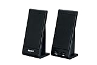
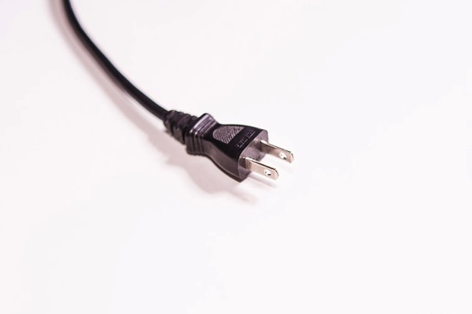
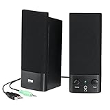
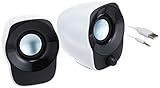

---
categories:
- レビュー
date: Sun, 21 Dec 2014 03:15:23 +0000
slug: post-6773
tags:
- おすすめガジェット
title: Amazonで300円くらいで買ったUSBスピーカーがいい感じ
---

毎朝、TVはMacBook Airで見ています。やじうま•••じゃなかった。グッドモーニングで依田さんのお天気コーナーあたりしか見ないんですが、Mac Book Airの音量がかなり貧弱でテレビ以外の音が鳴ってるとそこそこ聞き取りづらいので困っておりました。そこでPC用のスピーカーを探してたのですが、いいのがありましたのでご紹介。<!--more-->ハローしんぺー(<a href="https://twitter.com/s_s_p_y" target="_blank" rel="noopener">@s_s_p_y</a> )です。
オフィより詳しくて、wikiよりも有用なsukekiyo情報サイト「Gadget Zombie Parasite(ガジェットゾンビィパラサイト)」へようこそ。

こいつです。

<a href="http://www.amazon.co.jp/exec/obidos/ASIN/B0017U7U96/warawareotoko-22/ref=nosim/" target="_blank" rel="nofollow noopener">iBUFFALO スピーカー USB接続 コンセント不要 1W ブラック BSSP01UBK</a>

posted with <a href="http://kaereba.com" target="_blank" rel="nofollow noopener">カエレバ</a>

バッファロー 2008-04-25

<a title="アマゾン" href="http://www.amazon.co.jp/gp/search?keywords=BSSP01UBK&amp;__mk_ja_JP=%83J%83%5E%83J%83i&amp;tag=warawareotoko-22" target="_blank" rel="nofollow noopener">Amazon</a>

<a title="楽天市場" href="http://hb.afl.rakuten.co.jp/hgc/0f6e221b.2eb9748a.0f6e221c.35cc1e84/?pc=http%3A%2F%2Fsearch.rakuten.co.jp%2Fsearch%2Fmall%2FBSSP01UBK%2F-%2Ff.1-p.1-s.1-sf.0-st.A-v.2%3Fx%3D0%26scid%3Daf_ich_link_urltxt%26m%3Dhttp%3A%2F%2Fm.rakuten.co.jp%2F" target="_blank" rel="nofollow noopener">楽天市場</a>

<a title="ヤフオク!" href="http://ck.jp.ap.valuecommerce.com/servlet/referral?sid=3041033&amp;pid=882528283&amp;vc_url=http%3A%2F%2Fauctions.search.yahoo.co.jp%2Fsearch%3Fvo%3D%26ve%3D%26auccat%3D0%26aucminprice%3D%26aucmaxprice%3D%26aucmin_bidorbuy_price%3D%26aucmax_bidorbuy_price%3D%26loc_cd%3D0%26abatch%3D0%26istatus%3D0%26filtered%3D1%26ei%3DUTF-8%26tab_ex%3Dcommerce%26va%3DBSSP01UBK" target="_blank" rel="nofollow noopener">ヤフオク!</a>

いいところ
<ul>
 	<li>安すぎる！！！！記事公開時点で364円（Amazon）</li>
 	<li>コンセントからの電源供給不要</li>
 	<li>音量アップ！！</li>
</ul>
<h2>安すぎる！！！！記事公開時点で364円（Amazon）</h2>

まずは安さに関してですが、Amazon価格で364円
信じられますか？ちゃんとしたスピーカーなのにこんなに安いとか

ただし、やはり安いからでしょうか。Amazonからしてみたら、送料の方が高くなっちゃいますので他の商品との「合わせ買い対象商品」となっております。
<blockquote>あわせ買い対象商品は、Amazonギフト券を除くAmazon.co.jp が発送する商品と組み合わせて、合計額が2,500円（税込）以上の場合にご購入いただけます。あわせ買い対象商品の単品でのご注文は承っておりません。

<a href="http://www.amazon.co.jp/gp/help/customer/display.html?pop-up=1&amp;nodeId=200953240">Amazon</a></blockquote>
要はこのスピーカーを注文するなら合計で2,500円以上買い物してねってことです。

なので、他に必要なものがあるときに合わせて買っちゃいましょう。
<h2>コンセントからの電源供給不要</h2>

普通のPC用スピーカーっていいやつだとコンセントささなきゃダメなんですけど、これだとUSBからの電源供給で稼働してくれます。

ノートPCとかMac Book Airだと色々な場所にもっていけるので、場合によってはコンセントが遠いなんてこともあると思いますので、これはかなり助かります。
<h2>音量アップ！！</h2>

で肝心の性能ですが、普通に音量がアップしました。ウーハーとかないので音楽とかをちゃんと聞きたいって用途には向かないと思いますが、Youtube、hule、テレビなんかを見るってだけならこれで十分です。
<h2>しんぺーはこう思った。</h2>
ノートPCで音楽を聴いてるとかなり貧弱な音質になります。
ただでさえ、iTunesなんかに取り込むときにデータを圧縮しているのに、さらにスピーカーが貧弱なためにかなり制作者の意図と全く違った聞こえ方をしています。

スピーカーとか音質はこだわりだしたらきりがないらしいです。（それこそ音響を考えて部屋の改築や、電源供給を考慮して工事とかw）

が！これくらいの投資はしても全然損じゃないと思います！

多分PCスピーカーを使ったことがない人は驚くと思います。

<a href="http://www.amazon.co.jp/exec/obidos/ASIN/B0017U7U96/warawareotoko-22/ref=nosim/" target="_blank" rel="nofollow noopener">iBUFFALO スピーカー USB接続 コンセント不要 1W ブラック BSSP01UBK</a>

posted with <a href="http://kaereba.com" target="_blank" rel="nofollow noopener">カエレバ</a>

バッファロー 2008-04-25

<a title="アマゾン" href="http://www.amazon.co.jp/gp/search?keywords=BSSP01UBK&amp;__mk_ja_JP=%83J%83%5E%83J%83i&amp;tag=warawareotoko-22" target="_blank" rel="nofollow noopener">Amazon</a>

<a title="楽天市場" href="http://hb.afl.rakuten.co.jp/hgc/0f6e221b.2eb9748a.0f6e221c.35cc1e84/?pc=http%3A%2F%2Fsearch.rakuten.co.jp%2Fsearch%2Fmall%2FBSSP01UBK%2F-%2Ff.1-p.1-s.1-sf.0-st.A-v.2%3Fx%3D0%26scid%3Daf_ich_link_urltxt%26m%3Dhttp%3A%2F%2Fm.rakuten.co.jp%2F" target="_blank" rel="nofollow noopener">楽天市場</a>

<a title="ヤフオク!" href="http://ck.jp.ap.valuecommerce.com/servlet/referral?sid=3041033&amp;pid=882528283&amp;vc_url=http%3A%2F%2Fauctions.search.yahoo.co.jp%2Fsearch%3Fvo%3D%26ve%3D%26auccat%3D0%26aucminprice%3D%26aucmaxprice%3D%26aucmin_bidorbuy_price%3D%26aucmax_bidorbuy_price%3D%26loc_cd%3D0%26abatch%3D0%26istatus%3D0%26filtered%3D1%26ei%3DUTF-8%26tab_ex%3Dcommerce%26va%3DBSSP01UBK" target="_blank" rel="nofollow noopener">ヤフオク!</a>

他にはこの辺も安い

<a href="http://www.amazon.co.jp/exec/obidos/ASIN/B0064EN9QS/warawareotoko-22/ref=nosim/" target="_blank" rel="nofollow noopener">サンワサプライ USB電源マルチメディアスピーカー MM-SPL2NU</a>

posted with <a href="http://kaereba.com" target="_blank" rel="nofollow noopener">カエレバ</a>

サンワサプライ

<a title="アマゾン" href="http://www.amazon.co.jp/gp/search?keywords=MM-SPL2NU&amp;__mk_ja_JP=%83J%83%5E%83J%83i&amp;tag=warawareotoko-22" target="_blank" rel="nofollow noopener">Amazon</a>

<a title="楽天市場" href="http://hb.afl.rakuten.co.jp/hgc/0f6e221b.2eb9748a.0f6e221c.35cc1e84/?pc=http%3A%2F%2Fsearch.rakuten.co.jp%2Fsearch%2Fmall%2FMM-SPL2NU%2F-%2Ff.1-p.1-s.1-sf.0-st.A-v.2%3Fx%3D0%26scid%3Daf_ich_link_urltxt%26m%3Dhttp%3A%2F%2Fm.rakuten.co.jp%2F" target="_blank" rel="nofollow noopener">楽天市場</a>

<a title="ヤフオク!" href="http://ck.jp.ap.valuecommerce.com/servlet/referral?sid=3041033&amp;pid=882528283&amp;vc_url=http%3A%2F%2Fauctions.search.yahoo.co.jp%2Fsearch%3Fvo%3D%26ve%3D%26auccat%3D0%26aucminprice%3D%26aucmaxprice%3D%26aucmin_bidorbuy_price%3D%26aucmax_bidorbuy_price%3D%26loc_cd%3D0%26abatch%3D0%26istatus%3D0%26filtered%3D1%26ei%3DUTF-8%26tab_ex%3Dcommerce%26va%3DMM-SPL2NU" target="_blank" rel="nofollow noopener">ヤフオク!</a>

<a href="http://www.amazon.co.jp/exec/obidos/ASIN/B0053N3NVW/warawareotoko-22/ref=nosim/" target="_blank" rel="nofollow noopener">LOGICOOL ステレオスピーカー Z120BW</a>

posted with <a href="http://kaereba.com" target="_blank" rel="nofollow noopener">カエレバ</a>

ロジクール 2011-06-24

<a title="アマゾン" href="http://www.amazon.co.jp/gp/search?keywords=Z120BW&amp;__mk_ja_JP=%83J%83%5E%83J%83i&amp;tag=warawareotoko-22" target="_blank" rel="nofollow noopener">Amazon</a>

<a title="楽天市場" href="http://hb.afl.rakuten.co.jp/hgc/0f6e221b.2eb9748a.0f6e221c.35cc1e84/?pc=http%3A%2F%2Fsearch.rakuten.co.jp%2Fsearch%2Fmall%2FZ120BW%2F-%2Ff.1-p.1-s.1-sf.0-st.A-v.2%3Fx%3D0%26scid%3Daf_ich_link_urltxt%26m%3Dhttp%3A%2F%2Fm.rakuten.co.jp%2F" target="_blank" rel="nofollow noopener">楽天市場</a>

<a title="ヤフオク!" href="http://ck.jp.ap.valuecommerce.com/servlet/referral?sid=3041033&amp;pid=882528283&amp;vc_url=http%3A%2F%2Fauctions.search.yahoo.co.jp%2Fsearch%3Fvo%3D%26ve%3D%26auccat%3D0%26aucminprice%3D%26aucmaxprice%3D%26aucmin_bidorbuy_price%3D%26aucmax_bidorbuy_price%3D%26loc_cd%3D0%26abatch%3D0%26istatus%3D0%26filtered%3D1%26ei%3DUTF-8%26tab_ex%3Dcommerce%26va%3DZ120BW" target="_blank" rel="nofollow noopener">ヤフオク!</a>

と言ったところで本日は以上になります。おやすみなさい。