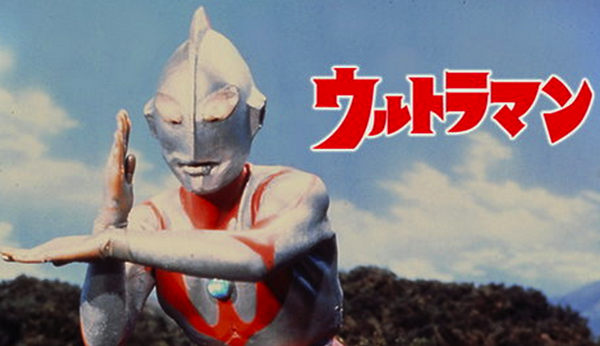
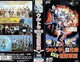

---
categories:
- 海外ドラマ
date: Wed, 24 Dec 2014 04:34:17 +0000
slug: post-6799
tags:
- Hulu
title: 【Hulu】久しぶりにウルトラマンを見て感じたこと。
---

ぼくは自営業の家庭で育ったので、両親や家族が家にいつつも遊んだりとか会話したりとか、土日にどこかにでかけたりとかってことがなく育ってきました。飲食店なのでだいたい家で夕方やら休日はずーーーーーーーーーーーーーーーーーーーーーーーーーーーーーーーーーーーーーーーーーーーーーーーーーーーーーーーーーーーーーーーーっと特撮やらアニメやらのビデオを見て育ちました。

だからこんな風になっちゃったwwww

<!--more-->

ハローしんぺー(<a href="https://twitter.com/s_s_p_y" target="_blank">@s_s_p_y</a> )です。
オフィより詳しくて、wikiよりも有用なsukekiyo情報サイト「Gadget Zombie Parasite(ガジェットゾンビィパラサイト)」へようこそ。

しかも見ていたビデオっていうのが父親が借りてきたウルトラマンとかゴジラとガメラとかっていうぼくの世代よりもずーっと上の世代の人が子供時代に見たであろうものばっかです。

初代ウルトラマンなんかで言えば1966年（昭和41年）放送開始らしいので、当時10歳以下を対象としてたとすると、1950年代後半から60年代前半世代の人たち用のものになりますわ。つまりぼくは、当時から自分が生まれる20年近く前のものを見続けていたのです。

うわ、しかも今調べてみたらどうもぼくが生まれた年代付近は「ウルトラマン」と冠した作品はどうも作られていないっぽい。隔絶された世代だったわ。

でとにかくビデオ屋の端から借りてくるので、初代ウルトラマン（玄人はマンとかって呼ぶんやで）からウルトラマンセブン、帰ってきたウルトラマン（ウルトラマンジャックな）、エースからタロウから双子から80から借りてきて、さらにはUSAとグレート借りてきて見てた。

で、そういや今日くそったれクリスマスだから思い出したけど、サンタを信じてたぼくにサンタがプレゼント持ってこなかったのな。マジ焦ったわ。

そしたら正月のある日ポストにビデオ入ってたのよ。ウルトラマンのビデオな。親がサンタさんが忘れてたみたいとか言ってたな。

そのビデオがこれ

<a href="http://www.amazon.co.jp/exec/obidos/ASIN/B00005ES1U/warawareotoko-22/ref=nosim/" rel="nofollow" target="_blank">ウルトラ6兄弟VS怪獣軍団 [VHS]</a>
posted with <a href="http://kaereba.com" rel="nofollow" target="_blank">カエレバ</a>

特撮(映像) 日本コロムビア 1993-10-21    

<a href="http://www.amazon.co.jp/gp/search?keywords=%83E%83%8B%83g%83%896%8CZ%92%EDVS%89%F6%8Fb%8CR%92c&__mk_ja_JP=%83J%83%5E%83J%83i&tag=warawareotoko-22" rel="nofollow" target="_blank" title="アマゾン" >Amazon</a>

<a href="http://hb.afl.rakuten.co.jp/hgc/0f6e221b.2eb9748a.0f6e221c.35cc1e84/?pc=http%3A%2F%2Fsearch.rakuten.co.jp%2Fsearch%2Fmall%2F%25E3%2582%25A6%25E3%2583%25AB%25E3%2583%2588%25E3%2583%25A96%25E5%2585%2584%25E5%25BC%259FVS%25E6%2580%25AA%25E7%258D%25A3%25E8%25BB%258D%25E5%259B%25A3%2F-%2Ff.1-p.1-s.1-sf.0-st.A-v.2%3Fx%3D0%26scid%3Daf_ich_link_urltxt%26m%3Dhttp%3A%2F%2Fm.rakuten.co.jp%2F" rel="nofollow" target="_blank" title="楽天市場" >楽天市場</a>

<a href="http://ck.jp.ap.valuecommerce.com/servlet/referral?sid=3041033&pid=882528283&vc_url=http%3A%2F%2Fshopping.search.yahoo.co.jp%2Fsearch%3FuIv%3Don%26ei%3DUTF-8%26tab_ex%3Dcommerce%26slider%3D0%26va%3D%25E3%2582%25A6%25E3%2583%25AB%25E3%2583%2588%25E3%2583%25A96%25E5%2585%2584%25E5%25BC%259FVS%25E6%2580%25AA%25E7%258D%25A3%25E8%25BB%258D%25E5%259B%25A3" rel="nofollow"  target="_blank" title="Yahooショッピング" >Yahooショッピング</a>

<a href="http://ck.jp.ap.valuecommerce.com/servlet/referral?sid=3041033&pid=882528283&vc_url=http%3A%2F%2Fauctions.search.yahoo.co.jp%2Fsearch%3Fvo%3D%26ve%3D%26auccat%3D0%26aucminprice%3D%26aucmaxprice%3D%26aucmin_bidorbuy_price%3D%26aucmax_bidorbuy_price%3D%26loc_cd%3D0%26abatch%3D0%26istatus%3D0%26filtered%3D1%26ei%3DUTF-8%26tab_ex%3Dcommerce%26va%3D%25E3%2582%25A6%25E3%2583%25AB%25E3%2583%2588%25E3%2583%25A96%25E5%2585%2584%25E5%25BC%259FVS%25E6%2580%25AA%25E7%258D%25A3%25E8%25BB%258D%25E5%259B%25A3" rel="nofollow"  target="_blank" title="ヤフオク!" >ヤフオク!</a>

今思うとこれ結構問題作だったらしい。ハヌマーンになった少年が泥棒に復讐して殺したり、怪獣をウルトラ兄弟とハヌマーンでリンチしたりとかwww

でもそこそこおもしろかったけどね

<a style="color:#0070C5;" href="http://dic.nicovideo.jp/a/%E3%83%8F%E3%83%8C%E3%83%9E%E3%83%BC%E3%83%B3" target="_blank">ハヌマーンとは (ハヌマーンとは) [単語記事] - ニコニコ大百科</a>  

で、話が逸れましたが、Huluで昨日ウルトラマンが配信されてるのを発見したわけです！で1話と2話を見てちょっと思ったよりも、、、いや、当時憧れていたままのクオリティがそこにあったので、これを機会に全部見よう！と思って、なおかつ年末年始はHuluでなんかみようぜ〜っていうご紹介です。本日は、はい。

<h2>ウルトラマンのここがすごい</h2>

ウルトラマンに変身するハヤタ隊員ですが、ぼくの従兄に顔が似てます。

あと若かりし頃の毒蝮三太夫が毒舌なしで出てます。

あと女優さんが美人です。

それと最初の怪獣ベムラーを倒すための科学特捜隊の作戦が結構ちゃんとしてた。
海底からの攻撃に加え、空中からの攻撃とでもすぐやられるんだけどな。どう考えても数十億レベルする戦闘機と潜水艦を両方壊しても、「わはは」とか笑って現れるハヤタ隊員まじイケメン。

あと2話目にウルトラマンと言ったらこいつというくらい有名な宇宙忍者バルタン星人が実は結構かわいそうだった件。
こいつら宇宙旅行中に、故郷の星でいかれた科学者（当然バルタン星人）が核実験して滅んだから帰る場所ないので地球に住まわせてほしい。っていうわけ

最初は地球防衛軍の幹部たちはいやいやマジアリッティだから、そく核ミサイルだからって言ってたんだけど、科学特捜隊の隊長が「話し合おう」とか言い出すわけ。おお、まじかwwwこいつ
で話あいに、メンバー1のお調子者のイデ隊員が「ぼくは宇宙語できる」とかって言って乗り込むんですが、あ、この時「ぼくはかなりの宇宙語きち◯い」とか普通にいっちゃってるので時代を感じます。

で、話あいの末、ハヤタ隊員がじゃー地球の法律や風土に順応するってんなら共存しようずって提案するんだけど、時にきみらは何人いるの？ってきくと20億3000万人でっす！でイデ隊員が「地球の人口も20億人ですけどおおおお」みたいに返すんだけど、えええええ地球の人口が20億人！！！今現在70億人以上wwww人類繁栄しすぎwww

で、最後バルタン星人やっつけるんですけど、最後彼らの宇宙船をウルトラマンがどっか宇宙に運んで行って、夕日をバッグに爆発音だけがなるっていう演出。

地球の平和を守るためにウルトラマンは難民ともいうべきバルタン星人をジェノサイドしたのか・・・どうなのか・・・

いろいろと考えさせられる

<h2>しんぺーはこう思った。</h2>
どうですか？

多分、女性にはウルトラマンきついと思うw古さに耐えられないと思う。

50代60代の方にはきっと懐かしい気分で見てもらえると思います！

いやーウルトラマンまじでかっこええわ！！
それ以外にも帰ってきたウルトラマン、エースとかっもやってるぜ！！

とりあえず最初はトライアルで無料ですので。
<iframe frameborder="0" allowtransparency="true" height="250" width="250" marginheight="0" scrolling="no" src="http://ad.jp.ap.valuecommerce.com/servlet/htmlbanner?sid=3041033&pid=883189345" marginwidth="0"><noscript></noscript></iframe>
と言ったところで本日は以上になります。おやすみなさい。