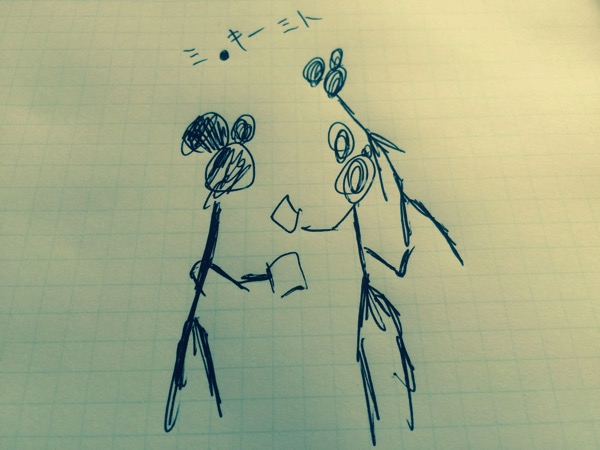

---
categories:
- DIR EN GREY
date: Sun, 28 Dec 2014 03:44:50 +0000
slug: post-6828
tags:
- DIR EN GREY
title: （ジグラット）覚えていますか？GAUZEツアー東京公演に現れたミッキーマウス3人を
---

DIR EN GREY夏のGAUZEツアーに参加された人は覚えているでしょうか？新木場スタジオコーストやゼップ東京にビラまきで現れたミッキーマウス3人を。

<!--more-->

ハローしんぺー(<a href="https://twitter.com/s_s_p_y" target="_blank">@s_s_p_y</a> )です。
オフィより詳しくて、wikiよりも有用なsukekiyo情報サイト「Gadget Zombie Parasite(ガジェットゾンビィパラサイト)」へようこそ。

ふと思い出したので、彼らの今後の活躍を期待して書いておきます。

一度見てからどうもずーっと気になってて、ちょくちょく調べたりしたんですがあまり情報がないです。活動暦がちょい浅めなのかな？

<h2>ジグラットのじょうほう</h2>

社（やしろ）担当の社（やしろ）、ギター担当の結羽(ゆう)、ベース担当のsaryo(サリョ)

ボーカル担当じゃなくてやしろ担当のやしろってどゆことよw

これは誤植ですか？？

みんなかっこいいですね、しかも長身。

<a href="http://ziggrat.com/biography/">オフィシャルサイト：http://ziggrat.com/biography/</a>

ドラムがサポートみたいなのいまの所3人メンバーみたいです。

<h3>音源</h3>
やっぱりこれくらいのバンドだと普通のお店じゃ買えないので、自主盤倶楽部とかライカエジソンとかいかなければいけないんでしょうね。ぼくはバンギャ（男）ですがいったことないんですよね〜

<a href="http://ziggrat.com/discography/">http://ziggrat.com/discography/</a>

ただYoutubeにいくつかあがっていました。

ジグラット　「完全自殺マニュアル」SPOT
<iframe width="560" height="315" src="//www.youtube.com/embed/_wWEDAUqbHM" frameborder="0" allowfullscreen></iframe>

ジグラット「-独白-」
<iframe width="420" height="315" src="//www.youtube.com/embed/s25rIRMpgOw" frameborder="0" allowfullscreen></iframe>

ジグラット「絶縁状」
<iframe width="420" height="315" src="//www.youtube.com/embed/inoE9S4JUxc" frameborder="0" allowfullscreen></iframe>

世界観はなんとなく確立されているっぽいですね。しかもいかにも最近はやりのキラキラ系とかエナメル系とかじゃないところがぼくは好きです。

ムックとか蜉蝣あたりから影響受けてそうですね。

あと12月14日に「幸せバス」という新曲をリリースしているみたいです。

<h2>しんぺーはこう思った。</h2>
昔から、LIVE後のビラはなるべくもらうようにしていますが、
このバンドはディズニーランドのお膝元でミッキ⚫︎のかっこしてたので、おいおい大丈夫かよってなったので覚えていたんですがw

今後が楽しみです。またDIR EN GREYのLIVEにビラくばりに来てくれたいいな。
と言ったところで本日は以上になります。おやすみなさい。