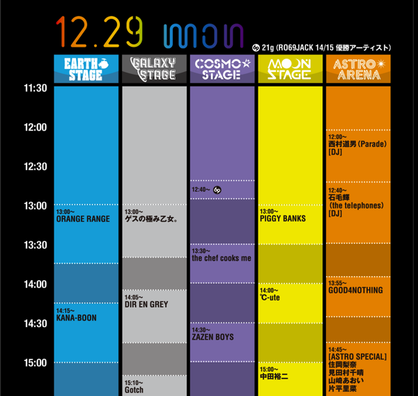
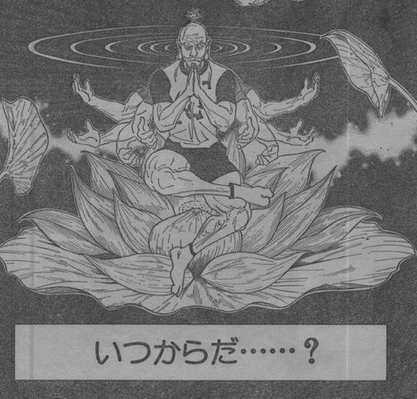
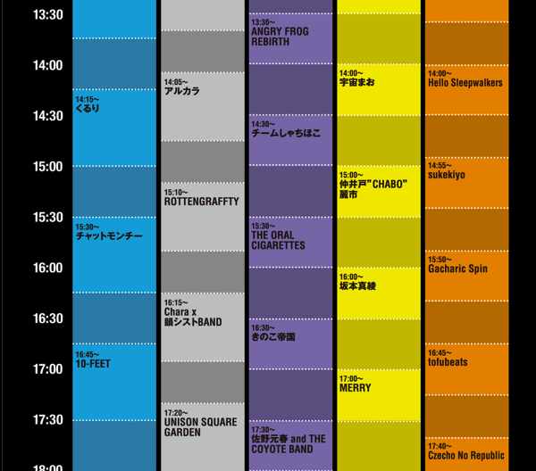

---
categories:
- DIR EN GREY
date: Mon, 29 Dec 2014 06:12:47 +0000
slug: post-6836
tags:
- DIR EN GREY
title: COUNT DOWN JAPAN14_15参加のDIR EN GREYがガラガラとな
---

本日はCOUNT DOWN JAPANにDIR EN GREYが参加しております。ぼくはといいますと暑すぎるくらいにエアコンが効いた部屋にてケーキを食べています。といいつつも、TLを監視しているんですがどうやらDIR EN GREYガラッガラらしいよwww

<!--more-->

ハローしんぺー(<a href="https://twitter.com/s_s_p_y" target="_blank">@s_s_p_y</a> )です。
オフィより詳しくて、wikiよりも有用なsukekiyo情報サイト「Gadget Zombie Parasite(ガジェットゾンビィパラサイト)」へようこそ。

<h2>DIR EN GREYがガラガラの原因</h2>

いやいや、ほぼど頭じゃないですかwwwどんだけですかww

はやい思ったけど、これじゃあ朝からカップヌードル食うくらいの消化不良ですわwww

それと同時刻にでてるKANA-BOONが人気らしい
そのほかにもGOOD4NOTHINGというのもきいたことあります。

まぁそんなわけで、とりあえずDIR EN GREYを見たいと思う人がかなり少なかったみたいえすな。

前回のポルノ超特急が好評すぎてこういうアウェー感は久しぶりだったのではないでしょうか。

いや・・・そうじゃねーだろ

そう、いつからだ？国内でDIR EN GREYが人気だと錯覚し出したのは？

いつからだ？国内音楽ファンにDIR EN GREYが受け入れられると思い出したのは？

そうじゃねーだろ？

だって、こんなのとか

<iframe width="560" height="315" src="//www.youtube.com/embed/knTCepRTS7E" frameborder="0" allowfullscreen></iframe>

こんなのとか
<iframe width="560" height="315" src="//www.youtube.com/embed/jAOGRPpEEZM" frameborder="0" allowfullscreen></iframe>

きわめつけがこれとか
<iframe width="560" height="315" src="//www.youtube.com/embed/RbQrfGBSaPY" frameborder="0" allowfullscreen></iframe>

こんなに目を覆うばかりのMVつくってるのがDIR EN GREYでした。

だいたい虜の前以外全てがアウェーでしたわ。

だから別に驚くことじゃないと思う。。。

とはいいつつ、初めてDIR EN GREYがCOUNT DOWN JAPANにでた時はけっこう人も入って、ぱんぴーに衝撃を与えていたんだけどね〜

またこのツイートみたいになると期待してたのに

<blockquote class="twitter-tweet" lang="ja">
とりあえず知らない人にDIRすきになってほしいとか一切思わないし食わず嫌いしないでとか言うきも毛頭ないんだけど、ぱんぴーが興味本意でDIRを目にして「う、うわぁ」とかなってるのを見るのが凄い好き
&mdash; しんぺー@LIVE納済み (@s_s_p_y) <a href="https://twitter.com/s_s_p_y/status/547301172101382144">2014, 12月 23</a></blockquote>

ただただ今はこういう気持ちです。
<blockquote class="twitter-tweet" lang="ja">
DIR スカスカに対する虜の反応→まじかよ〜年末くらい落ち着いて見られるんだったら行きたかったわ〜
&mdash; しんぺー@LIVE納済み (@s_s_p_y) <a href="https://twitter.com/s_s_p_y/status/549436649352863744">2014, 12月 29</a></blockquote>

とはいえ終了してからのツイートでは、ぱんぴーの好意的ツイートをRTするお仕事を皆さんされておられるようでよかったです。

いつも思うけど、ぱんぴーの人って自分のツイートが見ず知らずの、そういまのいままでステージでLIVEやってた人のアイコンの人たちにRTされまくるのって怖くねーかなって思うわwwww

だいたいが数十RT超えるし、ちょっと「お、おふ」「バンギャ、、、これがバンギャ、、、」って思ってると思うw

<h2>しんぺーはこう思った。</h2>
いまこれ書きながらスマホのアプリの通知が来たんですが、それが「sukekiyo」というワードが一定数ツイートされてるっていう知らせでした。

みんなDIRが終わった途端明日のsukekiyoの心配をツイートしだしたかw

おそらく今日以上にガラガラで、かつ静まり返ったステージになるんじゃないでしょうか。
念のためここにかぶってるアーティストをのせておきます。

ロットンとかぶってますねwww

しかも今日と時間的にあんまかわらないww

どうなるのでしょう〜！！明日もTL監視します。
と言ったところで本日は以上になります。おやすみなさい。