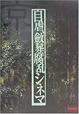

---
categories:
- sukekiyo
date: Wed, 31 Dec 2014 03:00:00 +0000
slug: post-6849
tags:
- sukekiyoまとめ
title: 今年最後のsukekiyoまとめっ！！
---

さて、ブログを始めて2年近くになります。相も変わらず目標としている数値には全然到達していないんですが、それでも今年は少しずつ見てくれる人も増えて、好意的な反応をいただいたりして更新を続けるモチベーションとなりました！ありがとうございます。さて、一応sukekiyoまとめサイト的なことを毎回言ってますので、今年最後の記事はsukekiyo関連で締めくくりたいと思います。

<!--more-->

<blockquote class="twitter-tweet" lang="ja">
<a href="https://twitter.com/hashtag/sukekiyo?src=hash">#sukekiyo</a> <a href="https://twitter.com/hashtag/VITIUM?src=hash">#VITIUM</a> <a href="https://twitter.com/hashtag/2%E6%9C%884%E6%97%A5?src=hash">#2月4日</a> (S) <a href="http://t.co/HsWGZZZjtU">pic.twitter.com/HsWGZZZjtU</a>
&mdash; sukekiyo (@sukekiyo_band) <a href="https://twitter.com/sukekiyo_band/status/562817263297134592">2015, 2月 4</a></blockquote>

ハローしんぺー(<a href="https://twitter.com/s_s_p_y" target="_blank">@s_s_p_y</a> )です。
オフィより詳しくて、wikiよりも有用なsukekiyo情報サイト「Gadget Zombie Parasite(ガジェットゾンビィパラサイト)」へようこそ。
さー、昨日のCOUNT DOWN JAPANのsukekiyoですが心配されていた通りがらっがらのスッカスカで、参列された方は思う存分近くでsuke納めをできたみたいで羨ましい限りです。

ロットンとかぶっている時間にもかかわらず、わざわざ見に来てくれたぱんぴーの方にも好評だったようで嬉しい限りですね。

LIVE終わりの京とYUCHI氏。なんか、、おかあさんと引きこもりの息子みたい。
<blockquote class="twitter-tweet" lang="ja">
【CDJ14/15 現地より生放送！】&#10;sukekiyoから京さんとYUCHIさんがコメント収録に来てくれました！&#10;⇒<a href="http://t.co/WfHLQzhUdU">http://t.co/WfHLQzhUdU</a> <a href="https://twitter.com/hashtag/wowow?src=hash">#wowow</a> <a href="https://twitter.com/hashtag/CDJ1415?src=hash">#CDJ1415</a> <a href="http://t.co/sYFOfO4REA">pic.twitter.com/sYFOfO4REA</a>
&mdash; WOWOW 音楽フェス (@FES_WOWOW) <a href="https://twitter.com/FES_WOWOW/status/549816281625423874">2014, 12月 30</a></blockquote>

それとCDJ会場にてこんなステッカー販売したみたいだけど・・・
まじで、、、ほしいんですけど、、、

<blockquote class="twitter-tweet" lang="ja">
こんにちわ。&#10;明日のCDJのライブでステッカー販売しますよ。700円です。&#10;写真ではわかんないけど銀色（シルバー）です〜。グッズ担当 <a href="http://t.co/UWEqyKVI6Y">pic.twitter.com/UWEqyKVI6Y</a>
&mdash; sukekiyo (@sukekiyo_band) <a href="https://twitter.com/sukekiyo_band/status/549394833463181312">2014, 12月 29</a></blockquote>

これ本当にほしい。。。。
通販か年明けのLIVEで売ってくれないかな。。。

<h2>sukekiyoニューアルバム情報</h2>

<blockquote class="twitter-tweet" lang="ja">
2月4日発売最新ミニアルバム『VITIUM』＜通販盤＞の特典CD収録曲決定！ヴォーカルコラボ4曲に加え、2014年5月6日京都劇場公演よりLIVE音源10曲の計14曲を収録致します。(S) <a href="http://t.co/YpIEMPKpDS">http://t.co/YpIEMPKpDS</a> <a href="http://t.co/eWpMY8qYaU">http://t.co/eWpMY8qYaU</a>
&mdash; sukekiyo (@sukekiyo_band) <a href="https://twitter.com/sukekiyo_band/status/549538268912443392">2014, 12月 29</a></blockquote>

と、いうことは・・・
秋のツアーでの青年館2daysに参列されたが持ってるCDと合わせると京都の漆黒の儀の音源がコンプできるということになりますね。（1曲を除いて）

一応詳細を載せておきますね。

「別れを惜しむフリは貴方の為」の5月5日京都劇場での公演を音源化したものが、秋のツアー「雨上がりの優詩」の日本青年館2days通し券購入者もしくはサンケイブリーゼ2days通し券購入者に無料配布されました。

配布されたCDは2枚で収録曲は

「zephyr」
「mama」
「in all weathers」

「aftermath」
「hidden one」
「scars like velvet」

ちなみに当時のセトリはこれ

1. elisabeth addict
SE destrudo
2. latour
3. nine melted fiction
4. zephyr
5. hidden one
6. aftermath
7. 烏有の空
8. the daemon's cutlery
9. scars like velvet
10. mama
11. vandal
12. hemimetabolism
13. 鵠
14. 斑人間
15. in all weathers
16. 304号室、舌と夜

今回の「<a href="http://sukekiyo-official.jp/product/index.html">vitium</a>」DISC2収録曲はこちらとのことなのでかぶりなし
destrudo
elisabeth addict
hemimetabolism
latour
nine melted fiction
烏有の空
the daemon's cutlery
vandal
斑人間
鵠

しかーっし！「304号室、舌と夜」だけは音源化なしです！

もしこちらの音源が欲しければこれを買うべし

<a href="http://www.amazon.co.jp/exec/obidos/ASIN/4840103119/warawareotoko-22/ref=nosim/" rel="nofollow" target="_blank">自虐、斂葬腐乱シネマ</a>
posted with <a href="http://kaereba.com" rel="nofollow" target="_blank">カエレバ</a>

京 メディアファクトリー 2001-08    

<a href="http://www.amazon.co.jp/gp/search?keywords=%8E%A9%8Bs%81A%9D%CA%91%92%95%85%97%90%83V%83l%83%7D&__mk_ja_JP=%83J%83%5E%83J%83i&tag=warawareotoko-22" rel="nofollow" target="_blank" title="アマゾン" >Amazon</a>

<a href="http://hb.afl.rakuten.co.jp/hgc/0f6e221b.2eb9748a.0f6e221c.35cc1e84/?pc=http%3A%2F%2Fsearch.rakuten.co.jp%2Fsearch%2Fmall%2F%25E8%2587%25AA%25E8%2599%2590%25E3%2580%2581%25E6%2596%2582%25E8%2591%25AC%25E8%2585%2590%25E4%25B9%25B1%25E3%2582%25B7%25E3%2583%258D%25E3%2583%259E%2F-%2Ff.1-p.1-s.1-sf.0-st.A-v.2%3Fx%3D0%26scid%3Daf_ich_link_urltxt%26m%3Dhttp%3A%2F%2Fm.rakuten.co.jp%2F" rel="nofollow" target="_blank" title="楽天市場" >楽天市場</a>

<a href="http://ck.jp.ap.valuecommerce.com/servlet/referral?sid=3041033&pid=882528283&vc_url=http%3A%2F%2Fshopping.search.yahoo.co.jp%2Fsearch%3FuIv%3Don%26ei%3DUTF-8%26tab_ex%3Dcommerce%26slider%3D0%26va%3D%25E8%2587%25AA%25E8%2599%2590%25E3%2580%2581%25E6%2596%2582%25E8%2591%25AC%25E8%2585%2590%25E4%25B9%25B1%25E3%2582%25B7%25E3%2583%258D%25E3%2583%259E" rel="nofollow"  target="_blank" title="Yahooショッピング" >Yahooショッピング</a>

<a href="http://ck.jp.ap.valuecommerce.com/servlet/referral?sid=3041033&pid=882528283&vc_url=http%3A%2F%2Fauctions.search.yahoo.co.jp%2Fsearch%3Fvo%3D%26ve%3D%26auccat%3D0%26aucminprice%3D%26aucmaxprice%3D%26aucmin_bidorbuy_price%3D%26aucmax_bidorbuy_price%3D%26loc_cd%3D0%26abatch%3D0%26istatus%3D0%26filtered%3D1%26ei%3DUTF-8%26tab_ex%3Dcommerce%26va%3D%25E8%2587%25AA%25E8%2599%2590%25E3%2580%2581%25E6%2596%2582%25E8%2591%25AC%25E8%2585%2590%25E4%25B9%25B1%25E3%2582%25B7%25E3%2583%258D%25E3%2583%259E" rel="nofollow"  target="_blank" title="ヤフオク!" >ヤフオク!</a>

<h2>しんぺーはこう思った。</h2>
さて来年もDIR EN GREYとsukekiyoを中心に記事更新していきます！！

今年はできる日はなるべく更新！やる気がないときはお休み〜としてきましたが来年は、なるべく定期更新をしようと思います。（なるべく）

定期更新（ちょこっと変更）
水曜日　AM1:00
日曜日　AM1:00
月曜日　AM1:00

あとは不定期でLIVEやインストやその他の情報がある場合はこれに加えて更新していきます。

また来年はゲーム実況とかブログのラジオ的なやつとかに力を入れていきたいと思います。要はyoutube関連。こっちはなるべくできる日にやる感じで。

あと来年ことはアプリを作ってリリースしたい！これマストな。

というところで、来年もガジェットゾンビィパラサイトとしんぺーをどうぞご贔屓に！

と言ったところで本日は以上になります。おやすみなさい。