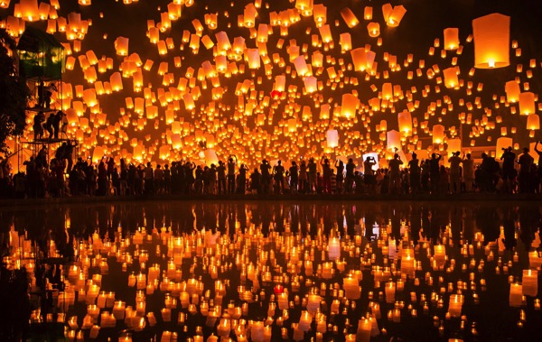

---
categories:
- DIR EN GREY
date: Sat, 03 Jan 2015 16:00:00 +0000
slug: post-6868
tags:
- dir en grey関連
title: DIR EN GREY「空谷の跫音」演奏時に流れる「ランタン祭り」 について調べてみた
---

新年明けましておめでとうございます。新年一発目の記事は、もちろんDIR EN GREY関連です。現在絶賛ツアー中なわけですが、その中でニューアルバム「ARCHE」からの曲で「空谷の跫音」という曲の演奏時に綺麗な映像が流れます。これについてです。

<!--more-->ハローしんぺー(<a href="https://twitter.com/s_s_p_y" target="_blank">@s_s_p_y</a> )です。
オフィより詳しくて、wikiよりも有用なsukekiyo情報サイト「Gadget Zombie Parasite(ガジェットゾンビィパラサイト)」へようこそ。

まーどんな映像かというとこんなのです。

<iframe width="560" height="315" src="//www.youtube.com/embed/L5mvTl4yfvM" frameborder="0" allowfullscreen></iframe>
これは、ポーランド西部のポズナン市で毎年夏至に開催されている聖ヨハネ祭。

ちなみにTwitterのTL上だと台湾のランタン祭りへの言及がメインだった気がします。
<iframe width="560" height="315" src="//www.youtube.com/embed/ezFk3h6xUP8" frameborder="0" allowfullscreen></iframe>

<iframe width="560" height="315" src="//www.youtube.com/embed/0mUbNrGVU0U" frameborder="0" allowfullscreen></iframe>

<h2>ランタン祭りとは</h2>

<h3>中国圏</h3>

ランタン祭りというか元宵節（げんしょうせつ）と言いまして、旧正月から15日目に行う中国の年中行事のようです。

じゃあ、元宵節って何なのよって話になりますが、はるか昔の漢の時代まで遡ります。皇帝交代時に反乱がおこり、それを平定したのが正月15日であったことでお祝いするようになったらしいです。

で、のちに色々な影響を受けて、華やかな雰囲気を作り吉祥・邪気払いとしてランタンを飛ばすようになったみたいです。

なので、2000年くらいの歴史がある風習みたいです。

参考:<a href="http://ja.wikipedia.org/wiki/%E5%85%83%E5%AE%B5%E7%AF%80">wikipedia「元宵節」</a>

で、ちょこっと調べてみたんですが、中国で現代でもランタンを飛ばす風習が残ってるのかどうかはわかりませんでした。
ただ台湾だと大々的にランタンを飛ばす風習が残っていて、日本からもツアーがあったりするみたいです。

さらに火事の原因になるとのことで色々と現代だと法令のもと執り行われているみたいです。

<blockquote>

天灯が火災の原因になるという指摘を受け、台湾当局は『天灯施放作業指導要点』を策定、点火された天灯が火災の原因にならないように風速と燃料に制限を設け、天灯の飛行範囲を5km以内、燃料も点火後10分以内の量に制限した。また『消防法』第14条を改正し法的な制限を加えるべく検討が進められている。
21世紀初頭では、『指導要点』により空港、石油貯蔵設備、弾薬庫、可燃性ガス貯蔵施設、軍事施設、高速道路、化学工場、住宅地、商業地、港湾区での天灯の使用が禁止されている。また天灯の寸法にも制限が加えられ、認められている最大寸法は直径60cm、高さ130cm、外周360cm以内となっている。

引用：<a href="http://ja.wikipedia.org/wiki/%E5%A4%A9%E7%81%AF">wikipedia「天灯」</a>
</blockquote>

<h3>ポーランド</h3>

ポーランドのポズナンというところでも夏至を祝うお祭りとして、ランタンを飛ばす風習があるみたいです。

ちなみにラプンツェルにも同様のシーンがある（らしい。みたことないけど）
<iframe width="560" height="315" src="//www.youtube.com/embed/vudLgnGEd1M" frameborder="0" allowfullscreen></iframe>

ただ、2014年は開催地での許諾が得られず中止だったみたいです。

<h3>タイ</h3>

コムローイというお祭りでも同様の風習があるそうです。
ってか写真を見る限りだとこれなんじゃないかという気がしてきました。
参考：http://www.thailandtravel.or.jp/detail/event/?no=844&tags=&page=1

やっぱり上がってる数とか背景とかから判断してこれなんじゃないかなー
<iframe width="420" height="315" src="//www.youtube.com/embed/m6K02fMYqKc" frameborder="0" allowfullscreen></iframe>

著作者:<a href="http://free-photos.gatag.net/2013/11/23/020000.html">Nik Cyclist</a>

これコムローイ祭りの画像らしいんですが、んー「これだろ」って思いました。

<h2>しんぺーはこう思った。</h2>
さて、調べてみて、そういや台湾の方の映像なのかポーランドの方なのかどっちなのかなぁとちょっとわからなくなりました。

おそらくですが、ポーランドの方なんじゃないかなと勝手に思っていますが、、

追記→タイも同様の風習があるということで、追加調査しましたがどうもタイな気がしてきました。

んー正直正解を教えてほしいな。

MTVで流れるだろうから実際のLIVE時の映像と見比べてみたい！

と言ったところで本日は以上になります。

次回の更新は月曜日のAM1:00です。

おやすみなさい。