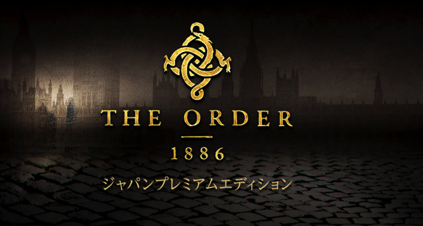
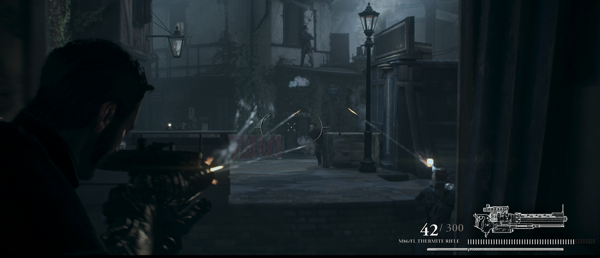
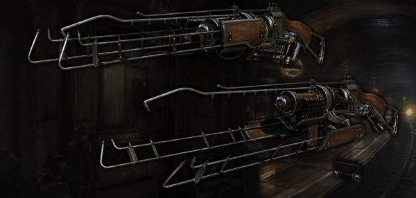
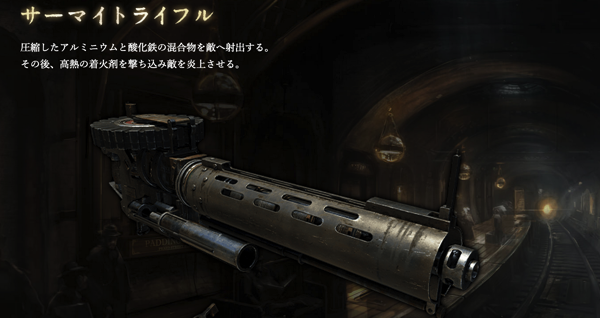
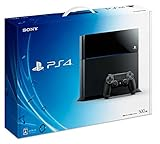

---
categories:
- ゲーム
date: Sun, 04 Jan 2015 16:00:00 +0000
slug: post-6877
tags:
- ゲーム
title: PS4ソフト「THE ORDER 1886」というゲームがめちゃくちゃ面白そう
---

クリスマス前にPS4を購入して、ひたすらラストオブアスのマルチプレイをやっております。ヌルヌル感がやばいです。ただそろそろ新しいゲームをやりたいと少し思ってるんですが、めっちゃくちゃ面白そうなゲームを発見したのでご紹介します。

<!--more-->

ハローしんぺー(<a href="https://twitter.com/s_s_p_y" target="_blank">@s_s_p_y</a> )です。
オフィより詳しくて、wikiよりも有用なsukekiyo情報サイト「Gadget Zombie Parasite(ガジェットゾンビィパラサイト)」へようこそ。

<h2>THE ORDER 1886ってこんなゲームだ！</h2>

時代背景は19世紀、場所はロンドン。

主人公は、人類の敵"半獣"という怪物と戦う騎士団”オーダー”の一員。

３人称視点のアクションアドベンチャーみたいな感じみたいです。いわゆるTPSです。

特別な武器を駆使し、怪物と戦うらしいんだけど、敵は怪物だけじゃなくて、帝国に反乱する人間とも戦うらしい。

<h2>画像がめっちゃ綺麗！！</h2>

動画を見ていただければわかるんですが、これがめっちゃくちゃ綺麗！！

<iframe width="560" height="315" src="//www.youtube.com/embed/34PO_jh69F8" frameborder="0" allowfullscreen></iframe>

武器もかっこいい！！

これマルチプレイとかもできるのかしら。。。

<h2>しんぺーはこう思った。</h2>
プレイ動画を見ただけで、かっけー！ってなるゲームはそんなにない。過去2つだけです。バイオハザードとラスアスのみ。

こおゲームはPS4の性能がわかった今だからこそ、きっと楽しい！プレイすること自体が快感だろう！と予想できるものです。

超期待！！めっちゃ楽しそう！！

だからこそ、現物で購入するか、日付変わった瞬間に購入できるダウンロードにするかを迷ってます。

これはぜひプレイ動画をYoutubeにあげていきたいと思います！！
それまでにゲームの腕前をあげておかねば！！

<a href="http://www.amazon.co.jp/exec/obidos/ASIN/B00PUEZ8XK/warawareotoko-22/ref=nosim/" rel="nofollow" target="_blank">The Order: 1886 (初回生産限定 コスチューム3種、武器2種、戦闘アイテム2種をダウンロードできるプロダクトコード 同梱)</a>
posted with <a href="http://kaereba.com" rel="nofollow" target="_blank">カエレバ</a>

 ソニー・コンピュータエンタテインメント 2015-02-20    

<a href="http://www.amazon.co.jp/gp/search?keywords=the%20order&__mk_ja_JP=%83J%83%5E%83J%83i&tag=warawareotoko-22" rel="nofollow" target="_blank" title="アマゾン" >Amazon</a>

<a href="http://hb.afl.rakuten.co.jp/hgc/0f6e221b.2eb9748a.0f6e221c.35cc1e84/?pc=http%3A%2F%2Fsearch.rakuten.co.jp%2Fsearch%2Fmall%2Fthe%2520order%2F-%2Ff.1-p.1-s.1-sf.0-st.A-v.2%3Fx%3D0%26scid%3Daf_ich_link_urltxt%26m%3Dhttp%3A%2F%2Fm.rakuten.co.jp%2F" rel="nofollow" target="_blank" title="楽天市場" >楽天市場</a>

<a href="http://ck.jp.ap.valuecommerce.com/servlet/referral?sid=3041033&pid=882528283&vc_url=http%3A%2F%2Fshopping.search.yahoo.co.jp%2Fsearch%3FuIv%3Don%26ei%3DUTF-8%26tab_ex%3Dcommerce%26slider%3D0%26va%3Dthe%2520order" rel="nofollow"  target="_blank" title="Yahooショッピング" >Yahooショッピング</a>

<a href="http://www.amazon.co.jp/exec/obidos/ASIN/B00O0Y0LR4/warawareotoko-22/ref=nosim/" rel="nofollow" target="_blank">PlayStation 4 ジェット･ブラック 500GB (CUH-1100AB01)</a>
posted with <a href="http://kaereba.com" rel="nofollow" target="_blank">カエレバ</a>

 ソニー・コンピュータエンタテインメント 2014-09-30    

<a href="http://www.amazon.co.jp/gp/search?keywords=PS4&__mk_ja_JP=%83J%83%5E%83J%83i&tag=warawareotoko-22" rel="nofollow" target="_blank" title="アマゾン" >Amazon</a>

<a href="http://hb.afl.rakuten.co.jp/hgc/0f6e221b.2eb9748a.0f6e221c.35cc1e84/?pc=http%3A%2F%2Fsearch.rakuten.co.jp%2Fsearch%2Fmall%2FPS4%2F-%2Ff.1-p.1-s.1-sf.0-st.A-v.2%3Fx%3D0%26scid%3Daf_ich_link_urltxt%26m%3Dhttp%3A%2F%2Fm.rakuten.co.jp%2F" rel="nofollow" target="_blank" title="楽天市場" >楽天市場</a>

<a href="http://ck.jp.ap.valuecommerce.com/servlet/referral?sid=3041033&pid=882528283&vc_url=http%3A%2F%2Fshopping.search.yahoo.co.jp%2Fsearch%3FuIv%3Don%26ei%3DUTF-8%26tab_ex%3Dcommerce%26slider%3D0%26va%3DPS4" rel="nofollow"  target="_blank" title="Yahooショッピング" >Yahooショッピング</a>

<a href="http://ck.jp.ap.valuecommerce.com/servlet/referral?sid=3041033&pid=882528283&vc_url=http%3A%2F%2Fauctions.search.yahoo.co.jp%2Fsearch%3Fvo%3D%26ve%3D%26auccat%3D0%26aucminprice%3D%26aucmaxprice%3D%26aucmin_bidorbuy_price%3D%26aucmax_bidorbuy_price%3D%26loc_cd%3D0%26abatch%3D0%26istatus%3D0%26filtered%3D1%26ei%3DUTF-8%26tab_ex%3Dcommerce%26va%3DPS4" rel="nofollow"  target="_blank" title="ヤフオク!" >ヤフオク!</a>

と言ったところで本日は以上になります。

次回の更新は水曜日AM1:00になります。

おやすみなさい。