---
categories:
- レビュー
date: Tue, 06 Jan 2015 16:00:00 +0000
slug: post-6898
tags:
- ガジェット
title: 通勤カバンをMac Book Proが入る「incase」のリュックにしたお話
---

昨年の秋あたりから通勤バッグを肩掛けからリュックに変えました。というのも外で開いた時間にブログ書いたりその他の勉強できるように普段Mac Book Proを持って会社に行ってるんですが、普通のカバンだとちょっとMacへのダメージが心配になってきたので、Mac用の耐衝撃性がしっかりしたものを買ってみました。2ヶ月ほど使ってみたので使用感のご紹介です。

<!--more-->
ハローしんぺー(<a href="https://twitter.com/s_s_p_y" target="_blank" rel="noopener">@s_s_p_y</a> )です。
オフィより詳しくて、wikiよりも有用なsukekiyo情報サイト「Gadget Zombie Parasite(ガジェットゾンビィパラサイト)」へようこそ。
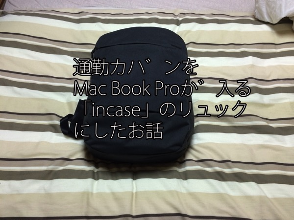
ぼくが購入したのはこちら。iPhoneケースでおなじみのincase製のリュックです。

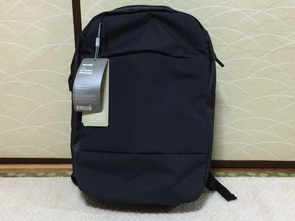

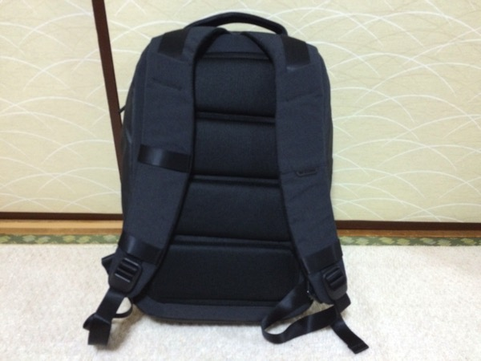

中身はこんな感じ。
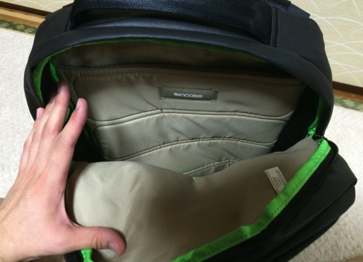

Mac Bookの専用収納スペースがこちら。柔らかい素材。なおかつ背中側に位置しているので、外からの衝撃にも強いと思われる。
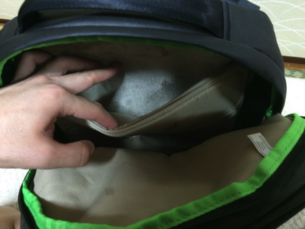

小さいポケットは、電車の中でリュックを前がけにした時に、小物を取り出しやすいようになってる。中身は同じく柔らかい素材で、スマホなどの小さなガジェットを入れておくの最適
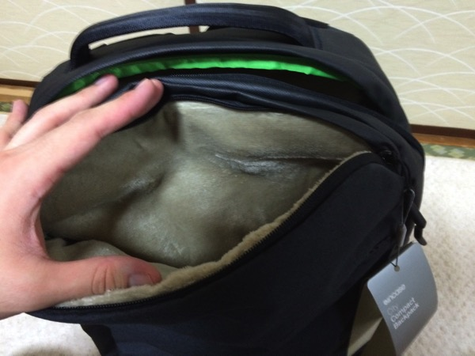

外側の収納スペースをあけると、スタイラスやらペンやらをさせるスペースがある。
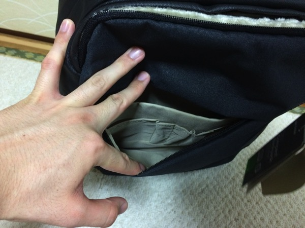

さらに外側にも柔らかいタブレット用と思われるスペースがある。iPadなんかをここに差し込むことができそう。
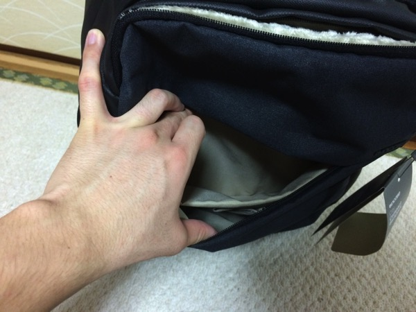

ちなみにMac Book Airの15インチを収納するとこんな感じ。
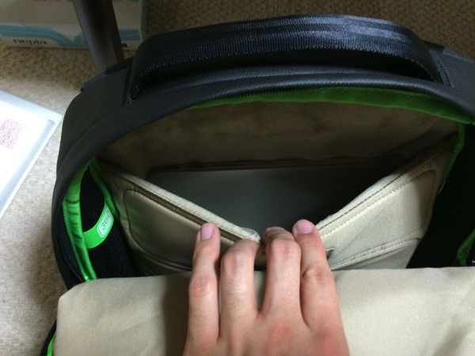

なお、2泊3日の大阪旅行に行った時の荷物がこれ。シャツとか下着とかパンツとかあと肩がけのポーチ的なものとか諸々
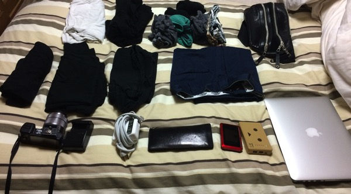

全部入った。わりとパンパンだけど、そこまででもない。
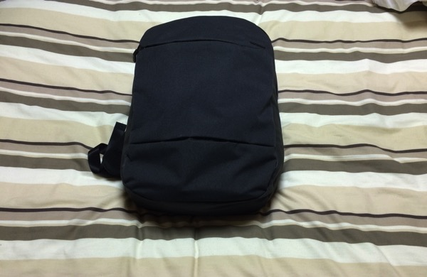
<h2>通勤カバンをリュックにした理由</h2>
<h3>地震などの災害時に手がふさがるのを防ぐため</h3>
東日本大震災当時、ぼくは肩からかけるタイプのカバンを使っていました。斜めがけにするど根性ガエルの主人公がしてるようなやつな。

でも、あれだと片足にあたる上に、なんかあった時走れない。

だから手が完全に自由なリュックを選びました。
<h3>ボーンアイデンティティーっぽい</h3>
マットデイモン主演のスパイアクション映画「ボーン」シリーズを見ればわかる。

彼はいつもリュックを片方だけかけて、後方を気にしつつ早歩きで移動する。

それに憧れたんです。いやマジで。
いや、今見たらリュックじゃねーしこれ
<h2>しんぺーはこう思った。</h2>
どうでしょうか。

おたくっぽいとか、男がリュックって•••とかっていう意見は受け付けません。

Macが壊れてからでは遅いのです。

Macやガジェットを持ち運ぶなら、これくらい堅牢なものを買ってもいいのではないでしょうか。

もう一度言います。

Macが壊れてからでは遅いのです。

<a href="http://www.amazon.co.jp/exec/obidos/ASIN/B00BF6L2B4/warawareotoko-22/ref=nosim/" target="_blank" rel="nofollow noopener">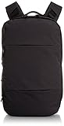</a>

<a href="http://www.amazon.co.jp/exec/obidos/ASIN/B00BF6L2B4/warawareotoko-22/ref=nosim/" target="_blank" rel="nofollow noopener">[インケース] INCASE Fresh CL55450 Black (Black)</a>

posted with <a href="http://kaereba.com" target="_blank" rel="nofollow noopener">カエレバ</a>

INCASE(インケース)

<a title="アマゾン" href="http://www.amazon.co.jp/gp/search?keywords=B00BF6L2B4&amp;__mk_ja_JP=%83J%83%5E%83J%83i&amp;tag=warawareotoko-22" target="_blank" rel="nofollow noopener">Amazon</a>

<a title="楽天市場" href="http://hb.afl.rakuten.co.jp/hgc/0f6e221b.2eb9748a.0f6e221c.35cc1e84/?pc=http%3A%2F%2Fsearch.rakuten.co.jp%2Fsearch%2Fmall%2FB00BF6L2B4%2F-%2Ff.1-p.1-s.1-sf.0-st.A-v.2%3Fx%3D0%26scid%3Daf_ich_link_urltxt%26m%3Dhttp%3A%2F%2Fm.rakuten.co.jp%2F" target="_blank" rel="nofollow noopener">楽天市場</a>

<a title="Yahooショッピング" href="http://ck.jp.ap.valuecommerce.com/servlet/referral?sid=3041033&amp;pid=882528283&amp;vc_url=http%3A%2F%2Fshopping.search.yahoo.co.jp%2Fsearch%3FuIv%3Don%26ei%3DUTF-8%26tab_ex%3Dcommerce%26slider%3D0%26va%3DB00BF6L2B4" target="_blank" rel="nofollow noopener">Yahooショッピング</a>

<a title="ヤフオク!" href="http://ck.jp.ap.valuecommerce.com/servlet/referral?sid=3041033&amp;pid=882528283&amp;vc_url=http%3A%2F%2Fauctions.search.yahoo.co.jp%2Fsearch%3Fvo%3D%26ve%3D%26auccat%3D0%26aucminprice%3D%26aucmaxprice%3D%26aucmin_bidorbuy_price%3D%26aucmax_bidorbuy_price%3D%26loc_cd%3D0%26abatch%3D0%26istatus%3D0%26filtered%3D1%26ei%3DUTF-8%26tab_ex%3Dcommerce%26va%3DB00BF6L2B4" target="_blank" rel="nofollow noopener">ヤフオク!</a>

<a href="http://www.amazon.co.jp/exec/obidos/ASIN/B00BF6LBOW/warawareotoko-22/ref=nosim/" target="_blank" rel="nofollow noopener">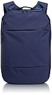</a>

<a href="http://www.amazon.co.jp/exec/obidos/ASIN/B00BF6LBOW/warawareotoko-22/ref=nosim/" target="_blank" rel="nofollow noopener">[インケース] INCASE Fresh CL55453 Navy (Navy)</a>

posted with <a href="http://kaereba.com" target="_blank" rel="nofollow noopener">カエレバ</a>

INCASE(インケース)

<a title="アマゾン" href="http://www.amazon.co.jp/gp/search?keywords=INCASE%20Fresh&amp;__mk_ja_JP=%83J%83%5E%83J%83i&amp;tag=warawareotoko-22" target="_blank" rel="nofollow noopener">Amazon</a>

<a title="楽天市場" href="http://hb.afl.rakuten.co.jp/hgc/0f6e221b.2eb9748a.0f6e221c.35cc1e84/?pc=http%3A%2F%2Fsearch.rakuten.co.jp%2Fsearch%2Fmall%2FINCASE%2520Fresh%2F-%2Ff.1-p.1-s.1-sf.0-st.A-v.2%3Fx%3D0%26scid%3Daf_ich_link_urltxt%26m%3Dhttp%3A%2F%2Fm.rakuten.co.jp%2F" target="_blank" rel="nofollow noopener">楽天市場</a>

<a title="Yahooショッピング" href="http://ck.jp.ap.valuecommerce.com/servlet/referral?sid=3041033&amp;pid=882528283&amp;vc_url=http%3A%2F%2Fshopping.search.yahoo.co.jp%2Fsearch%3FuIv%3Don%26ei%3DUTF-8%26tab_ex%3Dcommerce%26slider%3D0%26va%3DINCASE%2520Fresh" target="_blank" rel="nofollow noopener">Yahooショッピング</a>

<a title="ヤフオク!" href="http://ck.jp.ap.valuecommerce.com/servlet/referral?sid=3041033&amp;pid=882528283&amp;vc_url=http%3A%2F%2Fauctions.search.yahoo.co.jp%2Fsearch%3Fvo%3D%26ve%3D%26auccat%3D0%26aucminprice%3D%26aucmaxprice%3D%26aucmin_bidorbuy_price%3D%26aucmax_bidorbuy_price%3D%26loc_cd%3D0%26abatch%3D0%26istatus%3D0%26filtered%3D1%26ei%3DUTF-8%26tab_ex%3Dcommerce%26va%3DINCASE%2520Fresh" target="_blank" rel="nofollow noopener">ヤフオク!</a>

と言ったところで本日は以上になります。おやすみなさい。