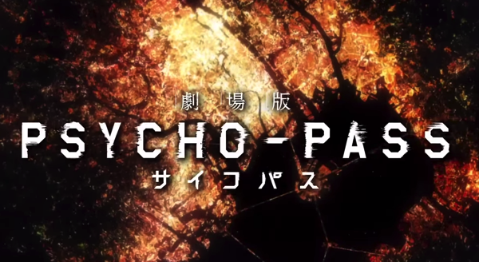
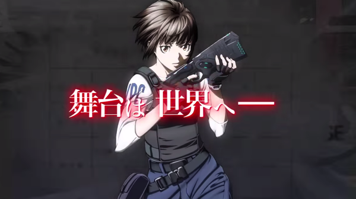
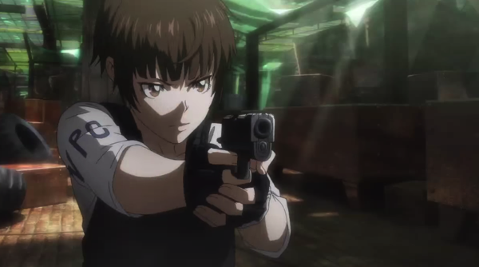
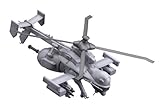
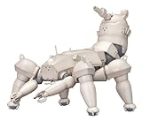
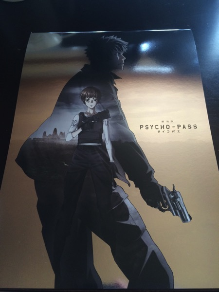

---
categories:
- アニメ
date: Sat, 10 Jan 2015 18:53:12 +0000
slug: post-6961
tags:
- PSYCHO-PASS
title: 【ネタバレあり】劇場版PSYCHO-PASS（サイコパス）あらすじと感想
---

見てきました「劇場版PSYCHO-PASS（サイコパス）」。結論から言いましょう。2015年最高の映像作品です。めちゃくちゃ面白かった。しかも息ができないほどの緊迫感。なにこれ。。<!--more-->ハローしんぺー(<a href="https://twitter.com/s_s_p_y" target="_blank">@s_s_p_y</a> )です。
オフィより詳しくて、wikiよりも有用なsukekiyo情報サイト「Gadget Zombie Parasite(ガジェットゾンビィパラサイト)」へようこそ。
<!--TOC-->

<h2>PSYCHO-PASSとは</h2>
フジテレビ系のノイタミナで放送していたアニメです。

人間の心が数値で測れるようになった時代、日本社会はシビュラシステムと呼ばれるシステムに管理されていた。心の数値はPSYCHO-PASS（サイコパス）呼ばれ、この数値を指標に生活していた。ただ、この数値の規定を著しく逸脱した場合、犯罪を犯していない人間でも、潜在的な犯罪者「潜在犯」として裁かれていた。

そして、この潜在犯を取り締まるのが主人公の常守朱が所属する厚生省直轄部隊の公安局であった。彼らはドミネーターと呼ばれるPSYCHO-PASS測定装置兼執行装置により、即座に対象への執行方法を決め、執行する。

簡単にいうとこういう社会背景のアニメです。近未来SFものですが、監督は踊る大捜査線の本広克行で、刑事ものという趣もあります。さらに攻殻機動隊のProduction I.Gが制作しているため、アニメ好きの人もそうでない人も楽しめるという2面性を持っているアニメです。

まー多少ぐろいのと、1期に関しては放映当時佐世保市の女子高生殺害事件と重なって一部放送中止の回があったり、2期に関してもこれ本当に地上波でやって大丈夫なの？ってくらいやばい回が続いたりします。

が、しかしとても奥深いアニメで非常に楽しい、ハードボイルドな大人のアニメです。

<h2>劇場版PSHCHO-PASS（サイコパス）のあらすじ（かため）</h2>

日本への密入国したテロリストの事件からアニメ1期にて、その後消息が不明になっている公安局局員狡噛慎也執行官が捜査線に浮上し、常守監視官は単身中国に飛び操作を開始します。

中国は、それまでの政府が崩壊し（多分）、ありあらゆる軍閥同士が覇権を巡って内戦をしている状態。そんな中ある軍閥が日本政府と契約し、シビュライシステムを輸入しシャンバラフロートと呼ばれる特別区を設置していました。

そして、狡噛執行官と再会した常守監視官は、やがてこれが巨大なシビュラの陰謀だと知る。

以下ネタバレ
<iframe width="560" height="315" src="//www.youtube.com/embed/Apzibx8oxkw" frameborder="0" allowfullscreen></iframe>

狡噛慎也は中国政府に対しての抵抗勢力の中でチェゲバラ的な指導者となって
いた。

そして中国政府は狡噛の抵抗勢力とそれと行動を共にした常守監視官を抹殺しようと画策、さらに傭兵部隊も絡み二人は絶対絶命

そこに日本から公安局がかけつけ憲兵を抹殺。しかしこれはシビュラの思惑通りだった。

というのも人間をより幸福にしたいとプログラムされたシビュラは、版図拡大とう欲望があるわけではないが、人間をより効率的に支配しシビュラが定義する幸せに導く義務がある。そのため、内戦状態である中国をシビュラの支配下に置き安全を提供しなければならないと判断していた。

そこで、有力な軍閥と契約し表向きシビュラシステムの輸出と称して、自分の支配地域を拡大。さらに軍閥トップを自分の一部と交換（クローンのおばさん？免罪体質者集団）、そして暴走した憲兵のクーデターということにして抹殺しようと計画していた。

それを知ったあとで、常守監視官は軍閥トップ＝シビュラに対し、社会の形は民衆の総意で決まり、人間の歴史はそうして作られてきた。だからもしシビュラとして支配するのであれば、民衆に選ばれた形でそれを成すべきと主張。シビュラもそれを承諾し、トップの座を辞任し改めて選挙を行う運びとなった。

ただ、シャンバラフロートという幸福をもたらした軍閥トップが選挙で再びトップに返り咲く。それを匂わせて物語は終わる。

<h2>劇場版PSHCHO-PASS（サイコパス）の感想</h2>

とにかくすごかった。面白すぎた。緊迫しすぎて息がめちゃくちゃつまった。

<h3>冒頭5分がまるで3時間かのごとく</h3>
冒頭の5分の戦闘シーンは、臨場感がすごくてもうそれだけで3時間くらい見た気になった。普通の映画って作品に没入していく感じだけど、これはスクリーンから現実世界に世界観が侵食してきて滲み出てくるかのごとくだった。

<iframe width="560" height="315" src="//www.youtube.com/embed/HPJCPHh-x2o" frameborder="0" allowfullscreen></iframe>
主題歌はもちろん凛として時雨、映像もかっこよかったけど、楽曲もいつも通り不穏な狂気に満ちていて、それでいてどこか近未来的な雰囲気だった。

<h3>メカが攻殻機動隊</h3>
あと、出てくるメカがスタジオI.Gということで攻殻機動隊と同じだった。ジガバチとか多脚戦車とか。

<table  border="0" cellpadding="5" style="border:none"><tr><td style="border:none;text-align:left"><a href="http://www.amazon.co.jp/exec/obidos/ASIN/B00CPVS3B0/warawareotoko-22/ref=nosim/" rel="nofollow" target="_blank" target="_top">攻殻機動隊S.A.C 2nd GIG ジガバチAV リパッケージ版 (1/72スケール プラスチックキット)</a></td></tr><tr><td style="border:none"><table  border="0" cellpadding="0" style="border:none"><tr><td valign="top" style="border:none"></td><td valign="top" style="border:none;text-align:left">
 壽屋 2013-09-13

売り上げランキング : 30832
<table style="border:none;margin-top:10px"><tr><td style="border:none;text-align:left;">
<a href="http://www.amazon.co.jp/gp/search?keywords=%83W%83K%83o%83%60&__mk_ja_JP=%83J%83%5E%83J%83i&tag=warawareotoko-22" rel="nofollow" target="_blank" title="アマゾン" >Amazon</a>

<a href="http://hb.afl.rakuten.co.jp/hgc/0f6e221b.2eb9748a.0f6e221c.35cc1e84/?pc=http%3A%2F%2Fsearch.rakuten.co.jp%2Fsearch%2Fmall%2F%25E3%2582%25B8%25E3%2582%25AC%25E3%2583%2590%25E3%2583%2581%2F-%2Ff.1-p.1-s.1-sf.0-st.A-v.2%3Fx%3D0%26scid%3Daf_ich_link_urltxt%26m%3Dhttp%3A%2F%2Fm.rakuten.co.jp%2F" rel="nofollow" target="_blank" title="楽天市場" >楽天市場</a>

<a href="http://ck.jp.ap.valuecommerce.com/servlet/referral?sid=3041033&pid=882528283&vc_url=http%3A%2F%2Fshopping.search.yahoo.co.jp%2Fsearch%3FuIv%3Don%26ei%3DUTF-8%26tab_ex%3Dcommerce%26slider%3D0%26va%3D%25E3%2582%25B8%25E3%2582%25AC%25E3%2583%2590%25E3%2583%2581" rel="nofollow"  target="_blank" title="Yahooショッピング" >Yahooショッピング</a>

<a href="http://ck.jp.ap.valuecommerce.com/servlet/referral?sid=3041033&pid=882660047&vc_url=http%3A%2F%2Fauctions.search.yahoo.co.jp%2Fsearch%3Fvo%3D%26ve%3D%26auccat%3D0%26aucminprice%3D%26aucmaxprice%3D%26aucmin_bidorbuy_price%3D%26aucmax_bidorbuy_price%3D%26loc_cd%3D0%26abatch%3D0%26istatus%3D0%26filtered%3D1%26ei%3DUTF-8%26tab_ex%3Dcommerce%26va%3D%25E3%2582%25B8%25E3%2582%25AC%25E3%2583%2590%25E3%2583%2581" rel="nofollow"  target="_blank" title="ヤフオク!" >ヤフオク!</a>
</td><td style="vertical-align:bottom;padding-left:10px;font-size:x-small;border:none">by <a href="http://kaereba.com" rel="nofollow" target="_blank">カエレバ</a></td></tr></table></td></tr></table></td></tr></table>

<table  border="0" cellpadding="5" style="border:none"><tr><td style="border:none;text-align:left"><a href="http://www.amazon.co.jp/exec/obidos/ASIN/B00DGNDMBW/warawareotoko-22/ref=nosim/" rel="nofollow" target="_blank" target="_top">攻殻機動隊 STAND ALONE COMPLEX 多脚戦車「剣菱重工 HAW206」 試作車ver. (1/35スケール プラスチックモデル)</a></td></tr><tr><td style="border:none"><table  border="0" cellpadding="0" style="border:none"><tr><td valign="top" style="border:none"></td><td valign="top" style="border:none;text-align:left">
 壽屋 2013-10-23

売り上げランキング : 37131
<table style="border:none;margin-top:10px"><tr><td style="border:none;text-align:left;">
<a href="http://www.amazon.co.jp/gp/search?keywords=%83W%83K%83o%83%60&__mk_ja_JP=%83J%83%5E%83J%83i&tag=warawareotoko-22" rel="nofollow" target="_blank" title="アマゾン" >Amazon</a>

<a href="http://hb.afl.rakuten.co.jp/hgc/0f6e221b.2eb9748a.0f6e221c.35cc1e84/?pc=http%3A%2F%2Fsearch.rakuten.co.jp%2Fsearch%2Fmall%2F%25E3%2582%25B8%25E3%2582%25AC%25E3%2583%2590%25E3%2583%2581%2F-%2Ff.1-p.1-s.1-sf.0-st.A-v.2%3Fx%3D0%26scid%3Daf_ich_link_urltxt%26m%3Dhttp%3A%2F%2Fm.rakuten.co.jp%2F" rel="nofollow" target="_blank" title="楽天市場" >楽天市場</a>

<a href="http://ck.jp.ap.valuecommerce.com/servlet/referral?sid=3041033&pid=882528283&vc_url=http%3A%2F%2Fshopping.search.yahoo.co.jp%2Fsearch%3FuIv%3Don%26ei%3DUTF-8%26tab_ex%3Dcommerce%26slider%3D0%26va%3D%25E3%2582%25B8%25E3%2582%25AC%25E3%2583%2590%25E3%2583%2581" rel="nofollow"  target="_blank" title="Yahooショッピング" >Yahooショッピング</a>

<a href="http://ck.jp.ap.valuecommerce.com/servlet/referral?sid=3041033&pid=882660047&vc_url=http%3A%2F%2Fauctions.search.yahoo.co.jp%2Fsearch%3Fvo%3D%26ve%3D%26auccat%3D0%26aucminprice%3D%26aucmaxprice%3D%26aucmin_bidorbuy_price%3D%26aucmax_bidorbuy_price%3D%26loc_cd%3D0%26abatch%3D0%26istatus%3D0%26filtered%3D1%26ei%3DUTF-8%26tab_ex%3Dcommerce%26va%3D%25E3%2582%25B8%25E3%2582%25AC%25E3%2583%2590%25E3%2583%2581" rel="nofollow"  target="_blank" title="ヤフオク!" >ヤフオク!</a>
</td><td style="vertical-align:bottom;padding-left:10px;font-size:x-small;border:none">by <a href="http://kaereba.com" rel="nofollow" target="_blank">カエレバ</a></td></tr></table></td></tr></table></td></tr></table>

<h3>小難しい説明はない（攻殻機動隊と比べて）</h3>

今回のストーリー理解には歴史的予備知識なくても全然いけると思うんですが、中国の100年くらい前からの歴史とかチェゲバラとか知ってるとより一層世界観を理解できると思う。

というのも中国が崩壊して軍閥が内戦してるって昔の中国まんまなので

<h2>いっこだけ納得いかない</h2>

抵抗勢力掃討作戦に随行した常守監視官が狡噛を発見して、戦車から出て行くシーンがあるんだけど、ハッチというかドアを「じゃ」みたいな友達の家から出て行くくらいの気軽さで開けて出て行ったので「ええええええええ」戦争用の重火器積んだ車両ってか戦車からそんな簡単にでていけるのかよ！！しかもこれ司令官がのってる車両だぞ！！ロックとか操縦士かけておけよ！！！って思った。ま、些細なことですが。

<h2><a href="https://twitter.com/s_s_p_y" target="_blank">しんぺー</a> はこう思った。</h2>
とにかく最高に面白かった。

新年まだ２週間もたってませんけど、これ間違いなく今年最高の映像作品です。
よく映画たくさんみて映画つーみたいな人いるけど、そういう人に限ってこういうアニメーションを見てなかったり、したに見る風潮あるけどさ、アニメじゃないと表現できないことってあるよね？さらには実写でやっちゃうと寒くなったりニュアンス違っちゃったり、さらには俳優の表現力とか俳優の印象で全然変わっちゃうじゃん。

だからこそ、そういう実写しか見ないで映画つー気取る人に見てもらいたい。
いや、見てもらわなくてもいいや。（どっちやねんwでもこのニュアンスわかるでしょ？自分の畑にそっちの人間入ってくるな的な、でもちょっと見てみてもいいよ的なw）

ぼくはおそらく公開期間中にもう一度見に行きます。さらにはDVDだかBlu-rayだかをおそらく買います。普段映画のDVDとかは一切買わないけど。

さらにさらに普段絶対買わないパンフレットを買っちゃいました。

とにかく絶対見るべき作品です。
超然おすすめ。

と言ったところで本日は以上になります。
次の更新は1月12日25:00、DIR EN GREYツアーファイナルのLIVEレポです。

おやすみなさい。