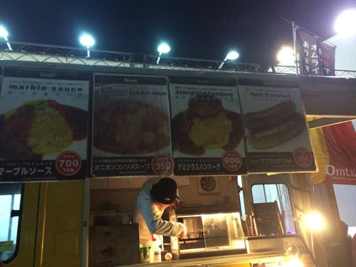
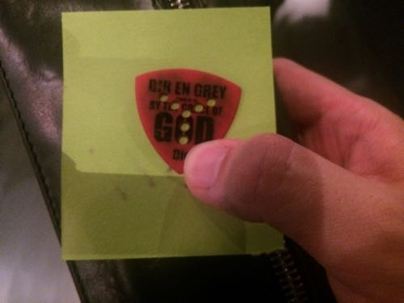

---
categories:
- DIR EN GREYのLIVEレポ
- TOUR14-15 BY THE GRACE OF GOD
date: Sun, 11 Jan 2015 16:00:00 +0000
slug: post-6974
tags:
- DIR EN GREY
- LIVEレポ
title: 【ライブレポ】DIR EN GREY TOUR 14-15「BY THE GRACE OF GOD」2015_1_11@新木場スタジオコースト
---

ついにARCHEのツアーが終了いたしました。次の春ツアーは4月。それまでDIR EN GREYとしての活動は今の所発表されていませんが、海外ツアーでも入るのかしら？それとアルバムがひと段落したので休憩かな？とりあえず本日のLIVEレポというか感想です。<!--more--><h2>TOUR 14-15「BY THE GRACE OF GOD」ファイナル新木場スタジオコースト セトリ</h2>

and Zero(演奏なし)
Un Deux
Chain Repulsion
Cause Of Fickleness
禍夜想
Bottom of the death valley
輪郭
濤声
空谷の跫音
「欲巣にDREAMBOX」あるいは成熟の理念と冷たい雨
鱗
暁
激闇
Sustain The Untruth

EN.
LIE BURIED WITH A VENGEANCE
Agitated Screams Of Maggots
BeautifulDirt
羅刹国
Revelation Of Mankind
and Zero(演奏)

登場は以前の通りShinyaからだった。なおかつandZeroは演奏なしで、最後は京がはけた後全員で演奏。
演奏後にはツアータイトルが映されて「BY THE GRACE OF GOD」から「THE  UNSTOPPABLE LIFE 」に変り終了。

<h2>メンバー衣装と演出とこぼれ話</h2>

<h3>衣装と演出</h3>

ツアーファイナルだからどこか変わってるということはありませんでした。京の髪型くらいです。

きっと今年頭の大阪の時はもっとだったんだろうな。現在のダウンタウンの松本人志と同じような感じです。ただかなりブリーチした金髪でした。

あとDieコールがぼくの参戦したLIVEでは最大だった気がする。これっていつごろから発生したのかな。段々と洗練されてきて、今回もうかなりの人数だったと思う。凄すぎて一瞬【Die】ってバンドなのかな？と思うくらい。

それとDie氏ずーっと右のイヤモニを気にされてました。二曲目か三曲目あたりから弾かずにつけなおしたりする場面もあったりして、最後の方まで気にしてた。

<h3>本日のMC</h3>

ぼくよく聞き取れませんでした。

https://twitter.com/s_s_p_y/status/554242283994755074

しかしどうやら違うみたいで

「俺が命削って叫んでやるからお前ら付いて来い！」

のようでございます。

<h3>夏のGAUZEツアーに引き続き出店あり</h3>

出店というかなんというかちゃんとした移動式のお店

昨日はラーメンだったみたい。今日はオムライス？

<h3>今日のジグラット！</h3>

来てたー！今日も来てた！
なんかミッキーのパンツ履いてた！そしてめっさ寒そうだった！話しかけたいなーそのために音源買おかな

<a style="color:#0070C5;" href="https://www.warawareotoko.com/2014/12/28/post-6828/" target="_blank" rel="noopener noreferrer">（ジグラット）覚えていますか？GAUZEツアー東京公演に現れたミッキーマウス3人を | Gadget Zombie Parasite</a>  

あ、それと団長とキリショーも来てたみたい！
<blockquote class="twitter-tweet" lang="ja">
新木場にDIR EN GREYさんのツアーファイナルを観に行かせていただきました。写り混んでいる邪魔な金髪はきりしょーです。じゃまだなぁ(＾ω＾) <a href="http://t.co/FnoAQdtV2Y">http://t.co/FnoAQdtV2Y</a>
&mdash; NoGoD団長@春ﾍﾞｽﾄｱﾙﾊﾞﾑ出す (@dancho_nogod) 2015, 1月 11</blockquote>

<h2>MV集「Average SORROW」発売</h2>

収録曲はまだ発表されてませんが、激闇以降の楽曲と思われます。

激しさとこの胸の中で絡みついた灼熱の闇
DIFFERENT SENSE 
LOTUS
輪郭
THE UNRAVELING

サステインが入るか微妙なところ

DVDとBlu-rayで発売は4月

<h2>しんぺーはこう思った。</h2>

考えて見ればぼくにとって今年最初のLIVEでした。

そして•••

Dieのピックゲット！！！

餌巻きの時にたまたま手伸ばしたら当たって、落ちてきたのが汗ばんだ首にへばりついたwそして絶対逃すものかととってすぐにポケット突っ込んだ。

夏とかに首に蛾とか蝶がくっついて、急いで掴んで放り投げるような感じの速さで

はい、次のDIR EN GREYは4月ですね。

その時は聞けなかった曲たちが演奏されるでしょうから待ち遠しい！

といったところで、本日は以上です。おやすみなさい。