---
categories:
- music
date: Sat, 17 Jan 2015 16:00:00 +0000
slug: post-7002
tags:
- 比較してみた
title: Webデザインが気になるV系バンドのオフィシャルサイト
---

ちょいとV系界隈のバンドのオフィシャルサイトを巡回してみました。初めて見るサイトとかもあって新鮮でございましたので、紹介してみます。他意はありませんし、バンドへの評価等ではなくあくまでサイトの使い勝手等々を客観的な感じで見てみた感想になります。<!--more-->ハローしんぺー(<a href="https://twitter.com/s_s_p_y" target="_blank">@s_s_p_y</a> )です。
オフィより詳しくて、wikiよりも有用なsukekiyo情報サイト「Gadget Zombie Parasite(ガジェットゾンビィパラサイト)」へようこそ。

<h2>DIR EN GREY</h2>

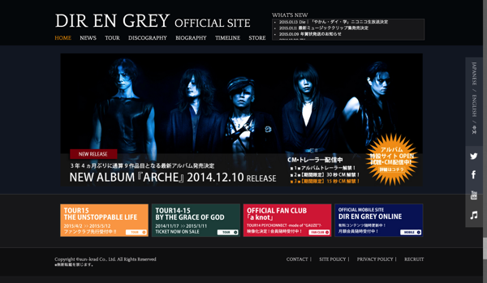
出典：<a href="http://direngrey.co.jp/">http://direngrey.co.jp/
</a>

バナーが多いですね。TOPページにほとんどテキストがありません。TOPページをいろんなところにランィングさせることを意図してるのかな？昨年の春にリニューアルしましたが、それ以前のサイトに比べるとだいぶすっきりしました。ただぼくは個人的にはあまり使い勝手がいいとは思いません。前の方が好きですね。というのも、いちいちクリックしないと情報にたどり着けないのと、情報へのアクセスに数回のクリックを要するからです。

ぱっと見すっきりしたけど、使いにくい。

<h2>MERRY</h2>

だいぶ見やすい！
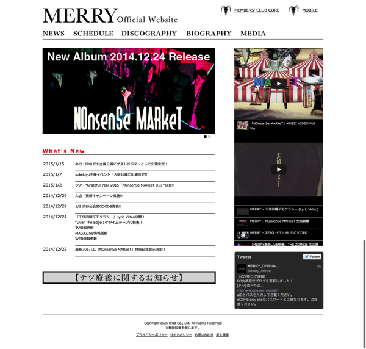
出典：<a href="http://merryweb.jp/">http://merryweb.jp/</a>

ユーザーのニーズをしっかり掴めてるきがする。ユーザー＝バンギャがこのサイトに何を求めてきているか、つまり最新ニュースです。そこへ TOPページからアクセスできるので非常に使い勝手がいいです。

さらにバックのカラーが白ってのがとても見やすい！あとサイドにYouTube動画を埋め込んでるけど、2段にしてなおかつリスト表示しているサイト初めてみた。

<h2>cali≠gari</h2>

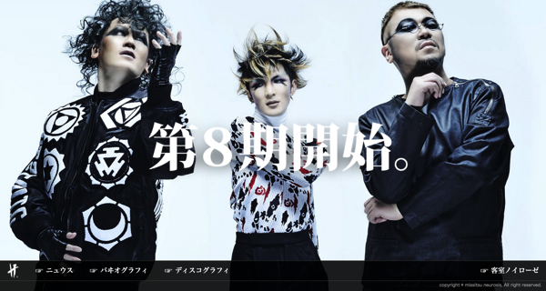
出典：<a href="http://www.missitsu.com/">http://www.missitsu.com/</a>

メンバーのアー写をメインビジュアルに据えて、その他無駄なボタンを一切排除。必要最低限のみを下部分に配置。ニュースとバイオグラフィ、ディスコグラフィのみ。

なるほどー！本当に必要最低限でなおかつ、複数回サイトに訪問しているユーザーですら何回も見るだろう項目！

見やすい！

でも、下層ページが見にくすぎて（醜すぎて）ワロタwwwカリガリワールドぜんかいwww

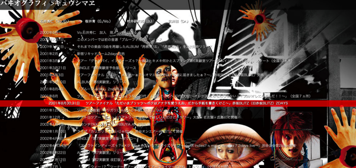

<h2>L'Arc〜en〜Ciel</h2>

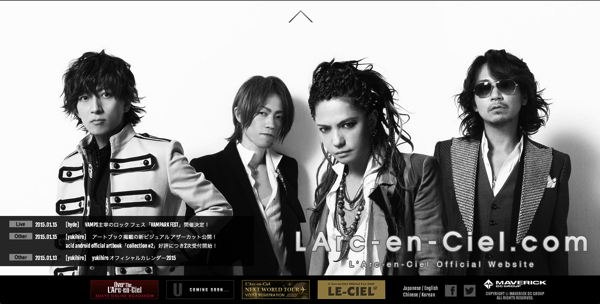
出典：<a href="http://www.larc-en-ciel.com/">http://www.larc-en-ciel.com/</a>

これがファーストビューです。つまりサイトを開くとこの状態なわけです。
とてもオシャンティですね。全体的に下にスクロールすることでコンテンツがでてきます。

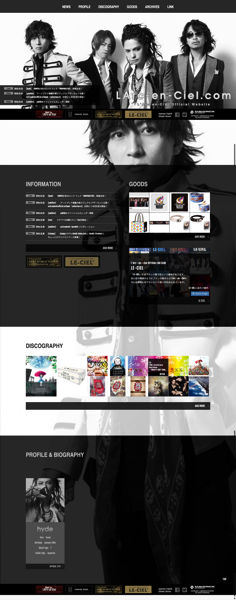

なお画面の上部にマウスをもっていくとメニューがでてきて、クリックすると該当部分まで飛ぶことができます。

他のサイトに比べると格段に外国っぽいです。訪問者が日本以外の人が多いのかな？？

<h2>sukekiyo</h2>

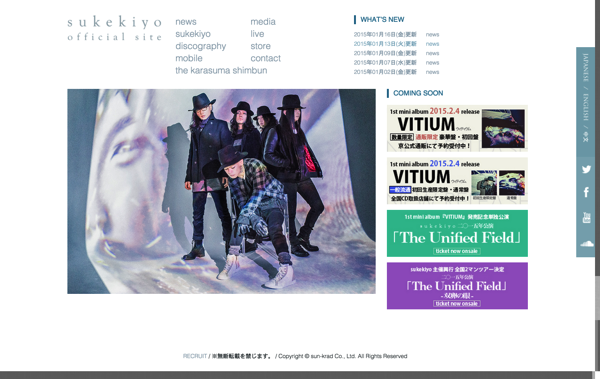<h2></h2>
出典：<a href="http://sukekiyo-official.jp/">http://sukekiyo-official.jp/</a>

DIR EN GREYと同じような構成になってます。メニュー（グローバルナビゲーション）と最新情報と各種バナー
ただ、DIRよりもわかりやすい配置になってるし、見やすいです。
最新情報の表示面積が大きいのもいい感じです。あとは最新情報へのアクセスも1度でOK。

ただ、vitiumのバナーがちょっとクリックしにくい気がする。。。それとやっぱり前回のIMMORTALISの時とコンセプトがガラッと変わったのか、全体的な雰囲気も変わっているなーって感じです。

<h2>Angelo</h2>

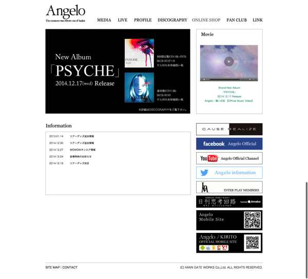
出典：<a href="http://angeloweb.jp/index.php">http://angeloweb.jp/index.php</a>

シンプルです。やっぱりこのサイトも最新情報へのアクセスがわかりやすくて、かんたんです。

ただ全体的に少しだけ安っぽく見えるのはなぜでしょう。配色がモノトーンだからかな。あとメインビジュアルがコロコロ変わりすぎ。スピードが速い。さらにクリックできないし。その辺がなんか個人サイトみたいな印象を受けました。

<h2>ムック</h2>

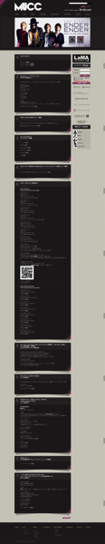
出典：<a href="http://www.55-69.com/">http://www.55-69.com/</a>

全体的に長い！！ファーストビューはこんな感じ
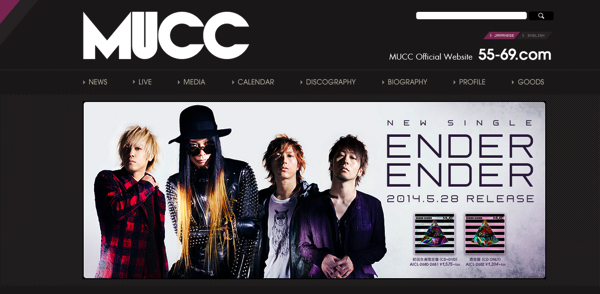

一般的な日本サイトって感じです。デザインはわかりやすいくて見やすいです。
あと、最新情報はこれ日付順？というよりも日付順で各カテゴリで一個のブロックにして出してる感じかな？

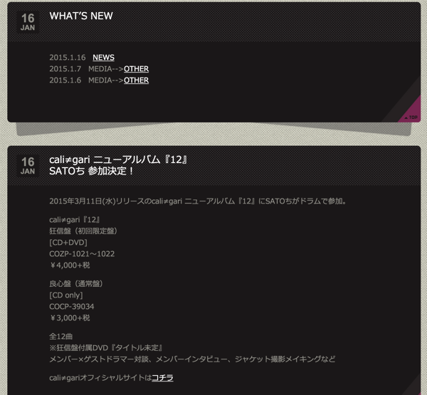

あとカレンダーでスケジュールが一覧できるのがすごく便利そう！！

<h2>GLAY</h2>

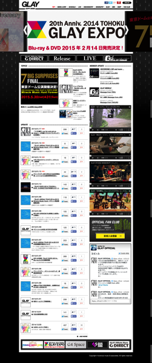
出典：<a href="http://www.glay.co.jp/">http://www.glay.co.jp/</a>

配置とか諸々一般的でなおかつメニューも一般的！ただ配色ががちゃがちゃしてて、ぱっと見で見ずらいなと感じた。

極め付けはこれ。SNSボタントップに持って来ちゃうかー。この辺もちょっと見ずらい原因かも
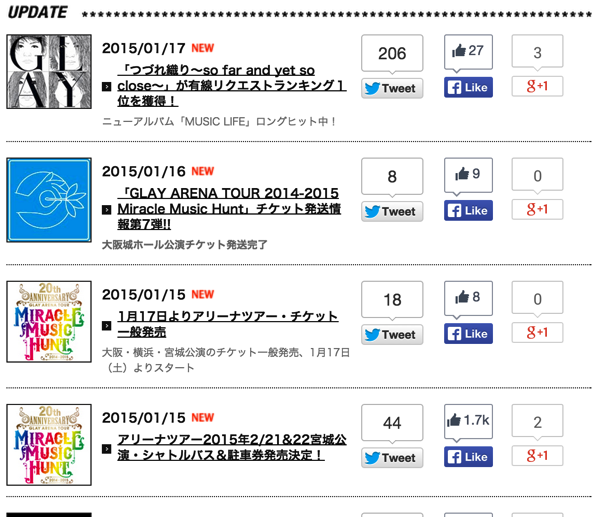

ただ、これはすごいと思ったのがスケジュールをGoogleカレンダーでまとめてくれてるところ！
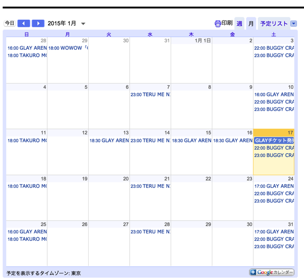
これは本当今すぐDIR EN GREYやらsukekiyoでもやってほしい！！入金忘れやいろいろなことの漏れを防げる！！おなしゃす！！

<h2>LUNA SEA</h2>

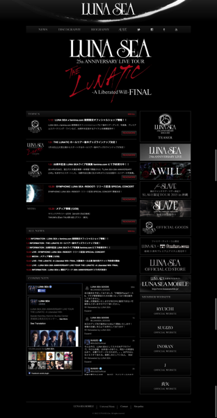
出典：<a href="http://www.lunasea.jp/app-def/S-102/wp/">http://www.lunasea.jp/app-def/S-102/wp/</a>

URLのけつにwpってついてるからWordPressでも使ってるんでしょうかね。
メニューもニュース、ディスコグラフィ、バイオグラフィなどを配置してさらに、TOPページの構成も最新情報とトピックスと各メンバーのサイトへのリンクバナーとファンクラブページへのバナーとSNSのガジェット

ぼくはこのサイトにほとんど訪問したことがないのですが、ちょっと慣れてないと戸惑っちゃいそうでした。おそらくSLAVEでない人が何かの情報を探しにくるってのを意図してはいない感じですね。

玄人仕様になっています。

<h2>X</h2>

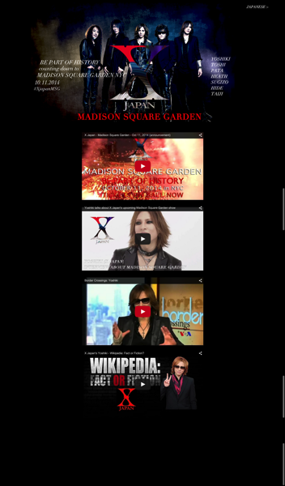
出典：<a href="http://www.xjapanmusic.com/index.html">http://www.xjapanmusic.com/index.html</a>

すごい！何がすごいって「x」でググったらトップにでてきたw色々とすごいw
この辺の検索関係はまた今度書きますね。

で、さらに驚いたのがアクセスするとそこは英語版ページでした。右上のJAPANESEをクリックしないと日本語ページが表示されません。

あともっと驚いたのが、メニュー（グローバルナビゲーション）がない！！！！！強いて言うならば各メンバーのオフィシャルサイトへのリンクのみ！！！！

英語版は、サイトにYouTubeを埋め込んであるだけ！バイオグラフィもディスコグラフィもない！！！

日本語版にいたってはライブビューイングのチケットサイトへのリンクのみ！！！

すげーーーー！！！これが！！！！！X！！！！！

まさかこんなページだったとは

さすがです！！！

<h2><a href="https://twitter.com/s_s_p_y" target="_blank">しんぺー</a> はこう思った。</h2>
Xが衝撃的すぎた。。。

個人的にデザインが一番気に入ったのがメリーでした。メリーのサイト見ててYoutube動画で最新のを見たら、療養中のテツがでてた。思ってたのと違ってだいぶ重篤そうなんだね。それでもこうして姿を見せてるってあたりきっと並々ならぬ覚悟と気合があるんだろうな。

<iframe width="560" height="315" src="//www.youtube.com/embed/82QiT98_X4s" frameborder="0" allowfullscreen></iframe>

早く完治してくれるといいですな。
と言ったところで本日は以上になります。
次回の更新は日曜25:00です。

おやすみなさい。