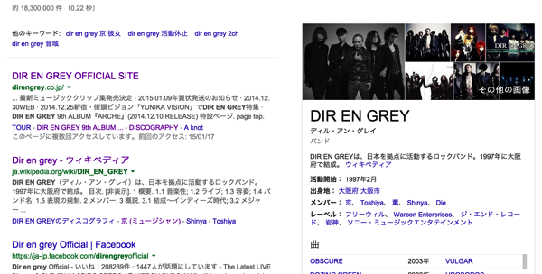
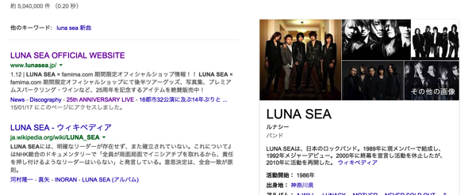
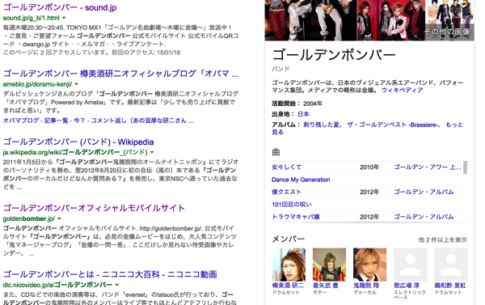
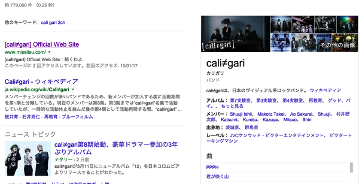
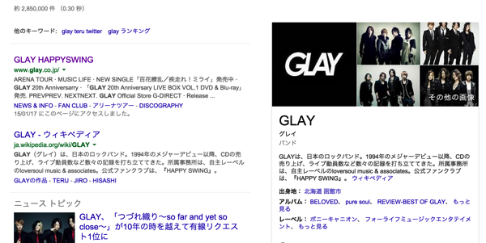
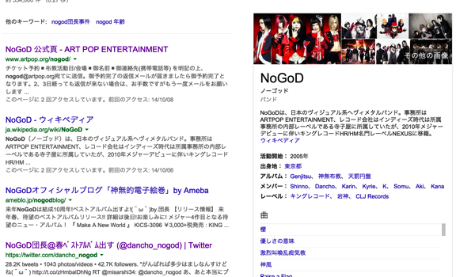
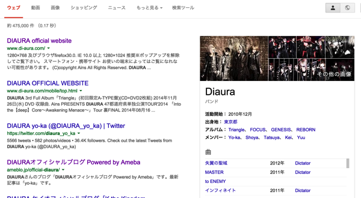
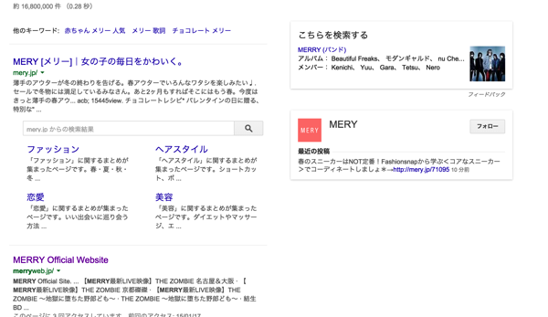
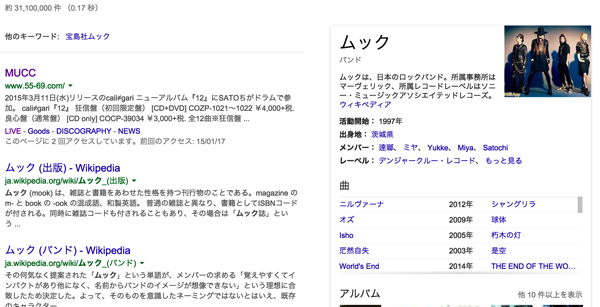
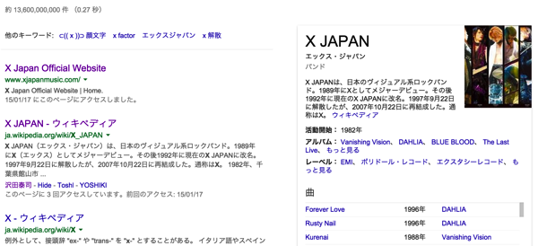

---
categories:
- ブログ
date: Sun, 18 Jan 2015 16:00:00 +0000
slug: post-7033
tags:
- 比較してみた
title: 検索したら一番上にでてくるV系バンドのサイト
---

好きなバンドのことをググった時に一番上にでてくる•••当たり前のことだと思っていませんか？否
そのためにはあらゆる要素が絡み合い、Google先生に真に価値あるサイトだと判断されなければなりません。
このことをSearch Engine Optimization(サーチ・エンジン・オプティマイゼーション)、すなわち検索エンジンの最適化といいます。
<!--more-->
ハローしんぺー(<a href="https://twitter.com/s_s_p_y" target="_blank">@s_s_p_y</a> )です。
オフィより詳しくて、wikiよりも有用なsukekiyo情報サイト「Gadget Zombie Parasite(ガジェットゾンビィパラサイト)」へようこそ。

まぁ、要はSEOとは検索した時に一番上にでてくるためにサイトをGoogleさんに評価してもらいやすくするためのアピール技術だと思ってください。

<h2>どうしたら検索の一番上にでてくるの？</h2>

これはGoogle様のみぞ知ることなので、公表はされておりません。

ただ、一つ言えることは、ユーザーにとって価値があるだろうとGoogleが判断したサイトは検索結果の上位に表示されるということです。

当サイトで言えば、「iphone 動画　車」とかで検索すると一番上にでてきます。（現時点で）
あとsukekiyoショックの時とか一瞬一番上に来たりしました。

あとちょいと専門的なこというとサイトのHTMLの書き方がちゃんとGoogleが推奨している書き方をしているかとか、他のサイトからリンクされている数とか、ユーザーがそのサイトに来てどれくらいの時間を過ごしているのかとかとかそんなあたりも評価の要素になります。

<h2>バンド名が固有名詞だ</h2>

とはいえ、ぼくも詳しくSEOの技術がわかってるわけではありませんし、各サイトのHTMLを詳しく見たわけじゃないのでここではネーミングと検索結果を見てあちゃーって勝手に思ったバンドのサイトと逆にこの名前で検索上位表示とかマジっすか！と思ったサイトを勝手に列挙することにします。

後述しますが、業者にお金を払ってある程度検索上位に持ってくこともできるんですけど、そうじゃなくてネーミングだけで上にあげていけるような名前こそが21世紀に求められるのでは！！とかなんとか・・・

<h3>DIR EN GREY</h3>

これはですね、いいですね。何がいいってネーミング。だっておそらくDIR EN GREYという単語を地球上で最初に使ったのって人類史の中でもこの5人が最初でしょう。

ということで、多分工夫しなくても検索順位は上位表示昔からされてたんだろうなと思います。

ただwikipediaよりも上に来ているあたりが結構中の人は頑張ってるんかなとも思いました。たまにいますよねwikipediaが上に来ちゃってるバンド。なんか萎えます。

<h3>LUNA SEA</h3>

このバンドも固有名詞でしょうね。DIRほどではないにしてもこの単語を常用しているのもきっとこの人たちくらいでしょう。あとは天文学者とか

<h3>ゴールデンボンバー</h3>

この人たちもきっとこの単語を使ったのはハドソン以来この人たちだけだったでしょう。

しかしながら検索結果がよくわからないことになっていました。

一番上にでてくるオフィシャルサイトってこれだったっけ？？
URL変更して移動させたのかな？？なんかサイトが適当な感じがする。わざとじゃない部分で。
あと誤字ってたりするのは昔のままにあえてしているという演出なのかな？？

あと樽美酒のアメブロが上位に来ててこのままだとオフィの上に行っちゃうんじゃないかとヒヤヒヤしてます。

<h3>cali≠gari</h3>

とくに本人たちは意識していないんでしょうけど、ただの「カリガリ」だとカレーとかwikipediaの「カリガリ博士」に負けてたかもしれません。

でもそこに「≠」とかそのほかの記号を入れているのでグッドだと思います。

<h3>GLAY</h3>

この人たちも固有名刺ですね。英語で灰色はGREYもしくはGRAYなので

<h3>NoGod</h3>

団長はデジタルネイティブ的な世代では全然ないし、ネットへの影響を考えて付けられた名前では絶対なと思いますが、結果的に固有名詞になってるのでいいのでは！

<h3>DIAURA</h3>

このバンド聞いたことないのでこの機会に聞いてみようと思います。伝統的ビジュアル系継承者なんて言われてるらしいですが、さすが最近のバンドです。名前のセンスが素晴らしすぎる。完全なる固有名詞と思われる。ネット世代ですね！！現代に即してる！！素晴らしい！！

wikipediaに負けないように頑張って！

<h2>バンド名が他にもある名前で検索上位が狙いにくい</h2>

あくまでSEO的なお話ね。

<h3>メリー</h3>

これ一番ダメですね。何がダメって一般的すぎる名詞だから、その単語自体で他の「メリー」に勝つのが結構大変だと思うんです。
現に通販サイトに負けてるし

<h3>sukekiyo</h3>

これ英語表記だからいいけど、とりあえず全世界的にsukekiyoよりもヤツハカムラの佐清氏の方が認知高いからSEO的な面から見たネーミングだときつい感じがします。

<h3>PIERROT</h3>

本当にこれな、これも復活時はメリーと同様の現象起きてましたわ。通販サイトに負けてたという。

ただ、今は上位表示されるようになっています。

むしろドメイン保持してたアンオフィシャルの人に交渉して、それ使わせてもらったりとかすればよかったのに。じゃないとアンオフィシャルサイトの人が保持してた意味がないじゃないの。

<h2>このバンド名でこの検索結果はすごい！！</h2>

<h3>ムック（MUCC）</h3>

ライバル多すぎでしょうw赤い毛むくじゃらのやつとか、あとwikiでも他の項目が上に来てるし、そんな中そいつらを抑えて上に表示されてる！

<h3>X</h3>

やっぱりここでもこのバンドが最強でした。だってXとかって普通の言葉ですよ？それなのにこんな結果とは、、、しかも内容があまりないサイトなのに。。。すごい、、、さすがX

<h2>SEOはお金かければある程度効果ある</h2>

つらつら書いてきました。お金をかけずにネーミングだけで上位表示されるだろうという側面からのお話でした。

上位表示されるためのGoogleの評価の中の一つにリンクされている数というのがあるらしいです。まーでもこれも今は昔の話で、最近では評価あまりされなのではという説もありますが

でも、一定の効果はあると思われます。で、これってお金払うことで効果をあげられるんですね〜でもGoogleは検索結果をお金で変えるってのはやっていませんから（広告はやってる）、SEO業者にお金を払って色んなサイトからリンクを貼ってもらうのです。

ということでsukekiyoとかはその辺の結果なのかなーと予想してみます。
あとムック

この辺は一般企業やブランドなんかも当たり前にやっていることではあります。むしろやってない企業がいるのかというくらいですが。

<h2><a href="https://twitter.com/s_s_p_y" target="_blank">しんぺー</a> はこう思った。</h2>
歴史が長いバンドほどwikipediaがライバルになりますね。

ラルクとかラルクとかラルクとか

まーそれはいいとして、21世紀の若手バンドはきっともっと個性的な名前のバンドがでてくるんじゃないかしら！

と言ったところで本日は以上になります。おやすみなさい。