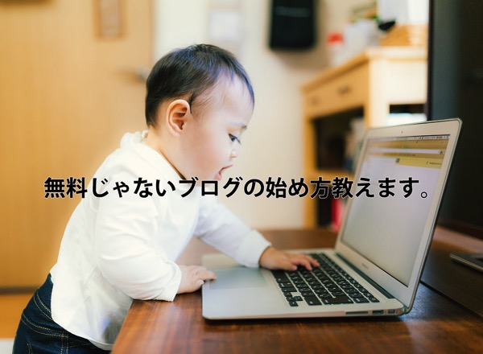
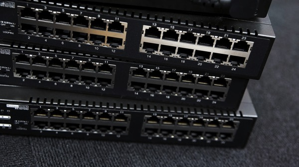
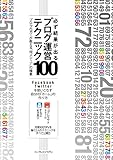

---
categories:
- ブログ
date: Tue, 20 Jan 2015 06:03:17 +0000
slug: post-7058
tags:
- ブログ
title: WordPressを使ったブログの始め方
---

このブログを始めてそろそろ2年になります。最初はほとんどアクセスがなかったこのブログですが、今ではちょこっと見られるようになってきました。今年はもっと頑張ります。さて、そんな中まだまだ修行中のぼくですが、知りあいの中で2人くらいブログやりたいって人がいたので、ちょこっと無料じゃないブログの始め方をまとめてみました。<!--more-->ハローしんぺー(<a href="https://twitter.com/s_s_p_y" target="_blank">@s_s_p_y</a> )です。

オフィより詳しくて、wikiよりも有用なsukekiyo情報サイト

「Gadget Zombie Parasite(ガジェットゾンビィパラサイト)」へようこそ。

<h2>無料ブログと有料ブログの違い</h2>

<h3>無料ブログ</h3>

無料ブログとはここでは無料で始められるブログのことを指しています。有名どころをあげると次の３つくらいでしょうか。おそらくどれか一つくらいは見た事あるでしょう。

・<a href="http://www.ameba.jp/">アメブロ</a>

・<a href="http://blog.livedoor.com/">livedoorブログ</a>

・<a href="http://hatenablog.com/">hatenaブログ</a>

それぞれ特徴がありますが、

アメブロは芸能人がやっていて、知名度はナンバー1だと思います。さらに、アメブロ内で他の人と交流できるような仕組みも充実していているので、始めればすぐアメブロ内で他の人の目につくようになると思われます。ブログのテンプレート＝外見もいろいろと用意されていて、女性向けのかわいいものから、シックなものもありますので幅広い人が利用できるブログです。

livedoorブログは、livedoorが運営しているブログで、アメブロほど分かりやすくありませんが、アメブロよりも少しシックな男性向けの感じです。

hatenaブログは、ユーザーがネットリテラシーの高い男性が多いことで有名です。はてなブックマークという機能により、シェアが増えることで爆発的なアクセスを呼び込む機能があります。なお、この機能はhatenaブログ以外のサイトでも利用できます。

どのブログも有料会員版があり、お金を毎月支払うことで元々ついている広告を外したり、無料会員ではいじれないブログの見た目をカスタマイズすることができるようになったりします。ただ、どれもちょいと微妙な値段で、趣味の範囲でやるにはちょいと高い気がします。

アメブロプレミアム→<a href="http://helps.ameba.jp/faq/premium/1901/ameba_6.html">http://helps.ameba.jp/faq/premium/1901/ameba_6.html</a>

1,008円〜

livedoorブログ有料プラン→<a href="http://blog.livedoor.com/guide/plan.html">http://blog.livedoor.com/guide/plan.html</a>

315円〜

はてなブログpro→<a href="http://hatenablog.com/guide/pro">http://hatenablog.com/guide/pro</a>

600円〜

<h3>有料ブログ</h3>

ここではどこかのブログサービスの会員になって作成するブログではなく、すべて自分でお金をかけて作成するブログのことを指します。

具体的にはwordpressというシステムを利用するのですが、それ以外にもいろいろと用意するものが必要です。

・サーバを借りる

・ドメインを買う

・サーバにwordpressをインストール

・wordpressにテーマをインストール

ここまで来てようやく記事を書いてブログスタートという感じです。

さらにいうとサーバのレンタル費用とドメインを借りるためには、毎年（場合によっては毎月）費用が発生します。サーバなんかは性能や会社によって費用が変わります。どうでしょう。ここまで読んでメンドwってなったら無料ブログでいいと思います。

それでもやってみようという方は次をごらんください。有料ブログの始め方を説明いたします。

<h2>WordPressでの有料ブログの始め方</h2>

<h3>サーバを借りる</h3>

いろんなレンタルサーバがありますが、ぼくが使っているのはロリポップです。

色々調べもせずに、なんとなく値段で決めたんですが、割と不安定でたまに落ちます。なので今年中に他のサーバに引っ越そうと思っております。ただ、WordPressの簡単な設定が充実しているらしいので、始めてのレンタルサーバはここでよかったかもしれません。

ロリポプラン以上じゃないとWordPress使えないみたいです。

<a style="color:#0070C5;" href="http://lolipop.jp/" target="_blank">ロリポップ！レンタルサーバー | 初期費用無料キャンペーン中</a>  

ちなみにここ分かりやすく比較している（<a href="http://www.switch-info.com/?p=3415">http://www.switch-info.com/?p=3415</a>）

<h3>ドメインを買う</h3>

ドメインとはかんたんにいうとオリジナルのURLです。無料ブログだとameblo〜とかlivedoor〜とかってついてしまいますが、有料ブログではドメインを買うことでオリジナルのURLにすることができます。これはお金を払っている限り、世界でたった一つのあなたのものとなります。

お申し込みはこれ
<iframe frameborder="0" allowtransparency="true" height="250" width="300" marginheight="0" scrolling="no" src="http://ad.jp.ap.valuecommerce.com/servlet/htmlbanner?sid=3041033&pid=883240458" marginwidth="0"><noscript></noscript></iframe>

<h3>サーバにwordpressをインストール</h3>

ロリポップのシステムを使って、簡単インストールというのをやりましたので詳細はわかりませんw

参考：<a href="http://lolipop.jp/service/plan-lolipo/">http://lolipop.jp/service/plan-lolipo/</a>

<h3>wordpressにテーマをインストール</h3>

要はブログのテンプレートというか、外見です。めっちゃくちゃ色々あります。気に入ったのをインストールすればいいと思います。中には有料のものや、セキュリティの観点からちょいと危険なもの、さらには後述するSEOの観点からあまりよくないものなんかもあります。評判を調べつつ、選びましょう。

ちなみにぼくは、昨年大流行しましたstingerというテーマを使っています。このテーマを使うだけで、検索されやすくなるらしいです。本当かどうかはわかりませんが、そうらしい。あとはすごいたくさんの人が使っているので、カスタマイズ情報が豊富です。HTML初心者なので、その点はすごい助かります。

いずれは自分で一から作成したいとかって密かに思ったりもしております。

<a style="color:#0070C5;" href="http://wp-fun.com/" target="_blank">STINGER5 - WordPressのはじめ方や使い方</a>  

<h2>wordpressでのブログの運用</h2>

さてこれでようやく最低限のブログを書く準備はできました。続いてブログを継続するモチベーションになるであろうお金の話と数字の話です。

<h3>Googleアナリティクス</h3>

ブログがいつ、何人の人に見られたか。どういう経路でブログにやってきたか。そういった数字を全部見ることができるGoogleのサービスです。

この数字をもとにブログの改善を行います。なお、このサービスは一般企業でも利用している企業が多く、信頼のおける数字になっています。

<a style="color:#0070C5;" href="http://www.google.com/intl/ja_jp/analytics/" target="_blank">Google アナリティクス公式サイト - ウェブ解析とレポート機能 – Google アナリティクス</a>  

<h3>Googleアドセンス</h3>

Googleが提供する広告サービスです。ブログや記事の内容、はたまた読んでいる人の属性やら普段どんなページを見ているかなどを分析して、最適な広告を配信してくれます。クリックされると数円〜数十円もらえます。これだけで生活している人もいるくらいなので、工夫しだいで伸ばしていけるでしょう。

<a style="color:#0070C5;" href="http://www.google.com/adsense/start/" target="_blank">AdSense – Google Ads</a>  

<h3>Amazonアソシエイト</h3>

Amazonの商品を紹介して、読んでいる人がそのリンクからAmazonに行って買い物をしてくれると紹介料として購入された商品の数%をAmazonからもらえます。楽天やヤフーも同様のことをやっております。

ちなみにAmazonの場合は、紹介したその商品が購入されなくても他の商品が買われれば紹介料が発生します。

<a style="color:#0070C5;" href="https://affiliate.amazon.co.jp/gp/associates/join/landing/main.html" target="_blank">Amazonアソシエイト（アフィリエイト）プログラムに参加しよう！</a>  

<h3>その他ASP</h3>

Googleアドセンスはクリック型、Amazonアソシエイト以外にA8ネットやバリューコマースといったアフィリエイトサービスを提供する会社があります。ここはいろんな広告を用意していて、その広告をブログに掲載して、そこからそのサービスを購入もしくは成約にいたった場合成功報酬がもらえます。例えば、クレジットカードの広告を貼って、読んでいる人がクレジットカードを作ってくれないと成功報酬がもらえません。そういった意味だと他のサービスと比べて割と難しいなーと個人的には思っています。

<a href="https://www.valuecommerce.ne.jp/">バリューコマース</a>

<a href="http://www.linkshare.ne.jp/">リンクシェア</a>

<h2>ブログ更新のネタ</h2>

なんでもOK！！まじで！！

ただ好きなものにしよう！詳しいもの、というよりも好きなものについて書こう！

<h3>好きなものを何でも書こう！</h3>

なぜなら好きな物ほどたくさんかけるし、アドレナリンでまくりで興奮して書ける！そして何より書いていて楽しい！自分が楽しければ、読んでいる人もきっと楽しい！

当ブログでいうとDIR EN GREY、sukekiyo関連です。

書いていて一番楽しい！

<h3>グルメネタは鉄板</h3>

飲み会や友達といった飲食店について書こう！写真を多用して！

美味しければ人におすすめしやすい！せっかく行ったんだから一つの記事にしちゃいましょう！

<h2>参考になるブログ</h2>

<h3>タムカイズム</h3>

<a style="color:#0070C5;" href="http://tamkaism.com/" target="_blank">タムカイズム | 人生の楽しみ方をデザインするブログ</a>  

ラクガキを使ってもっと人生楽しくいこうぜ！を提唱するタムカイ（<a href="https://twitter.com/tamkai">@tamkai</a>）さんのブログです。セミナーでも講演されたのを3回見たことありますが、お話が面白くてとてもためになります。

ブログを楽しむことを念頭に書かれているみたいで、PVが低いとかGoogleの検索上位にでないとか、そんなこまけーこたーきにしねーみたいな。楽しければそれでいいんだよ！って感じです。

ぼくがPVが伸びずに悩んでいるときに「そんなこと気にしちゃだめ」と言われました。というのも、タムカイズムは長期間Googleにバンされてしまっていて検索にでてこなかったらしいです。

書いても書いても見られない、そんな経験があったからこそのお言葉でした。

ぼくも今はやっとそういった気持ちになってきています。

リピートしてみてくれている方も少なからずいて、なおかつ書いている自分がすごく楽しめている。

これこそがブログだと思います。

<h3>あかめ女子のwebメモ</h3>

<a style="color:#0070C5;" href="http://webmemo.biz/" target="_blank">あかめ女子のwebメモ</a>  

iPhoneを使ってブログ更新をする「モブログ」で有名なあかめちゃん（<a href="https://twitter.com/mk_mizuho">@mk_mizuho</a>）のブログです。モブログの女王なんて呼ばれています。

iPhoneを使ったモブログ術の他に、なんといってもこのブログの魅力は美味しそうな飲食店の記事です。

写真の撮り方から、お店の雰囲気、料理の味まで細かく書いてくれているので紹介された店はもれなく行きたくなります。

<h3>number333</h3>

<a style="color:#0070C5;" href="http://number333.org/" target="_blank">iPhone・Macの情報発信ブログ "NUMBER333"</a>  

イケメンで爽やかな青年というか少年、堀口くん(<a href="https://twitter.com/infoNumber333">@infoNumber333</a>)のブログです。

紹介されているガジェット関係がどれもセンスいいものばかりで、わくわくします。

そしてなんといっても興味深いのが、賃貸DIYというコーナーです。賃貸マンションに住みながら、なんと内装をほぼリフォーム状態に「自分」で改造しちゃっています。

もちろん賃貸なので、現状復活できるように気を配りつつ。その作業内容や工具、材料を事細かに説明してくれているので、これまた読んでてワクワクします。

あとイケメンです。爽やかです。その人がらがブログに滲みでてます。

<h3>narumi@blog</h3>

<a style="color:#0070C5;" href="http://narumi.blog.jp/" target="_blank">Blog @narumi</a>  

上に紹介してきたブログと違っているのは、これLIVEドアブログで運営されているという点です。多分有料版なんでしょうが。

この人もイケメンです(<a href="https://twitter.com/narumi">@narumi</a>)。確か元webメディアの記者だったかなんだったか、NAVERのカリスマまとめ職人です。渋谷のグルメ関連記事がやばいです。どれも美味しそうで美味しそうで。ぼく渋谷勤務なんで、ぜったいどれか行きたい！って思って全部メモってます。

とまーこんな感じでさーっとみて参考にしていただければと思います！

でも形にとらわれず、ぱぱぱーって思いつくことを書けばいいと思います！

とりあえず1ヶ月続けてみれば！

<h2><a href="https://twitter.com/s_s_p_y" target="_blank">しんぺー</a> はこう思った。</h2>

ブログの書き方とか書いたことなかったんですが、いかがだったでしょうか。

ぼくはブログ始めようと思った時、このへんをひたすら調べまくってやっておりました。

多分というか絶対、ぼくの説明だけだと不十分なんですが、そのへんは適宜ググって調べていただければと思います。多分、専門家や上級ブロガーが分かりやすく説明してくれてます。

あ、あと最後に。ブログは始めよう始めようと思ってると始まらないので、やりたかったらとりあえず作っちゃうことです。

その後は惰性で書いていって習慣化させればOK

とりあえず作るところから！

と言ったところで本日は以上になります。

おやすみなさい。

<table  border="0" cellpadding="5" style="border:none"><tr><td style="border:none;text-align:left"><a href="http://www.amazon.co.jp/exec/obidos/ASIN/B009NQ7MGM/warawareotoko-22/ref=nosim/" rel="nofollow" target="_blank" target="_top">必ず結果がでるブログ運営テクニック100 プロ・ブロガーが教える"俺メディア"の極意</a></td></tr><tr><td style="border:none"><table  border="0" cellpadding="0" style="border:none"><tr><td valign="top" style="border:none"></td><td valign="top" style="border:none;text-align:left">
コグレ マサト,するぷ インプレス 2012-08-23

売り上げランキング : 4862
<table style="border:none;margin-top:10px"><tr><td style="border:none;text-align:left;">
<a href="http://www.amazon.co.jp/gp/search?keywords=%83u%83%8D%83K%81%5B&__mk_ja_JP=%83J%83%5E%83J%83i&tag=warawareotoko-22" rel="nofollow" target="_blank" title="アマゾン" >Amazon</a>

<a href="http://hb.afl.rakuten.co.jp/hgc/0f6e221b.2eb9748a.0f6e221c.35cc1e84/?pc=http%3A%2F%2Fsearch.rakuten.co.jp%2Fsearch%2Fmall%2F%25E3%2583%2596%25E3%2583%25AD%25E3%2582%25AC%25E3%2583%25BC%2F-%2Ff.1-p.1-s.1-sf.0-st.A-v.2%3Fx%3D0%26scid%3Daf_ich_link_urltxt%26m%3Dhttp%3A%2F%2Fm.rakuten.co.jp%2F" rel="nofollow" target="_blank" title="楽天市場" >楽天市場</a>

<a href="http://ck.jp.ap.valuecommerce.com/servlet/referral?sid=3041033&pid=882528283&vc_url=http%3A%2F%2Fshopping.search.yahoo.co.jp%2Fsearch%3FuIv%3Don%26ei%3DUTF-8%26tab_ex%3Dcommerce%26slider%3D0%26va%3D%25E3%2583%2596%25E3%2583%25AD%25E3%2582%25AC%25E3%2583%25BC" rel="nofollow"  target="_blank" title="Yahooショッピング" >Yahooショッピング</a>

<a href="http://ck.jp.ap.valuecommerce.com/servlet/referral?sid=3041033&pid=882660047&vc_url=http%3A%2F%2Fauctions.search.yahoo.co.jp%2Fsearch%3Fvo%3D%26ve%3D%26auccat%3D0%26aucminprice%3D%26aucmaxprice%3D%26aucmin_bidorbuy_price%3D%26aucmax_bidorbuy_price%3D%26loc_cd%3D0%26abatch%3D0%26istatus%3D0%26filtered%3D1%26ei%3DUTF-8%26tab_ex%3Dcommerce%26va%3D%25E3%2583%2596%25E3%2583%25AD%25E3%2582%25AC%25E3%2583%25BC" rel="nofollow"  target="_blank" title="ヤフオク!" >ヤフオク!</a>
</td><td style="vertical-align:bottom;padding-left:10px;font-size:x-small;border:none">by <a href="http://kaereba.com" rel="nofollow" target="_blank">カエレバ</a></td></tr></table></td></tr></table></td></tr></table>