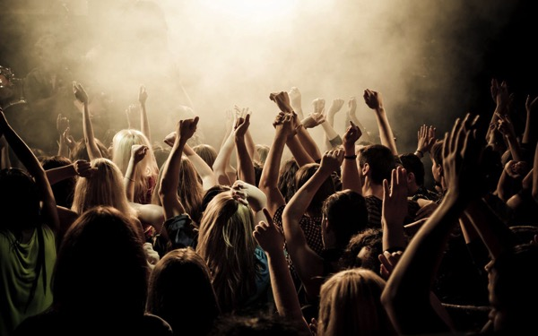
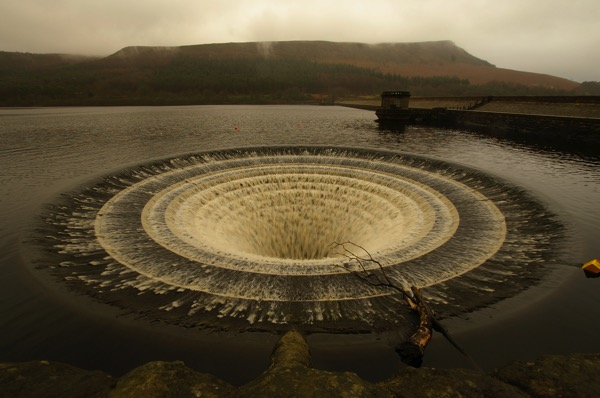
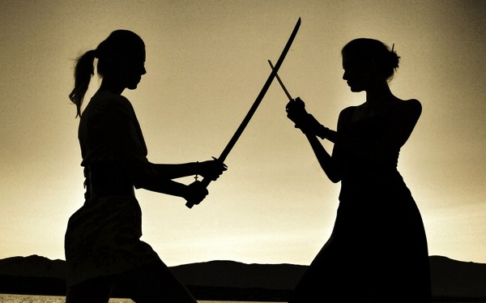

---
categories:
- LIVEのお作法
date: Sat, 24 Jan 2015 16:00:00 +0000
slug: post-7062
tags:
- LIVEのお作法
title: 【LIVEあるある】LIVEの時の譲りあい。いいよね、バンギャのそういう武士的なところ
---

LIVEは戦場。自分の場所を守るために戦います。しかもいい場所だと思っても現状維持は後退を意味します。常に前に進み続けようとする意志がなければ、それは戦闘放棄としてみなされます。でも、人が倒れた時、ギブアップで出て行こうとする人がいる時、やばそうな人をスタッフの方にお知らせして引き上げさせようとする時、細いスペースを移動する時の行き違いに交差する視線、ホールであとから来た人のために椅子から立つ時に交わされる会釈。全てがLIVEを作る要素であり、バンギャ特有の文化だと思います。<!--more-->ハローしんぺー(<a href="https://twitter.com/s_s_p_y" target="_blank">@s_s_p_y</a> )です。
オフィより詳しくて、wikiよりも有用なsukekiyo情報サイト「Gadget Zombie Parasite(ガジェットゾンビィパラサイト)」へようこそ。

著作者: Michael Thomas

一概に言えないのかもしれませんが、他のLIVEに行った時は、どうしてもエゴがでてしまう場所なのかそういった当たり前に行われるべき所作は見受けられませんでした。

<h2>バンギャのこういうところが好き</h2>

<h3>人が倒れた時</h3>

著作者:Sue Langford  原題	:Blowhole *explored at #6!

隣の人がバランス崩して倒れた時、ロシアの大地に突如あいた穴の様に周囲の人が一斉にその人を助けます。

多分崩れた下敷きになった人にしかわからない苦しみがあります。一歩間違えると本当に死ぬしね。

そういや、その昔ムックのイベントがアルタ前でありました。
これが最悪のイベントでした。

確か、アルタビジョンに映像が流れるってことで行ってたと思います。そして映像終了後に係りの人がバラを配り始めました。それを受け取れた人が、その後の少人数のアコースティックライブを生で見られるという流れだったと思います。

ただバラの配り方もスタッフが投げるという明らかに怪我人がでる仕様。しかもアルタビジョンの直下で見てた人中心。後ろの広場でも少し配られてたらしいけど。

で、ぼくは直下で見てたんですが、怖くなってちょい後ろさがった直後にバラが投げられて、全員強風に吹き付けられる草原よろしくぶっ倒れていました。

で、結局バラにも当たり外れがあってせっかくとってもどっちか判らないって寸法。

頭にきてすぐに帰りました。

<h3>やばそうな人を助ける時</h3>

前から横からの圧に負けて倒れそうな人、具合が悪そうで脱出しようとする人。
そういう人がいる時のスタッフを呼ぶ人、ささっと道を開けてあげる人。良いLIVEを作るのにルールなんかなくて、思いやりが良いLIVEを作り上げるのです。

<h3>行き違う時</h3>

細いスペースをお互い行き違う時、わーって行って押しあうんじゃなくて、お互い乾坤一擲目線で語って道を譲るその様は、さながら武士の仕合

<h3>ホールで後から来た人のために席を立つ時</h3>

スタンディングのLIVEだとあまりありませんけど、ホール系で席ありの会場で、こちらが先に座ってて、あとから人が来て時に「すいません」と言われ、さっと席を立つあれです。

<h2><a href="https://twitter.com/s_s_p_y" target="_blank">しんぺー</a> はこう思った。</h2>いぜん、ちょいと若い人が多いバンドのLIVEに行ったら人にあたっても謝りもしないし、押し合いで意図的にぶつかったりとか・・・
モッシュピットじゃなくて普通の場所でもそんな感じでした。それがそのバンドの文化なのかもしれないけど、、、ちょっと閉口しました。

さらに今をトキメク某バンドなんかは、床がツルツル滑るなーとか思って、LIVE終わった後見てみたらマクドナルドの紙袋が。しあもオレンジジュースが入ってたみたいで、漏れ出て滑ったのでした。いやーまじでそんなもん持ち込むなし。しかも床に置くなよ

とかとか

まーこのへん常識の範疇だと思うんですけど、でもLIVE中に暴れてオカシイと思われがちなバンギャですが、常識的な立ち居振る舞いに、ぼくは日本人の古き良さを感じます。譲りあい、思いやり、それこそが良いLIVEを作ると思います。

と言ったところで本日は以上になります。
おやすみなさい。