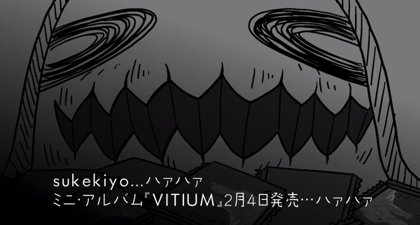
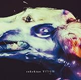

---
categories:
- sukekiyo
date: Sun, 25 Jan 2015 16:00:00 +0000
slug: post-7071
title: 【sukekiyoまとめ】VITIUM収録曲タイトルの読み方と意味
---

いよいよsukekiyo 二〇一五公園「The Unified Field」-双卵の眼-が水曜日の赤坂BLITZを皮切りにスタートします。おそらく1バンド1時間ずつくらいのステージになるのではないでしょうか。ということは8曲〜10曲くらいかな？VITIUM全曲はやらないでしょう。<!--more-->ハローしんぺー(<a href="https://twitter.com/s_s_p_y" target="_blank">@s_s_p_y</a> )です。
オフィより詳しくて、wikiよりも有用なsukekiyo情報サイト「Gadget Zombie Parasite(ガジェットゾンビィパラサイト)」へようこそ。

<h2>VITIUM情報まとめ</h2>

ということで販売前情報のまとめをいたします。まずはこちら

<h3>VITIUM収録曲のタイトルとその意味</h3>

そもそもVITIUMの意味はラテン語で「異常な、欠点、過ち」
読み方は「ウィティウム」です。

収録曲は<a href="http://sukekiyo-official.jp/product/index.html">こちら</a>
01. leather field
02. dunes
03. dot
04. foster mother
05. 雨上がりの優詩
06. maniera
07. 白露
08. celeste
09. focus

<h4>leather field</h4>
読み方　れざーふぃーるど
意味　革のフィールド
はい？？ちょっと明日アメリカ人に聞いてみます。
ちなみにそのまんまで検索するとアパレルメーカー？のサイトがでてきます。

<h4>dunes</h4>
読み方　でゅーんず
意味　砂丘

<h4>dot</h4>
読み方　どっと
意味　「.」これのこと
ただ・・・この意味ではないとは思う。今回のツアータイトルが「The Unified Field」つまり統一場理論なのでこっちだと思われる。

<blockquote>

物理学において、量子効果が顕著に表れるような極めて小さな半導体結晶を量子ドットと呼ぶ。電子がナノスケールの量子井戸に束縛されている状態では、束縛電子のエネルギー固有値が複数に離散化されるので、様々な波長の光を吸収でき、太陽光発電の効率化などの応用が期待されている。

引用:<a href="http://ja.wikipedia.org/wiki/%E3%83%89%E3%83%83%E3%83%88">wikipedia</a>

</blockquote>

<h4>foster mother</h4>
読み方　ふぉすたーまざー
意味　養母
なんとなくdir en greyの方のmidwifeと同じ匂いを感じます。

<h4>雨上がりの優詩</h4>
読み方　あめあがりのゆうし
意味　優詩とは調べてもでてこないので造語だと思います。
原曲は匠

絶え間ない振り込め用紙の嵐に、我々にとっては雨上がりの融資が欲しいところ

<h4>maniera</h4>
読み方　まにえら
意味

<blockquote>
イタリア語の「マニエラ（maniera）」に由来し、「手法」や「様式」を意味する。 ミケランジェロやラファエロの「手法」を評価するにあたり、ヴァザーリはこの「マニエラ」に「自然をも凌駕する高度な芸術的手法」という意味を付加した。
引用：<a href="http://artscape.jp/artword/index.php/%E3%83%9E%E3%83%8B%E3%82%A8%E3%83%AA%E3%82%B9%E3%83%A0">マニエリスム | 現代美術用語辞典ver.2.0 - Artscape</a>
</blockquote>

ということでミケランジェロやらラファエロってことで匠の曲かしら？？

<h4>白露</h4>
読み方　はくろ
意味　大寒とかそういう暦の呼び方の一つのようです。9月8日頃（2014年、2015年は9月8日）、および秋分までの期間。この日から仲秋になるらしい。

<h4>celeste</h4>
読み方　ちぇれすた　もしくは　せれすと　もしくは　ちぇれすて
意味　ちぇれすたなら楽器です。小さいピアノみたいな形をしています。詳しくはこちら<a href="http://ja.wikipedia.org/wiki/%E3%83%81%E3%82%A7%E3%83%AC%E3%82%B9%E3%82%BF">wikipedia</a>

<a href="http://www2.yamaha.co.jp/u/naruhodo/24celesta/celesta1.html#2">鳴るほど♪楽器解体全書　チェレスタの歴史と構造 | ヤマハ株式会社</a> via <a href="http://kwout.com/quote/mdxenife">kwout</a>

ただ、ラジオだとセレストと言ってた。それだと多分空色という意味のイタリア語

<h4>focus</h4>
読み方　ふぉーかす
意味　焦点。ラテン語では「炉(の焼点)」の意味。

ここで試聴ができます。
<iframe width="100%" height="166" scrolling="no" frameborder="no" src="https://w.soundcloud.com/player/?url=https%3A//api.soundcloud.com/tracks/185035490&color=ff5500"></iframe>

さらにMVも公開中
<iframe width="560" height="315" src="//www.youtube.com/embed/x96bW_WWRbc" frameborder="0" allowfullscreen></iframe>

<h3>VITIUMコラボアーティスト情報</h3>

こちらは通常盤以外の通販版と一般初回盤に収録されています。

01. 雨上がりの優詩　Collaboration with Toshl
02. focus　Collaboration with 三上博史
03. elisabeth addict　Remixed by Renholdër
04. latour　Collaboration with Wes Borland

<h4>雨上がりの優詩　Collaboration with Toshl</h4>

X(X JAPAN）のToshIが参加。あの声で雨上がりの優詩をどう歌うのか。気になる。きっと全然違う印象になるんだろうな。

<h4>focus　Collaboration with 三上博史</h4>
<iframe width="420" height="315" src="//www.youtube.com/embed/ZO0nZ7gEYQM" frameborder="0" allowfullscreen></iframe>
なるほどこの世界観ならsukekiyoにあいそうだな。。
それにしても京と関係あったのかな？？聞いた事ないけど

どちらかというと俳優というイメージしかなかった。

<h4>elisabeth addict　Remixed by Renholdër</h4>

元NINE INCH NAILSのメンバーのRENHOLDËR（Danny Lohner）
あまり詳しくないです。アルバム一枚iTunesに入ってた！結構ダウナーな感じで世界観はあってると思います。
どんなリミックスになるか楽しみです。

<h4>latour　Collaboration with Wes Borland</h4>
LIMP BIZKITのWes Borland

リンプほとんど聞いたことないけど、とりあえずDIR EN GREYやsukekiyoとは全然違うアップテンポでポップな感じだと認識しています。
でも、ちょいと調べてみたら割と通じるところがありそうな・・・

http://youtu.be/m9a2HJ3pEKo

結構イっちゃってる人っぽい。昔の京を思い出す。
<a style="color:#0070C5;" href="http://matome.naver.jp/odai/2138755042969088701" target="_blank">特殊メイクが変態すぎるLimp Bizkitのギタリスト、ウェス・ボーランドの画像集 - NAVER まとめ</a>  

どんな風にアレンジさるのやら

<h2>ゼメキス家からカワイイアニメーション</h2>

<iframe width="560" height="315" src="//www.youtube.com/embed/4pxHdo3pm2s" frameborder="0" allowfullscreen></iframe>

これかわいいなw3分番組とかでYoutubeで番組作って欲しい、、、

で、最後

コマーシャルかよwww

<h2><a href="https://twitter.com/s_s_p_y" target="_blank">しんぺー</a> はこう思った。</h2>

今回の双卵の眼はいい番号の整番だったんですが、LM.Cからずっと前の方で棒立ちもきついかなというのと諸々の事情でちょいとパスしました。

そういえば本日からkyo-online予約のツアーチケットの発券期間ですが、ぼくはちゃんと入金していたのだろうか。

これで結局入金してなかったら、チケット急いで手配しなければだ。。。
そして最悪なのは入金してたけど発券番号のボタンが復活しないで、分からなくて発券できないってパティーン

いやー本当にそしたら悪夢です。。

まーインストには行けるので最悪それだけでも。。。
いや、渋谷のLIVEは行きたいな。

とりあえず悪意ちゃんのLINEスタンプはよ

と言ったところで本日は以上になります。
おやすみなさい。

<table  border="0" cellpadding="5" style="border:none"><tr><td style="border:none;text-align:left">vitium(初回生産限定盤) (デジタルミュージックキャンペーン対象商品: 400円クーポン)</td></tr><tr><td style="border:none"><table  border="0" cellpadding="0" style="border:none"><tr><td valign="top" style="border:none"></td><td valign="top" style="border:none;text-align:left">
sukekiyo Fire Wall Division 2015-02-04

売り上げランキング : 1274
<table style="border:none;margin-top:10px"><tr><td style="border:none;text-align:left;">
<a href="http://www.amazon.co.jp/gp/search?keywords=sukekiyo&__mk_ja_JP=%83J%83%5E%83J%83i&tag=warawareotoko-22" rel="nofollow" target="_blank" title="アマゾン" >Amazon</a>

<a href="http://hb.afl.rakuten.co.jp/hgc/0f6e221b.2eb9748a.0f6e221c.35cc1e84/?pc=http%3A%2F%2Fsearch.rakuten.co.jp%2Fsearch%2Fmall%2Fsukekiyo%2F-%2Ff.1-p.1-s.1-sf.0-st.A-v.2%3Fx%3D0%26scid%3Daf_ich_link_urltxt%26m%3Dhttp%3A%2F%2Fm.rakuten.co.jp%2F" rel="nofollow" target="_blank" title="楽天市場" >楽天市場</a>

<a href="http://ck.jp.ap.valuecommerce.com/servlet/referral?sid=3041033&pid=882528283&vc_url=http%3A%2F%2Fshopping.search.yahoo.co.jp%2Fsearch%3FuIv%3Don%26ei%3DUTF-8%26tab_ex%3Dcommerce%26slider%3D0%26va%3Dsukekiyo" rel="nofollow"  target="_blank" title="Yahooショッピング" >Yahooショッピング</a>

<a href="http://ck.jp.ap.valuecommerce.com/servlet/referral?sid=3041033&pid=882660047&vc_url=http%3A%2F%2Fauctions.search.yahoo.co.jp%2Fsearch%3Fvo%3D%26ve%3D%26auccat%3D0%26aucminprice%3D%26aucmaxprice%3D%26aucmin_bidorbuy_price%3D%26aucmax_bidorbuy_price%3D%26loc_cd%3D0%26abatch%3D0%26istatus%3D0%26filtered%3D1%26ei%3DUTF-8%26tab_ex%3Dcommerce%26va%3Dsukekiyo" rel="nofollow"  target="_blank" title="ヤフオク!" >ヤフオク!</a>
</td><td style="vertical-align:bottom;padding-left:10px;font-size:x-small;border:none">by <a href="http://kaereba.com" rel="nofollow" target="_blank">カエレバ</a></td></tr></table></td></tr></table></td></tr></table>

<table  border="0" cellpadding="5" style="border:none"><tr><td style="border:none;text-align:left"><a href="http://www.amazon.co.jp/exec/obidos/ASIN/B00Q3APQHS/warawareotoko-22/ref=nosim/" rel="nofollow" target="_blank" target="_top">VITIUM(初回生産限定盤)</a></td></tr><tr><td style="border:none"><table  border="0" cellpadding="0" style="border:none"><tr><td valign="top" style="border:none"></td><td valign="top" style="border:none;text-align:left">
sukekiyo SMD itaku (music) 2015-02-04

売り上げランキング : 286
<table style="border:none;margin-top:10px"><tr><td style="border:none;text-align:left;">
<a href="http://www.amazon.co.jp/gp/search?keywords=sukekiyo&__mk_ja_JP=%83J%83%5E%83J%83i&tag=warawareotoko-22" rel="nofollow" target="_blank" title="アマゾン" >Amazon</a>

<a href="http://hb.afl.rakuten.co.jp/hgc/0f6e221b.2eb9748a.0f6e221c.35cc1e84/?pc=http%3A%2F%2Fsearch.rakuten.co.jp%2Fsearch%2Fmall%2Fsukekiyo%2F-%2Ff.1-p.1-s.1-sf.0-st.A-v.2%3Fx%3D0%26scid%3Daf_ich_link_urltxt%26m%3Dhttp%3A%2F%2Fm.rakuten.co.jp%2F" rel="nofollow" target="_blank" title="楽天市場" >楽天市場</a>

<a href="http://ck.jp.ap.valuecommerce.com/servlet/referral?sid=3041033&pid=882528283&vc_url=http%3A%2F%2Fshopping.search.yahoo.co.jp%2Fsearch%3FuIv%3Don%26ei%3DUTF-8%26tab_ex%3Dcommerce%26slider%3D0%26va%3Dsukekiyo" rel="nofollow"  target="_blank" title="Yahooショッピング" >Yahooショッピング</a>

<a href="http://ck.jp.ap.valuecommerce.com/servlet/referral?sid=3041033&pid=882660047&vc_url=http%3A%2F%2Fauctions.search.yahoo.co.jp%2Fsearch%3Fvo%3D%26ve%3D%26auccat%3D0%26aucminprice%3D%26aucmaxprice%3D%26aucmin_bidorbuy_price%3D%26aucmax_bidorbuy_price%3D%26loc_cd%3D0%26abatch%3D0%26istatus%3D0%26filtered%3D1%26ei%3DUTF-8%26tab_ex%3Dcommerce%26va%3Dsukekiyo" rel="nofollow"  target="_blank" title="ヤフオク!" >ヤフオク!</a>
</td><td style="vertical-align:bottom;padding-left:10px;font-size:x-small;border:none">by <a href="http://kaereba.com" rel="nofollow" target="_blank">カエレバ</a></td></tr></table></td></tr></table></td></tr></table>

<table  border="0" cellpadding="5" style="border:none"><tr><td style="border:none;text-align:left"><a href="http://www.amazon.co.jp/exec/obidos/ASIN/B00Q3APRH2/warawareotoko-22/ref=nosim/" rel="nofollow" target="_blank" target="_top">VITIUM</a></td></tr><tr><td style="border:none"><table  border="0" cellpadding="0" style="border:none"><tr><td valign="top" style="border:none"></td><td valign="top" style="border:none;text-align:left">
sukekiyo SMD itaku (music) 2015-02-04

売り上げランキング : 1588
<table style="border:none;margin-top:10px"><tr><td style="border:none;text-align:left;">
<a href="http://www.amazon.co.jp/gp/search?keywords=sukekiyo&__mk_ja_JP=%83J%83%5E%83J%83i&tag=warawareotoko-22" rel="nofollow" target="_blank" title="アマゾン" >Amazon</a>

<a href="http://hb.afl.rakuten.co.jp/hgc/0f6e221b.2eb9748a.0f6e221c.35cc1e84/?pc=http%3A%2F%2Fsearch.rakuten.co.jp%2Fsearch%2Fmall%2Fsukekiyo%2F-%2Ff.1-p.1-s.1-sf.0-st.A-v.2%3Fx%3D0%26scid%3Daf_ich_link_urltxt%26m%3Dhttp%3A%2F%2Fm.rakuten.co.jp%2F" rel="nofollow" target="_blank" title="楽天市場" >楽天市場</a>

<a href="http://ck.jp.ap.valuecommerce.com/servlet/referral?sid=3041033&pid=882528283&vc_url=http%3A%2F%2Fshopping.search.yahoo.co.jp%2Fsearch%3FuIv%3Don%26ei%3DUTF-8%26tab_ex%3Dcommerce%26slider%3D0%26va%3Dsukekiyo" rel="nofollow"  target="_blank" title="Yahooショッピング" >Yahooショッピング</a>

<a href="http://ck.jp.ap.valuecommerce.com/servlet/referral?sid=3041033&pid=882660047&vc_url=http%3A%2F%2Fauctions.search.yahoo.co.jp%2Fsearch%3Fvo%3D%26ve%3D%26auccat%3D0%26aucminprice%3D%26aucmaxprice%3D%26aucmin_bidorbuy_price%3D%26aucmax_bidorbuy_price%3D%26loc_cd%3D0%26abatch%3D0%26istatus%3D0%26filtered%3D1%26ei%3DUTF-8%26tab_ex%3Dcommerce%26va%3Dsukekiyo" rel="nofollow"  target="_blank" title="ヤフオク!" >ヤフオク!</a>
</td><td style="vertical-align:bottom;padding-left:10px;font-size:x-small;border:none">by <a href="http://kaereba.com" rel="nofollow" target="_blank">カエレバ</a></td></tr></table></td></tr></table></td></tr></table>