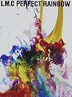

---
categories:
- sukekiyo
date: Sat, 31 Jan 2015 16:00:00 +0000
slug: post-7090
tags:
- sukekiyoまとめ
title: 【sukekiyoまとめ】ついにスタートThe Unified Field-双卵の眼-LM.CとHEAD PHONES PRESIDENT
---

参列（参戦）していないLIVEの記事書くのどうかといつも思ってるのですが、感想とかじゃなくて参加していなくもてわかる範囲で情報をまとめておきます。なのでLIVE中のMCや様子、感想はここにはありません。基本的にセトリと関係者Twitterと、補足情報です。LIVEレポは参列された方のブログを見ていただければと思います！

<!--more-->

ハローしんぺー(<a href="https://twitter.com/s_s_p_y" target="_blank">@s_s_p_y</a> )です。
オフィより詳しくて、wikiよりも有用なsukekiyo情報サイト「Gadget Zombie Parasite(ガジェットゾンビィパラサイト)」へようこそ。

<h2>LM.C</h2>

各日限定のコラボステッカー
<blockquote class="twitter-tweet" lang="ja">
今日はsukekiyoとの対バンです。&#10;&#10;表現のベクトルがほぼ真逆なバンド同士なので、ある意味楽しみっす！&#10;&#10;sukekiyoファンの皆様もチーマーのみんなも、共に楽しみましょう。 <a href="http://t.co/48KN4JisGH">pic.twitter.com/48KN4JisGH</a>
&mdash; LM.C Aiji (@Aiji_LMC) 2015, 1月 28</blockquote>

<h3>LM.Cのセトリ</h3>

1.No.9
2.LET ME' CRAZY!! 
3.MOGURA
4.DOUBLE DRAGON
5.OH MY JULIET.
6.SUPER DUPER GALAXY
7.DREAMscape
8.JUST LIKE THIS!!
9.Chameleon Dance
10.Ah Hah!
11.☆ROCKtheLM.C☆

最新のアルバムがこちらのようです。
<table  border="0" cellpadding="5" style="border:none"><tr><td style="border:none;text-align:left"><a href="http://www.amazon.co.jp/exec/obidos/ASIN/B00OAXJYKK/warawareotoko-22/ref=nosim/" rel="nofollow" target="_blank" target="_top">PERFECT RAINBOW【初回限定盤】</a></td></tr><tr><td style="border:none"><table  border="0" cellpadding="0" style="border:none"><tr><td valign="top" style="border:none"></td><td valign="top" style="border:none;text-align:left">
LM.C ビクターエンタテインメント 2014-12-17

売り上げランキング : 88556
<table style="border:none;margin-top:10px"><tr><td style="border:none;text-align:left;">
<a href="http://www.amazon.co.jp/gp/search?keywords=PERFECT%20RAINBOW%81y%8F%89%89%F1%8C%C0%92%E8%94%D5%81z&__mk_ja_JP=%83J%83%5E%83J%83i&tag=warawareotoko-22" rel="nofollow" target="_blank" title="アマゾン" >Amazon</a>

<a href="http://hb.afl.rakuten.co.jp/hgc/0f6e221b.2eb9748a.0f6e221c.35cc1e84/?pc=http%3A%2F%2Fsearch.rakuten.co.jp%2Fsearch%2Fmall%2FPERFECT%2520RAINBOW%25E3%2580%2590%25E5%2588%259D%25E5%259B%259E%25E9%2599%2590%25E5%25AE%259A%25E7%259B%25A4%25E3%2580%2591%2F-%2Ff.1-p.1-s.1-sf.0-st.A-v.2%3Fx%3D0%26scid%3Daf_ich_link_urltxt%26m%3Dhttp%3A%2F%2Fm.rakuten.co.jp%2F" rel="nofollow" target="_blank" title="楽天市場" >楽天市場</a>

<a href="http://ck.jp.ap.valuecommerce.com/servlet/referral?sid=3041033&pid=882528283&vc_url=http%3A%2F%2Fshopping.search.yahoo.co.jp%2Fsearch%3FuIv%3Don%26ei%3DUTF-8%26tab_ex%3Dcommerce%26slider%3D0%26va%3DPERFECT%2520RAINBOW%25E3%2580%2590%25E5%2588%259D%25E5%259B%259E%25E9%2599%2590%25E5%25AE%259A%25E7%259B%25A4%25E3%2580%2591" rel="nofollow"  target="_blank" title="Yahooショッピング" >Yahooショッピング</a>

<a href="http://ck.jp.ap.valuecommerce.com/servlet/referral?sid=3041033&pid=882660047&vc_url=http%3A%2F%2Fauctions.search.yahoo.co.jp%2Fsearch%3Fvo%3D%26ve%3D%26auccat%3D0%26aucminprice%3D%26aucmaxprice%3D%26aucmin_bidorbuy_price%3D%26aucmax_bidorbuy_price%3D%26loc_cd%3D0%26abatch%3D0%26istatus%3D0%26filtered%3D1%26ei%3DUTF-8%26tab_ex%3Dcommerce%26va%3DPERFECT%2520RAINBOW%25E3%2580%2590%25E5%2588%259D%25E5%259B%259E%25E9%2599%2590%25E5%25AE%259A%25E7%259B%25A4%25E3%2580%2591" rel="nofollow"  target="_blank" title="ヤフオク!" >ヤフオク!</a>
</td><td style="vertical-align:bottom;padding-left:10px;font-size:x-small;border:none">by <a href="http://kaereba.com" rel="nofollow" target="_blank">カエレバ</a></td></tr></table></td></tr></table></td></tr></table>

<h3>LIVE後のLM.CギターAijiの反応</h3>

<blockquote class="twitter-tweet" lang="ja">
今日のsukekiyoとの対バン@赤坂ブリッツ、超刺激的だった。&#10;2バンドだからこそのコントラスト具合で、お互いの世界感がブーストし合えたライブだったと思う！&#10;対バンのライブをほぼ全部ちゃんと観たのも本当久しぶりで、しっかり刺激いただきました。&#10;&#10;最高に楽しかったっす！
&mdash; LM.C Aiji (@Aiji_LMC) 2015, 1月 28</blockquote>

<blockquote class="twitter-tweet" lang="ja">
こちらこそありがとう！素敵なイベントに呼んでもらえて最高に刺激的でした☆ RT <a href="https://twitter.com/yuchivalism">@yuchivalism</a>: <a href="https://twitter.com/Aiji_LMC">@Aiji_LMC</a> 今日は本当にありがとうございました～！&#10;超異種格闘技的な感じでしたが(笑)、一緒に出来てとっても嬉しかったです！&#10;アルバムもありがとうございました～！
&mdash; LM.C Aiji (@Aiji_LMC) 2015, 1月 28</blockquote>

YUCHIとLM.Cボーカルのmayaは親交があるらしい。なんでも10年以上の付き合い（ソースはYUCHIの<a href="http://ameblo.jp/yuchi-bassist/entry-11983057845.html?frm_src=thumb_module">ブログ</a>）

<blockquote class="twitter-tweet" lang="ja">
しかし、京くんと同じステージに立つのは18年ぶりとか…だったかな。&#10;お互い走り続けてきて、今こうしてまた同じステージで対バンするとか…&#10;まったく想像すらしなかった、今日の対バン。
&mdash; LM.C Aiji (@Aiji_LMC) 2015, 1月 28</blockquote>

1997年?のSHOCK WAVEというイベントにどうやらPIERROTとDIR EN GREYがでてるっぽい
<iframe width="420" height="315" src="https://www.youtube.com/embed/D52D7GIdOic" frameborder="0" allowfullscreen></iframe>

京曰くキリトとは前回のIMMORTALISが初対面っとのことなので。（IMMORATLIS京公式オンラインストア限定初回仕様限定盤購入者特典の全曲解説生放送より）

<a style="color:#0070C5;" href="https://www.warawareotoko.com/2014/05/11/post-5343/" target="_blank">今週のsukekiyoまとめ!5月4日〜5月11日(2014)タワレコインストと全曲解説について | Gadget Zombie Parasite</a>  

<blockquote class="twitter-tweet" lang="ja">
やっぱ、昔からの同世代の音楽仲間ってのは本当に刺激になるし、当時の仲間がドンドンいなくなっていく中、今も戦い続けてる仲間がいるってだけで、自分もがんばれる。&#10;&#10;これからも、そんな存在でお互い居たいなぁと思った。&#10;そんな赤坂ブリッツ。
&mdash; LM.C Aiji (@Aiji_LMC) <a href="https://twitter.com/Aiji_LMC/status/560476195356024832">2015, 1月 28</a></blockquote>

次はゼヒPIERROTとコラボお願いします。というかもうsukekiyoでフェスやってくれ。頼む。
suke、ピ、cali≠gari、X、LUNA SEA、凛としれ時雨、鬼束ちひろとかよんで武道館でやってください。お願いします。

<blockquote class="twitter-tweet" lang="ja">
素敵な機会を与えてくれたsukekiyoメンバー、スタッフ、ファンの皆さん、本当にありがとうございます。
&mdash; LM.C Aiji (@Aiji_LMC) <a href="https://twitter.com/Aiji_LMC/status/560476757183053824">2015, 1月 28</a></blockquote>

ってかmayaの方のTwitterみたら年末から止まってましたw

<h2>sukekiyoのセトリ</h2>

1.destrudo
2.aftermath
3.hemimetabolism
4.烏有の空
5.新曲1
6.新曲2
7.vandal
8.斑人間
9.楽器隊のセッション
10.mama
11.zhphyr
12.focus
13.in all weathers

なお、追加公演として調布グリーンホールというところでのLIVEが発表されました。

<h2>HEAD PHONES PRESIDENT</h2>

各日限定のコラボステッカー

<map id="map_b75mjbqs" name="map_b75mjbqs"><area coords="0,0,96,28" href="http://www.ameba.jp/" alt="" shape="rect" /><area coords="102,0,159,28" href="http://mypage.ameba.jp/" alt="" shape="rect" /><area coords="172,0,199,28" href="http://pigg.ameba.jp/" alt="" shape="rect" /><area coords="212,0,259,28" href="http://blog.ameba.jp/ucs/top.do" alt="" shape="rect" /></map>
<a href="http://ameblo.jp/yuchi-bassist/entry-11983792258.html">双卵の眼、名古屋公演終了！｜YUCHI OFFICIAL BLOG 「discharge!」Powered by Ameba</a> via <a href="http://kwout.com/quote/b75mjbqs">kwout</a>

<h3>HEAD PHONES PRESIDENTのセトリ</h3>

1.Life is not fair
2.Hang Veil
3.sacrificed
4.Breeze
5.Far Away
6.A New World
7.The On To Break
8.Light to Die
9.Where Are You
10.Stand in The World

<h2>sukekiyoのセトリ</h2>

1.destrudo
2.aftermath
3.hemimetabolism
4.烏有の空
5.新曲
6.新曲
7.vandal
8.斑人間
9.楽器隊セッション
10.mama
11.zhphyr
12.focus
13.in all weathers

<h3>LIVE後のHEAD PHONES PRESIDENT関係者の反応</h3>

LIVE後の匠のブログ。時間的に寝ないでそのまま書かれているみたいですw
<a style="color:#0070C5;" href="http://ameblo.jp/takumixofficial/entry-11983726496.html" target="_blank">sukekiyo / HEAD PHONES PRESIDENT 名古屋公演終了｜匠オフィシャルブログ「Takumi's blog」by Ameba</a>  

なるほどシンセを弾きながらギターとか、匠と同じだ。そりゃあきっと話も盛り上がっただろうな。本当に匠の楽器持ち替え回数を数えたことあったけど2桁いったので、すげーって思ったの思い出した。
<blockquote class="instagram-media" data-instgrm-captioned data-instgrm-version="4" style=" background:#FFF; border:0; border-radius:3px; box-shadow:0 0 1px 0 rgba(0,0,0,0.5),0 1px 10px 0 rgba(0,0,0,0.15); margin: 1px; max-width:658px; padding:0; width:99.375%; width:-webkit-calc(100% - 2px); width:calc(100% - 2px);">
 
 

 
 <a href="https://instagram.com/p/yewfxtFFaz/" style=" color:#000; font-family:Arial,sans-serif; font-size:14px; font-style:normal; font-weight:normal; line-height:17px; text-decoration:none; word-wrap:break-word;" target="_top">ライブ機材全景。 鍵盤は懐かしの名機Trinityでした！</a>
 
Saito Hiroakiさん(@hirohpp)が投稿した写真 - <time style=" font-family:Arial,sans-serif; font-size:14px; line-height:17px;" datetime="2015-01-30T13:57:43+00:00">2015 1月 30 5:57午前 PST</time>

</blockquote>

ボーカルANZAさんのfacebook

 

<a href="https://www.facebook.com/photo.php?fbid=444902119006265&amp;set=a.402040716625739.1073741826.100004594417078&amp;type=1">投稿</a> by Anza Ohyama.

<h2><a href="https://twitter.com/s_s_p_y" target="_blank">しんぺー</a> はこう思った。</h2>
次回は2月2日の福岡のスカラエスパシオにてacid androidoとの対バンです。

それと公式アカウントで毎日カウントダウンツイートがされています。VITIUMの発売もとうとう来週です。

だ、だれ・・・
<blockquote class="twitter-tweet" lang="ja">
『VITIUM』まであと… (S) <a href="http://t.co/AFw5Vpbadp">pic.twitter.com/AFw5Vpbadp</a>
&mdash; sukekiyo (@sukekiyo_band) <a href="https://twitter.com/sukekiyo_band/status/560756348388777986">2015, 1月 29</a></blockquote>

<blockquote class="twitter-tweet" lang="ja">
<a href="https://twitter.com/hashtag/sukekiyo?src=hash">#sukekiyo</a> <a href="https://twitter.com/hashtag/VITIUM?src=hash">#VITIUM</a> <a href="https://twitter.com/hashtag/2%E6%9C%884%E6%97%A5?src=hash">#2月4日</a> (S) <a href="http://t.co/rHTxACvcgx">pic.twitter.com/rHTxACvcgx</a>
&mdash; sukekiyo (@sukekiyo_band) <a href="https://twitter.com/sukekiyo_band/status/561072626450198528">2015, 1月 30</a></blockquote>

と言ったところで本日は以上になります。おやすみなさい。