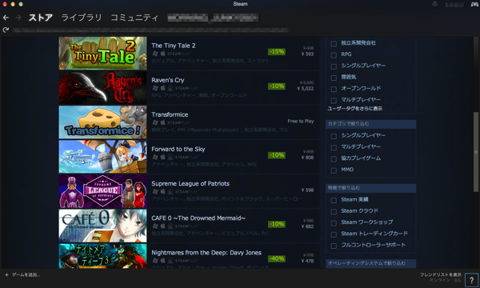
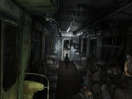
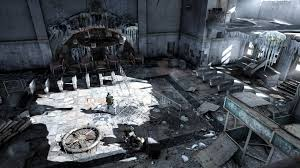
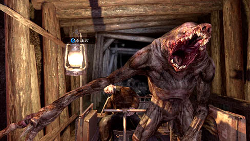
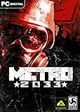

---
categories:
- ゲーム
date: Sun, 01 Feb 2015 16:00:00 +0000
slug: post-7102
tags:
- おすすめ
title: 【おすすめゲーム】METRO 2033の世界観がめちゃくちゃ好きです【 STEAM】
---

PCゲームをやっている人ってそこまで多くないと思います。が、クオリティが高く、そして価格が低いゲームが以外にも家庭用ゲーム機ででてなかったり、出るのが遅かったりします。
しかもセール期間があったりして、すごい安く手に入ったりします。今日はそんな中から、今ぼくがやっているゲームの紹介です。<!--more-->ハローしんぺー(<a href="https://twitter.com/s_s_p_y" target="_blank">@s_s_p_y</a> )です。
オフィより詳しくて、wikiよりも有用なsukekiyo情報サイト「Gadget Zombie Parasite(ガジェットゾンビィパラサイト)」へようこそ。

<h2>PCゲームをやりたかったらSTEAM（スチーム）を導入しよう</h2>

STEAM知ってますか？

<a style="color:#0070C5;" href="http://store.steampowered.com/?l=japanese" target="_blank">Steam へようこそ</a>  

<blockquote>
Steam（スチーム）は、コンピュータゲームのダウンロード販売、デジタル著作権管理、マルチプレイヤーゲームのサポート、ユーザの交流補助を目的としたプラットフォームである。 開発および運営はValve Corporationによって行なわれている。

引用：<a href="http://ja.wikipedia.org/wiki/Steam">wikipedia</a>
</blockquote>

要はiTunesStoreとかAppStoreとかと同じで、PCゲームを購入・ダウンロードできるプラットフォームです。
とりあえず、これをダウンロードしてインストールして、そこから欲しいゲームを見つけて購入すれば遊べるというすんぽうです。

しかも年末年始とかクリスマスとか定期定期にセールを行っているので15%OFFとか古めのゲームだと80%OFFとかで購入できるのです！

さらに！！
現在開発中のゲームとかも公開されていて一部プレイできたりします。

早期アクセスと言いますが、開発会社がβ版として公開していたりするので発売前にいち早くプレイできるというお得感があります。

ただ、これやっぱりまだ早期のアクセスということもあって、ゲームのバグとか荒さとかが満載です。さらにずーっと早期アクセスでそのまま一行に発売されないケースもあったりしますので、ちょっとこの辺は気になるところです。

<h2>「METRO 2033」</h2>

そんな中、ゲーム実況の弟者氏がやっていたゲームを見て気になったのがきっかけで、このゲームを購入してみました。

<iframe width="560" height="315" src="https://www.youtube.com/embed/videoseries?list=PL1Z1KdfmKueZfqmaB-cYwVLM71AwpDV4c" frameborder="0" allowfullscreen></iframe>

ウクライナ製のゲームらしいです。

<blockquote>
メトロ2033は2002年にロシアの作家、ドミトリー・グルホフスキーがインターネット上で発表した『終末もの』のSF小説。最終戦争後のモスクワの地下世界を舞台に、ミュータントの襲撃に苦しむ地下鉄駅で暮らす青年が遠く離れた地下都市に助けを求める旅に出る物語。

引用：<a href="http://ja.wikipedia.org/wiki/%E3%83%A1%E3%83%88%E3%83%AD2033">wikipedia</a>

</blockquote>

いわゆるFPS（ファーストパーソンシューティング）ゲームです。一人称視点で、銃などの武器を使って敵を倒していきます。

<h3>ストーリー</h3>

核戦争後のロシア。汚染された地上に住めなくなった人々は、地下鉄の奥深くに身を隠し生活していた。

地上には、核戦争後に出現したミュータントが生息しており、人間にかわって闊歩している。そして、残りすくない人類を絶滅させんがごとく、人々が生活する地下鉄の駅を襲撃していた。

主人公のアルチョムは、故郷の駅を救うため、中央の駅に助けを求めるための旅にでたのであった。

<h3>世界観</h3>

ぼく、このゲームをやって確信しました。

世界滅亡後の荒廃した世界観が多分好き。
倒壊寸前の高層ビル、破壊された道路、そしてそこを自分の知恵と力で生存する人間。

ラストオブアスもそうだけど、こういう世界観大好き！！！ということに気がつきました。

さて、このゲームの主な敵は、ミュータントです。こいつらは様々な姿形をしていますが、基本獣のような姿をしたモンスターです。知能はありません。人間を見つけて食料とみなして襲ってくるみたいです。

で、一番の雑魚と思われる頻出モンスター「ノサリス」というのがいるのですが、これが強い。。。しまも集団で出てくる。。。10匹以上で。。。

ということで、結構難しいゲームです。

<h2>こんな人におすすめ</h2>

・家庭用ゲーム機で今やりたいゲームがとくにない。
・骨太のストーリー系FPSがやりたい。
・少しでも安く面白いゲームがやりたい。
・幽霊的なホラーじゃないスリリングさを求めている。

<h2><a href="https://twitter.com/s_s_p_y" target="_blank">しんぺー</a> はこう思った。</h2>
発売されて、数年経っていますので価格がかなり落ちております。
しかも、ぼくは続編のMETRO LAST LIGHTと抱き合わせで80%OFFで購入しました。

とりあえず、PC操作に慣れていないのと、難易度がやっぱりちょいと高めなので難しいです。

しかし！！慣れてきて、戦闘シーンとかめちゃくちゃ楽しくなってきました！！

迫り来るミュータントの群れに、生き抜くための希望を銃弾に込めて撃つ。

この生き抜く快感がたまらない！！あとホラー要素というかスリリングさがかなりあるので、これもまたたまらない！！

おすすめでっす！

ちなみにこのゲームXboXやPS4でも発売されていますので、そちらをプレイしてみるのもいいかと思います！

<table  border="0" cellpadding="5" style="border:none"><tr><td style="border:none;text-align:left"><a href="http://www.amazon.co.jp/exec/obidos/ASIN/B00M1JTHRK/warawareotoko-22/ref=nosim/" rel="nofollow" target="_blank" target="_top">メトロ リダックス</a></td></tr><tr><td style="border:none"><table  border="0" cellpadding="0" style="border:none"><tr><td valign="top" style="border:none"></td><td valign="top" style="border:none;text-align:left">
 スパイク・チュンソフト 2014-10-30

売り上げランキング : 270
<table style="border:none;margin-top:10px"><tr><td style="border:none;text-align:left;">
<a href="http://www.amazon.co.jp/gp/search?keywords=METRO%202033&__mk_ja_JP=%83J%83%5E%83J%83i&tag=warawareotoko-22" rel="nofollow" target="_blank" title="アマゾン" >Amazon</a>

<a href="http://hb.afl.rakuten.co.jp/hgc/0f6e221b.2eb9748a.0f6e221c.35cc1e84/?pc=http%3A%2F%2Fsearch.rakuten.co.jp%2Fsearch%2Fmall%2FMETRO%25202033%2F-%2Ff.1-p.1-s.1-sf.0-st.A-v.2%3Fx%3D0%26scid%3Daf_ich_link_urltxt%26m%3Dhttp%3A%2F%2Fm.rakuten.co.jp%2F" rel="nofollow" target="_blank" title="楽天市場" >楽天市場</a>

<a href="http://ck.jp.ap.valuecommerce.com/servlet/referral?sid=3041033&pid=882528283&vc_url=http%3A%2F%2Fshopping.search.yahoo.co.jp%2Fsearch%3FuIv%3Don%26ei%3DUTF-8%26tab_ex%3Dcommerce%26slider%3D0%26va%3DMETRO%25202033" rel="nofollow"  target="_blank" title="Yahooショッピング" >Yahooショッピング</a>

<a href="http://ck.jp.ap.valuecommerce.com/servlet/referral?sid=3041033&pid=882660047&vc_url=http%3A%2F%2Fauctions.search.yahoo.co.jp%2Fsearch%3Fvo%3D%26ve%3D%26auccat%3D0%26aucminprice%3D%26aucmaxprice%3D%26aucmin_bidorbuy_price%3D%26aucmax_bidorbuy_price%3D%26loc_cd%3D0%26abatch%3D0%26istatus%3D0%26filtered%3D1%26ei%3DUTF-8%26tab_ex%3Dcommerce%26va%3DMETRO%25202033" rel="nofollow"  target="_blank" title="ヤフオク!" >ヤフオク!</a>
</td><td style="vertical-align:bottom;padding-left:10px;font-size:x-small;border:none">by <a href="http://kaereba.com" rel="nofollow" target="_blank">カエレバ</a></td></tr></table></td></tr></table></td></tr></table>

<table  border="0" cellpadding="5" style="border:none"><tr><td style="border:none;text-align:left"><a href="http://www.amazon.co.jp/exec/obidos/ASIN/B003AZZSWW/warawareotoko-22/ref=nosim/" rel="nofollow" target="_blank" target="_top">メトロ2033</a></td></tr><tr><td style="border:none"><table  border="0" cellpadding="0" style="border:none"><tr><td valign="top" style="border:none"></td><td valign="top" style="border:none;text-align:left">
 スパイク 2010-05-13

売り上げランキング : 4138
<table style="border:none;margin-top:10px"><tr><td style="border:none;text-align:left;">
<a href="http://www.amazon.co.jp/gp/search?keywords=METRO%202033&__mk_ja_JP=%83J%83%5E%83J%83i&tag=warawareotoko-22" rel="nofollow" target="_blank" title="アマゾン" >Amazon</a>

<a href="http://hb.afl.rakuten.co.jp/hgc/0f6e221b.2eb9748a.0f6e221c.35cc1e84/?pc=http%3A%2F%2Fsearch.rakuten.co.jp%2Fsearch%2Fmall%2FMETRO%25202033%2F-%2Ff.1-p.1-s.1-sf.0-st.A-v.2%3Fx%3D0%26scid%3Daf_ich_link_urltxt%26m%3Dhttp%3A%2F%2Fm.rakuten.co.jp%2F" rel="nofollow" target="_blank" title="楽天市場" >楽天市場</a>

<a href="http://ck.jp.ap.valuecommerce.com/servlet/referral?sid=3041033&pid=882528283&vc_url=http%3A%2F%2Fshopping.search.yahoo.co.jp%2Fsearch%3FuIv%3Don%26ei%3DUTF-8%26tab_ex%3Dcommerce%26slider%3D0%26va%3DMETRO%25202033" rel="nofollow"  target="_blank" title="Yahooショッピング" >Yahooショッピング</a>

<a href="http://ck.jp.ap.valuecommerce.com/servlet/referral?sid=3041033&pid=882660047&vc_url=http%3A%2F%2Fauctions.search.yahoo.co.jp%2Fsearch%3Fvo%3D%26ve%3D%26auccat%3D0%26aucminprice%3D%26aucmaxprice%3D%26aucmin_bidorbuy_price%3D%26aucmax_bidorbuy_price%3D%26loc_cd%3D0%26abatch%3D0%26istatus%3D0%26filtered%3D1%26ei%3DUTF-8%26tab_ex%3Dcommerce%26va%3DMETRO%25202033" rel="nofollow"  target="_blank" title="ヤフオク!" >ヤフオク!</a>
</td><td style="vertical-align:bottom;padding-left:10px;font-size:x-small;border:none">by <a href="http://kaereba.com" rel="nofollow" target="_blank">カエレバ</a></td></tr></table></td></tr></table></td></tr></table>

AmazonからもDLできます。
<table  border="0" cellpadding="5" style="border:none"><tr><td style="border:none;text-align:left"><a href="http://www.amazon.co.jp/exec/obidos/ASIN/B00NEFHDCG/warawareotoko-22/ref=nosim/" rel="nofollow" target="_blank" target="_top">Metro 2033 [オンラインコード] [ダウンロード]</a></td></tr><tr><td style="border:none"><table  border="0" cellpadding="0" style="border:none"><tr><td valign="top" style="border:none"></td><td valign="top" style="border:none;text-align:left">
 Deep Silver 2010-03-18

売り上げランキング : 113
<table style="border:none;margin-top:10px"><tr><td style="border:none;text-align:left;">
<a href="http://www.amazon.co.jp/gp/search?keywords=METRO%202033&__mk_ja_JP=%83J%83%5E%83J%83i&tag=warawareotoko-22" rel="nofollow" target="_blank" title="アマゾン" >Amazon</a>

<a href="http://hb.afl.rakuten.co.jp/hgc/0f6e221b.2eb9748a.0f6e221c.35cc1e84/?pc=http%3A%2F%2Fsearch.rakuten.co.jp%2Fsearch%2Fmall%2FMETRO%25202033%2F-%2Ff.1-p.1-s.1-sf.0-st.A-v.2%3Fx%3D0%26scid%3Daf_ich_link_urltxt%26m%3Dhttp%3A%2F%2Fm.rakuten.co.jp%2F" rel="nofollow" target="_blank" title="楽天市場" >楽天市場</a>

<a href="http://ck.jp.ap.valuecommerce.com/servlet/referral?sid=3041033&pid=882528283&vc_url=http%3A%2F%2Fshopping.search.yahoo.co.jp%2Fsearch%3FuIv%3Don%26ei%3DUTF-8%26tab_ex%3Dcommerce%26slider%3D0%26va%3DMETRO%25202033" rel="nofollow"  target="_blank" title="Yahooショッピング" >Yahooショッピング</a>

<a href="http://ck.jp.ap.valuecommerce.com/servlet/referral?sid=3041033&pid=882660047&vc_url=http%3A%2F%2Fauctions.search.yahoo.co.jp%2Fsearch%3Fvo%3D%26ve%3D%26auccat%3D0%26aucminprice%3D%26aucmaxprice%3D%26aucmin_bidorbuy_price%3D%26aucmax_bidorbuy_price%3D%26loc_cd%3D0%26abatch%3D0%26istatus%3D0%26filtered%3D1%26ei%3DUTF-8%26tab_ex%3Dcommerce%26va%3DMETRO%25202033" rel="nofollow"  target="_blank" title="ヤフオク!" >ヤフオク!</a>
</td><td style="vertical-align:bottom;padding-left:10px;font-size:x-small;border:none">by <a href="http://kaereba.com" rel="nofollow" target="_blank">カエレバ</a></td></tr></table></td></tr></table></td></tr></table>
と言ったところで本日は以上になります。おやすみなさい。