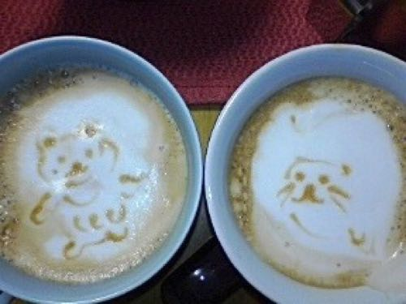
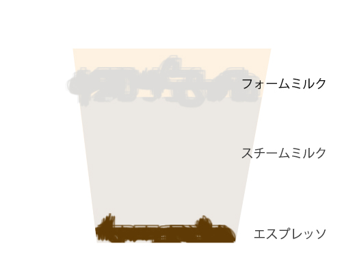
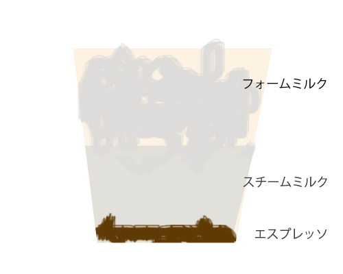
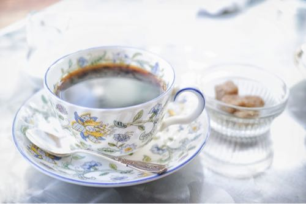

---
categories:
- その他
date: Tue, 03 Feb 2015 16:00:00 +0000
slug: post-7111
tags:
- スタバ
title: 【スタバ】ラテとカプチーノとカフェミストの違いを知っていますか？
---

スターバックスのラテとカプチーノの違いを知っていますか？昨日会社で聞かれて説明したんですが、結構知らない人いると思ったのでご紹介。<!--more-->ハローしんぺー(<a href="https://twitter.com/s_s_p_y" target="_blank" rel="noopener">@s_s_p_y</a> )です。
オフィより詳しくて、wikiよりも有用なsukekiyo情報サイト「Gadget Zombie Parasite(ガジェットゾンビィパラサイト)」へようこそ。

<h2>ラテとは？</h2>

<blockquote>
カフェ・ラッテ（Caffè Latte）は、コーヒーと牛乳、特にエスプレッソと牛乳を混ぜたイタリア発祥の飲み物である。アメリカでは、エスプレッソとスチームミルクを用いるのが一般。スターバックス等のアメリカ式のコーヒー店で供されるものは後者で、日本では英語式の発音に基づきカフェ・ラテ又はカフェラテと表記されることが多い。

引用:<a href="http://ja.wikipedia.org/wiki/%E3%82%AB%E3%83%95%E3%82%A7%E3%83%BB%E3%83%A9%E3%83%83%E3%83%86">wikipedia</a>
</blockquote>

要はエスプレッソにあっためたミルクを入れて飲むものをラテといいます。

図にするとこんな感じ

<h2>カプチーノとは？</h2>

<blockquote>
カプチーノ（イタリア語:cappuccino）は、イタリアで好まれているコーヒーの飲み方の1つで、陶器のコーヒーカップに注いだエスプレッソに、クリーム状に泡立てた牛乳を加えたものをいう。イタリア語の本来の発音は「カップッチーノ」に近い。好みによってチョコレートパウダーで風味付けすることもある。

引用：<a href="http://ja.wikipedia.org/wiki/%E3%82%AB%E3%83%97%E3%83%81%E3%83%BC%E3%83%8E">wikipedia</a>
</blockquote>

図にするとこんな感じ

要はエスプレッソにスチームミルクと泡泡のフォームミルクを入れて飲むものです。
割合は半々くらいです。

だからラテに比べるとカプチーノは泡の比率が多くて、重量が軽いのが特徴です。

じゃあカプチーノよりもラテの方がいいじゃんと思われるかもしれませんが、
カプチーノはミルクの甘さを楽しむ飲み物なんです。
なぜならうまくスチームされたミルクは甘さが増すんです！！

もしスタバでカプチーノを作ってもらうなら作り立てで作ってもらったほうが美味しいです。

<h2>(こぼれ話)カフェオレとカフェラテの違い</h2>

スタバでカフェオレにあたるメニューは、カフェミストです。

本日のコーヒーとスチームミルク半々の飲み物です。
ラテがエスプレッソで作られてるのと違って、コーヒーで作られてるのでラテよりも薄味です。コーヒー飲みすぎちゃったとか、ラテより薄めがいいなぁという人はこちらを注文してみてください。

<h3>裏技。コーヒー2杯目お代わりをカフェミストにすることができる</h3>

本日のコーヒーを注文したレシートを、その日のうちにスタバに持っていくと2杯目が100円になることをご存知でしょうか？

これに関してはお店で一杯目注文した時に案内されることが多いと思います。

でも、この2杯目をカフェミストに出来ることを知ってる人はあまりいないのではないでしょうか？コーヒー飲みすぎたなーとか、ちょっと気分を変えたいって時にオススメです。

ただ、注意点が２つ。
ミルク分の50円が加算されます。なので、150円になります。

ちなみに豆乳に変えても値段は同じでした。

それと、本日のコーヒーがミルクに合わないような風味のものの場合、あまり美味しくないかもしれません。その辺は店員さんに、聞いてみましょう。

<h2><a href="https://twitter.com/s_s_p_y" target="_blank" rel="noopener">しんぺー</a> はこう思った。</h2>

結構知らない人がいるかなーと思って書いてみました。

割と毎日スタバに行ってるので、費用が結構かさみます。ただ、結果的に一杯単価が安くなるので、必ずお代わりはしてしまいます。

コンビニより割高ですが、美味しいので飲んでしまいます。それとコンビニのコーヒーよりも目がさめる気がするし•••
プラシーボ効果でしょうが。。。

と言ったところで本日は以上になります。おやすみなさい。