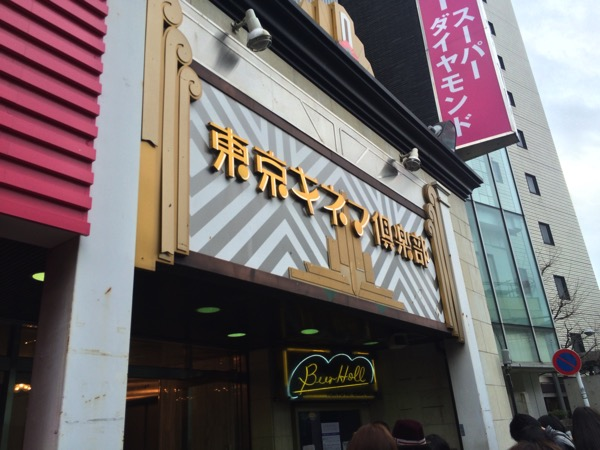

---
categories:
- sukekiyoのイベントレポ
date: Sat, 07 Feb 2015 16:00:00 +0000
slug: post-7125
tags:
- sukekiyo
title: 【イベントレポ】sukekiyo通販限定豪華版購入者限定イベント＠東京キネマ倶楽部
---

本日行ってまいりました東京キネマ倶楽部。前回のハロウィン殺しの時のような怪しげな雰囲気はなく、あっという間に45分が過ぎ去りました。メモしてきましたのでまとめておきます！では早速。<!--more-->ハローしんぺー(<a href="https://twitter.com/s_s_p_y" target="_blank" rel="noopener">@s_s_p_y</a> )です。
オフィより詳しくて、wikiよりも有用なsukekiyo情報サイト「Gadget Zombie Parasite(ガジェットゾンビィパラサイト)」へようこそ。

ステージに5つの椅子と1つの机が置かれていました。足元にはペットボトル。

時間になり現れたメンバーの席順は下手から見て
匠、UTA、京、YUCHI、未架
<h2>メンバーの服装と様子</h2>
匠
メガネにジャケット？
<a style="color: #0070c5;" href="http://ameblo.jp/takumixofficial/" target="_blank" rel="noopener">匠オフィシャルブログ「Takumi's blog」by Ameba</a> 
最後の方は時間ばかり気にして、カチカチされており京さんから指摘されておりました。

それと京さんへの話の振り方が雑と指摘されておりました。以下ぼくの感想
<blockquote class="twitter-tweet" lang="ja">京さんに話を降りつつ、結局最後自分の感想になっちゃう匠カワイイ

— しんぺー@新宿タワレコ (@s_s_p_y) <a href="https://twitter.com/s_s_p_y/status/563941692428914689">2015, 2月 7</a></blockquote>

UTA
ピーコートにスキニーパンツでサングラス。

ぼく上手にいたんですが、ずっとこっち見つめててなんか・・・ドキドキしましたw
こっちの方面見すぎてて、途中質問とか聞いてなくて匠から「う、うたさん・・・」みたいに言われたり、あと最後の方もうしゃべる気がないのか、股間にマイク置きっぱにしてて、それも匠に指摘されておりました。

京
サングラス、チェゲバラみたいな帽子と、黒目のコートを着てた。靴等の下半身は見えず。
でかい男性の中央にチョコンと座ってる感じでした。

それとなんかしらないけどポケットをすげー探してる感じだった。
<blockquote class="twitter-tweet" lang="ja">京さん服の全部のポケットをまさぐって何かを探してらした

— しんぺー@新宿タワレコ (@s_s_p_y) <a href="https://twitter.com/s_s_p_y/status/563940994219925504">2015, 2月 7</a></blockquote>

YUCHI
唯一メガネもサングラスもなし
ジャケットを着てた。

未架
メガネ、ジャケットかな？
<h2>収録曲解説</h2>
収録曲の説明から始まり、寄せられた質問への回答という流れでした。
<h3>DISC1</h3>
１、leather field
原曲はYUCHI

2、dunes
原曲はUTA
当初の形から結構かわった。海外ツアーを回った影響が色濃く曲に反映されている。
レコーディングがかなり大変だった。

3、dot
前回のツアーのときからあった唯一の曲

4、foster mother
原曲はYUCHI
去年の京都劇場3daysの直後にできた曲

匠はYAMAHAのDX7という楽器を使用し演奏。結構な年代モノとのことで、収録終わった瞬間にお釈迦になったとのこと。

ちなみにこれだと思われます。

<map id="map_6pbn4x5a" name="map_6pbn4x5a"> <area alt="" coords="2,53,353,67" shape="rect" href="http://ja.wikipedia.org/wiki/%E3%83%95%E3%82%A1%E3%82%A4%E3%83%AB:YAMAHA_DX7.jpg" /> <area alt="" coords="336,125,350,136" shape="rect" href="http://ja.wikipedia.org/wiki/%E3%83%95%E3%82%A1%E3%82%A4%E3%83%AB:YAMAHA_DX7.jpg" /></map>

<a href="http://ja.wikipedia.org/wiki/%E3%83%A4%E3%83%9E%E3%83%8F%E3%83%BBDX%E3%82%B7%E3%83%AA%E3%83%BC%E3%82%BA">ヤマハ・DXシリーズ - Wikipedia</a> via <a href="http://kwout.com/quote/6pbn4x5a">kwout</a>

5、雨上がりの優詩
原曲匠

6、maniera
海外ツアー終わった後10月11月くらいにできた。

7、白露
右から流れてくる音は日本青年館、左から流れてくる音はヨーロッパ公演の演奏を逆再生で流しているらしい。

さらにモーツァルトのレクイエム「涙の日」というのを入れているらしい

<iframe src="https://www.youtube.com/embed/6g1u7Y8zSwU" width="420" height="315" frameborder="0" allowfullscreen="allowfullscreen"></iframe>

8、celeste
セレステ
前回のIMMORTALISは京と匠で原曲を作ったりというのが多かったが、今回はメンバーからの原曲が多かった。そこで京を匠の自宅に呼んで作成した曲とのこと。

ここで京がギターをおもむろに手に取り、コードを弾いてこんな感じと伝えたとのこと。

9、focus
原曲はUTA
京が始まりは静か目にと、匠がシンフォニックにアレンジを加えたとのこと

すべてのサビでコード進行が異なっている。
ジャンベという前回のアルバム収録曲のエリザベスにて使用しているものを再度使用したと未架さん。
<h3>DISC2</h3>
雨上がりの優詩 with Toshi
もらった瞬間、「ありがとうございました」しかなかったとのこと
匠、京共々LIVE終わりに初めて聴いたとのことで、すごいテンションがあがったらしい

focus with 三上博史
京が個人的に昔から大好きな人だったらしく、ずっとLIVEにきてくれるようにお願いしてたらしい。
で収録の時におもむろにサインをお願いしたとのこと

京：あの、お願いがあるんですけど

三上：ナニ？

この「ナニ？」がすごかったらしいw映画とかドラマで見たまんまだったとのこと

elisabeth addict Remix by Renholder
この辺はどうも前回のアルバムの時からオーダーしてたみたい。
未架さん曰く、「面白い」とのこと

latour with Wes Borlan
リンプビズキットはYUCHI氏学生の時「死ぬほど聴いた」とのことで、自分たちの曲にその人がミックスしてるとか、すごい感動したみたい。
<h2>質問コーナー</h2>
<h3>Q1、カメラの機種は？</h3>
匠が司会をずっとしてましたが、ここで質問用紙をメンバーに回して選んでもらって話すという形式に変更

最初匠がまごついてたら京さんが「ぼく（匠）が選んでください」と

で、最初に選ばれた質問がこれ（選んだのUTAだったか匠だったか忘れましたが）
「focusという曲名からカメラ覗く京さんの姿が目に浮かびました」（京この時点でうんうんとうなずく）「そこでカメラの機種を型式で教えてください」（ガクッみたいな雰囲気に包まれる会場w）

A、機種とかよくわからないので、、、
＿人人人人人人人人人人人＿
＞　　わかりません　　　＜
￣Y^Y^Y^Y^Y^Y^Y^Y^Y^Y￣

匠？UTA？どちらかが「あ、これ選んじゃいけない質問でしたね」と
<h3>Q2、ツアー中のハプニング</h3>
未架さんが青年館でバスドラ踏み抜いてしまった穴を開けてしまったお話し。少しずつ穴が空いてない位置に、場所を変えて凌いだとのこと

この件は、他のメンバー一切気がついていなかったとのこと

海外で匠のギターの音がでなくなって相当あせった。ピアノでその部分を弾いて凌いだとのこと。

そういったメンバーの機材トラブルで慌てふためく姿を見て京は面白がっているとのことw「面白い」とのことですw

あと、今回のアルバムの制作中のハプニングとして最後の方にdunesの歌データがなくなってしまって、奇跡的にUTAが持っていて事なきを得たとのこと。
メンバー曰く、一番データを保存してなさそうなUTAが持っていて驚いたみたい。

京の制作スタイルとして、歌どりを最初に終わらすとのことなので、本当に最後の方になくなっちゃったんだろうな。
<h3>LIVE前のジンクスなどありますか？</h3>
未架
特にない。多少ウォーミングアップするくらいで
周りから見てると練習しているように見える

UTA
キャンディークラッシュ

匠
バッハを聴く
<h3>メンバーは朝方？</h3>
えーっと京以外見事にめちゃくちゃとのことですwww

唯一YUCHIだけが明るいうちじゃないと仕事する気になれないとのことで昼型みたいです。
あとはトレーニングとかもしているみたいです。

匠と未架は完全に夜に脳が活性化するタイプで、UTAに至っては昼寝が大好きなくらい眠いみたいです。

あと、朝の4時5時、すなわち匠が寝る時間であり京が起きる時間あたりに大事なことのやりとりが沢山発生してたとのことです。
<h2>メンバーからメッセージ</h2>
未架
もっと面白いことしたい（だったかな・・・

YUCHI
もうVITIUMに自分の関心はなくて、もっと新しいことをどんどんやりたい

UTA
どんどん友達に広めてください

匠
改めて聞き直したい

京
もう、他のメンバーが喋っちゃったといいつつ、最後の最後に
<blockquote class="twitter-tweet" lang="ja">京さん最後の最後に付け加える形で、「ファンのみんなが礼儀正しいって言われる、ありがとう」と言ってた。

— しんぺー@新宿タワレコ (@s_s_p_y) <a href="https://twitter.com/s_s_p_y/status/563940427863052288">2015, 2月 7</a></blockquote>

そりゃー「黙れ」と言われて黙るファンですからwww
それと割と大人が多いしね
<h2><a href="https://twitter.com/s_s_p_y" target="_blank" rel="noopener">しんぺー</a> はこう思った。</h2>
いやー笑いに包まれる和やかなイベントでした。
普段あんな狂気に満ちたLIVEをする人たちとは全く思えないwww

明日のインストも楽しみですね。

と言ったところで本日は以上になります。
おやすみなさい。