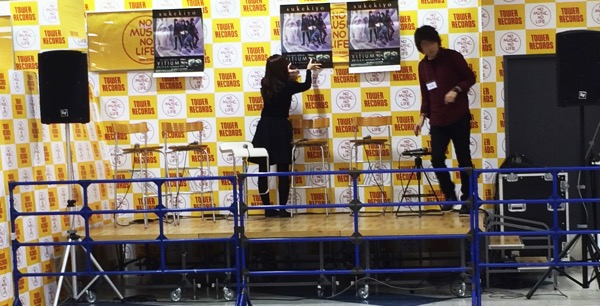
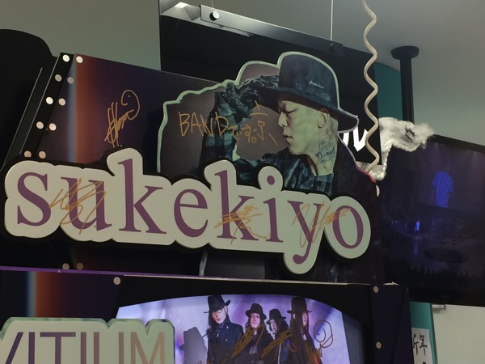

---
categories:
- sukekiyoのイベントレポ
date: Sun, 08 Feb 2015 16:00:00 +0000
slug: post-7137
tags:
- sukekiyo
title: 【sukekiyo】VITIUM発売記念タワーレコードインストアイベント
---

昨日の限定イベントに引き続き、本日のタワレコインストイベント行ってまいりました！<!--more-->ハローしんぺー(<a href="https://twitter.com/s_s_p_y" target="_blank" rel="noopener">@s_s_p_y</a> )です。
オフィより詳しくて、wikiよりも有用なsukekiyo情報サイト「Gadget Zombie Parasite(ガジェットゾンビィパラサイト)」へようこそ。
<h2>VITIUM発売記念インスト＠新宿タワーレコード</h2>
<blockquote class="twitter-tweet" lang="ja">【V系】sukekiyo「VITIUM」発売記念トークショー先程終了!司会には増田さんを迎え、貴重かつ濃厚なトークを聞かせていただきました！sukekiyoの未来が更に楽しみになるひととき。皆様ありがとうございました! <a href="http://t.co/YWDD9i3yw5">pic.twitter.com/YWDD9i3yw5</a>

— タワーレコード新宿店 (@TOWER_Shinjuku) <a href="https://twitter.com/TOWER_Shinjuku/status/564326442901594112">2015, 2月 8</a></blockquote>

さて、本日は15時スタートで14:30くらいからタワレコの階段に整理番号順に整列、入場しました。

前回と同じくLIVEかっていうくらいのぎゅうぎゅう感。そしてメンバー登場時に押し発生。

司会はライターの増田勇一さん（<a href="https://twitter.com/youmasuda">@youmasuda</a>）です。

ステージはこんな感じでした。向かって左から匠、未架、京（白い椅子）、YUCHI、UTA、増田さん

匠：紫の網目が入ったゆったりした黒目のトレーナーに眼鏡
未架：黒ジャケット黒パンツに眼鏡
京さん：グレーのかなりでかめのコートにシャツにグレーのセーターを重ね着、白のハイカットの靴、グレーの四角いキャップ
YUCHI:黒ジャケットに黒パンツにスニーカーに黒の指があいた手袋と白いハイカットの靴
UTA：黒のジャケット黒パンツ、グラサン

質問事項等はあまり覚えておりませんが•••なんせ昨日と違ってメモが取れる状況じゃなかったので（汗
以下順不同
<h3>いつから制作開始？</h3>

京：決めずに、ずっとやってたから、いつからというのはない。

増田さん：締め切りとか気にせずに？

京：もうずっと。1月に新曲あげているメンバーもいたし

<h3>対バンツアーの話</h3>

増田さん：対バンツアーはどうでした？そういえば昨日たまたまメリーのネロとあって話したんですけど「いやー心臓に良くないっす」って言ってましたよw

京：僕前にイベントでメリーの曲歌ったんですけど、そのときのことがトラウマらしくて。じっと見られてる雰囲気が嫌だって言ってて。今回も1曲やってくれと言われてて、ボーカルだけならチェンジ可能だったんですけど、バンドでやりたいって言っててなしになった

LIVEにコラボした人とかを出したら？という話の時に（ガラが） どうしてもスケキヨのステージに立ちたくないみたいで、ガラが凄くあの雰囲気を味わいたくないというので、それを先輩に押し付けるのは・・・みたいなこと言ってました。

YUCHI：acid androidのyukihiroさんのスタイルがめっちゃよくて。あの体型が。楽屋が一緒だったんですけど、隣で話してるのが聞こえたんですけど、体脂肪3%って。
UTA：学生時代から見ていたアイジさん、とりあえずすぐに握手しました。
<h3>リミックスのお話</h3>
チュー・マッドセンのミックスについて
YUCHI：楽器ひとつひとつの線の太さにびっくりしました。次回はどうなるかわかりませんが、新しく挑戦できるところが増えた。
匠：今までは国内のエンジニアだったんで、細かいところとかすぐに直してもらったりしたんですけど、celesteはトラック数が多いので大丈夫かなと思ったんですけど、全部の音が綺麗に聞こえていました。
<h3>バンドとしてのお話</h3>

増田さん：よくDIR EN GREYの京さんのソロプロジェクトとかサイドプロジェクトとか言われますが

京：めっちゃ嫌です！（この言い方、のちのニコ生でも同じテンションで言ってました）

増田さん：さっきの楽屋でポップにサインする時バンドですって書いてましたね。

京：ぼくの写真があって、名前が書いてあってこの人がsukekiyoさんなんかなと思われちゃったりするかなと思ったんで。

増田さん:白い覆面被ってるようなね

京：だからバンドですって書きました。

増田さん：これだけ作曲者が多いと空気が悪くなることはないですか？

京：？

増田さん：例えば海外のバンドとかだと誰々の曲が３曲だと、じゃあ俺はもっとみたいな話を実際に聞きますが

京：そうなんですか？そんなんあるんですか〜

京：別に、あいつが2曲だから3曲とか、ないです。曲を選ぶときも、誰のとか考えずにバランスみて決めてます。

<h3>今後について</h3>
匠：空気を、みなさんと一緒に作っていきたいので、みなさんよろしくお願いします。
未架： 自由なバンドなので、これから色んなものを吸収して、聴いたことのないものを作っていけたらと思います。
UTA：ものすごい楽器も使っちゃうかもしれないんで。 もしかしたらですけど。 IMMORTALISをもう一回聴いてほしいです。今思うと順番逆だったかなと
YUCHI:（すんません、、わすれました）

京：動いてくれていいですよ。ノリはチャラくなければ。このバンドで名前呼ばれるのはなんか違うかなって。映画館で喋ってるのとか腹立つじゃないですか。うっとうしい。ダメじゃないけど空気読んで。正直、このバンド以外の音がいらないんで世界観として（だったかな）

増田さん：煎餅食うなよって。食べるなら爆発シーンで食べるとかね！

<h2><a href="https://twitter.com/s_s_p_y" target="_blank" rel="noopener">しんぺー</a> はこう思った。</h2>
今回あまり記憶がなく、、、目の前の女性が倒れて運ばれたりしてたし
sukekiyoのいつものLIVEよりかは押しがあった感じでした。

取り急ぎ本日のインスト情報のみをまとめてみました〜

と言ったところで本日は以上になります。
おやすみなさい。